+++
title = "Tweets by Eric Topol Nov 02"
Summary = ""
tags = ["Twitter"]
category = "Twitter"
+++

---

<a href="https://twitter.com/erictopol/status/1455366084756787202" target="_blank" rel="noreferer">02:48 UCT</a>

A universal vaccine vs "every coronavirus," or at least the sarbecovirus family, would protect vs all future #SARCoV2 variants. There was been steady progress by many groups, but there's no coordination and it hasn't been made a national priority
https://www.wired.com/story/the-race-is-on-to-develop-a-vaccine-against-every-coronavirus/?mbid=social_tw_sci&utm_brand=wired-science&utm_medium=social&utm_social-type=owned&utm_source=twitter @marynmck

---

<a href="https://twitter.com/erictopol/status/1455523404803571715" target="_blank" rel="noreferer">13:13 UCT</a>

A misleading headline. Teens/adolescents aren't children. We've yet to see vaccine-induced myocarditis in children, age 5-11, with the imminent rollout this week
No cases reported in the 2 randomized clinical trials of ~7,000 children https://www.nytimes.com/2021/11/01/health/covid-kids-children.html 

<a href="FDMOem8VUA091mF.jpg"  >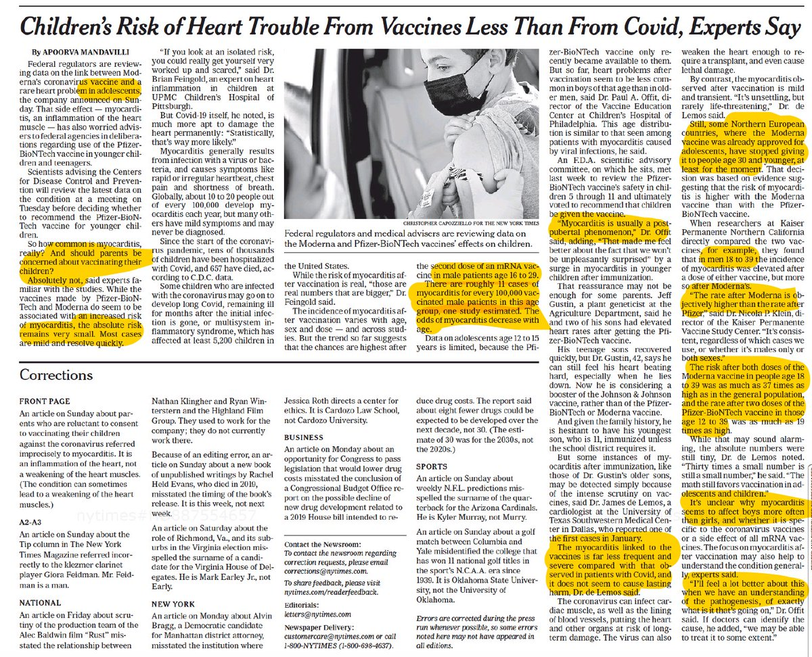</img></a>

---

<a href="https://twitter.com/erictopol/status/1455530882681409549" target="_blank" rel="noreferer">13:42 UCT</a>

Addressing freedom, personal choice and the mandate  controversy
https://www.nytimes.com/2021/11/01/opinion/vaccine-mandates-biden-republicans.html by @paulkrugman 
"It's hard to imagine a worse case for defending personal choice."
"It’s important to understand that freedom is no reason to block a potential medical miracle." 

<a href="FDMUo1jXoAAeB9J.jpg"  >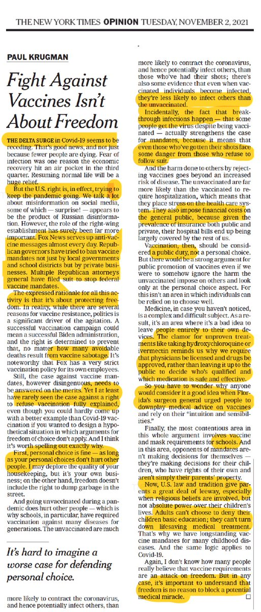</img></a>

---

<a href="https://twitter.com/erictopol/status/1455530887492165634" target="_blank" rel="noreferer">13:43 UCT</a>

Which also applies to the issue of breakthrough infections 

<a href="FDMVb7HVQAEYs7r.png"  >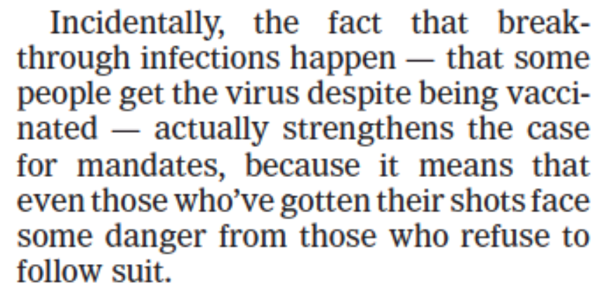</img></a>

---

<a href="https://twitter.com/erictopol/status/1455532582670585870" target="_blank" rel="noreferer">13:49 UCT</a>

That doesn't mean it won't occur, but if it does likely will be exceedingly rare. The dose issue is notable. Pfizer's 10 μg compared with Moderna 50 μg of mRNA for children, and we already know in teens there was a doubling for 100 μg (Moderna) vs 30 μg (Pfizer), reviewed in link

---

<a href="https://twitter.com/erictopol/status/1455540739799011328" target="_blank" rel="noreferer">14:22 UCT</a>

My discussion on children vaccinations with @amcoren @CNN https://www.youtube.com/watch?v=574lMfzne0A 

<a href="FDMefPfXIAwS0c0.jpg"  >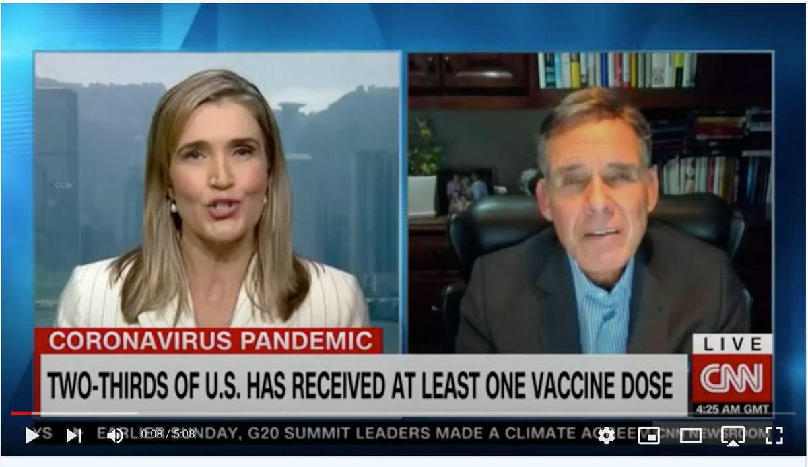</img></a>

---

<a href="https://twitter.com/erictopol/status/1455554071746646018" target="_blank" rel="noreferer">15:15 UCT</a>

Just out @SciImmunology Good news on the long-lasting T cell response to a mRNA vaccine, with a sizable T stem cell memory population  
https://www.science.org/doi/10.1126/sciimmunol.abl5344 

<a href="FDMp5tiUUAYu663.jpg"  >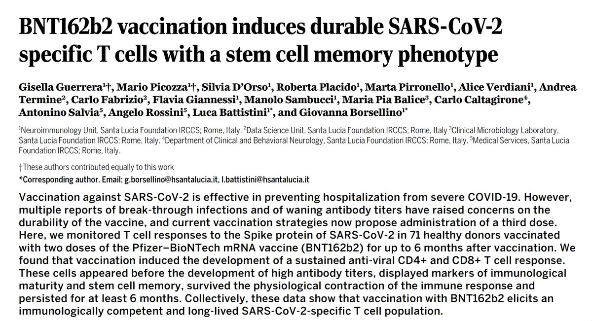</img></a><a href="FDMqR-VVgAUBmlG.jpg"  >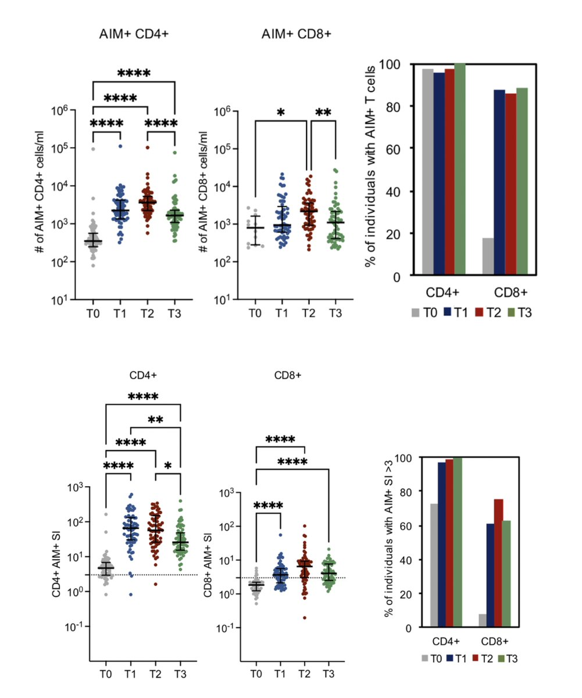</img></a>

---

<a href="https://twitter.com/erictopol/status/1455556835667165185" target="_blank" rel="noreferer">15:26 UCT</a>

Today @ScienceTM, yet another step towards a universal sarbecovirus vaccine
https://www.science.org/doi/10.1126/scitranslmed.abj7125 by @Baric_Lab and collaborators 

<a href="FDMs84xUUAYqFq8.jpg"  >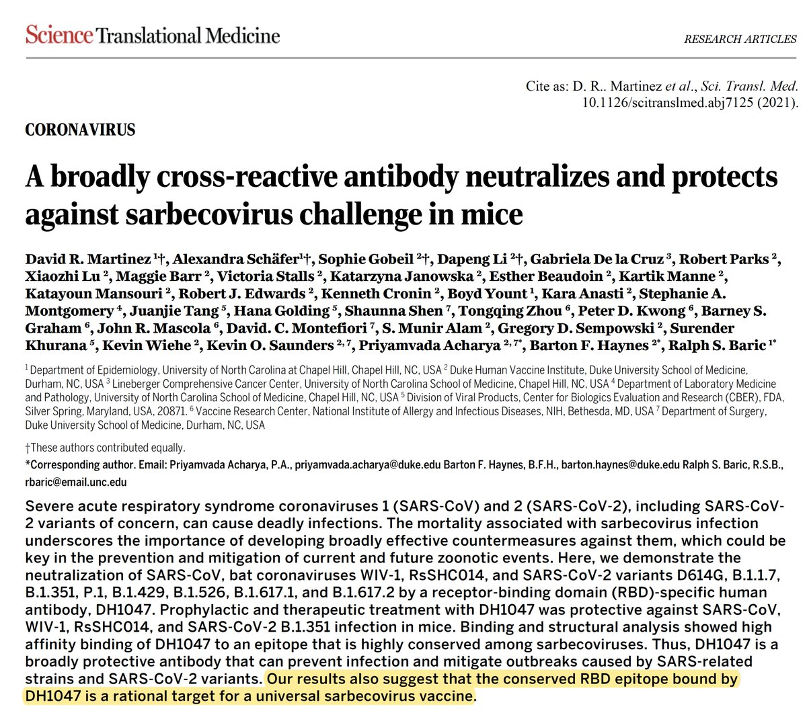</img></a>

---

<a href="https://twitter.com/erictopol/status/1455564744820068354" target="_blank" rel="noreferer">15:57 UCT</a>

The goal of both efforts should be ...shaping #AI with human values, including the dignity and moral agency of humans. ...The advancement of AI is inevitable, but its ultimate destination is not.
https://www.wsj.com/articles/being-human-artifical-intelligence-ai-chess-antibiotic-philosophy-ethics-bill-of-rights-11635795271?mod=opinion_lead_pos5 @ericschmidt 

<a href="FDMzkVbUUAkOnCy.jpg"  >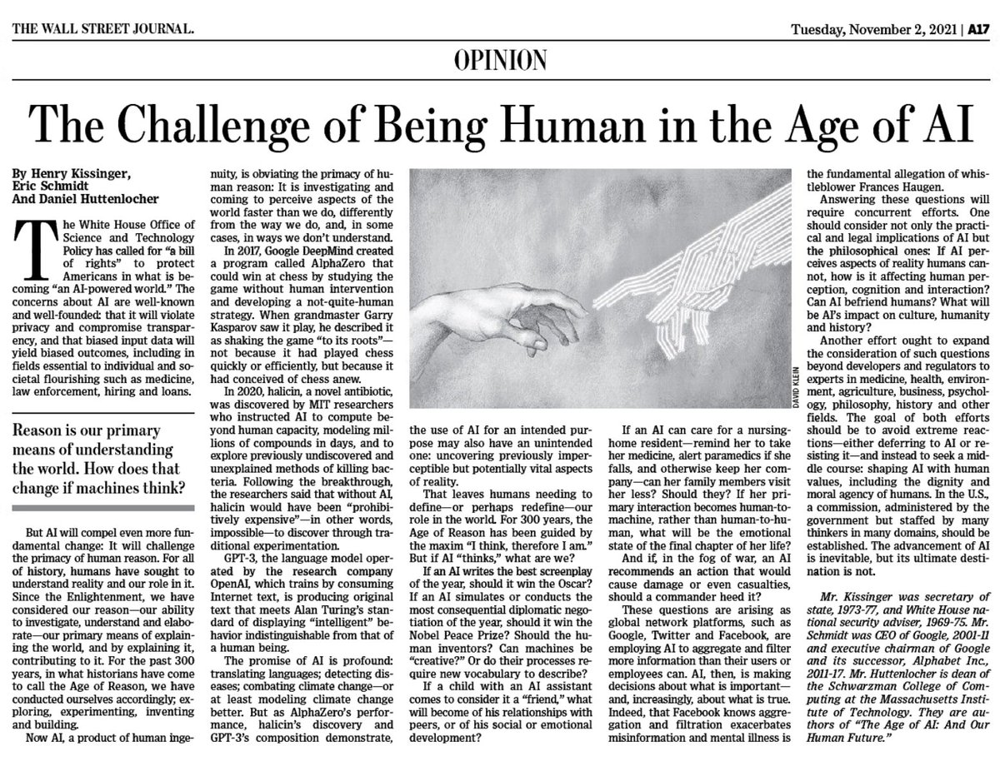</img></a>

---

<a href="https://twitter.com/erictopol/status/1455566693888004105" target="_blank" rel="noreferer">16:05 UCT</a>

Just published @ScienceMagazine 
"We show that the third wave of infections in England was driven primarily by the Delta variant in younger, unvaccinated people."
https://www.science.org/doi/10.1126/science.abl9551
"the highest prevalence of infection ...was among 13 to 24 year olds"

---

<a href="https://twitter.com/erictopol/status/1455570799000047617" target="_blank" rel="noreferer">16:21 UCT</a>

The "official" death toll of the pandemic thus far is 5 million, But there are actually more than 15 million. Russia's &gt;750,000 excess deaths are a prime example of the miscount
https://www.ft.com/content/f1a270c3-3870-46ad-99e8-45b5d8f127e0 @FT @jburnmurdoch 

<a href="FDM5gV8VUAklhcJ.jpg"  >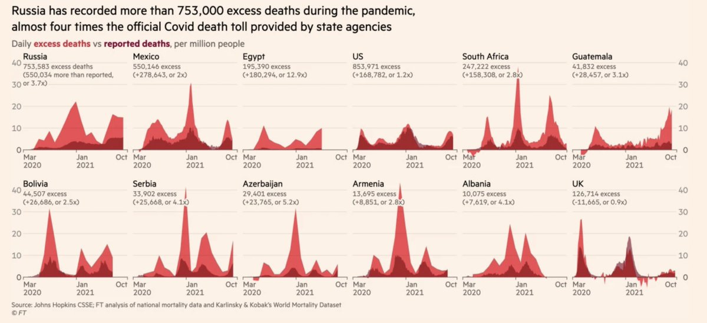</img></a>

---

<a href="https://twitter.com/erictopol/status/1455623359895531523" target="_blank" rel="noreferer">19:50 UCT</a>

Among other points, I cited this recent report of over 150,000 children, teens and adults with #LongCovid symptoms and matched controls
https://twitter.com/EricTopol/status/1451926435409530886

---

<a href="https://twitter.com/erictopol/status/1455626533830156289" target="_blank" rel="noreferer">20:03 UCT</a>

Stunning visualization of #SARSCoV2 infecting the olfactory (smell) and respiratory mucosa (cell lining), but not the neurons (reassuring!) in 85 people who died from Covid soon after their infections
https://www.cell.com/cell/fulltext/S0092-8674(21)01282-4 @CellCellPress 

<a href="FDNr76yVQAEDKyY.jpg"  >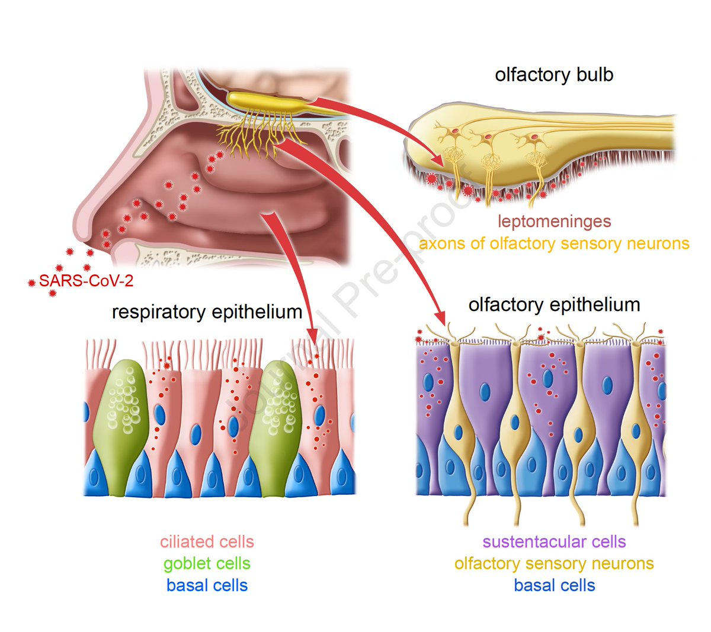</img></a><a href="FDNsACJUUAIgguI.jpg"  >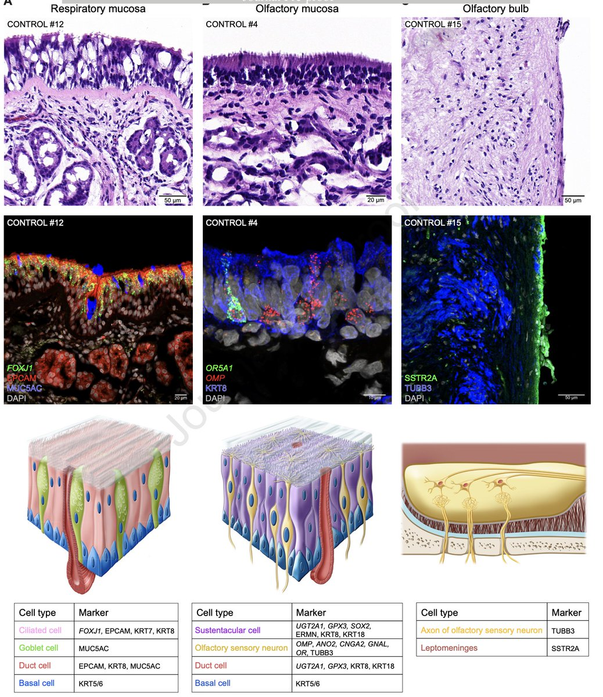</img></a>

---

<a href="https://twitter.com/erictopol/status/1455638774759583744" target="_blank" rel="noreferer">20:51 UCT</a>

In many countries in Western Europe, Covid cases are going in the wrong direction
@OurWorldInData 

<a href="FDN3iA4UcAAKUQl.jpg"  >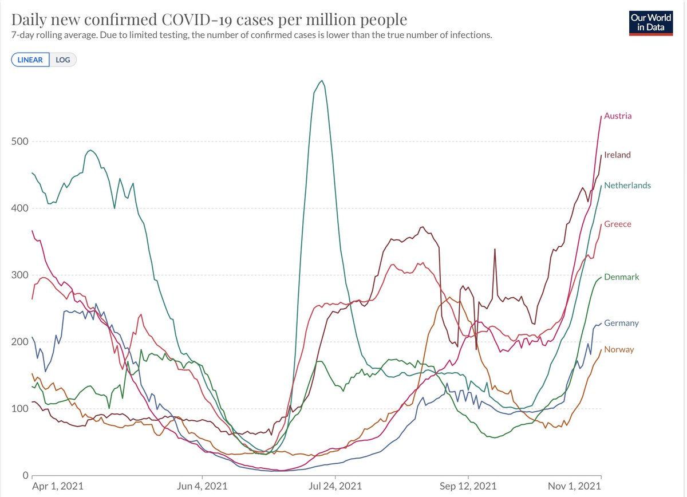</img></a>

---

<a href="https://twitter.com/erictopol/status/1455686022218457092" target="_blank" rel="noreferer">23:59 UCT</a>

The extraordinary benefit of vaccination in pregnancy
https://www.thelancet.com/journals/laninf/article/PIIS1473-3099(21)00691-5/fulltext
NNV (number needed to vaccinate) is 10 to prevent a Covid infection. "The balance of risk favors COVID-19 vaccination... particularly to avoid severe maternal infection or preterm or caesarean birth." 

<a href="FDOiLk5UcAMY3O7.jpg"  >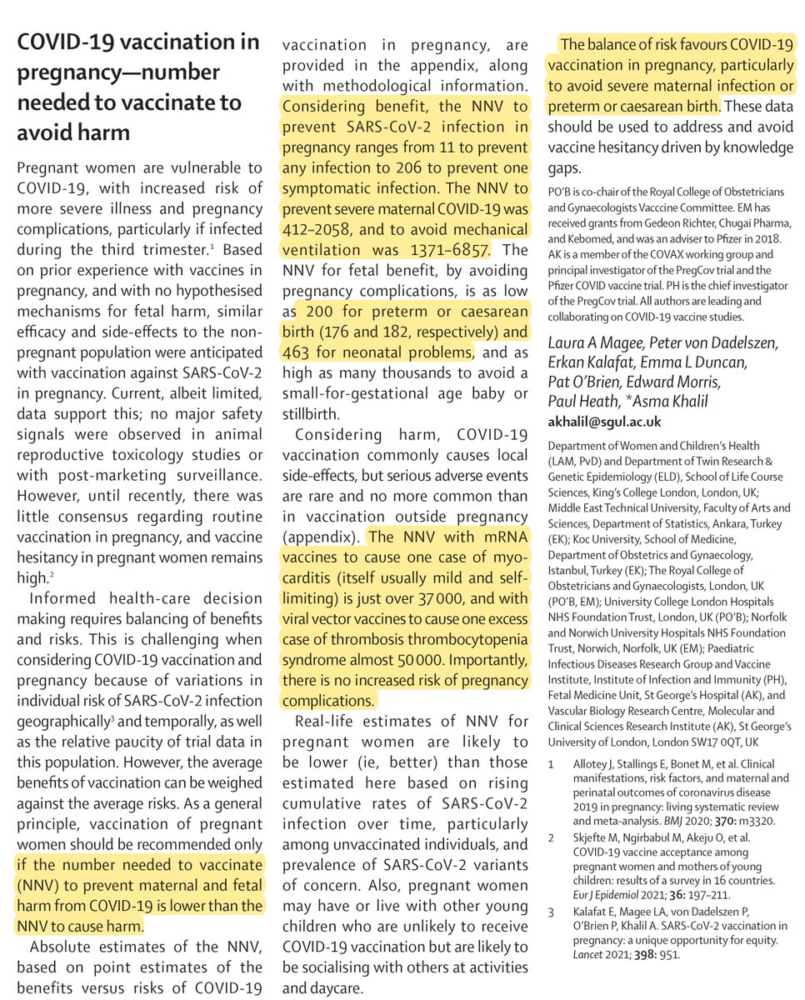</img></a>