+++
title = "Tweets by Eric Topol Nov 03"
Summary = ""
tags = ["Twitter"]
category = "Twitter"
+++

---

<a href="https://twitter.com/erictopol/status/1455713429201715204" target="_blank" rel="noreferer">01:48 UCT</a>

Success in Spain, 80% total population double-vaxxed (#3 in world), hard hit in previous waves. Will this hold?
"Experts are beginning to believe the country is on the cusp of reaching something that barely seemed possible even weeks ago—herd immunity."
https://www.thelancet.com/journals/lanres/article/PIIS2213-2600(21)00495-1/fulltext 

<a href="FDO5yDTVcAY6z_O.jpg"  >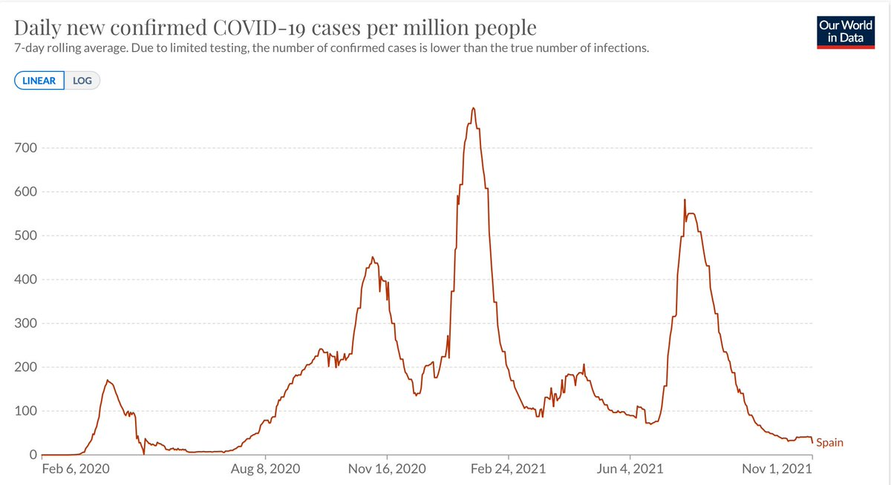</img></a><a href="FDO7ekSUUAINMSF.jpg"  >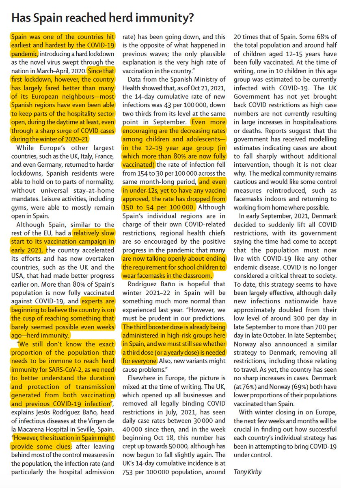</img></a>

---

<a href="https://twitter.com/erictopol/status/1455723404053598210" target="_blank" rel="noreferer">02:28 UCT</a>

@CellCellPress Such an impressive study that gets to the basis of loss of smell with Covid, and it's good to see the lack of infection of olfactory bulb neurons 

<a href="FDO_KGeVkAQZWj3.jpg"  >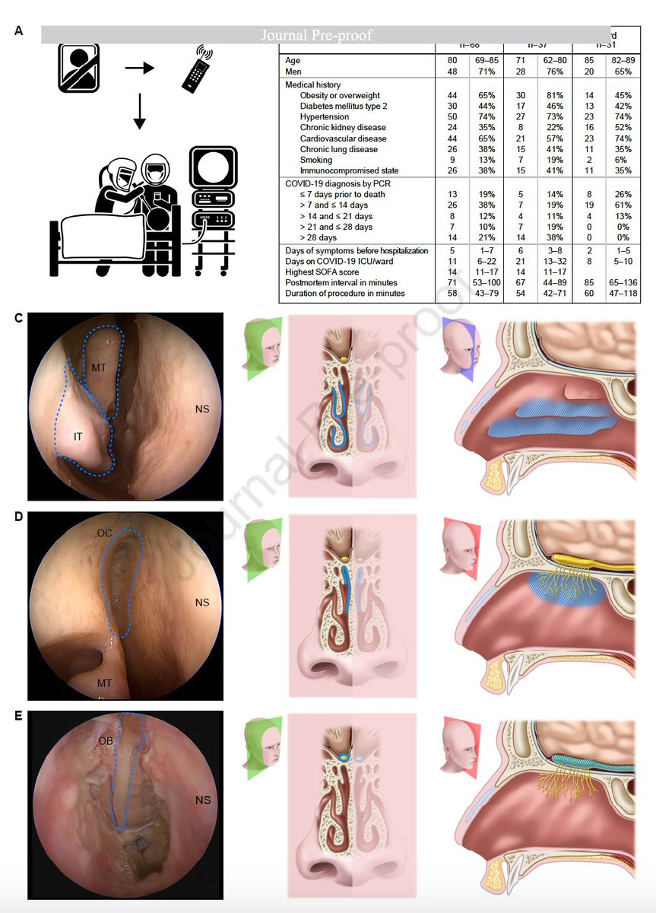</img></a><a href="FDO_LUDVcA8D3Zm.jpg"  >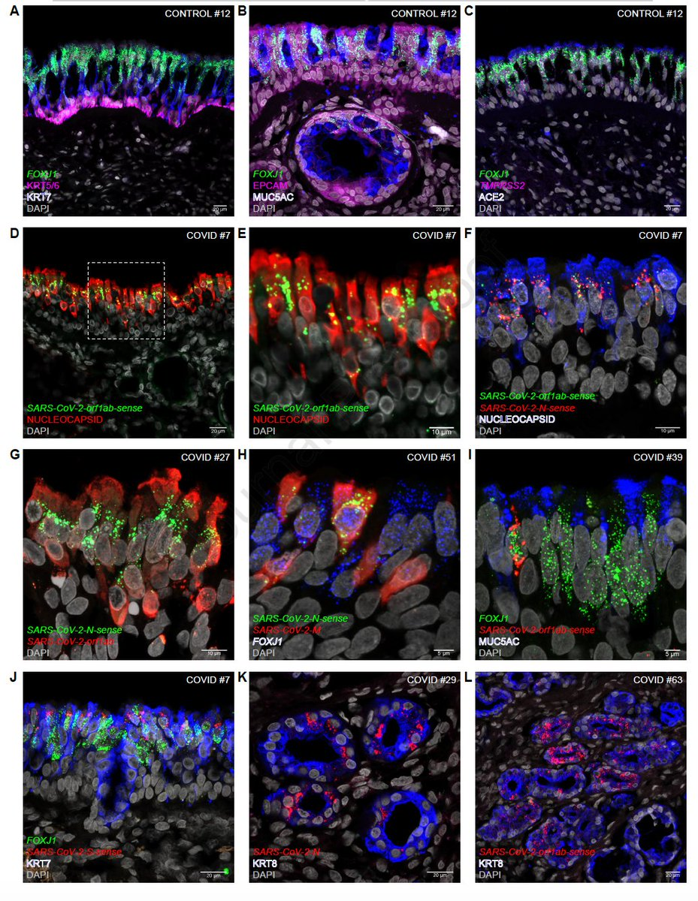</img></a>

---

<a href="https://twitter.com/erictopol/status/1455926023866892290" target="_blank" rel="noreferer">15:53 UCT</a>

Since we don't have any US data @CDCgov since Sept 4th (~30% of country), we have to turn to what we do have. Here's the latest @SanDiegoCounty 
https://www.sandiegouniontribune.com/news/health/story/2021-11-02/racist-comments-surface-at-county-supervisors-meeting
Not fully vaccinated = vulnerable (includes kids)
Waning 💉💉impact seen by age, need for boosters 

<a href="FDR8TovVUAMUSB3.jpg"  >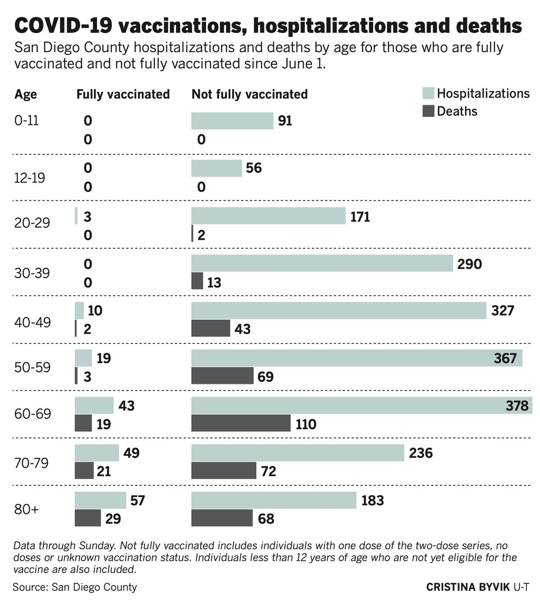</img></a>

---

<a href="https://twitter.com/erictopol/status/1455931213785362440" target="_blank" rel="noreferer">16:13 UCT</a>

Immuncompromised comprise ~3% of the US population. A new @CDCMMWR report shows that mRNA vaccines are holding up fairly well in this group; gap is highest in those w/ organ transplants or blood cancers. Recommendations for boosters provided. https://www.cdc.gov/mmwr/volumes/70/wr/mm7044e3.htm?s_cid=mm7044e3_w 

<a href="FDSAkuoUUAYVY-_.jpg"  >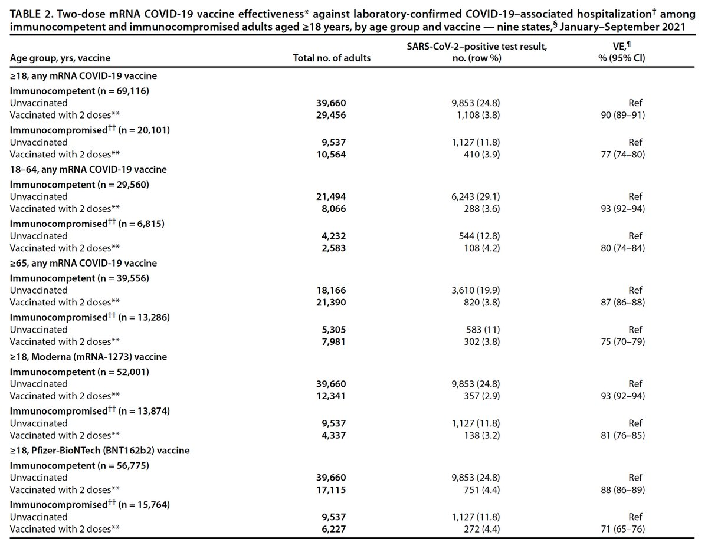</img></a>

---

<a href="https://twitter.com/erictopol/status/1455937075853754369" target="_blank" rel="noreferer">16:37 UCT</a>

The UAE has more than 10 million people, the highest vaccination rate in the world (87% fully, total). Lowest number of cases since the beginning of the pandemic. Less than 1 death per day. 

<a href="FDSGcVuVUAAuTfD.jpg"  >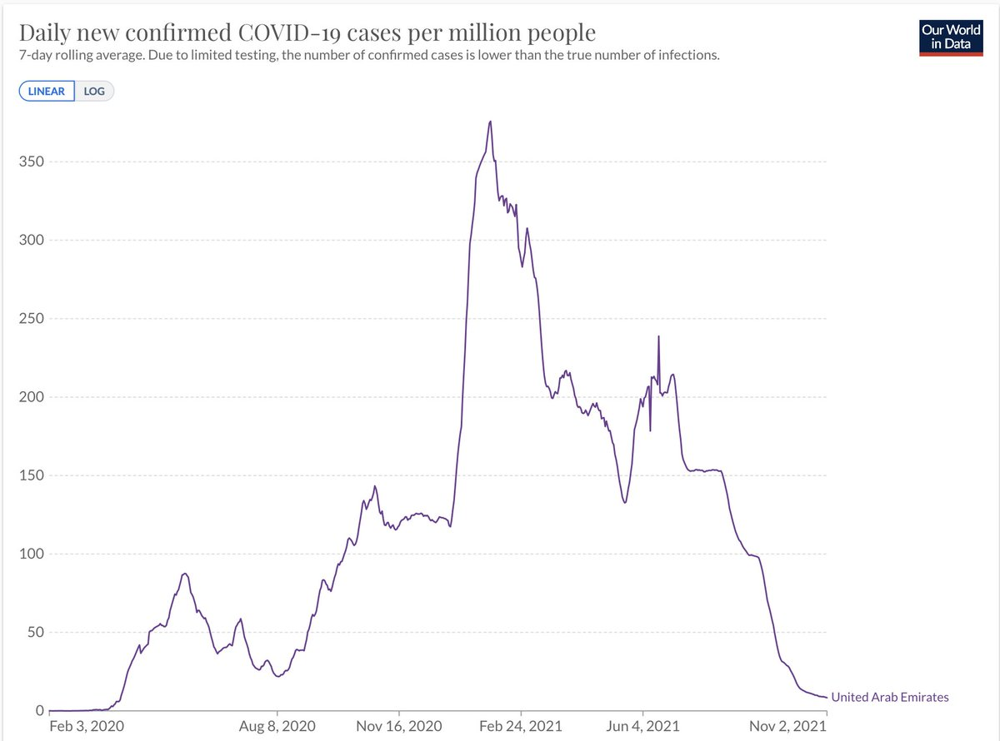</img></a>

---

<a href="https://twitter.com/erictopol/status/1455942997808279554" target="_blank" rel="noreferer">17:00 UCT</a>

Based on all I've seen to date, I'm not concerned about AY.4.2 ("Delta plus"). That doesn't mean there won't be a Delta lineage someday that is a BFD, just not this one. https://twitter.com/Ecquis/status/1455639854545612807

---

<a href="https://twitter.com/erictopol/status/1455947944218148868" target="_blank" rel="noreferer">17:20 UCT</a>

Yet another Ivermectin study retracted (this one from Lebanon, previous from Egypt and Argentina) due to copying and pasting data repeatedly for patients that didn't exist
https://retractionwatch.com/2021/11/02/ivermectin-covid-19-study-retracted-authors-blame-file-mixup/
and
https://www.theguardian.com/australia-news/2021/sep/25/fraudulent-ivermectin-studies-open-up-new-battleground-between-science-and-misinformation 

<a href="FDSPec0UYAQLpP4.jpg"  >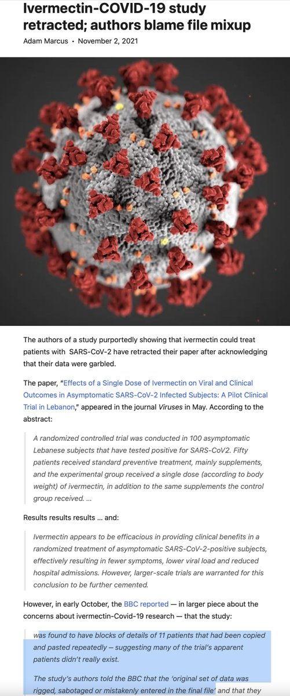</img></a>

---

<a href="https://twitter.com/erictopol/status/1455956233655963650" target="_blank" rel="noreferer">17:53 UCT</a>

@AliHMokdad @uche_blackstock @angie_rasmussen @DrLeanaWen @DrEricDing @PeterHotez @ashishkjha There are so many papers on this important topic. A few attached 

<a href="FDSYV6UUYAYTzak.jpg"  >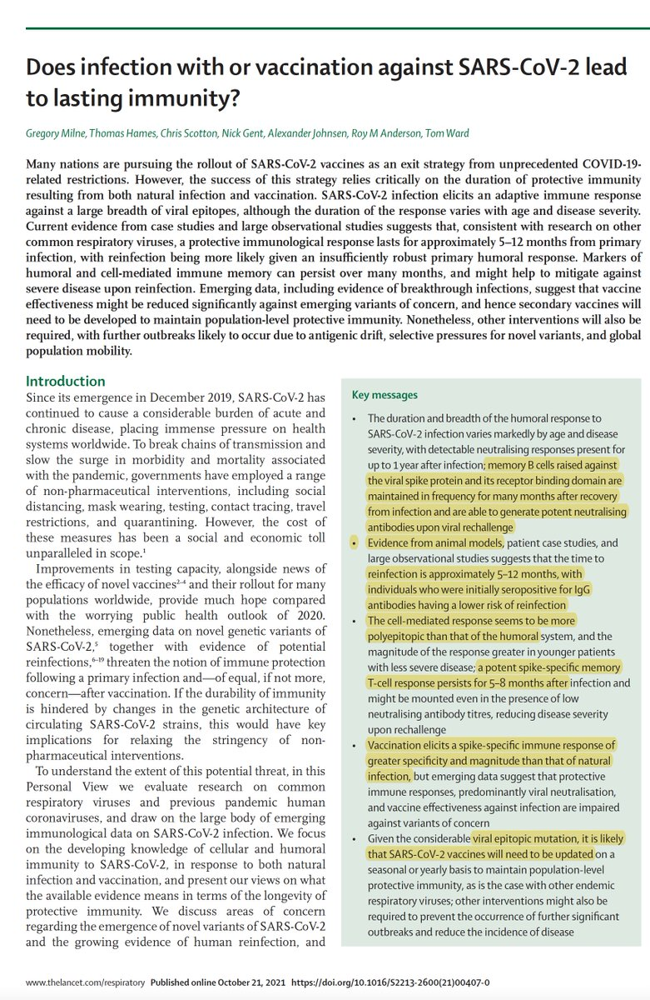</img></a><a href="FDSYXdJVEAEDtcG.jpg"  >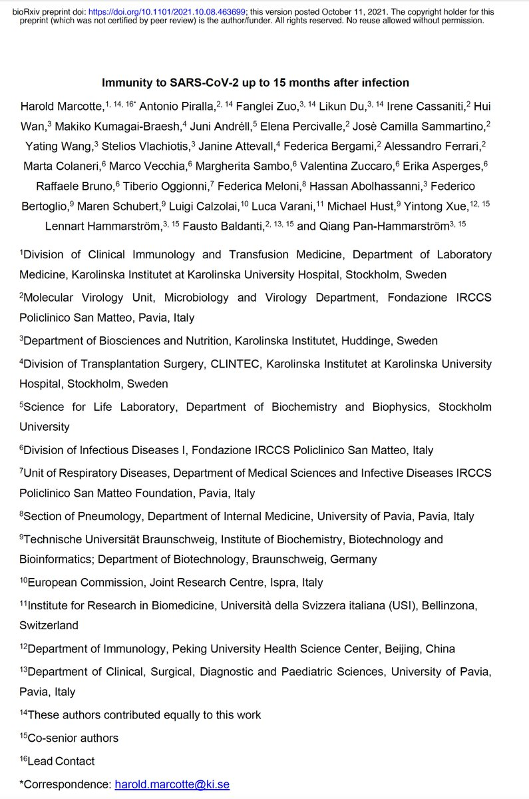</img></a><a href="FDSYZDOVEAIyAuV.jpg"  >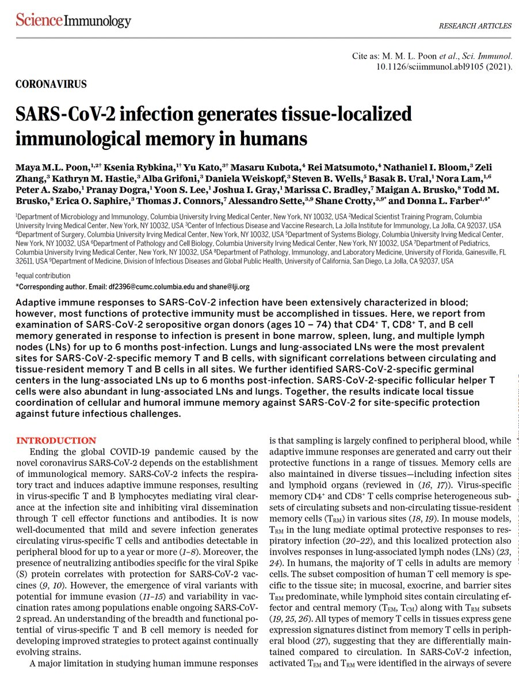</img></a><a href="FDSYagnVUAQGu3n.jpg"  >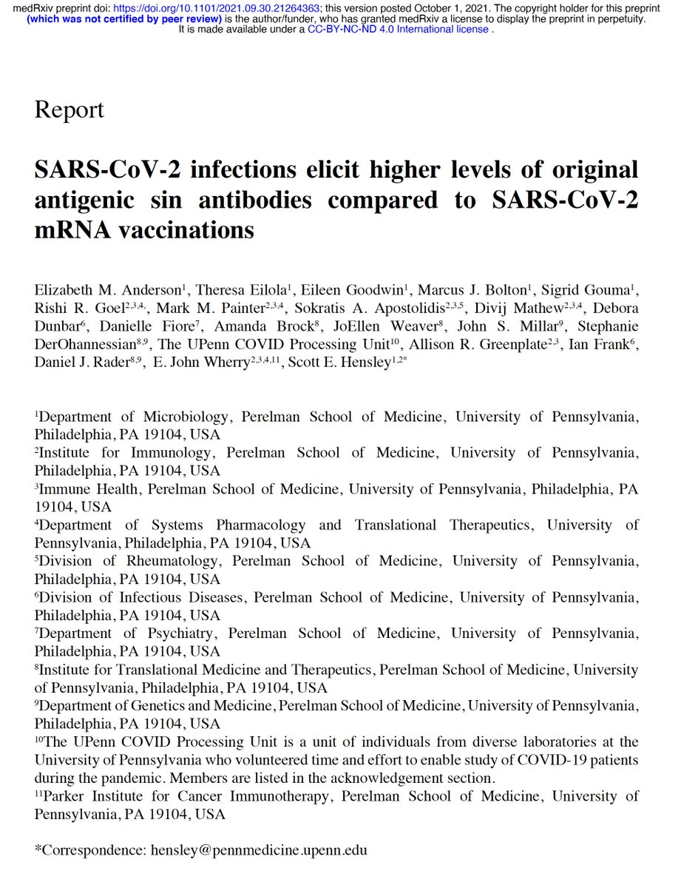</img></a>

---

<a href="https://twitter.com/erictopol/status/1455966000877236224" target="_blank" rel="noreferer">18:31 UCT</a>

Colorado and New Hampshire are states with 63% of their residents fully vaccinated, above the 58% US average. That isn't enough. 

<a href="FDSgfs4UcAMw-dV.jpg"  >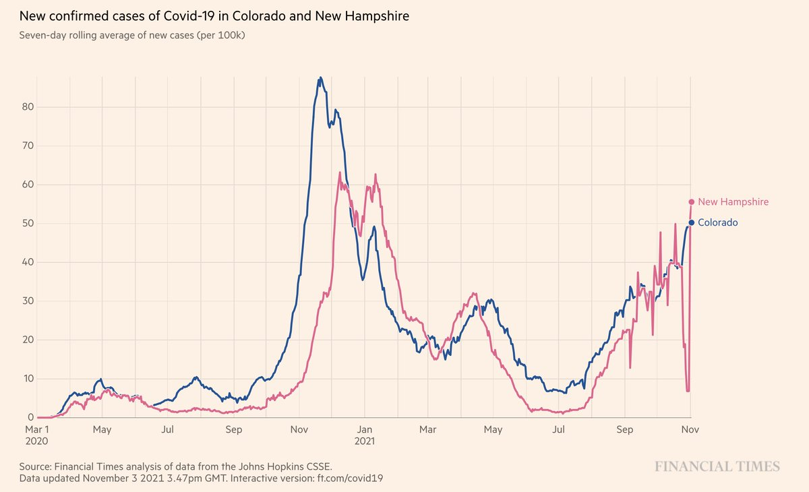</img></a><a href="FDShL2JUUAIdAfO.jpg"  >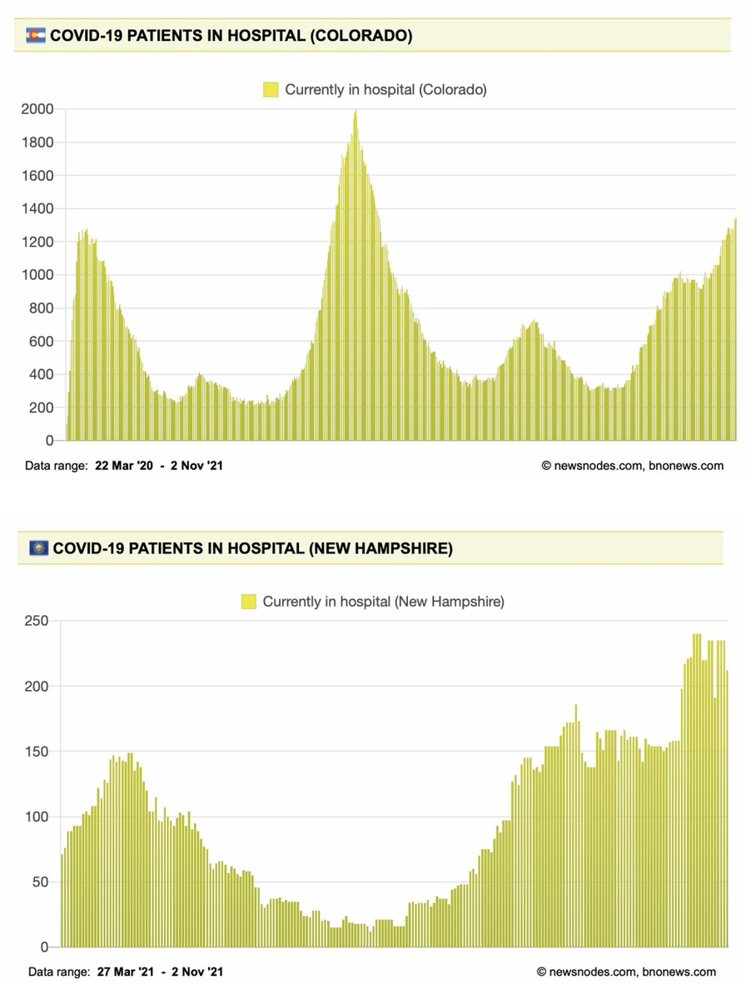</img></a>

---

<a href="https://twitter.com/erictopol/status/1455991232493068291" target="_blank" rel="noreferer">20:12 UCT</a>

The next chapter of anti-Covid is about to start with pills that inactivate the virus, irrespective of variants. First will be Molnupiravir in a matter of weeks, then this one.
Helping to get us onto an exit ramp. https://www.science.org/doi/10.1126/science.abl4784
@ScienceMagazine

---

<a href="https://twitter.com/erictopol/status/1455995963420471299" target="_blank" rel="noreferer">20:31 UCT</a>

These will add an important new layer of defense early after symptom onset w/ test positive confirmation and also, as clinical trials get completed, for known exposure 

<a href="FDS72uZVUAEzXth.jpg"  >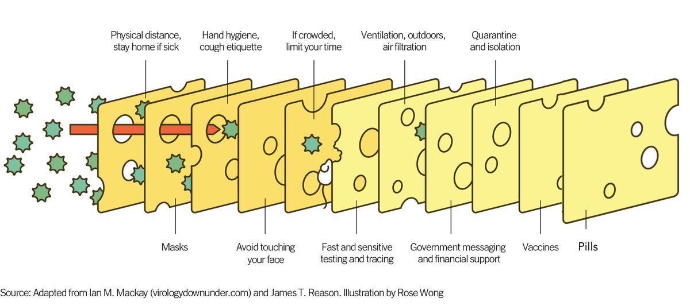</img></a>

---

<a href="https://twitter.com/erictopol/status/1456004814928695297" target="_blank" rel="noreferer">21:06 UCT</a>

New @NEJM 
The impact of waning immunity in the Moderna COVE vaccine trial over time and with 97% Delta variant http://www.nejm.org/doi/full/10.1056/NEJMc2115597 

<a href="FDTCbYxVEAMxrLl.jpg"  >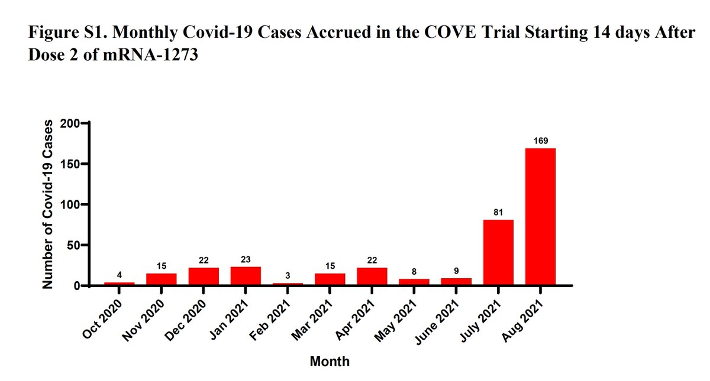</img></a>

---

<a href="https://twitter.com/erictopol/status/1456004820070912001" target="_blank" rel="noreferer">21:06 UCT</a>

Comparing that trial (mRNA-1273e) with the open-label phase (mRNA-1273p) for which participants had more recent vaccinations: more infections overall; and more severe cases for age 65+. Some imbalances, as noted  in text below 

<a href="FDTDUe6VEAEoaBb.jpg"  >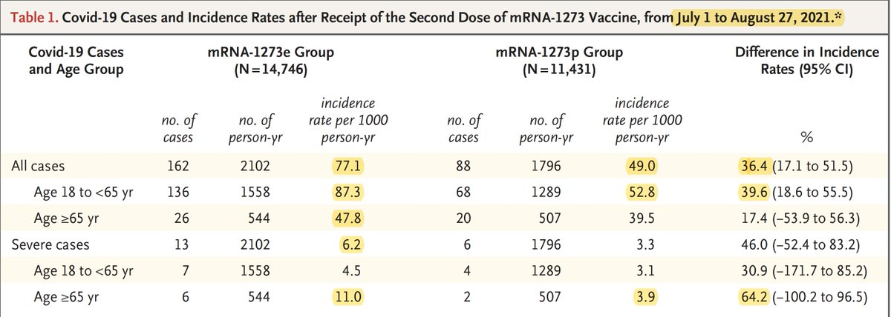</img></a>

---

<a href="https://twitter.com/erictopol/status/1456004825657741316" target="_blank" rel="noreferer">21:06 UCT</a>

The text, and more details of baseline features and types of severe cases can be found in the Appendix 

<a href="FDTEEEGUYAAN5r6.jpg"  >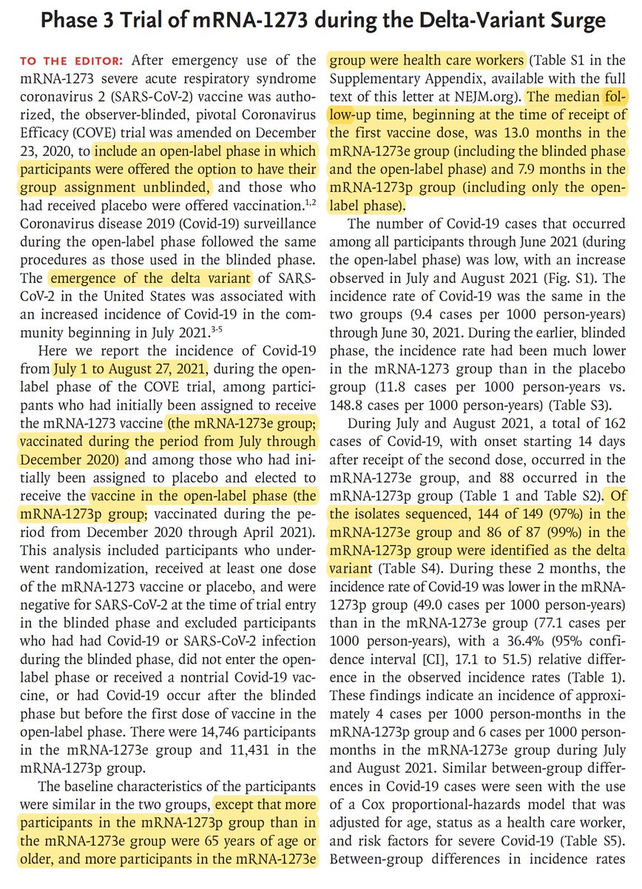</img></a><a href="FDTEIU9VIAMigv5.jpg"  >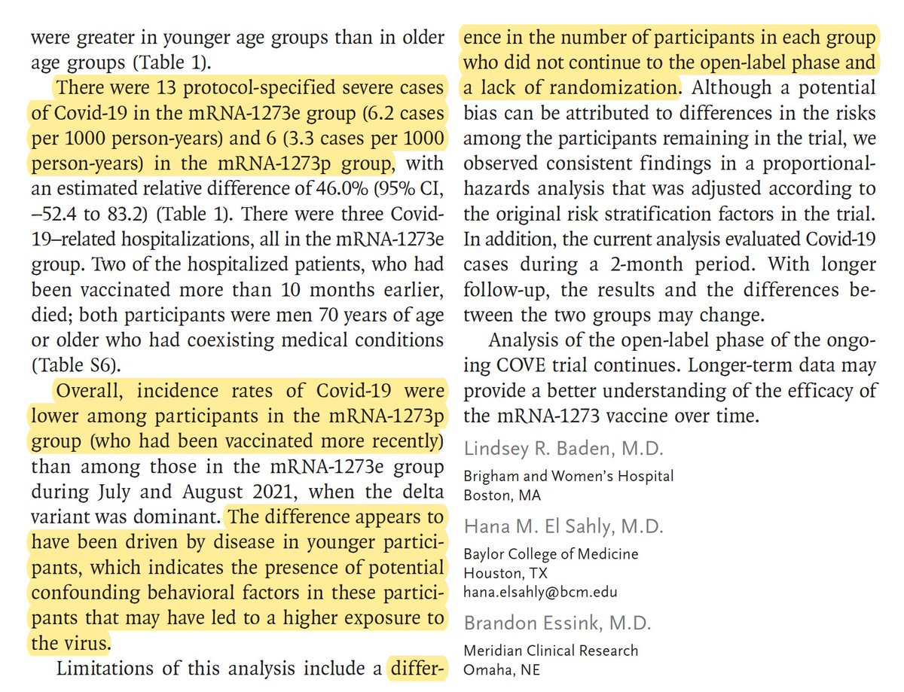</img></a>

---

<a href="https://twitter.com/erictopol/status/1456007646297804803" target="_blank" rel="noreferer">21:17 UCT</a>

RT @Argyle13: @mishwoz @EricTopol Simply not true. Am in Spain. You can get a test in "atención primaria" (primary health service). You onl…

---

<a href="https://twitter.com/erictopol/status/1456026149180563464" target="_blank" rel="noreferer">22:31 UCT</a>

Just published  @bmj_latest 
A focus of the pandemic toll has been on death, which ignores years of life lost (YYL). Among 31 countries, there has been &gt; 28 million YYL. The US, adjusted per capita, is among the highest
https://www.bmj.com/content/375/e066768 

<a href="FDTI71tUYAUXULh.jpg"  >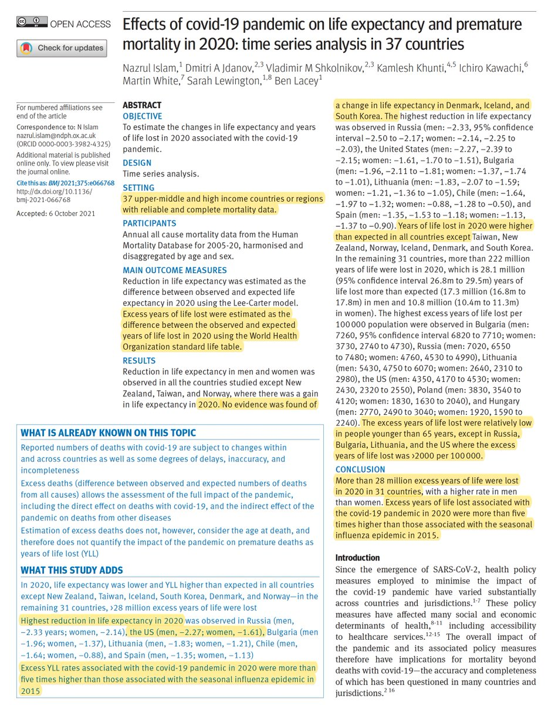</img></a><a href="FDTJEIyVIAMzNIF.jpg"  >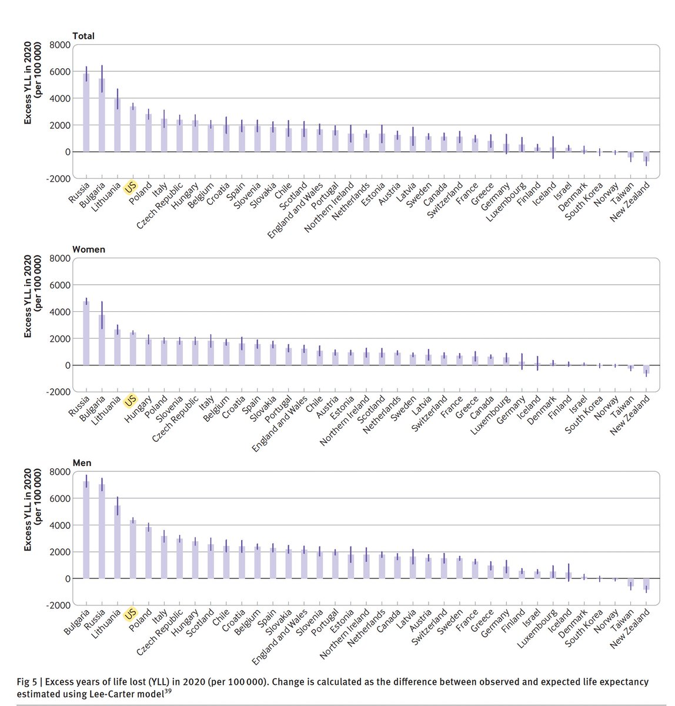</img></a>

---

<a href="https://twitter.com/erictopol/status/1456041925337751552" target="_blank" rel="noreferer">23:33 UCT</a>

A 3-shot vaccine that reduced a cancer by 87%
https://www.thelancet.com/journals/lancet/article/PIIS0140-6736(21)02178-4/fulltext?utm_campaign=lancet&utm_content=185960506&utm_medium=social&utm_source=twitter&hss_channel=tw-27013292 #VaccinesWork

---

<a href="https://twitter.com/erictopol/status/1456045055056101379" target="_blank" rel="noreferer">23:46 UCT</a>

That's YLL (typo), and here are 2 more Figures from the paper that convey the magnitude and how the US stands out as one of the highest YLL due to loss of lives among younger individuals, particularly men 

<a href="FDTpC6SUUAU7-bK.jpg"  >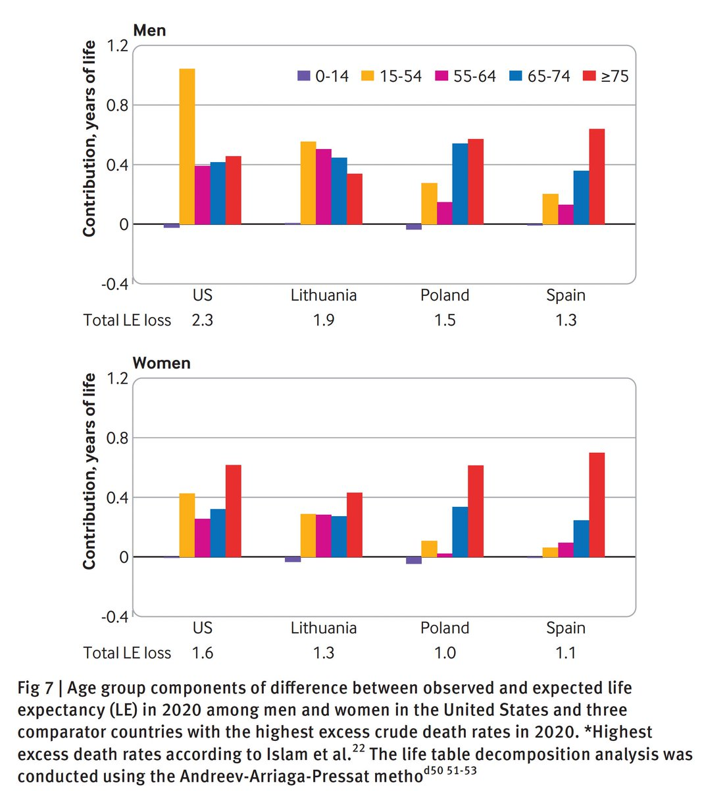</img></a><a href="FDTpEu1VIAIcwPq.jpg"  >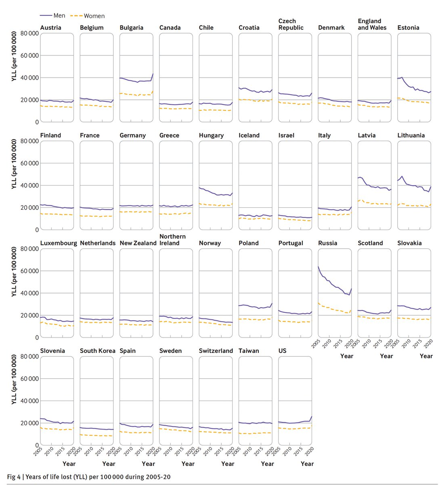</img></a>