+++
title = "Tweets by Eric Topol Nov 04"
Summary = ""
tags = ["Twitter"]
category = "Twitter"
+++

---

<a href="https://twitter.com/erictopol/status/1456061498481000448" target="_blank" rel="noreferer">00:51 UCT</a>

'Vaccinees rarely tested positive for HPV infection at even a single time point, as measured by sensitive PCR assays, implying that the vaccines provide “sterilizing” immunity from initial infection in most cases'
https://www.ncbi.nlm.nih.gov/labs/pmc/articles/PMC6035892/ a review of efficacy for these vaccines

---

<a href="https://twitter.com/erictopol/status/1456067164750839811" target="_blank" rel="noreferer">01:13 UCT</a>

RT @akriss253: @EricTopol I'm in Dubai right now. Everyone is wearing masks, both inside and outside. We flew in last night and, even thoug…

---

<a href="https://twitter.com/erictopol/status/1456090009103077381" target="_blank" rel="noreferer">02:44 UCT</a>

Success of the Covid pill era depends on rapid tests that are widely available, free or very inexpensive, and accurate. While the pills are coming soon, the US is still woefully unprepared for their roll out.

---

<a href="https://twitter.com/erictopol/status/1456099341324615683" target="_blank" rel="noreferer">03:21 UCT</a>

The updated and revised meta-analysis, with deletion of the 3 fraudulent studies, shows no significant effect of Ivermectin (upper 95% CI &gt;1), plus a new negative 500 patient randomized trial via @GidMK https://twitter.com/GidMK/status/1456072575772082177 

<a href="FDUaahXVQAAoBE5.jpg"  >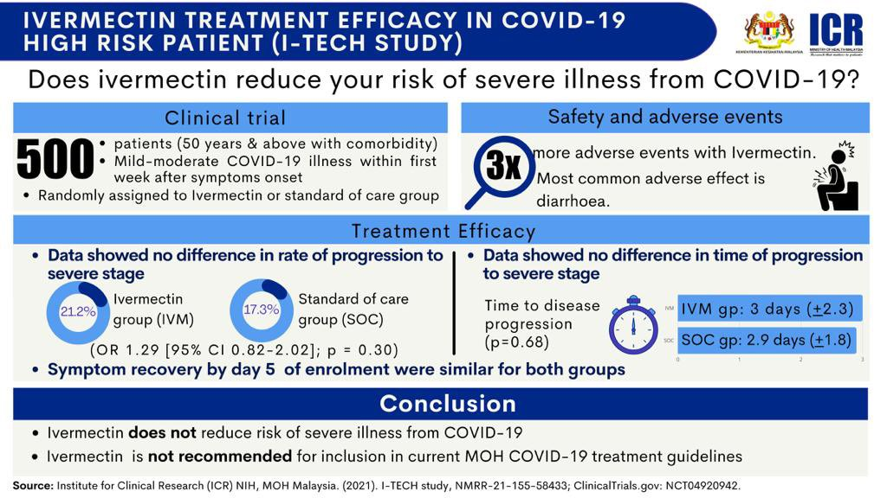</img></a>

---

<a href="https://twitter.com/erictopol/status/1456100410360352770" target="_blank" rel="noreferer">03:26 UCT</a>

Fixed link https://www.bmj.com/content/375/bmj-2021-066768

---

<a href="https://twitter.com/erictopol/status/1456259221687726084" target="_blank" rel="noreferer">13:57 UCT</a>

More on the case for kid vaccinations
https://www.ft.com/content/40b40fc7-6609-4c42-bb94-503de3191b9c by @JamieSmythF @caitlinsgilbert
1/4 of current US cases 
What drove the UK recent surge
https://www.nytimes.com/interactive/2021/10/29/world/europe/uk-britain-covid-surge.html 

<a href="FDWqtwLVIAkVnBG.jpg"  >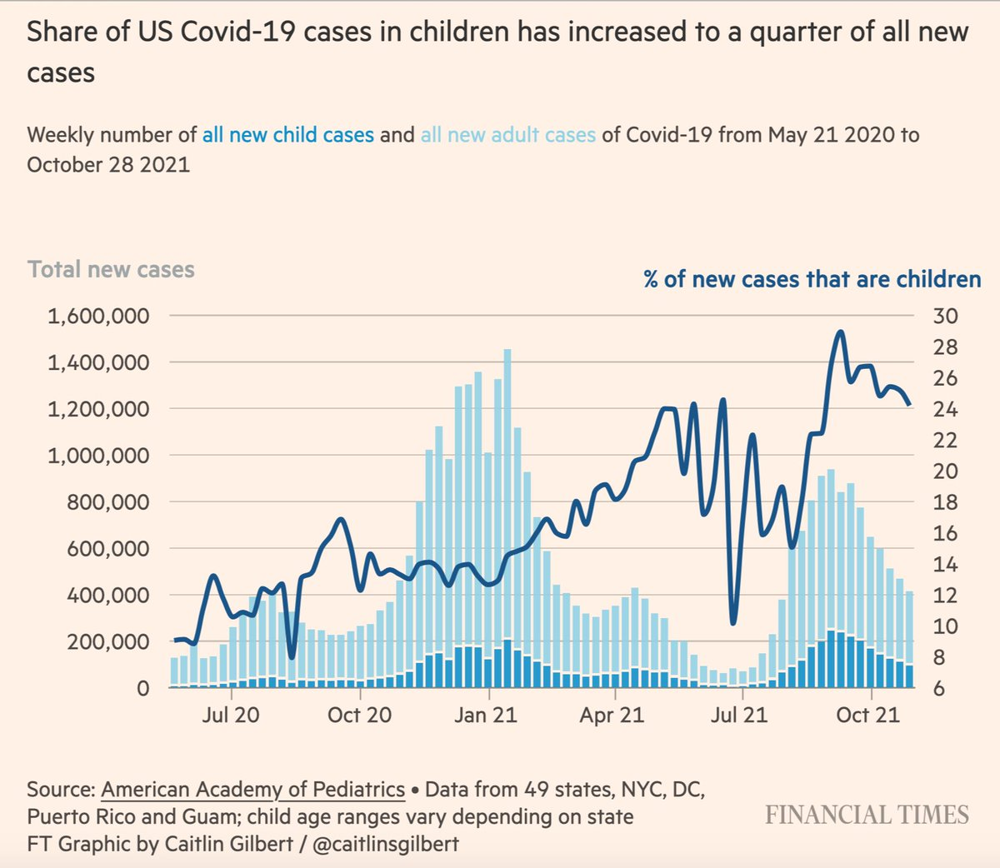</img></a><a href="FDWrTRCUcBUX5VU.jpg"  >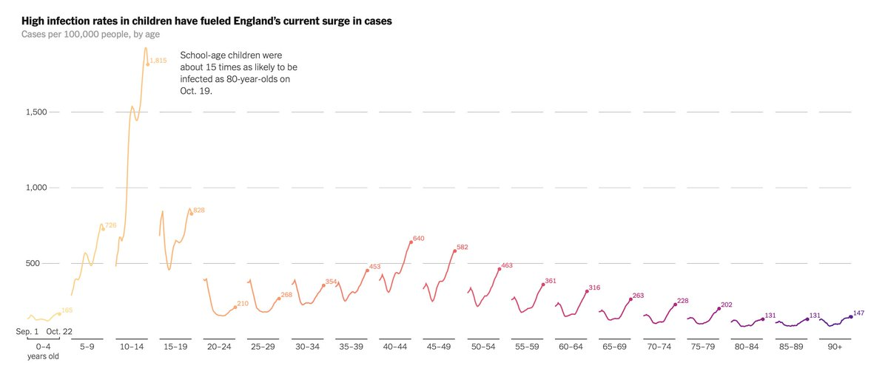</img></a>

---

<a href="https://twitter.com/erictopol/status/1456260028424343570" target="_blank" rel="noreferer">14:00 UCT</a>

The trade name for the 1st pill is Lagevrio and it's already moving forward 

<a href="FDWsu2GVkAIDvuD.jpg"  >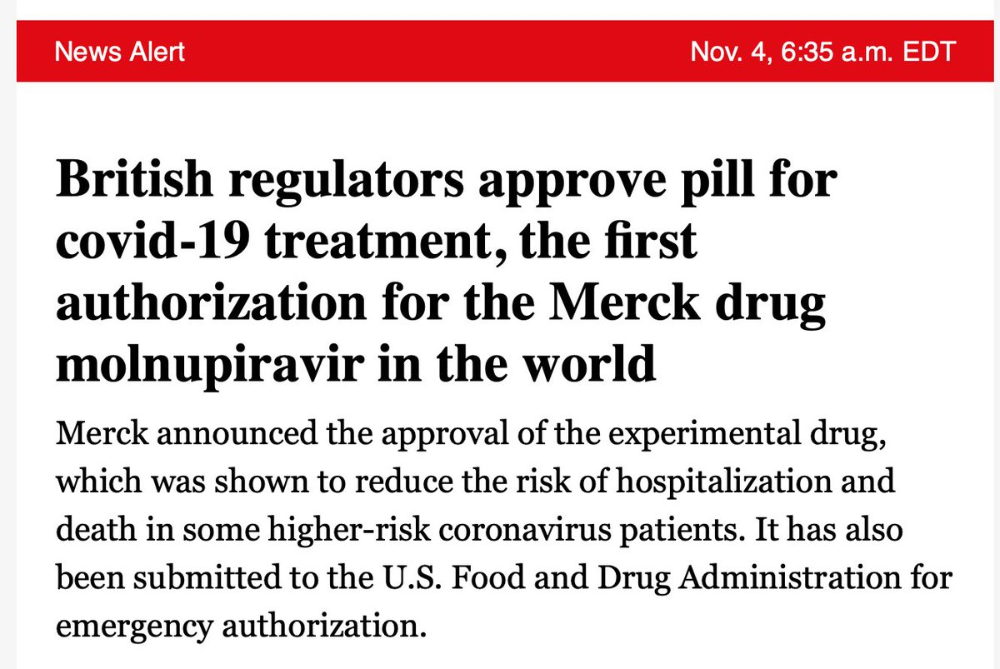</img></a>

---

<a href="https://twitter.com/erictopol/status/1456260970095910927" target="_blank" rel="noreferer">14:04 UCT</a>

These 3 recent Covid crusher countries following Delta waves have something in common: Vaccines Plus
78-87% fully vaccinated plus continued use of some mitigation measures 

<a href="FDWtd2sUYAkRIcY.jpg"  >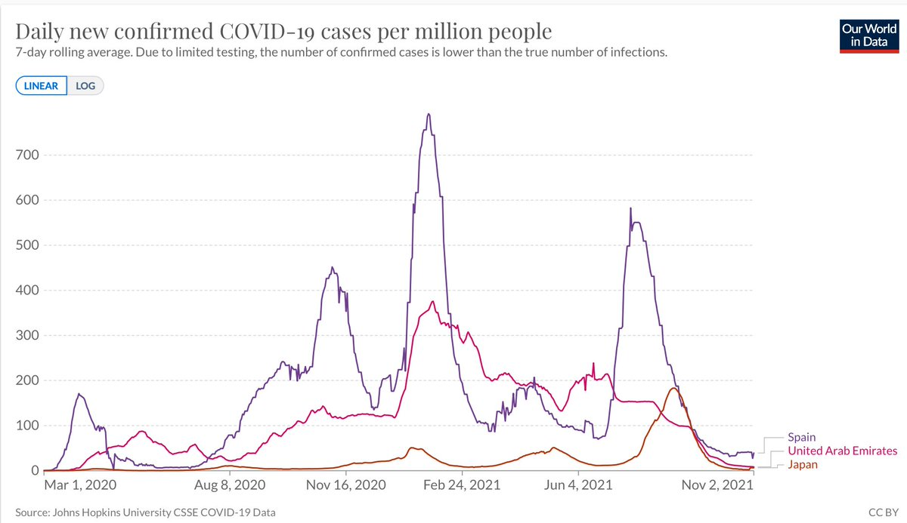</img></a>

---

<a href="https://twitter.com/erictopol/status/1456270684347199495" target="_blank" rel="noreferer">14:42 UCT</a>

Canada has vastly outperformed the United States for the entire pandemic: difference in deaths
Canada 29,114 deaths; 1 in 1,311 Canadians
US 750,450 deaths; 1 in 443 Americans 

<a href="FDW1vhNVcAkzhS5.jpg"  >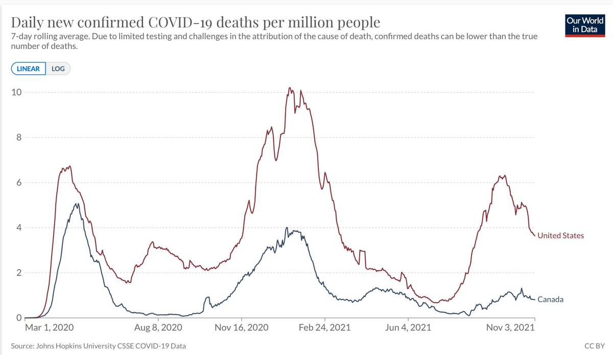</img></a>

---

<a href="https://twitter.com/erictopol/status/1456276671556816903" target="_blank" rel="noreferer">15:06 UCT</a>

What was the significance of the 2005 @ImmunityCP mRNA paper by @kkariko and @WeissmanLab?
https://www.cell.com/immunity/fulltext/S1074-7613(21)00456-8 my response along with @KizzyPhD @doctorsoumya and others 

<a href="FDW632dVUAsFvNK.jpg"  >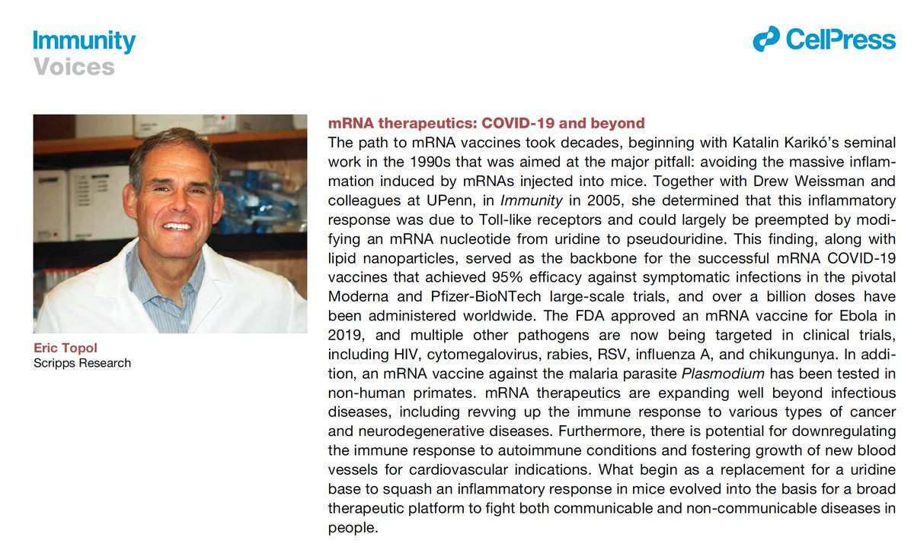</img></a>

---

<a href="https://twitter.com/erictopol/status/1456284946784403460" target="_blank" rel="noreferer">15:39 UCT</a>

Just out @NEJM 
Simple to say: "it was inferior" 😉
"FFR-guided PCI was not found to be noninferior to CABG...."
https://www.nejm.org/doi/full/10.1056/NEJMoa2112299?query=featured_home 

<a href="FDXDB7MUYAcnuoM.jpg"  >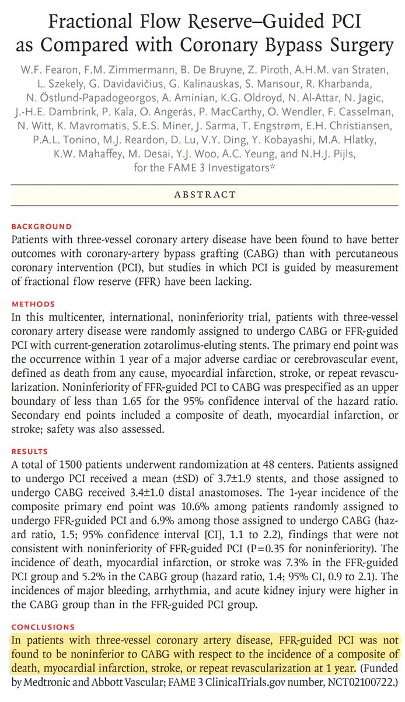</img></a>

---

<a href="https://twitter.com/erictopol/status/1456298856979697664" target="_blank" rel="noreferer">16:34 UCT</a>

1 in 440 Americans have died from Covid. 
~400,000 deaths since vaccines became available. 1,700 lost souls yesterday. There is no excuse for this tragedy. https://twitter.com/HelenBranswell/status/1456069049193009155

---

<a href="https://twitter.com/erictopol/status/1456317085127110657" target="_blank" rel="noreferer">17:47 UCT</a>

Here are @KizzyPhD and Tony Fauci's perspectives on this remarkable mRNA landmark paper 

<a href="FDXgfCoVIAc2krh.jpg"  >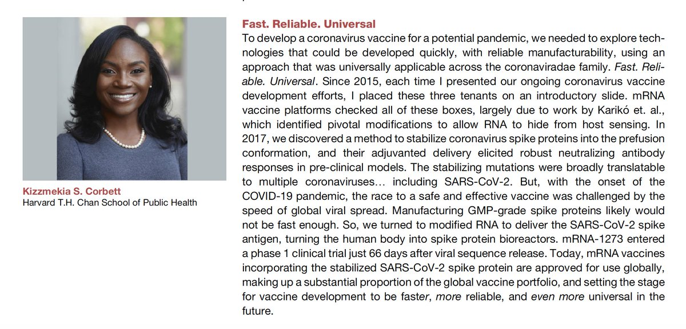</img></a><a href="FDXgiaYVIEUBtLd.jpg"  >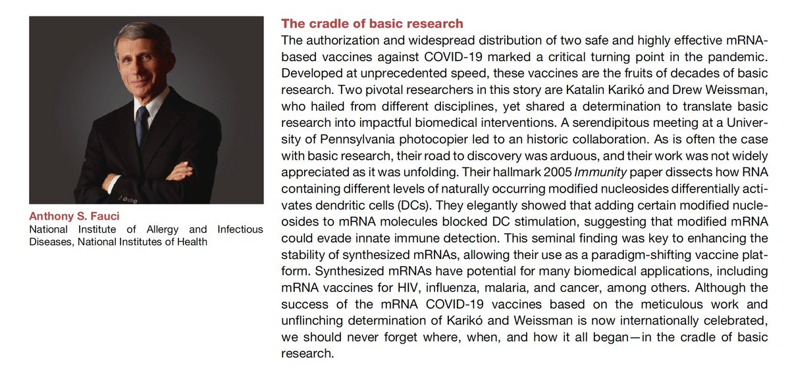</img></a>

---

<a href="https://twitter.com/erictopol/status/1456321376873295881" target="_blank" rel="noreferer">18:04 UCT</a>

You can say that again. 💯
https://www.science.org/doi/10.1126/science.abj2042
@ScienceMagazine 
"The benefits of in-person schooling with mitigations in place outweigh the risks of COVID-19 for children"
by @ShamezLadhani and colleagues 

<a href="FDXkHJAVEAgIy3r.jpg"  >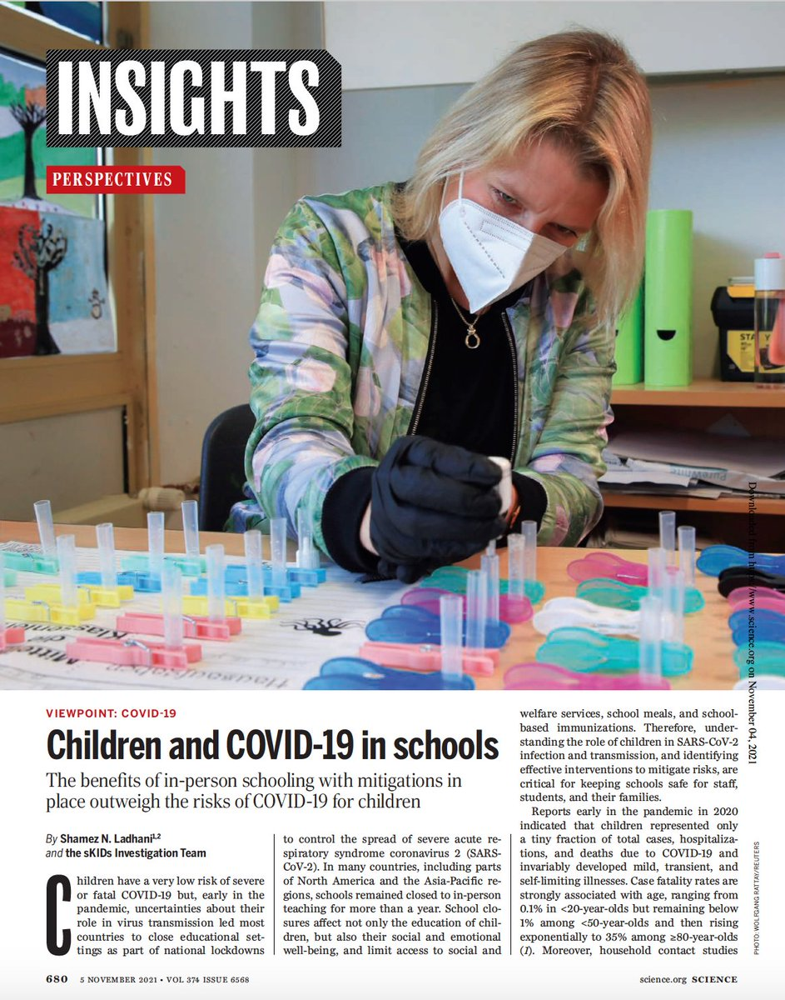</img></a>

---

<a href="https://twitter.com/erictopol/status/1456330379548233728" target="_blank" rel="noreferer">18:39 UCT</a>

Important paper, just published @ScienceMagazine, on waning vaccine effectiveness among &gt;780,000 US Veterans over time and during the Delta wave. Across all ages; J&amp;J vaccine had the most decline; reduction protection vs deaths too (Figure at right) https://www.science.org/doi/10.1126/science.abm0620 

<a href="FDXsAodVEBUvvU5.jpg"  >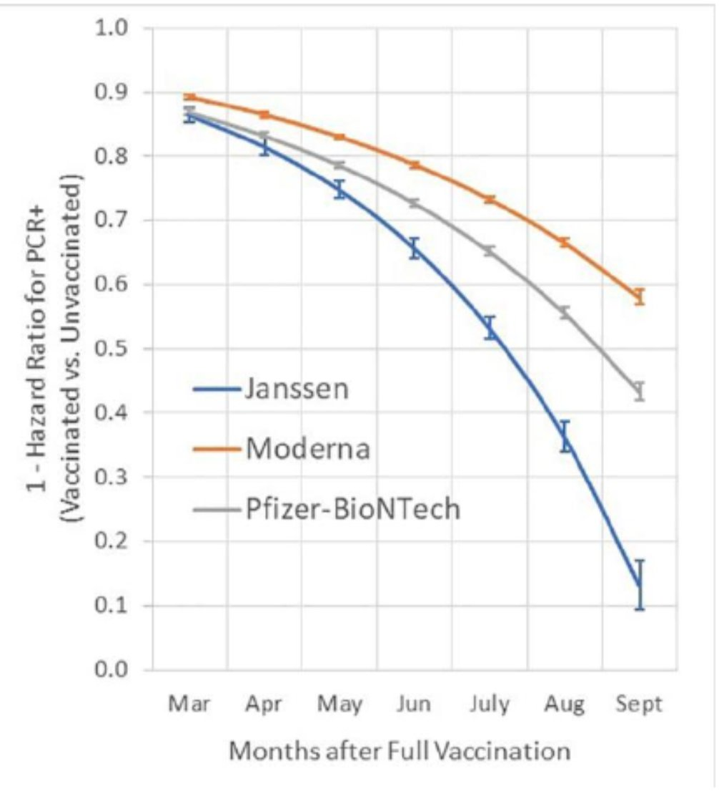</img></a><a href="FDXsDgBUYAAyg1X.jpg"  >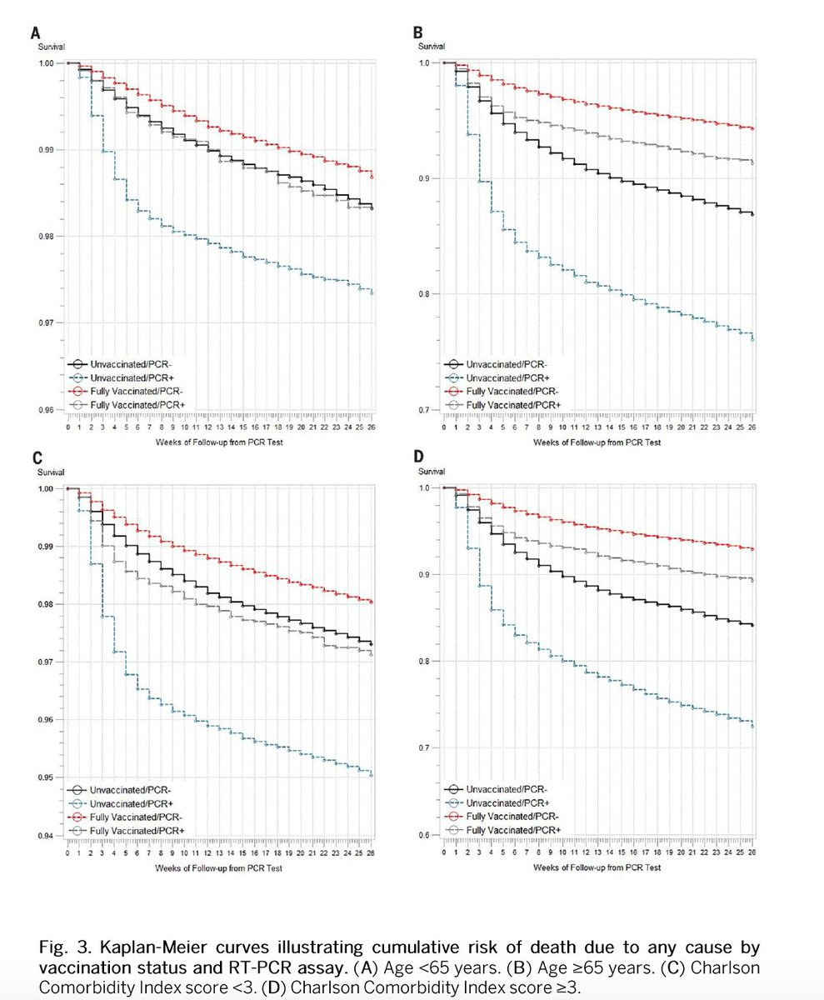</img></a>

---

<a href="https://twitter.com/erictopol/status/1456344178888085504" target="_blank" rel="noreferer">19:34 UCT</a>

Relevant discussion on the vital protection by vaccination and the breakthrough deaths 

<a href="FDX5NofVUAAhRzW.jpg"  >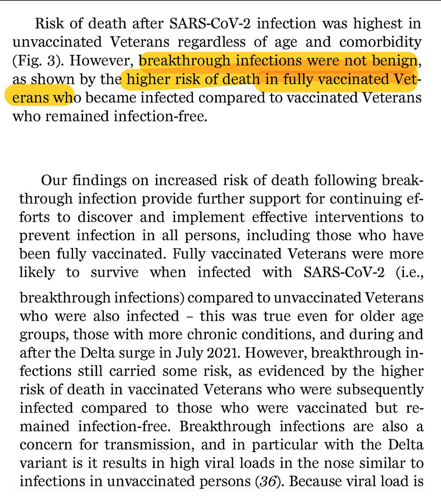</img></a>

---

<a href="https://twitter.com/erictopol/status/1456367138063597573" target="_blank" rel="noreferer">21:05 UCT</a>

Early in the pandemic, the chromosome 3p21.31 locus (haplotype arising from Neanderthal DNA) was found to be associated with a doubling of severe COVID risk.
Today the likely gene variant (regulatory,GoF) responsible for this—LZTFL1—published @NatureGenet  https://www.nature.com/articles/s41588-021-00955-3 

<a href="FDYMx3hVQBEXey5.jpg"  >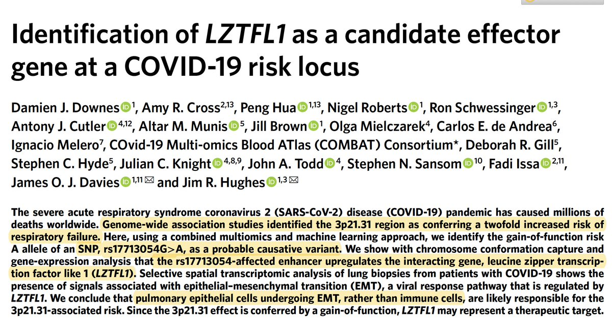</img></a>