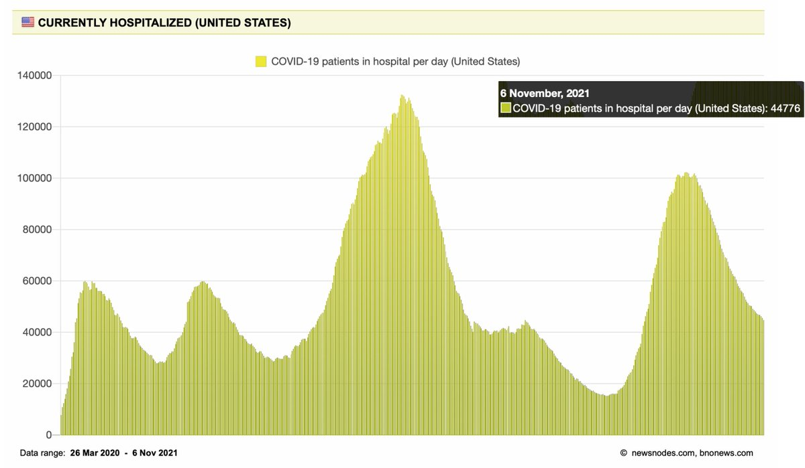
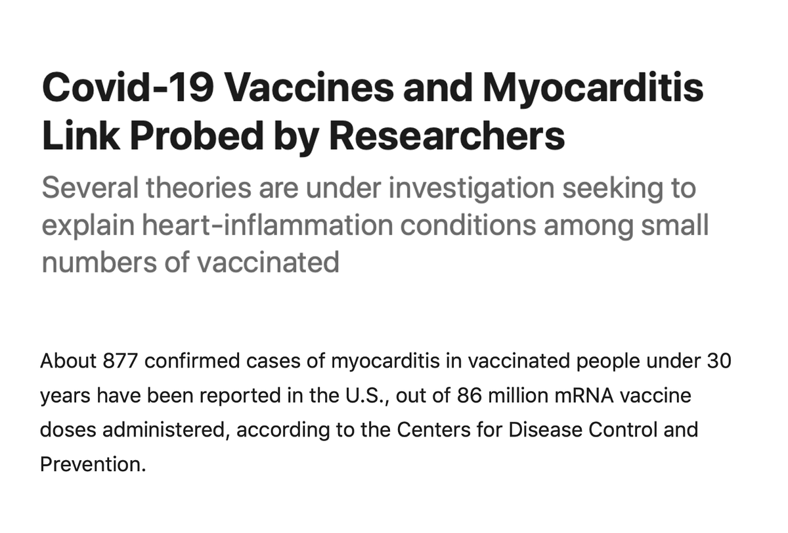
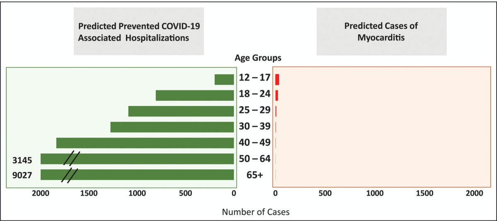
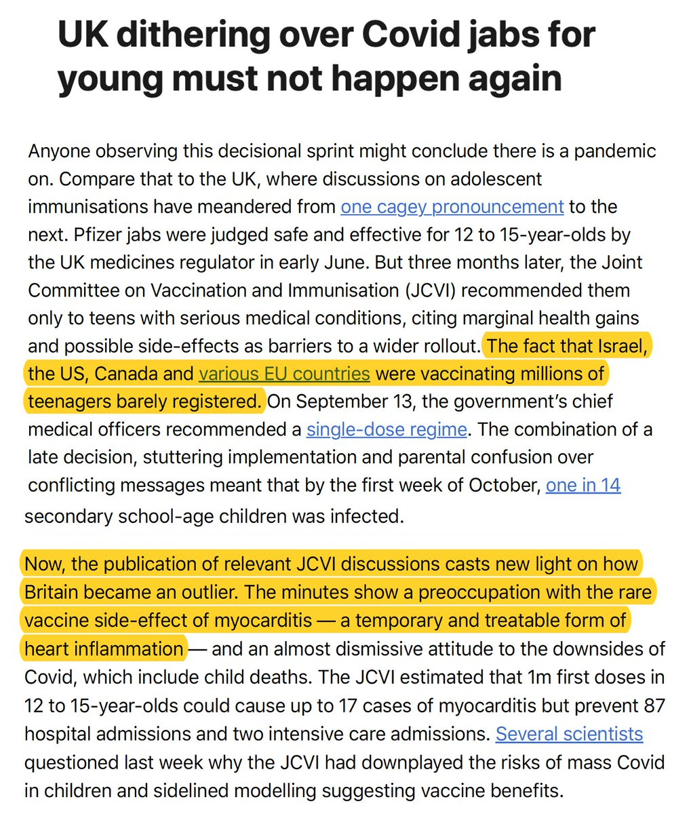
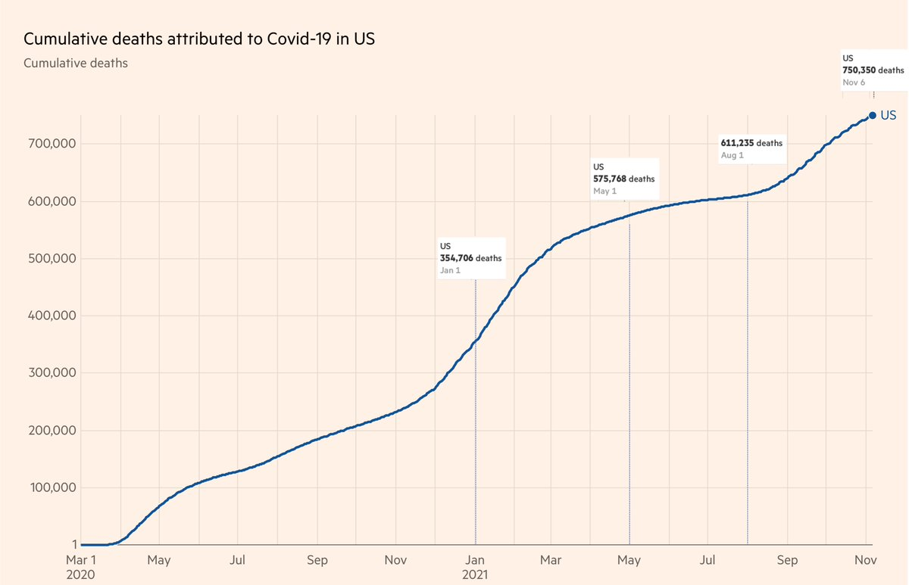
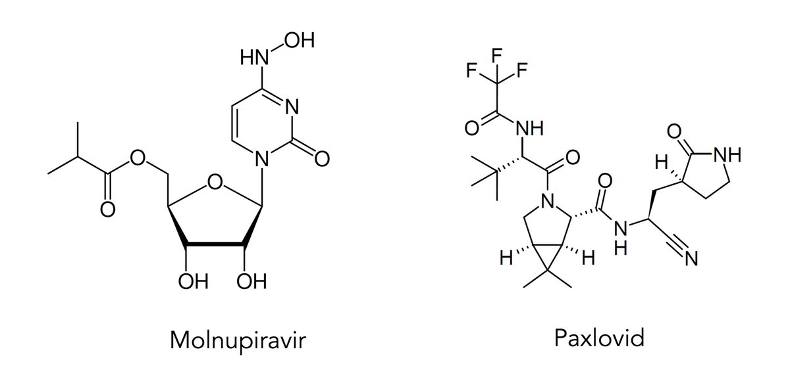
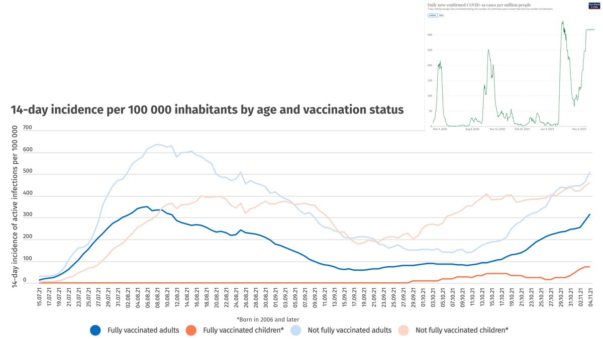
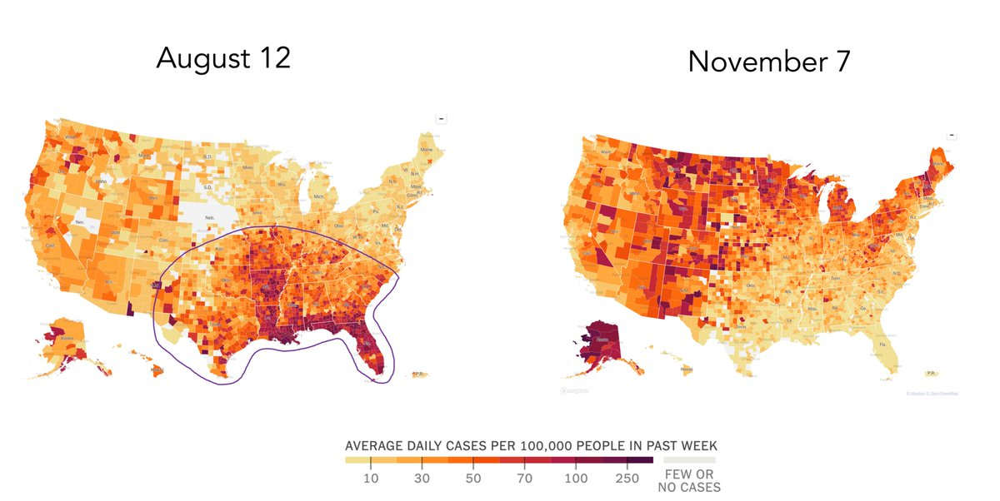

+++
title = "Tweets by Eric Topol Nov 07"
Summary = ""
tags = ["Twitter"]
category = "Twitter"
+++

---

<a href="https://twitter.com/erictopol/status/1457151784917422082" target="_blank" rel="noreferer">01:03 UCT</a>

The number of US covid hospitalizations has come down today below 45,000 for the first time since July 

<a href="FDjXkUcVUAUtkz0.jpg"  ></img></a>

---

<a href="https://twitter.com/erictopol/status/1457367329554059267" target="_blank" rel="noreferer">15:20 UCT</a>

Fortunately rare and usually mild and self-limiting, myocarditis after mRNA vaccination remains a mechanistic mystery https://www.wsj.com/articles/researchers-probe-link-between-covid-19-vaccines-and-myocarditis-11636290002 by @Loftus 
https://www.ahajournals.org/doi/epub/10.1161/CIRCULATIONAHA.121.056135 by @BiykemB @PeterHotez @ishannovation 

<a href="FDmaL8wVEAAgt-4.png"  ></img></a><a href="FDmbExPVIAESjY-.jpg"  ></img></a>

---

<a href="https://twitter.com/erictopol/status/1457379125279158275" target="_blank" rel="noreferer">16:07 UCT</a>

On the "dithering" decision for teen vaccination in the UK,  by @anjahuja @FT
https://www.ft.com/content/e5dd42d4-a555-4208-a218-738fc09a618c 

<a href="FDmmT7QVIAcBUMg.jpg"  ></img></a>

---

<a href="https://twitter.com/erictopol/status/1457396178903990273" target="_blank" rel="noreferer">17:15 UCT</a>

We'd have a 1 hour M&amp;M conference to review the circumstances of one preventable death.
What about hundreds of thousands?
~150,000 deaths in the US Delta wave, more than 90% preventable by vaccination 

<a href="FDm16QBVIAEALOz.jpg"  ></img></a>

---

<a href="https://twitter.com/erictopol/status/1457407595698745346" target="_blank" rel="noreferer">18:00 UCT</a>

When organic chemistry becomes quite relevant. Two small molecules in the form of pills that take down #SARSCoV2 will be making a big difference in the months ahead for preventing hospitalizations and deaths, adding to the powerful impact of vaccines 

<a href="FDm_dcrUYAgSvWN.jpg"  ></img></a>

---

<a href="https://twitter.com/erictopol/status/1457415941990465536" target="_blank" rel="noreferer">18:33 UCT</a>

RT @ScottGottliebMD: In the U.S., we need to focus not only on the breadth of coverage (encouraging more adults to get vaccinated for first…

---

<a href="https://twitter.com/erictopol/status/1457430069849178112" target="_blank" rel="noreferer">19:29 UCT</a>

Iceland is one of several European countries with a recent surge in Covid, with data indicating the cases stem from unvaccinated adults and teens, and, to a lesser extent, vaccinated adults
https://grapevine.is/news/2021/11/05/covid-roundup-record-number-of-domestic-cases-new-requirements-instituted/ 

<a href="FDnUONuVkAEoiKb.jpg"  ></img></a>

---

<a href="https://twitter.com/erictopol/status/1457438899580456968" target="_blank" rel="noreferer">20:04 UCT</a>

Almost opposites 

<a href="FDnc8n9VgAAS5YX.jpg"  ></img></a>