+++
title = "Tweets by Eric Topol Nov 09"
Summary = ""
tags = ["Twitter"]
category = "Twitter"
+++

---

<a href="https://twitter.com/erictopol/status/1457913612765253634" target="_blank" rel="noreferer">03:31 UCT</a>

Another Delta transmission in household study:
"Effectiveness of full vaccination against transmission to unvaccinated household contacts was 63% (95% CI 46-75%)" among 7,771 contacts of 4,921 index cases.
https://www.medrxiv.org/content/10.1101/2021.10.14.21264959v1

---

<a href="https://twitter.com/erictopol/status/1458083296743772177" target="_blank" rel="noreferer">14:45 UCT</a>

Where did the deaths occur? 

<a href="FDwm_DuVQAAhN-u.jpg"  >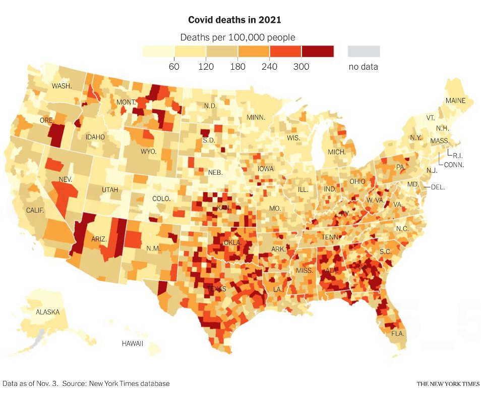</img></a>

---

<a href="https://twitter.com/erictopol/status/1458084717518020614" target="_blank" rel="noreferer">14:51 UCT</a>

"A genius on the football field, Rodgers has revealed himself to be a pandemic ignoramus.....He has done the impossible: sacked himself."—@MaxBoot 
https://www.washingtonpost.com/opinions/2021/11/08/when-did-dr-aaron-rodgers-qb-acquire-phd-epidemiology/ @PostOpinions 
https://twitter.com/hholdenthorp/status/1457160945881468929 "We’re waiting for the paper on your research"—@hholdenthorp

---

<a href="https://twitter.com/erictopol/status/1458091095347376137" target="_blank" rel="noreferer">15:16 UCT</a>

Just published @ScienceMagazine 
What is a/the basis for the immune evasion of the Delta strain?
Elegant structural biology, cryo-EM assessment shows remodeling of the N-terminal domain
https://www.science.org/doi/10.1126/science.abl8506 

<a href="FDwt_eCWUAMQvWw.jpg"  >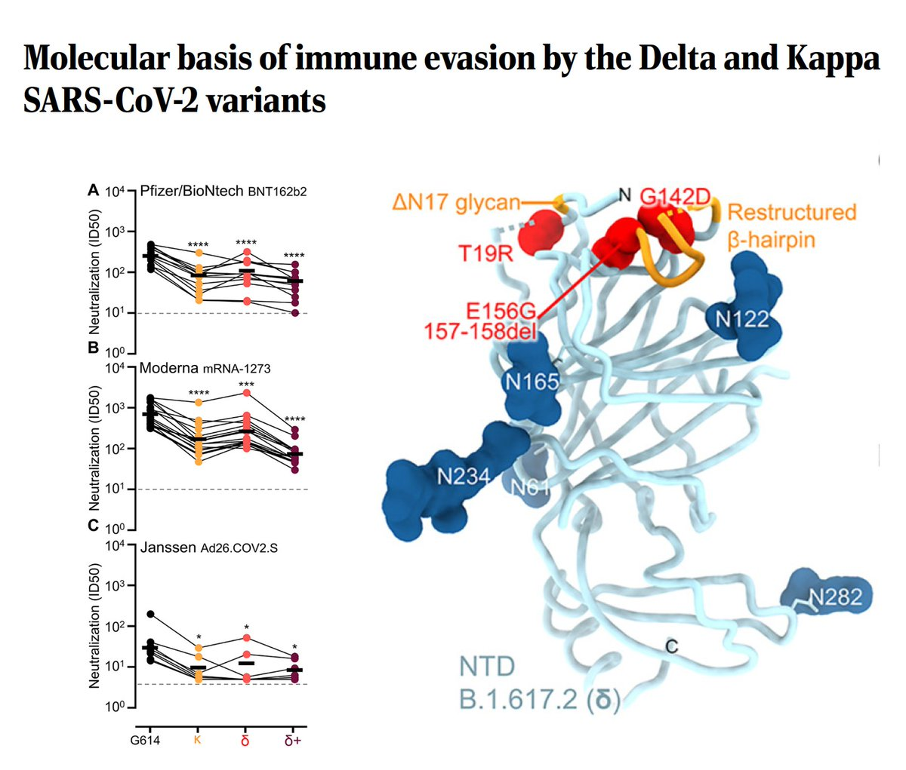</img></a>

---

<a href="https://twitter.com/erictopol/status/1458093303669346322" target="_blank" rel="noreferer">15:25 UCT</a>

RT @EricTopol: A Delta outbreak of 246 people (31% unvaccinated children, age &lt;12) that emanated from 2 children (solid red squares, G1)
ht…

---

<a href="https://twitter.com/erictopol/status/1458117183771496455" target="_blank" rel="noreferer">17:00 UCT</a>

The randomized trial of the Pfizer vaccine for children age 5-11 is published @NEJM today. The data indicate very high efficacy (91%, 95% CI 68,98)) a strong immune response and absence of any serious side effects among 2,268 participants 
http://www.nejm.org/doi/full/10.1056/NEJMoa2116298 

<a href="FDxAnrEUcAE8FmO.jpg"  >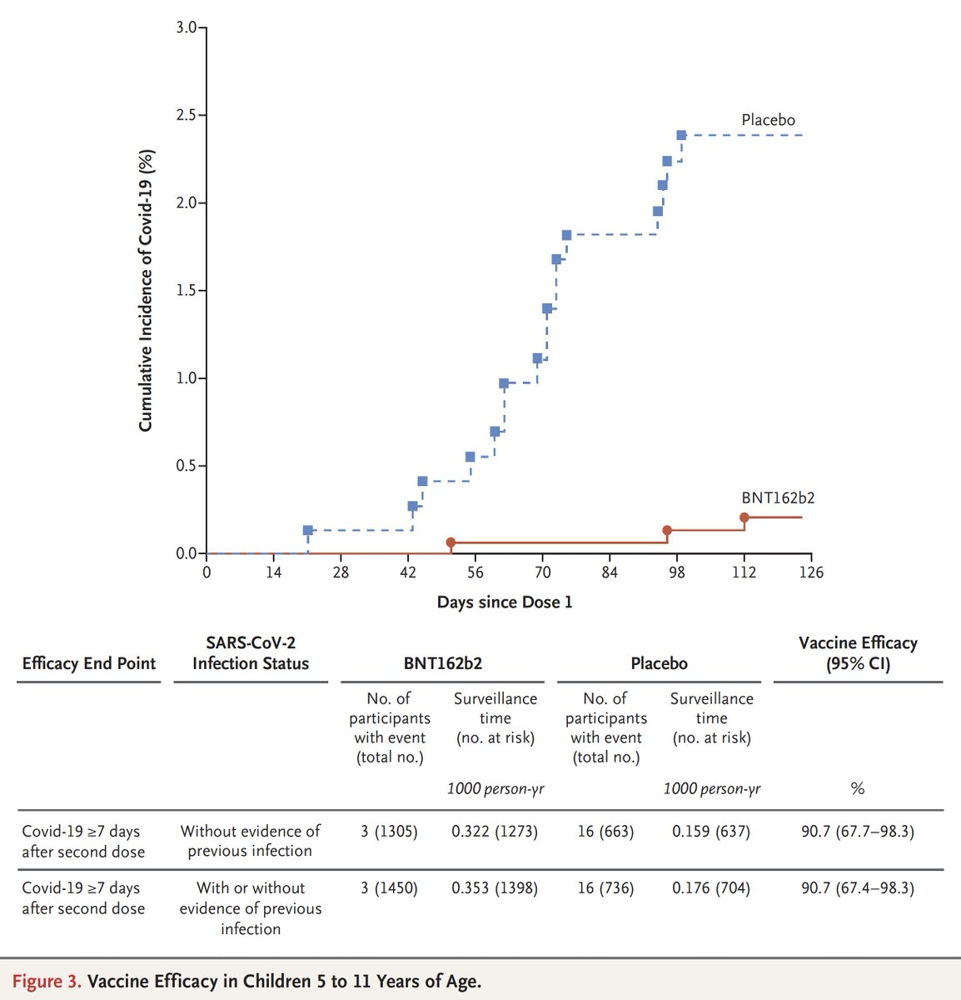</img></a>

---

<a href="https://twitter.com/erictopol/status/1458122130533466116" target="_blank" rel="noreferer">17:19 UCT</a>

The neutralizing antibody response for 5-11 years olds vs 16-25 years olds at 1/3rd the dose (and compared with placebo)
https://www.nejm.org/doi/suppl/10.1056/NEJMoa2116298/suppl_file/nejmoa2116298_appendix.pdf 

<a href="FDxJ4BjUYAMrMbt.jpg"  >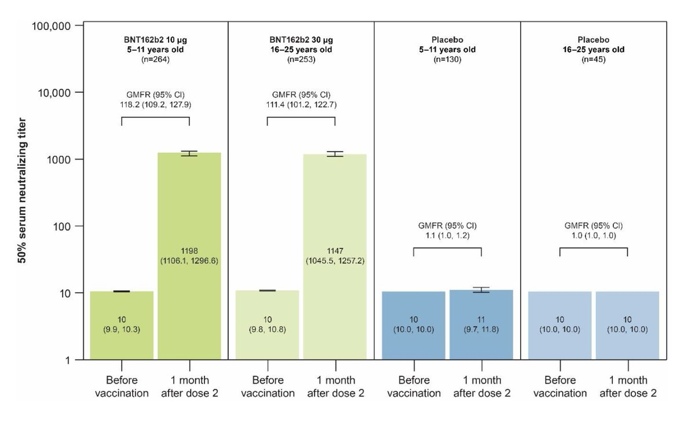</img></a>

---

<a href="https://twitter.com/erictopol/status/1458129699566014467" target="_blank" rel="noreferer">17:49 UCT</a>

Two new reports serve as a foundation for a covid kids vaccine checklist
https://www.nejm.org/doi/full/10.1056/NEJMoa2116298 on efficacy and safety
https://www.medrxiv.org/content/10.1101/2021.11.05.21265712v1 2 unvaccinated children (G1) seed an outbreak of 246 people 

<a href="FDxQqWfVIAMlHDk.jpg"  >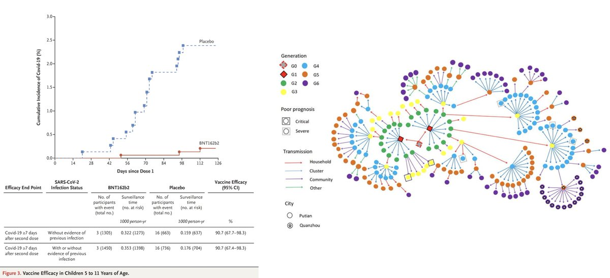</img></a><a href="FDxROg1UcAMniOM.jpg"  >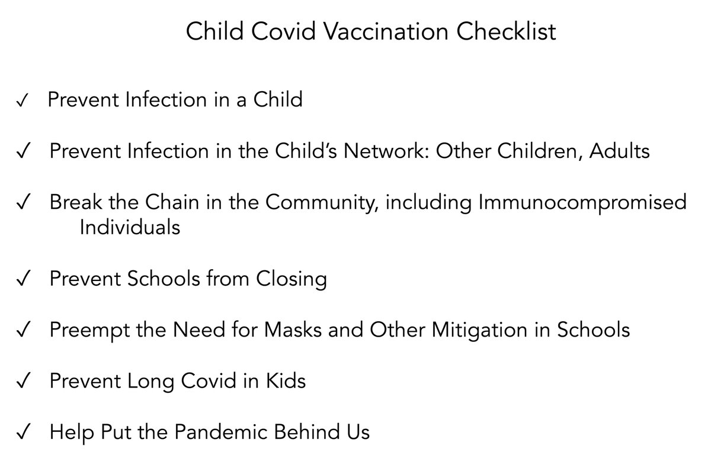</img></a>

---

<a href="https://twitter.com/erictopol/status/1458141186716147717" target="_blank" rel="noreferer">18:35 UCT</a>

Misinformation is a killer. Not just in the United States.
What has fueled the world's outlier in Covid deaths?
https://www.nytimes.com/2021/11/08/world/europe/romania-covid-vaccine-refusal.html?searchResultPosition=2 @ATHigginsNYT 
(where it is classified as a criminal offense) 

<a href="FDxZsZZVIAQWcmj.jpg"  >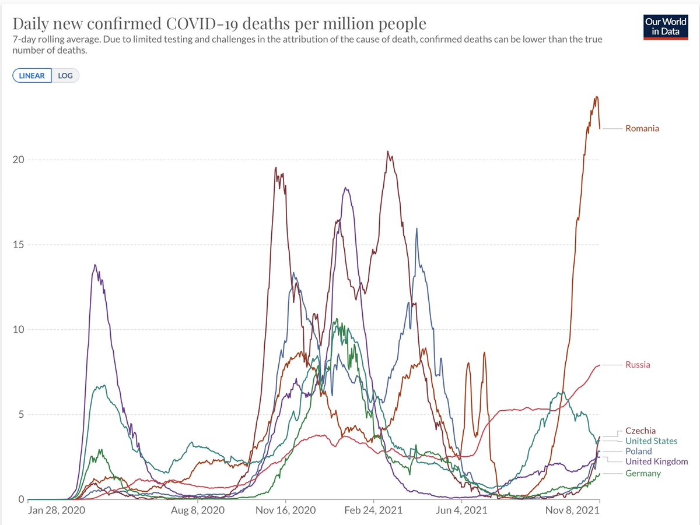</img></a><a href="FDxbWcSUcAArRFG.jpg"  >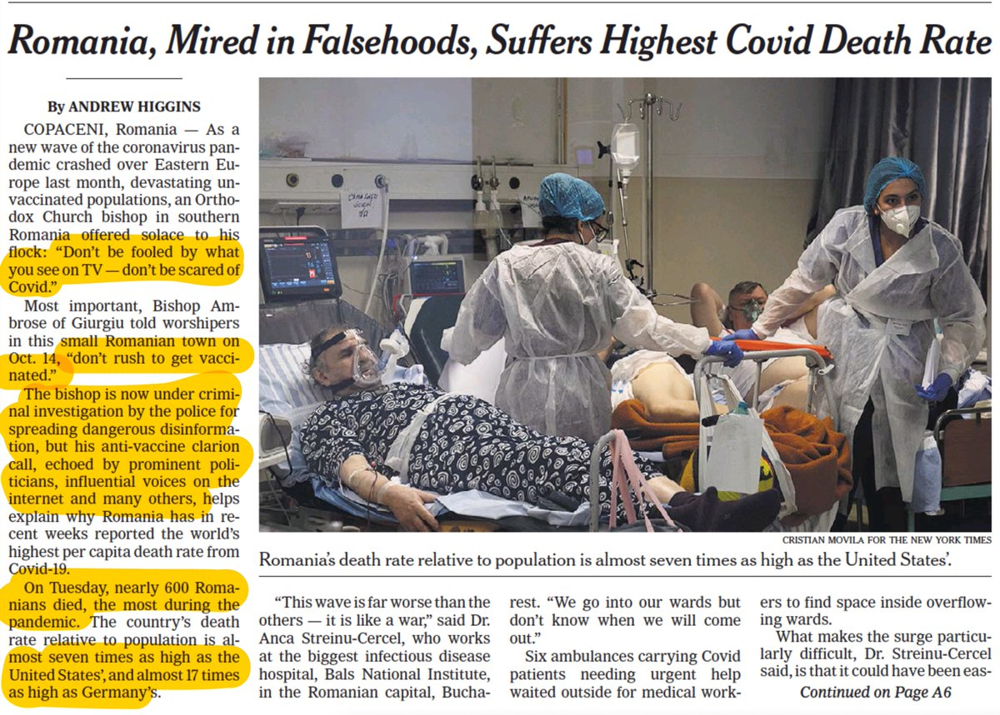</img></a>

---

<a href="https://twitter.com/erictopol/status/1458167566195511299" target="_blank" rel="noreferer">20:20 UCT</a>

Important new study on immunity (anti-spike Ab) waning and breakthrough infections after AZ &amp; Pfizer vaccines in &gt;5500 people
1. AZ far more pronounced and earlier waning than Pfizer &amp; more breakthroughs
2.Anti-S correlated w/ risk of breakthroughs
https://www.medrxiv.org/content/10.1101/2021.11.05.21265968v1 

<a href="FDxzYmyUYAEX4BS.jpg"  >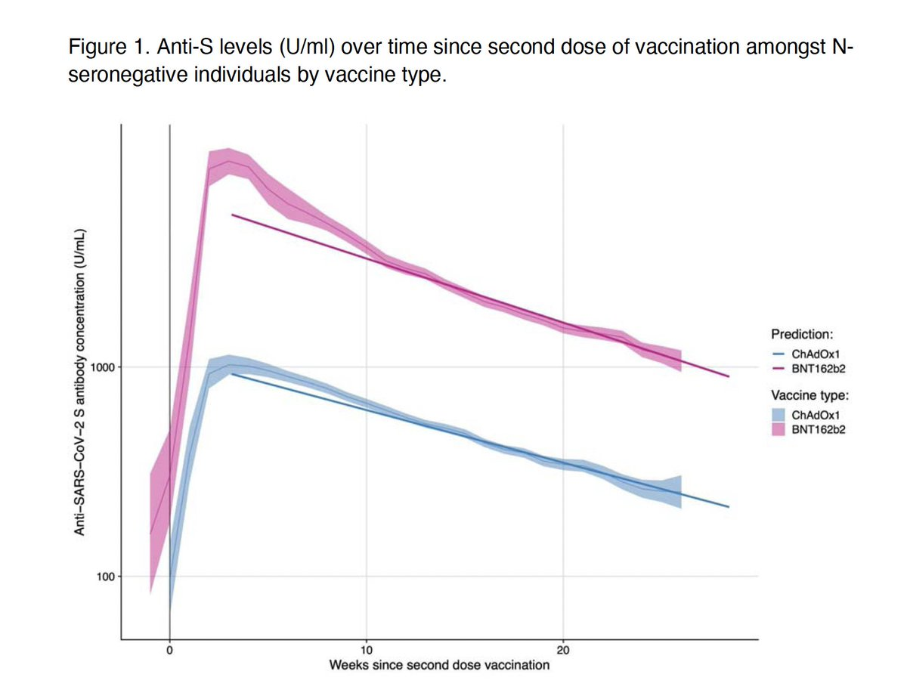</img></a><a href="FDxzaFAUUAEOMmN.jpg"  >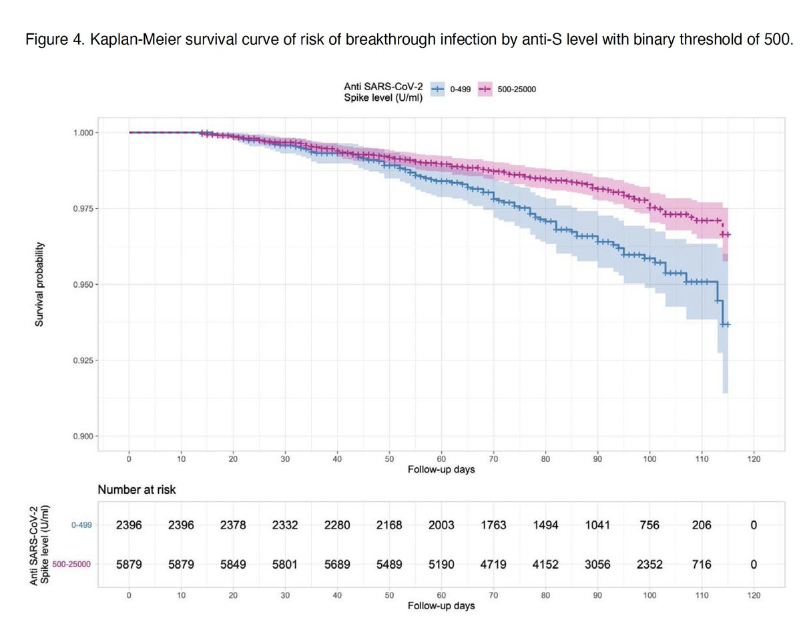</img></a>

---

<a href="https://twitter.com/erictopol/status/1458167894496346113" target="_blank" rel="noreferer">20:21 UCT</a>

"Our data demonstrate the importance of booster doses to maintain protection in the elderly and clinically vulnerable and suggest that these should be prioritized to those who received ChAdOx1 [AZ vaccine] as their primary course."

---

<a href="https://twitter.com/erictopol/status/1458172855707832324" target="_blank" rel="noreferer">20:41 UCT</a>

About timing:
"Our results show waning to levels associated with breakthrough infections before this 6 month period for those vaccinated with ChAdOx1 but not for BNT162b2."

---

<a href="https://twitter.com/erictopol/status/1458222239300481024" target="_blank" rel="noreferer">23:57 UCT</a>

Our covid times :-) 

<a href="FDylVDyUUAA4BX5.jpg"  >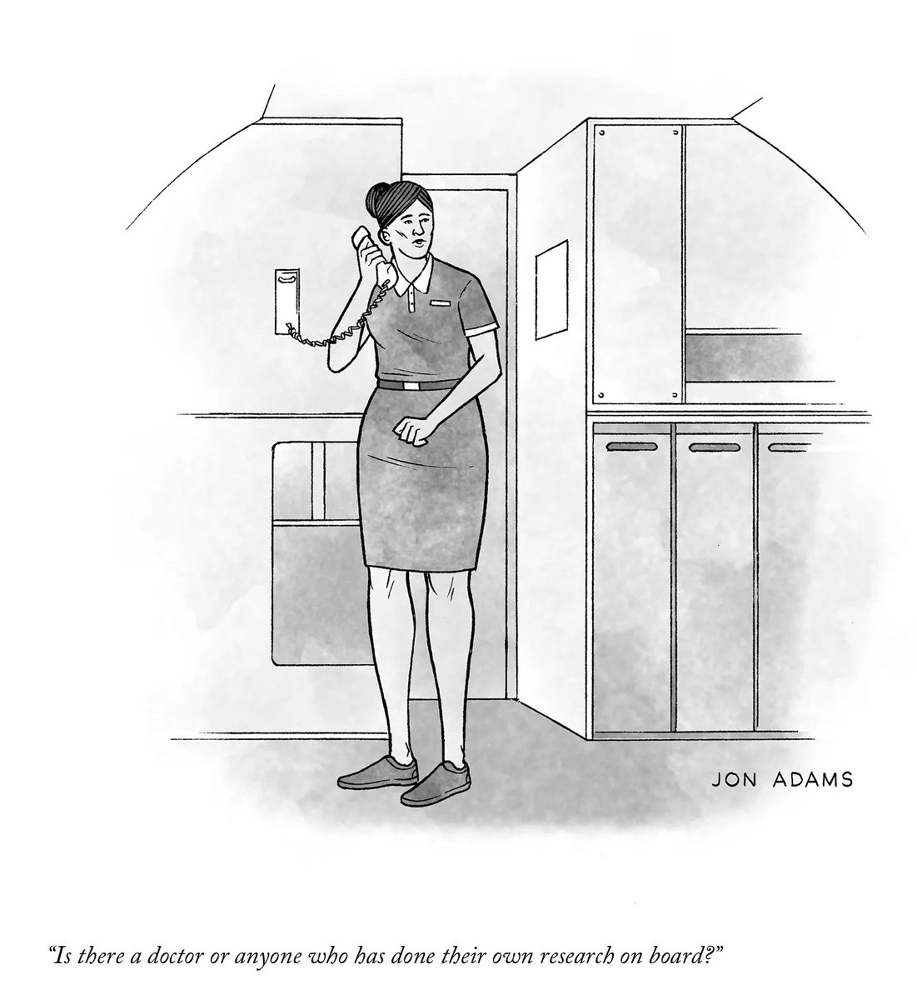</img></a><a href="FDylX_GVIAY8Vv8.jpg"  >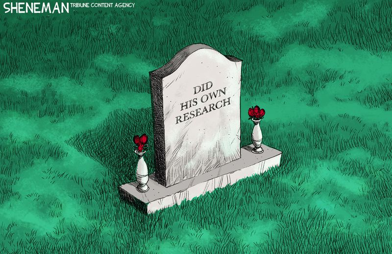</img></a>