+++
title = "Tweets by Eric Topol Nov 10"
Summary = ""
tags = ["Twitter"]
category = "Twitter"
+++

---

<a href="https://twitter.com/erictopol/status/1458231156319551490" target="_blank" rel="noreferer">00:32 UCT</a>

The rapid and marked decline of anti-Spike antibodies seen with the AZ vaccine is very similar to what has been reported for the J&amp;J (both adenovector-based)
https://www.cdc.gov/mmwr/volumes/70/wr/mm7038e1.htm?s_cid=mm7038e1_w @CDCMMWR 

<a href="FDytZ89VUAAANt4.jpg"  >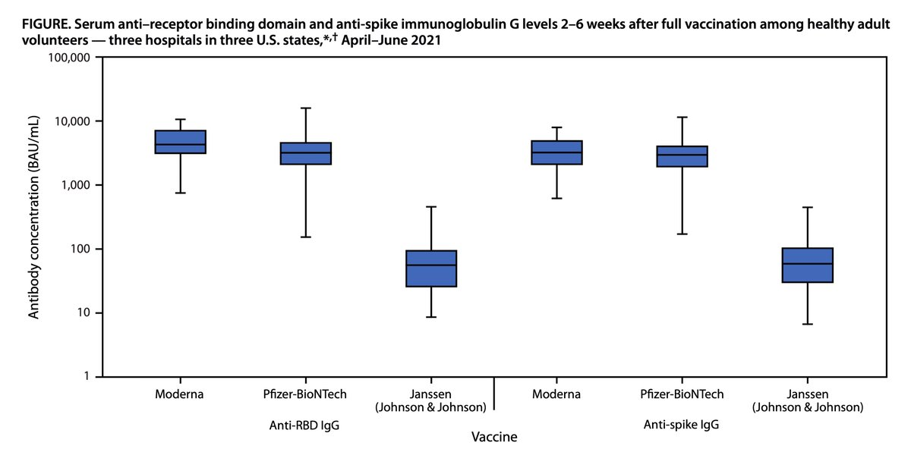</img></a>

---

<a href="https://twitter.com/erictopol/status/1458234847667785728" target="_blank" rel="noreferer">00:47 UCT</a>

One of the leading communicators in medicine today —@gradydoctor—joined us for the latest @Medscape podcast. Hope you'll find it as informative and enjoyable as we did.
https://www.medscape.com/viewarticle/961519 
w/ @cuttingforstone #MedTwitter

---

<a href="https://twitter.com/erictopol/status/1458238284790779907" target="_blank" rel="noreferer">01:01 UCT</a>

The BIG benefit of 1 vaccine after Prior Covid
A prospective study of healthcare workers with or without prior Covid and mRNA vaccination:
Superior antibody and T cell response, further accentuated with major variants @LancetMicrobe 
https://www.thelancet.com/journals/lanmic/article/PIIS2666-5247(21)00275-5/fulltext 

<a href="FDyzpXDUUAc6U2s.jpg"  >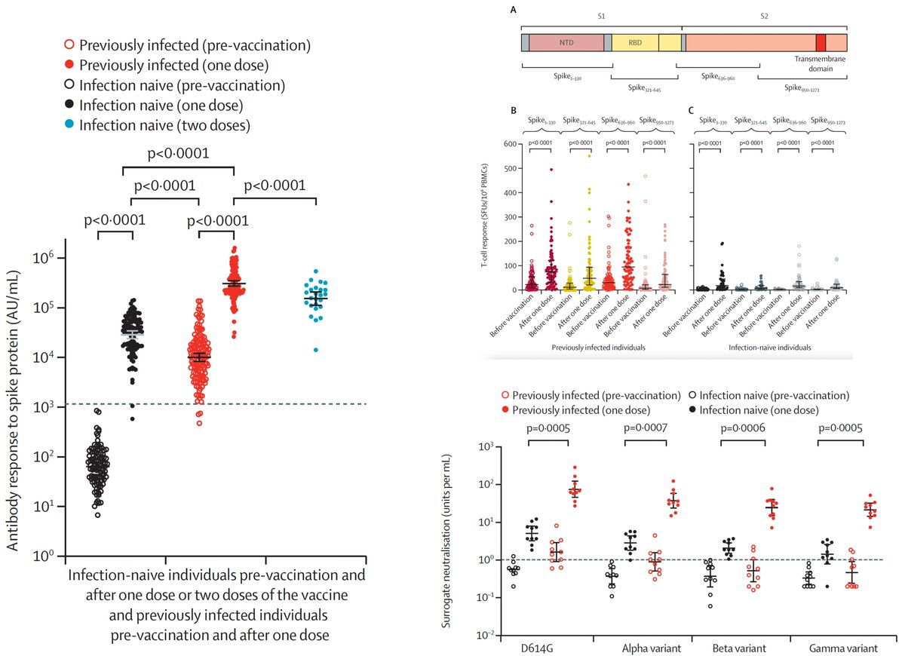</img></a>

---

<a href="https://twitter.com/erictopol/status/1458294649269862401" target="_blank" rel="noreferer">04:45 UCT</a>

Up 7% past 7-days
3 weeks at ≥ 75,000 new cases/day 
https://newsnodes.com/us 

<a href="FDzl92zVgAYQgbc.jpg"  >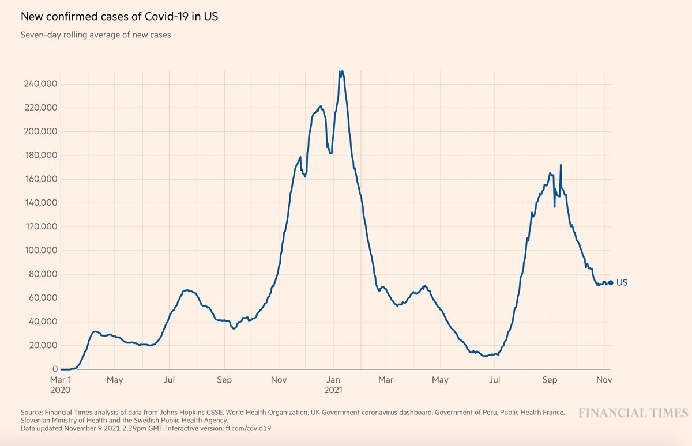</img></a>

---

<a href="https://twitter.com/erictopol/status/1458444085333692417" target="_blank" rel="noreferer">14:39 UCT</a>

An ugly patent battle by a company who received not just massive $ taxpayer and @NIH science support, but also the template for the vaccine from the #SARSCoV2 sequence with the 2-P substitution from NIH's Vaccine Research Center
https://www.nytimes.com/2021/11/09/us/moderna-vaccine-patent.html?searchResultPosition=1 @SherylNYT @RebeccaDRobbins 

<a href="FD1uhKQVIAUAD99.jpg"  >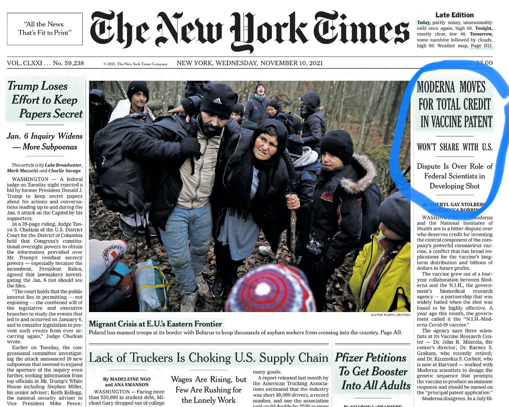</img></a>

---

<a href="https://twitter.com/erictopol/status/1458451549139587072" target="_blank" rel="noreferer">15:08 UCT</a>

Western Europe getting worse, while Eastern Europe currently has worst surge in the world @OurWorldInData 
https://www.nytimes.com/2021/11/10/world/europe/covid-germany-record-cases.html
In Germany, @c_drosten  "has warned that the nation’s pandemic death toll could double if sufficient measures are not taken." 

<a href="FD10wE_VkAM9H60.jpg"  >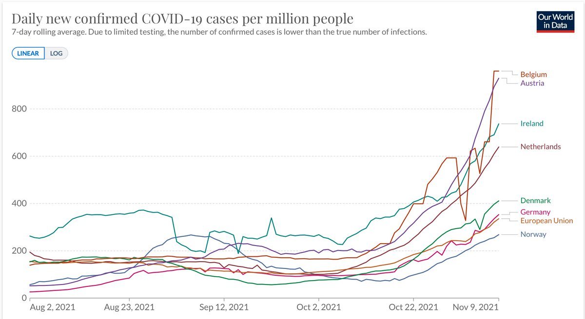</img></a>

---

<a href="https://twitter.com/erictopol/status/1458464478568370186" target="_blank" rel="noreferer">16:00 UCT</a>

How do certain people *abort* a Covid infection?
Their pre-existing T cells vs RTC rapidly clear the virus, and they have -PCR and antibody tests
Fascinating report, just published @nature, with implications for new vaccines
https://www.nature.com/articles/s41586-021-04186-8 

<a href="FD15wt2UcAc-R4g.jpg"  >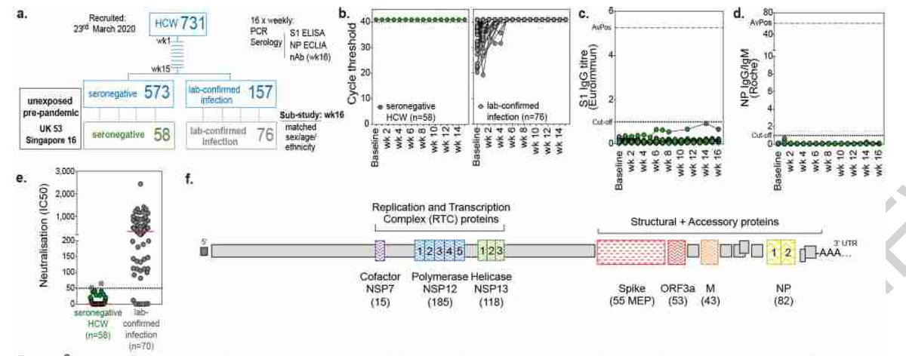</img></a>

---

<a href="https://twitter.com/erictopol/status/1458473912338059267" target="_blank" rel="noreferer">16:37 UCT</a>

Phenomenal work by @Leo1401j
 @maini_lab @ucl @UCLInfectImm 🙏 

<a href="FD2KN5JVgAIn46q.jpg"  >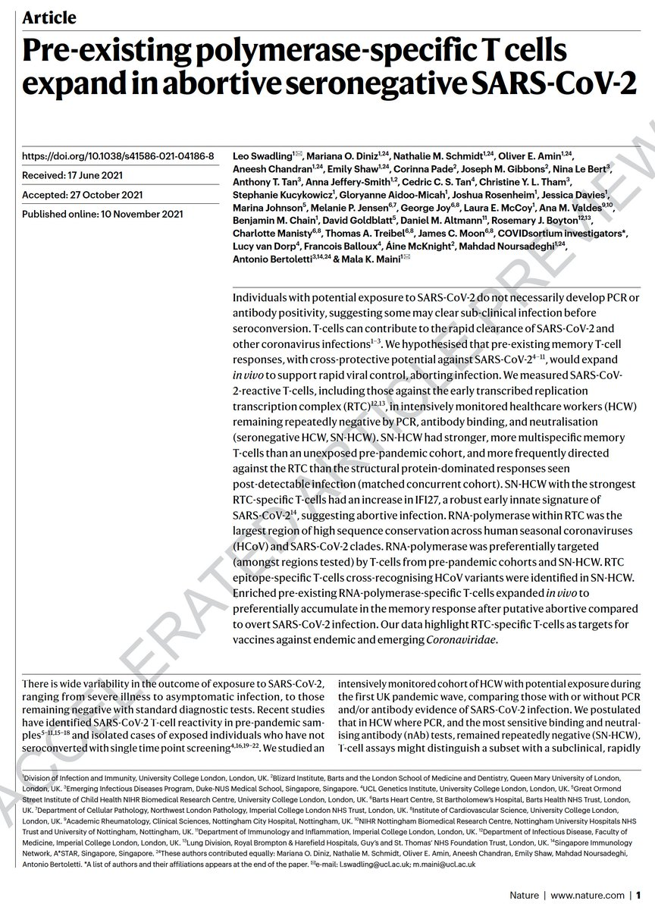</img></a>

---

<a href="https://twitter.com/erictopol/status/1458478864770891782" target="_blank" rel="noreferer">16:57 UCT</a>

How well do boosters protect versus severe disease across age groups?
Updated Israel data via @jsm2334, from @IsraelMOH 
Benefit seen 16+ 

<a href="FD2OusYUYAkUNjR.jpg"  >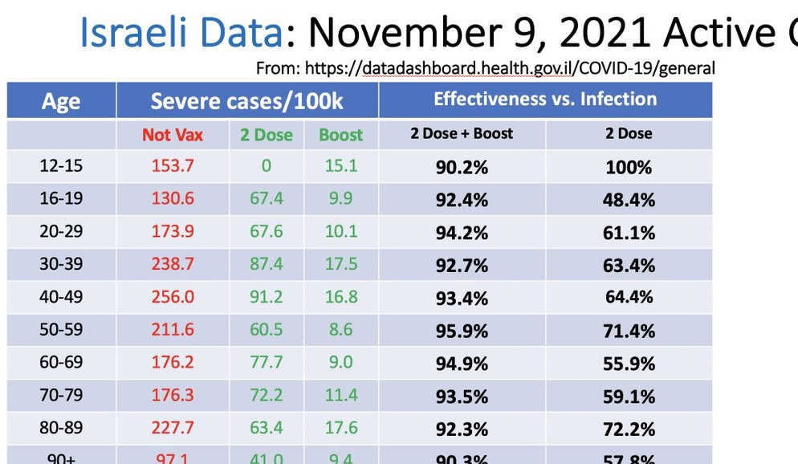</img></a>

---

<a href="https://twitter.com/erictopol/status/1458490818700845059" target="_blank" rel="noreferer">17:44 UCT</a>

Corrected graphs (label issue) for confirmed infections and severe disease, absolute and per 100K people, via @jsm2334 

<a href="FD2ZVr2VQAECRIe.jpg"  >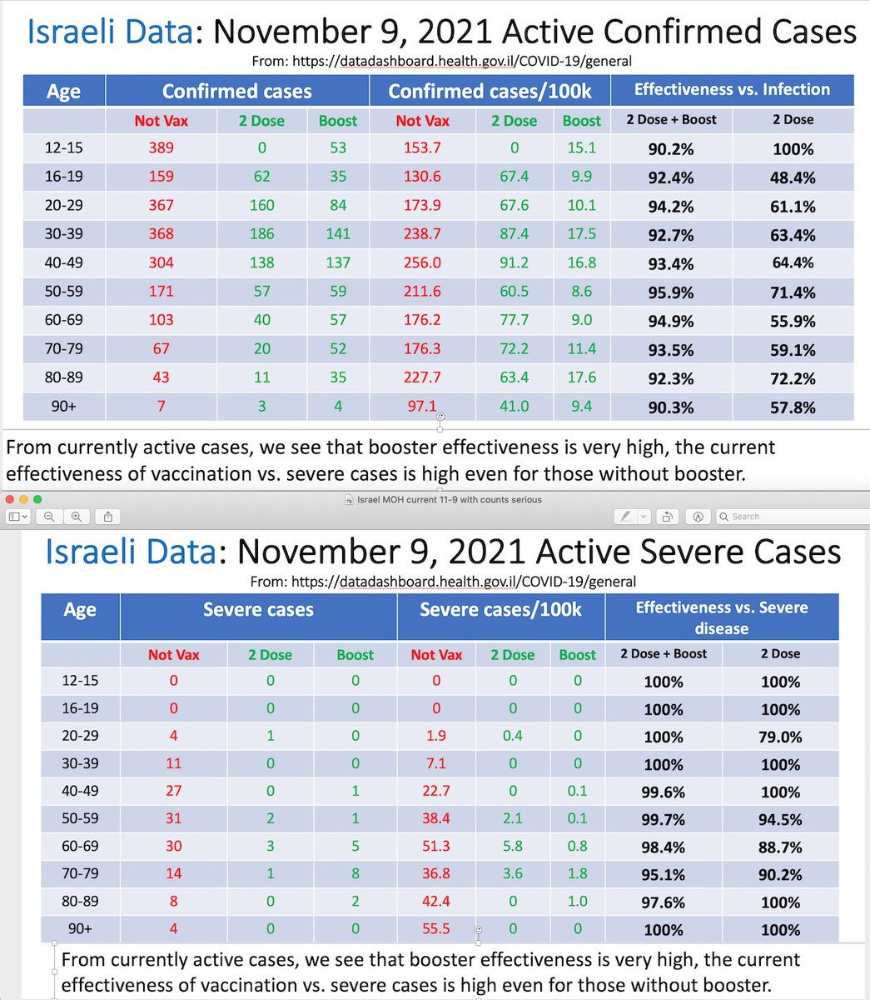</img></a>

---

<a href="https://twitter.com/erictopol/status/1458494662625300480" target="_blank" rel="noreferer">17:59 UCT</a>

A TIP to prevent Covid
Therapeutic Interfering Particle
In expect model: "both prophylactic and therapeutic intranasal administration of lipid-nanoparticle TIPs durably suppressed SARS-CoV-2 by 100 fold in the lungs"
https://www.cell.com/cell/fulltext/S0092-8674(21)01319-2?rss=yes&utm_source=dlvr.it&utm_medium=twitter
@CellCellPress 

<a href="FD2dAcOVEAQgVQ3.jpg"  >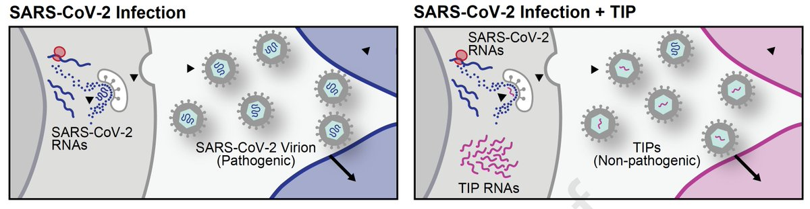</img></a>

---

<a href="https://twitter.com/erictopol/status/1458507635385241602" target="_blank" rel="noreferer">18:51 UCT</a>

Now ~1 million vaccinated, 27 million more are eligible
https://twitter.com/AP/status/1458427002017484802

---

<a href="https://twitter.com/erictopol/status/1458525710474043392" target="_blank" rel="noreferer">20:03 UCT</a>

Learning from the top 10 countries in the world now, Covid cases/100,000 people, all in Europe
—Even 74% fully vaccinated + extensive prior Covid exposure (Belgium) is not adequately protective
—The US is missing the warning⚠️ again. Much lower vaccination rate than Austria, too 

<a href="FD24eaPUcAIiVQn.jpg"  >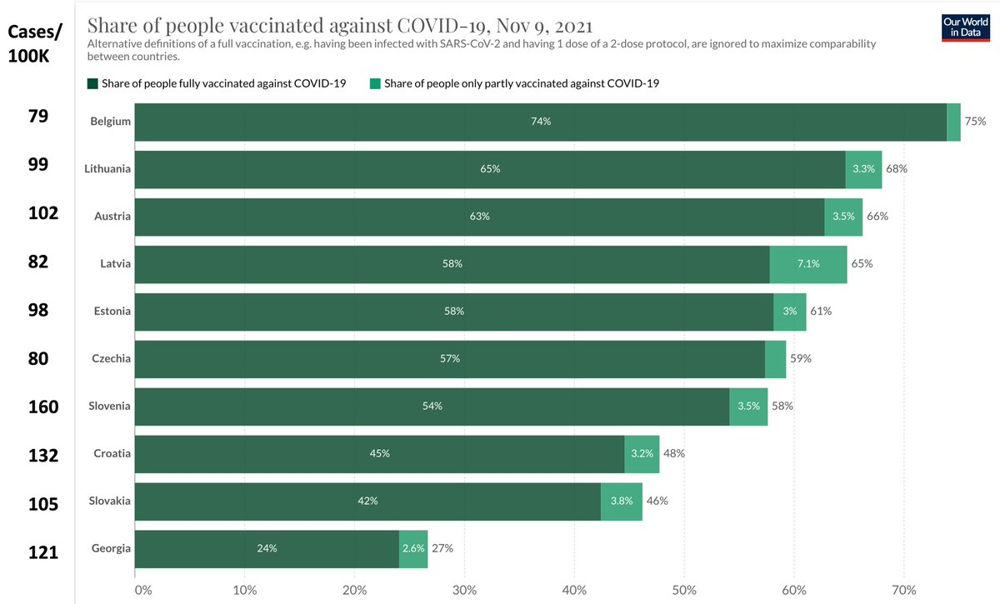</img></a>

---

<a href="https://twitter.com/erictopol/status/1458547086878646274" target="_blank" rel="noreferer">21:28 UCT</a>

Greece.
Deaths on the rise, too. 

<a href="FD3MriYUYAUVGxE.jpg"  >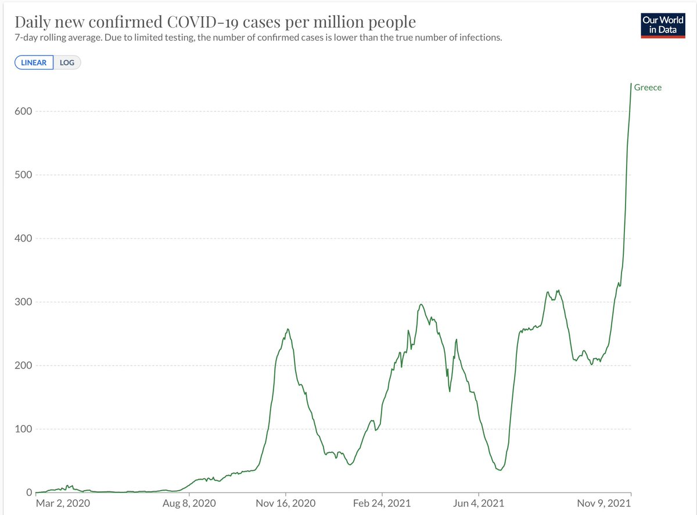</img></a>

---

<a href="https://twitter.com/erictopol/status/1458548349385150467" target="_blank" rel="noreferer">21:33 UCT</a>

BTW Greece has 62% total population fully vaccinated (US is 58%) and a few months more recently 

<a href="FD3NsNqUcAAAYHO.jpg"  >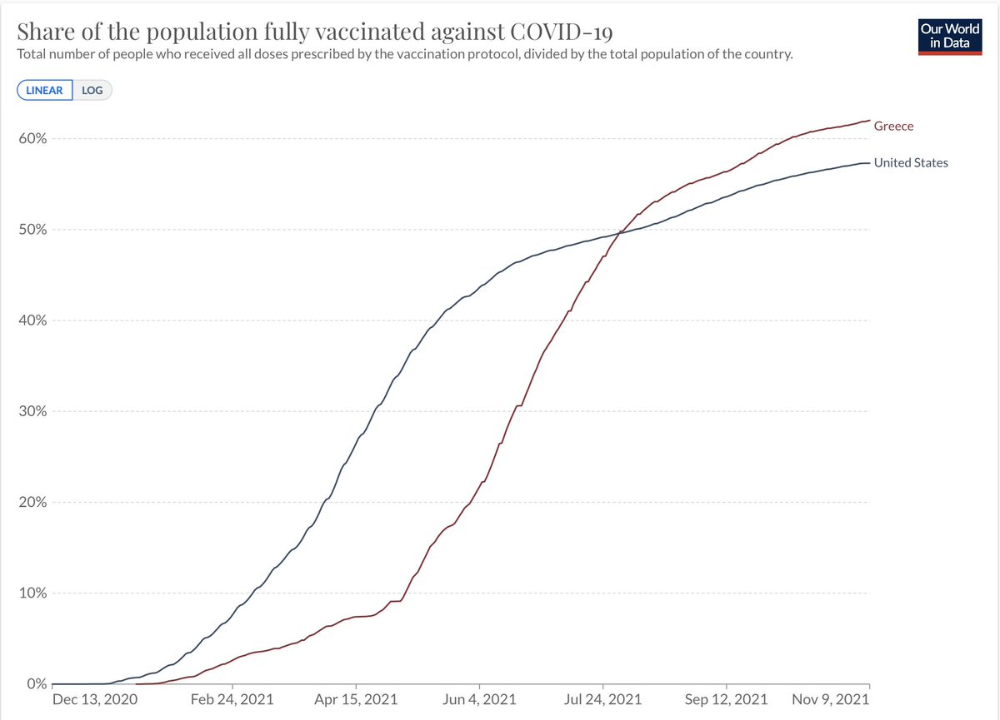</img></a>

---

<a href="https://twitter.com/erictopol/status/1458555314467397645" target="_blank" rel="noreferer">22:01 UCT</a>

Cryptic transmission of Delta in a hospital ward between vaccinated patients, beginning with an asymptomatic individual 
http://www.nejm.org/doi/full/10.1056/NEJMc2113090
PCR cycle thresholds are shown
Delta were viral loads were &gt;1000-fold that of earlier variants in this health system @VABostonHC @NEJM 

<a href="FD3QyN4VIAgh6qw.jpg"  >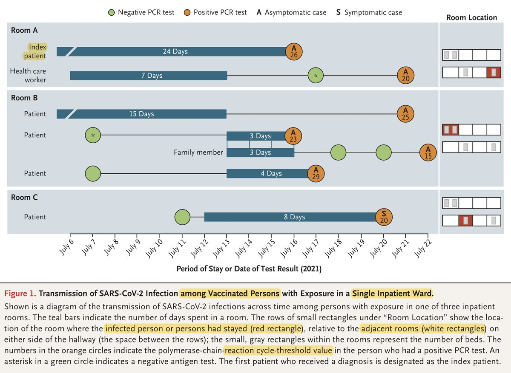</img></a>

---

<a href="https://twitter.com/erictopol/status/1458560700637270020" target="_blank" rel="noreferer">22:22 UCT</a>

RT @chrislhayes: We are going to ahve a big fall/winter surge here in the US and people should 1) get vaccinated if they're not! 2) psychol…

