+++
title = "Tweets by Eric Topol Nov 11"
Summary = ""
tags = ["Twitter"]
category = "Twitter"
+++

---

<a href="https://twitter.com/erictopol/status/1458585603625218049" target="_blank" rel="noreferer">00:01 UCT</a>

RT @EricTopol: How do certain people *abort* a Covid infection?
Their pre-existing T cells vs RTC rapidly clear the virus, and they have -P…

---

<a href="https://twitter.com/erictopol/status/1458596717603868674" target="_blank" rel="noreferer">00:45 UCT</a>

A landmark paper in the era of human whole genome sequencing: diagnosing rare diseases in 535 people from over 2,000 families; ~60% of the diagnoses would have been missed by existing medical workups 
https://www.nejm.org/doi/full/10.1056/NEJMoa2035790?query=featured_home @GenomicsEngland @NEJM 

<a href="FD35jZbVkAAOG48.jpg"  ></img></a>

---

<a href="https://twitter.com/erictopol/status/1458607826515890176" target="_blank" rel="noreferer">01:29 UCT</a>

The imminent anti-Covid pills, which have considerable promise to help us prevail over the pandemic
Summary https://www.nature.com/articles/d41586-021-03074-5 @heidiledford @nature 
Added a Table row to account for the cytochrome interactions with common drugs for the Pfizer drug combo (due to ritonavir) 

<a href="FD4DYblUcAIe4vH.png"  >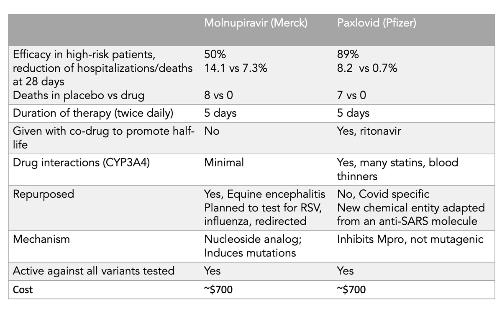</img></a>

---

<a href="https://twitter.com/erictopol/status/1458613931711156234" target="_blank" rel="noreferer">01:53 UCT</a>

Note that the drug interactions with Pfizer's pills are readily circumvented, since it's only a 5-day treatment course (you can read the linked piece)

---

<a href="https://twitter.com/erictopol/status/1458632059790839809" target="_blank" rel="noreferer">03:05 UCT</a>

In July, we reported prolonged impact of Covid on resting heart rate and other physiologic parameters, a window into #LongCovid. https://jamanetwork.com/journals/jamanetworkopen/fullarticle/2781687
Now that finding has been fully and independently replicated in Germany @rki_de  https://twitter.com/DirkBrockmann/status/1458346662959763457

<a href="FD4Y2fYVQAcKTTj.jpg"  >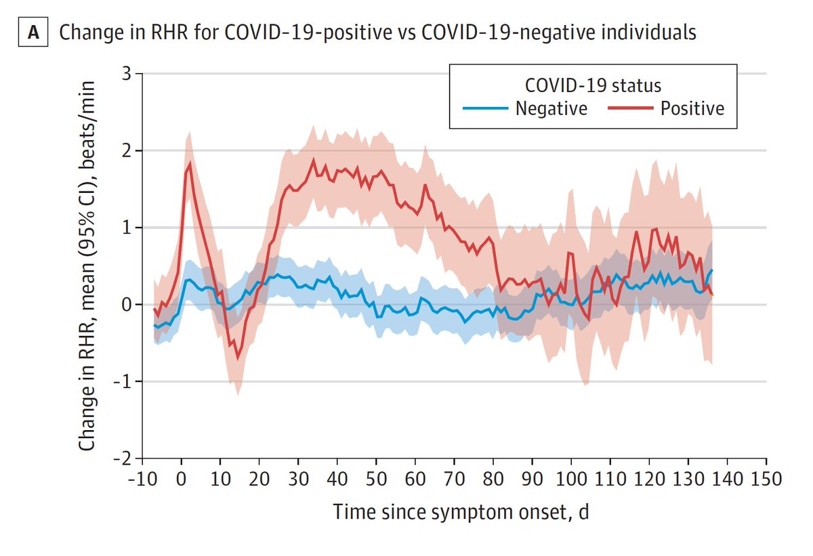</img></a>

---

<a href="https://twitter.com/erictopol/status/1458648079893098499" target="_blank" rel="noreferer">04:09 UCT</a>

Going in the wrong direction
Cases, hospitalizations, test positivity, and deaths
https://newsnodes.com/us 

<a href="FD4oSp1VQAAhoPX.jpg"  >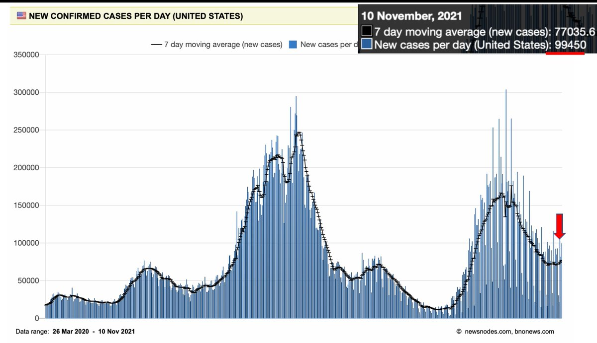</img></a>

---

<a href="https://twitter.com/erictopol/status/1458794132919390213" target="_blank" rel="noreferer">13:49 UCT</a>

Israel provided the initial and solid body of data that  booster shots restored effectiveness and helped achieve its turnaround. Now the UK adds to that
https://www.ft.com/content/e11add47-b1f9-4fe9-8faa-0bd72fc31367 @mroliverbarnes @jburnmurdoch 
1.The improvement 

<a href="FD6srT1VcAUkeeM.jpg"  >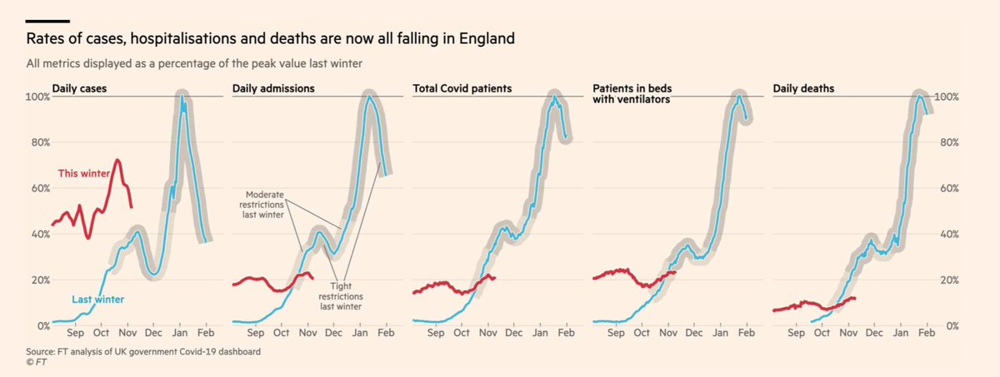</img></a>

---

<a href="https://twitter.com/erictopol/status/1458794137545629698" target="_blank" rel="noreferer">13:50 UCT</a>

2. The boosted folks driving the recovery 

<a href="FD6tEOcVcAEXkXe.jpg"  >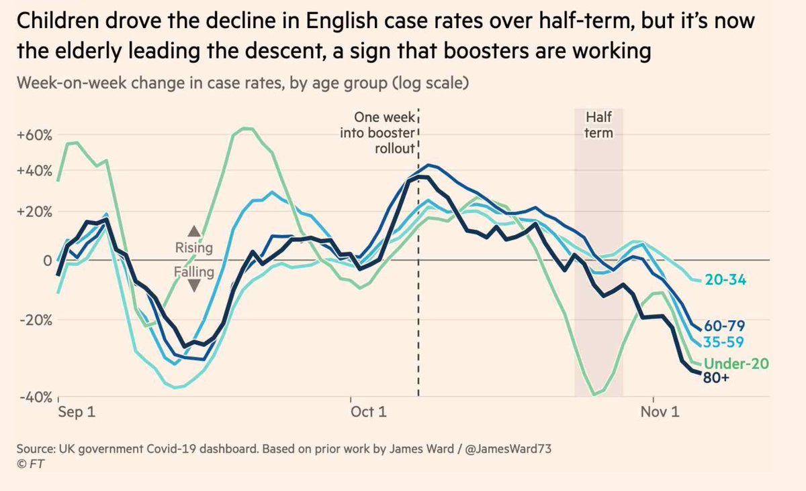</img></a>

---

<a href="https://twitter.com/erictopol/status/1458794141366689800" target="_blank" rel="noreferer">13:50 UCT</a>

3. From waning to to rising antibody levels 

<a href="FD6tKaTVQAIywfq.jpg"  >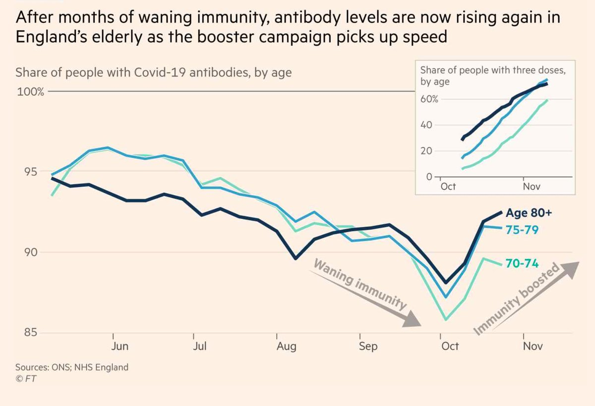</img></a>

---

<a href="https://twitter.com/erictopol/status/1458797590271520771" target="_blank" rel="noreferer">14:03 UCT</a>

Just published @NatureMedicine 
An in-depth analysis of the 25 children who died from Covid in England during the 1st year of the pandemic
https://www.nature.com/articles/s41591-021-01578-1
Great that 99.995% of children w/ a positive test survived (not what is driving the need for 💉in kids) 

<a href="FD6voVpVgAQlyuW.jpg"  >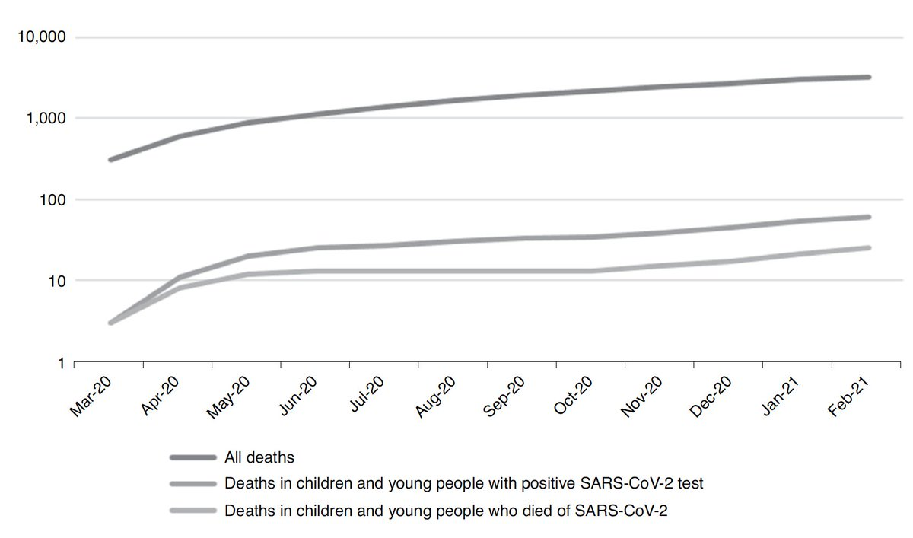</img></a>

---

<a href="https://twitter.com/erictopol/status/1458812392993787906" target="_blank" rel="noreferer">15:02 UCT</a>

Update. Good on @NIH 

<a href="FD6-E7sVkAYg_RM.jpg"  >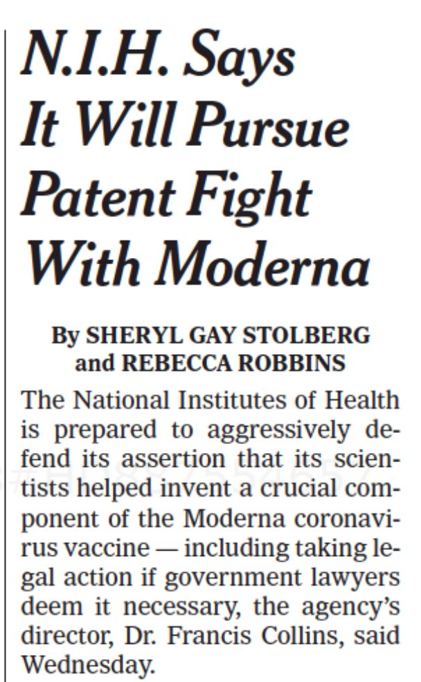</img></a><a href="FD6-H2oUYAA591d.png"  >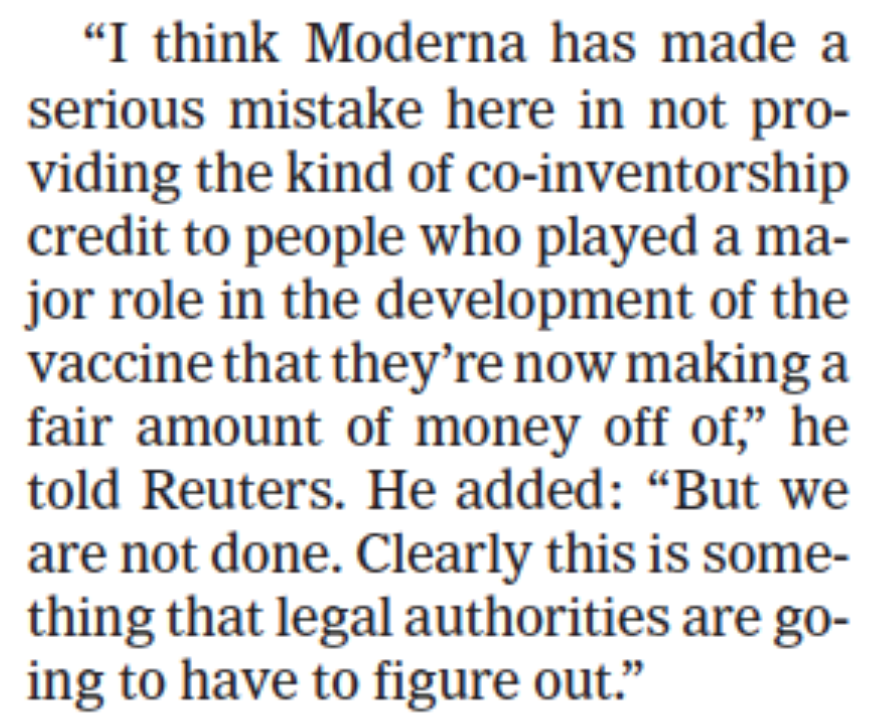</img></a>

---

<a href="https://twitter.com/erictopol/status/1458824385842724866" target="_blank" rel="noreferer">15:50 UCT</a>

RT @UrnovFyodor: EVERY. SINGLE. ONE of these disease-causing point mutation can be fixed by editing. The clinicians and computational biolo…

---

<a href="https://twitter.com/erictopol/status/1458826112721571845" target="_blank" rel="noreferer">15:57 UCT</a>

And @TheEconomist weighs in on this important development
https://www.economist.com/science-and-technology/2021/11/13/new-antiviral-drugs-mark-a-big-turning-point-in-the-covid-19-pandemic 

<a href="FD7KhiDVEAIN3Zr.png"  >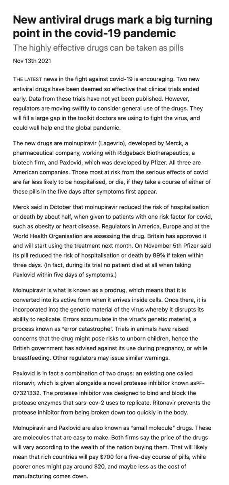</img></a><a href="FD7KmPqUUAUZGrK.png"  >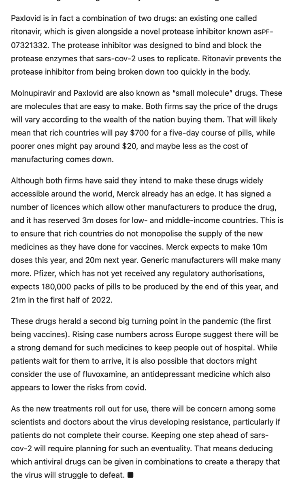</img></a>

---

<a href="https://twitter.com/erictopol/status/1458841700244148228" target="_blank" rel="noreferer">16:58 UCT</a>

And now this 

<a href="FD7Yuk7VQAI3ZNF.jpg"  >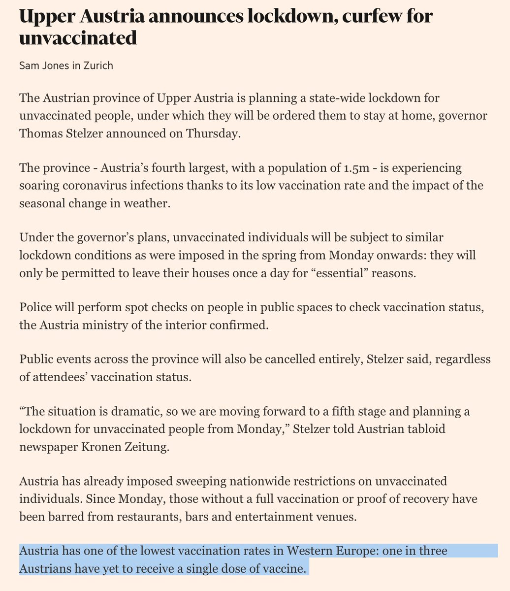</img></a>

---

<a href="https://twitter.com/erictopol/status/1458845654873088009" target="_blank" rel="noreferer">17:14 UCT</a>

The @nytimes published "What We Know So Far About
Waning Vaccine Effectiveness" today 
It is misleading and missing key reports from New York State, Veterans Affairs, Puerto Rico, Israel, Qatar, the UK, and several others
https://www.nytimes.com/interactive/2021/11/11/science/vaccine-waning-immunity.html

---

<a href="https://twitter.com/erictopol/status/1458855840643891202" target="_blank" rel="noreferer">17:55 UCT</a>

Exemplifies bad messaging, skewed, incomplete data.
No, it's not true that "vaccines still offer strong protection against severe Covid-19" which is why the majority of at-risk US people (such as age 60+, past 6 months from 💉💉) have not gotten boosters yet

---

<a href="https://twitter.com/erictopol/status/1458873853417975828" target="_blank" rel="noreferer">19:06 UCT</a>

A year ago, Nov 9th, the 1st Covid vaccine was announced w/ &gt;90% efficacy vs symptomatic infections, at 2 months follow-up, before the emergence α, β,γ and δ variants
Today, w/ a 3rd shot, there's still &gt;90% efficacy vs Delta and risk of hospitalizations and deaths.
We're lucky.

---

<a href="https://twitter.com/erictopol/status/1458880992786071557" target="_blank" rel="noreferer">19:35 UCT</a>

Great @ScienceVisuals showing the difference in mechanism between these 2 pills in the course of #SARSCoV2 replication
https://www.science.org/content/article/pfizer-antiviral-slashes-covid-19-hospitalizations
Paxlovid inhibits the main protease (Mpro) that creates other essential proteins
Molnupiravar induces lethal mutagenesis  https://twitter.com/EricTopol/status/1458607826515890176

<a href="FD77OK0VcAYOYQy.jpg"  >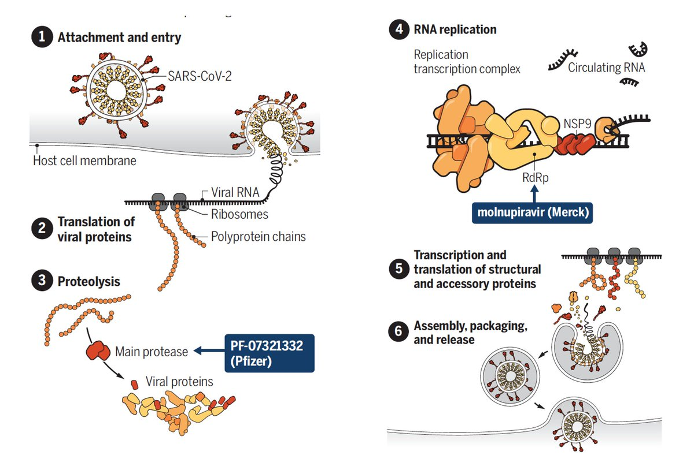</img></a>

---

<a href="https://twitter.com/erictopol/status/1458900543842119697" target="_blank" rel="noreferer">20:52 UCT</a>

RT @florian_krammer: @EricTopol @nytimes Yeah, its missing data from about 40 studies.

---

<a href="https://twitter.com/erictopol/status/1458900746699632664" target="_blank" rel="noreferer">20:53 UCT</a>

RT @michaelmina_lab: I agree. This is another incomplete and skewed @nytimes effort regarding COVID recently. The graphics are nice, but, c…

---

<a href="https://twitter.com/erictopol/status/1458934962808262658" target="_blank" rel="noreferer">23:09 UCT</a>

People with Prior Covid "have pronounced deficiencies in functional Spike-specific T cell responses and the ability to neutralize [with antibodies] the current variants of concern"
https://www.medrxiv.org/content/10.1101/2021.11.08.21266035v1
There's false assurance on "natural immunity" protection; it's not enough.

---

<a href="https://twitter.com/erictopol/status/1458940234679218203" target="_blank" rel="noreferer">23:30 UCT</a>

Germany has outperformed the US throughout the pandemic. It also has ~10% more of its total population fully vaccinated, and 💉💉more recently.
Today Germany had a pandemic record of new cases, nearly 50,000, and highest deaths (220) since May.

Not a good look for the US. 

<a href="FD8xTFaVkAEGg9e.jpg"  >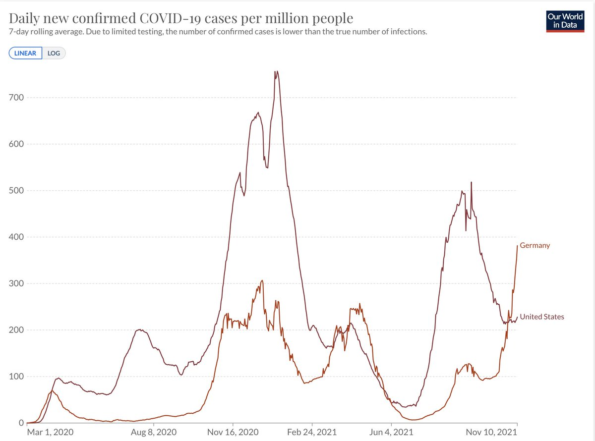</img></a>