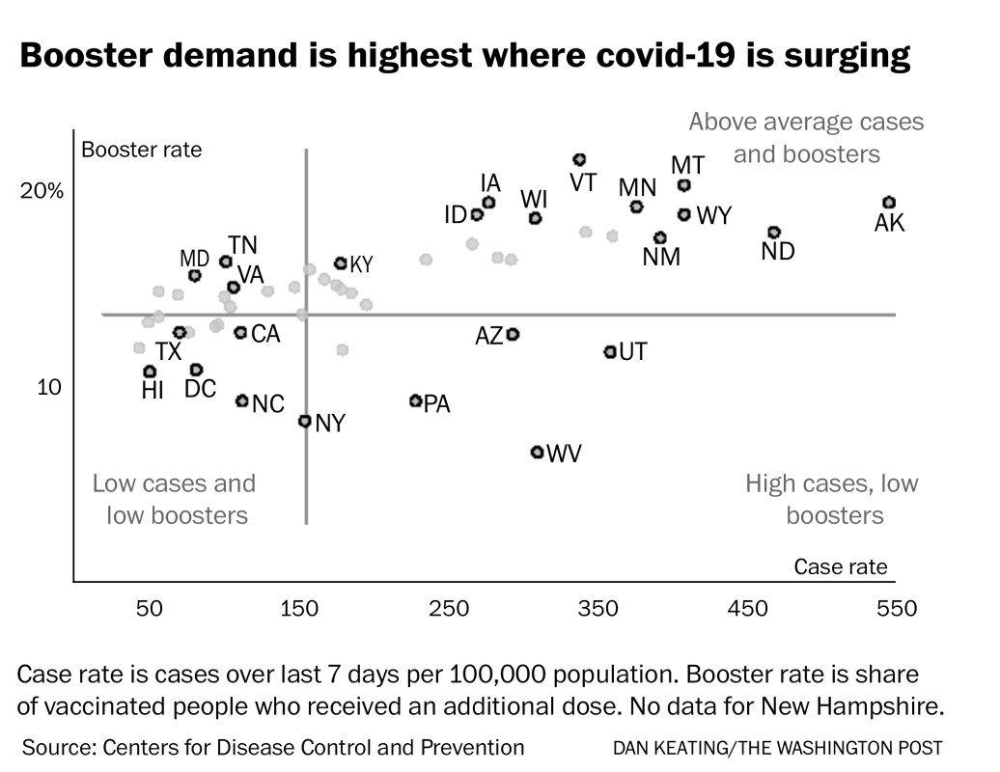
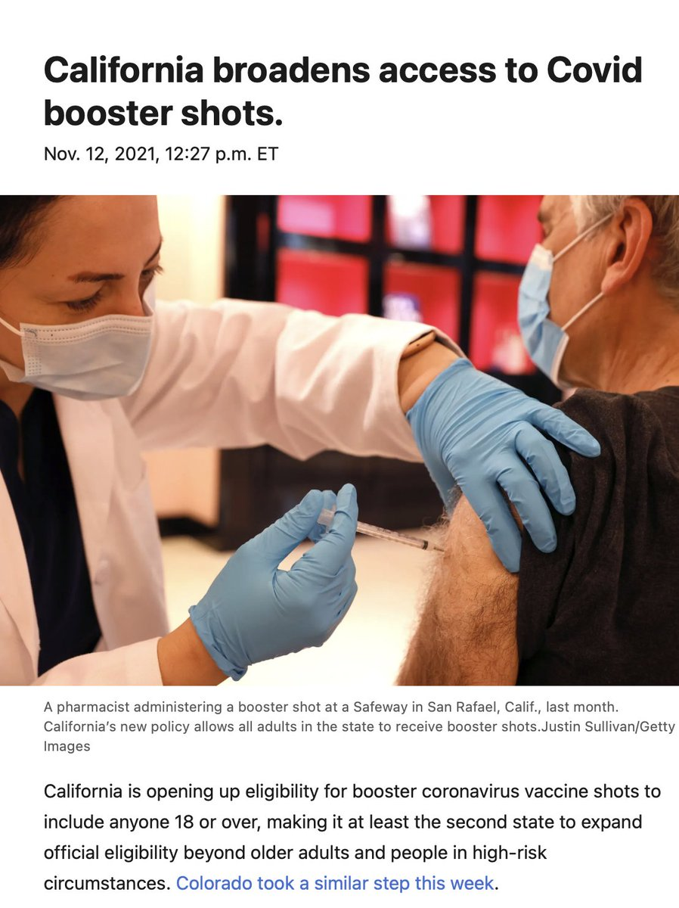
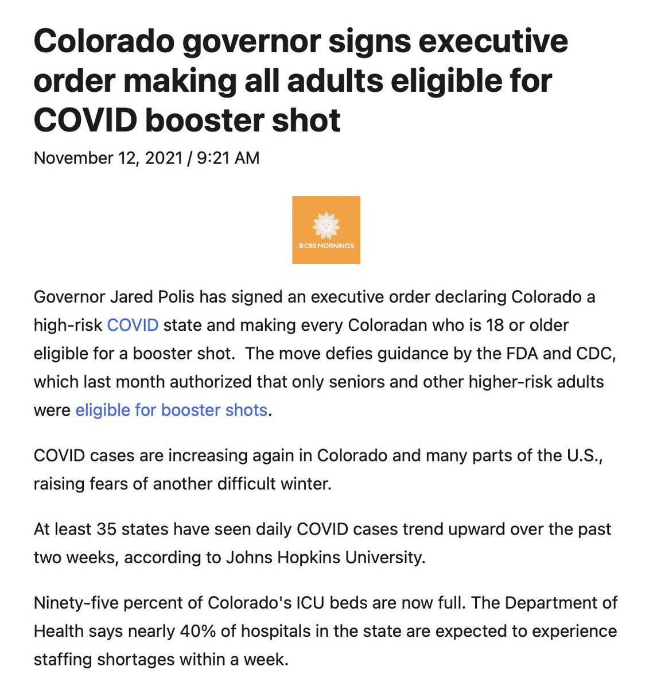

+++
title = "Tweets by Eric Topol Nov 12"
Summary = ""
tags = ["Twitter"]
category = "Twitter"
+++

---

<a href="https://twitter.com/erictopol/status/1458980569224646660" target="_blank" rel="noreferer">02:10 UCT</a>

Oh, cases are "nonsensical"
Even though cases beget cases, beget #LongCovid, were the primary endpoint of efficacy for all vaccination trials, and have tracked with hospitalizations and deaths for every wave and recovery phase of the US pandemic https://twitter.com/mtracey/status/1458947883613437957

---

<a href="https://twitter.com/erictopol/status/1459003149155397635" target="_blank" rel="noreferer">03:40 UCT</a>

Why are we lucky?
—💉became available faster than any in history by many years
—Despite 2 years of considerable🦠evolution, our vaccines have maintained remarkably high efficacy w/ a 3rd shot
—&gt;90% efficacy &gt;&gt; 50%, preset criteria for FDA approval 
—Safety in billions of people

---

<a href="https://twitter.com/erictopol/status/1459008140515504128" target="_blank" rel="noreferer">04:00 UCT</a>

"It’s our low rate of vaccination — we haven’t done what was necessary ...We are still below 70 percent, I don’t know how we can win this race against time with the fourth wave. I fear we’ve already lost.”
https://www.nytimes.com/2021/11/11/world/europe/germany-covid-unvaccinated.html @kbennhold

---

<a href="https://twitter.com/erictopol/status/1459017996433702913" target="_blank" rel="noreferer">04:39 UCT</a>

For months the media &amp; many experts insisted the vaccines were fully protective vs severe disease while the evidence was pointing against that assertion. Still today @nytimes! No wonder the public is confused and  booster uptake is low. Only 32% in the highest risk age group, 65+

---

<a href="https://twitter.com/erictopol/status/1459020901639286784" target="_blank" rel="noreferer">04:51 UCT</a>

@GZuckerman Great job @msnbc this evening and on your outstanding book. Congrats!

---

<a href="https://twitter.com/erictopol/status/1459160929812115465" target="_blank" rel="noreferer">14:07 UCT</a>

I wrote about the situation in Europe and what it means for the United States https://www.theguardian.com/commentisfree/2021/nov/12/covid-cases-surging-europe-america-denial @guardian

---

<a href="https://twitter.com/erictopol/status/1459173237317767179" target="_blank" rel="noreferer">14:56 UCT</a>

The last thing we need now is division among governmental agencies for support of 3rd (booster) shots. While the data for their benefit are overwhelming, the demand so far is weak, especially among high-risk people https://www.washingtonpost.com/health/2021/11/11/biden-administration-coronavirus-booster-shots/ @lauriemcginley2 @bylenasun @tylerpager 

<a href="FEAD5x6VkAILNUz.jpg"  ></img></a><a href="FEAFAu0acAAbocf.jpg"  ></img></a>

---

<a href="https://twitter.com/erictopol/status/1459177414412541954" target="_blank" rel="noreferer">15:13 UCT</a>

RT @DrLeanaWen: We are "in the zone of denial for the fourth time.... Now is the time for the U.S. to heed the European signal for the firs…

---

<a href="https://twitter.com/erictopol/status/1459187744442228737" target="_blank" rel="noreferer">15:54 UCT</a>

What is the principal reason for Europe's surge?
Insufficient vaccination/immunity

Why does this portend trouble for the US?
Our vaccination rate is 58.5%, considerably less than countries that are surging in the EU, and our counter to waning with 3rd shots is moving very slowly

---

<a href="https://twitter.com/erictopol/status/1459230981848633346" target="_blank" rel="noreferer">18:45 UCT</a>

Colorado and California broadening eligibility for boosters (3rd shots) for all adults. 
6 months after mRNA, 2 months after J&amp;J
Good. That's what the data supports to fully restore vaccine effectiveness to &gt;90% 

<a href="FEA6QouUcAEPMT3.jpg"  ></img></a><a href="FEA6T3PVIAElI46.jpg"  ></img></a>

---

<a href="https://twitter.com/erictopol/status/1459249792664489987" target="_blank" rel="noreferer">20:00 UCT</a>

RT @PaulSaxMD: With vaccine effectiveness waning, case numbers rising, and no concerning safety signals from boosters so far, is it time to…

