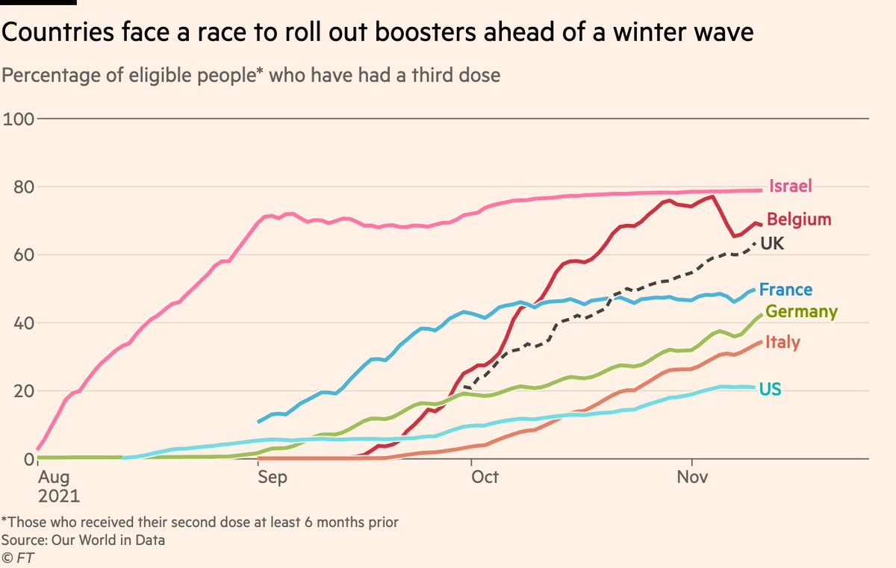
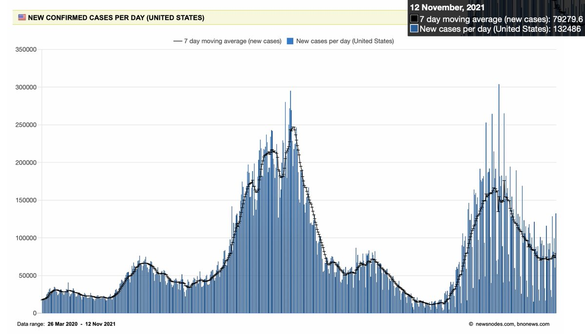
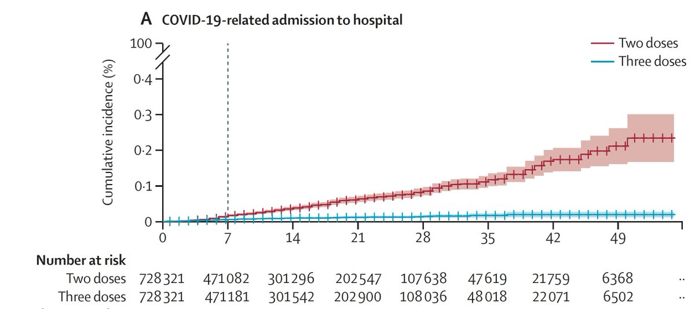
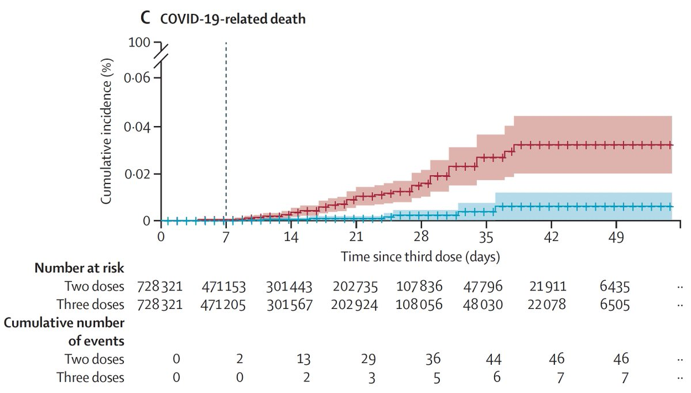
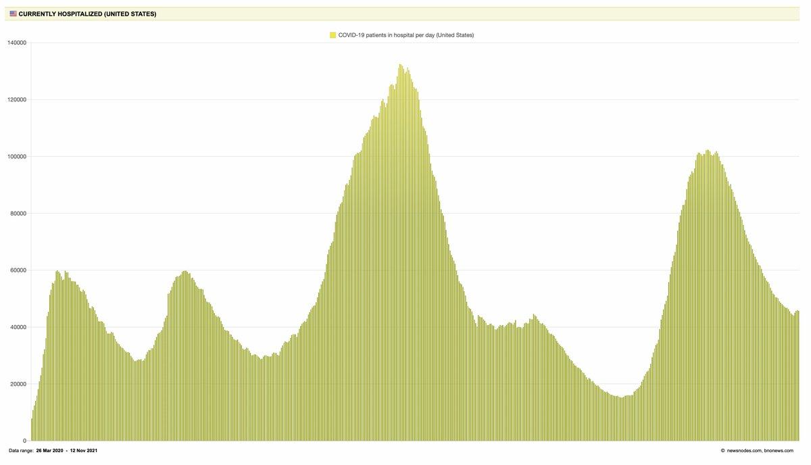
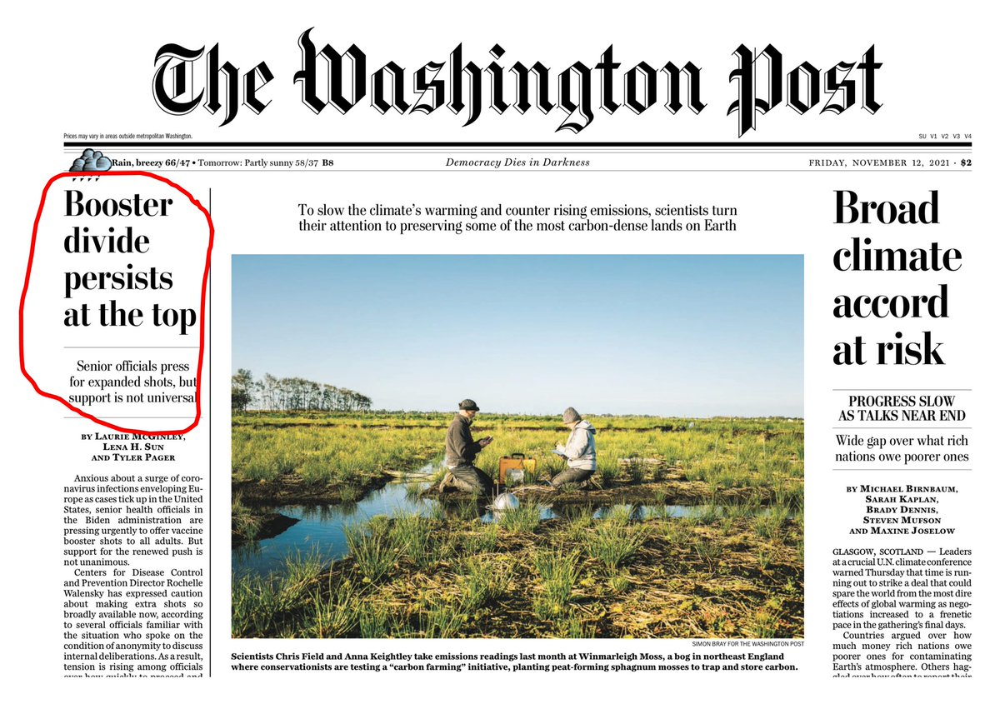
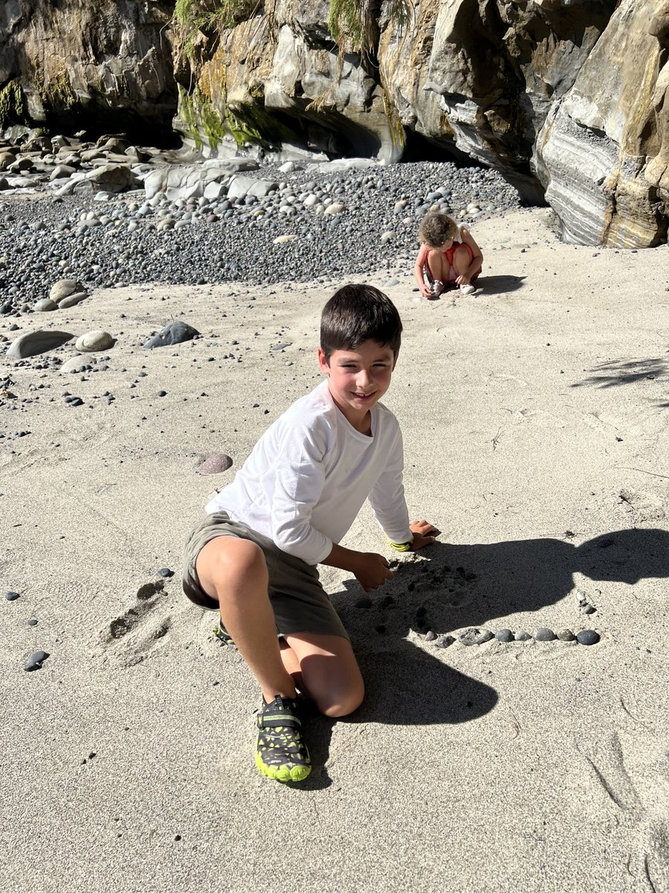

+++
title = "Tweets by Eric Topol Nov 13"
Summary = ""
tags = ["Twitter"]
category = "Twitter"
+++

---

<a href="https://twitter.com/erictopol/status/1459318726604427268" target="_blank" rel="noreferer">00:34 UCT</a>

RT @jburcum: "Only countries such as Spain at 80% and Portugal at 88% that fully vaccinated their total populations have set a high bar and…

---

<a href="https://twitter.com/erictopol/status/1459319950011629570" target="_blank" rel="noreferer">00:39 UCT</a>

This isn't going to help matters, folks.
Graph by @jburnmurdoch 
https://www.theguardian.com/commentisfree/2021/nov/12/covid-cases-surging-europe-america-denial 

<a href="FECLkI3VIAYSo8Q.jpg"  ></img></a>

---

<a href="https://twitter.com/erictopol/status/1459331169036619778" target="_blank" rel="noreferer">01:23 UCT</a>

RT @wrightwb: @Finn_aka_Jeremy @EricTopol @jburnmurdoch It’s crazy how many people I talk to have no idea they can just go and get one if t…

---

<a href="https://twitter.com/erictopol/status/1459352335935676416" target="_blank" rel="noreferer">02:48 UCT</a>

Today in the USA, over 132,000 new cases, 7-day average back up to ~80,000
Over 2,100 deaths
Test positivity &gt;5% for the first time in a month
Fasten your seat belts 

<a href="FECoBwtVEAEo2qe.jpg"  ></img></a>

---

<a href="https://twitter.com/erictopol/status/1459538391293329410" target="_blank" rel="noreferer">15:07 UCT</a>

RT @ASlavitt: I have to say I completely agree with Eric @EricTopol here. And disagree with those who think things are over.

130,000 recor…

---

<a href="https://twitter.com/erictopol/status/1459570332377907200" target="_blank" rel="noreferer">17:14 UCT</a>

Why should every adult get a 3rd shot (booster) when eligible (6 months after 1°💉)?
1. A randomized, placebo-controlled trial, the gold standard for assessing efficacy, showed restoration of efficacy to 95.6%, in &gt;10,000 participants across all age groups
https://twitter.com/erictopol/status/1451170313492852740

---

<a href="https://twitter.com/erictopol/status/1459570337352339458" target="_blank" rel="noreferer">17:14 UCT</a>

2. Prevention of hospitalizations and deaths in a study of &gt;728,000 people w/ 3-shots vs &gt;728,000 matched controls (2-shots) https://www.thelancet.com/journals/lancet/article/PIIS0140-6736(21)02249-2/fulltext @TheLancet 

<a href="FEFnxNCUcAcbNWg.jpg"  ></img></a><a href="FEFnybaUcAA5ro3.jpg"  ></img></a>

---

<a href="https://twitter.com/erictopol/status/1459570343396270086" target="_blank" rel="noreferer">17:14 UCT</a>

3. We have no US National data by vaxx status but hospitalizations are starting to increase again and several states are reporting an increasing proportion of breakthroughs accounting for them 

<a href="FEFsViSVgAQqIOL.jpg"  ></img></a>

---

<a href="https://twitter.com/erictopol/status/1459570347506737157" target="_blank" rel="noreferer">17:14 UCT</a>

4. The US is doing a poor job of rolling out boosters relative to many other countries. 
Only 1 in 3 people of the highest risk group, age 65+, have received one. Only 1 in 7 overall who are eligible. 

<a href="FEFsvuzVQAEG_uW.jpg"  ></img></a>

---

<a href="https://twitter.com/erictopol/status/1459570354414751749" target="_blank" rel="noreferer">17:14 UCT</a>

6. Meanwhile, 2 states have taken the appropriate steps of opening up boosters for all over the age 18 (California and Colorado) which is unprecedented (overriding CDC and FDA).  And many countries have made boosters eligible for all adults their policy, including Canada.

---

<a href="https://twitter.com/erictopol/status/1459570351885602819" target="_blank" rel="noreferer">17:14 UCT</a>

5. Despite the compelling data and the current predicament, there is unwarranted and serious division at the top @CDCgov and among some experts who have been in denial of the vaccine effectiveness waning issue for months, resulting in mixed messages to the public and confusion 

<a href="FEFuC6vUUAIQjX0.jpg"  ></img></a>

---

<a href="https://twitter.com/erictopol/status/1459575790593474561" target="_blank" rel="noreferer">17:36 UCT</a>

RT @greg_travis: @EricTopol Note that there are about 1,600 deaths from cancer a day.   That’s not just one form of cancer, that’s ALL canc…

---

<a href="https://twitter.com/erictopol/status/1459626271118270466" target="_blank" rel="noreferer">20:56 UCT</a>

My oldest grandkid (7) got his 💉today 👍 

<a href="FEGiWPaVEAImA8g.jpg"  ></img></a>