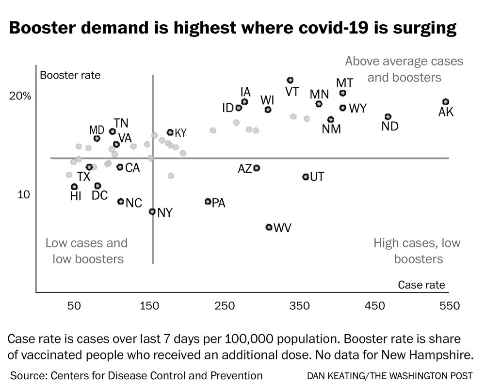
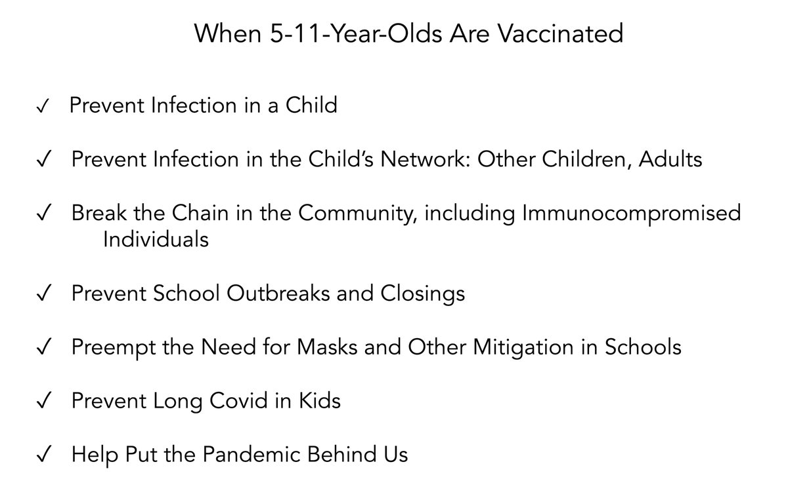
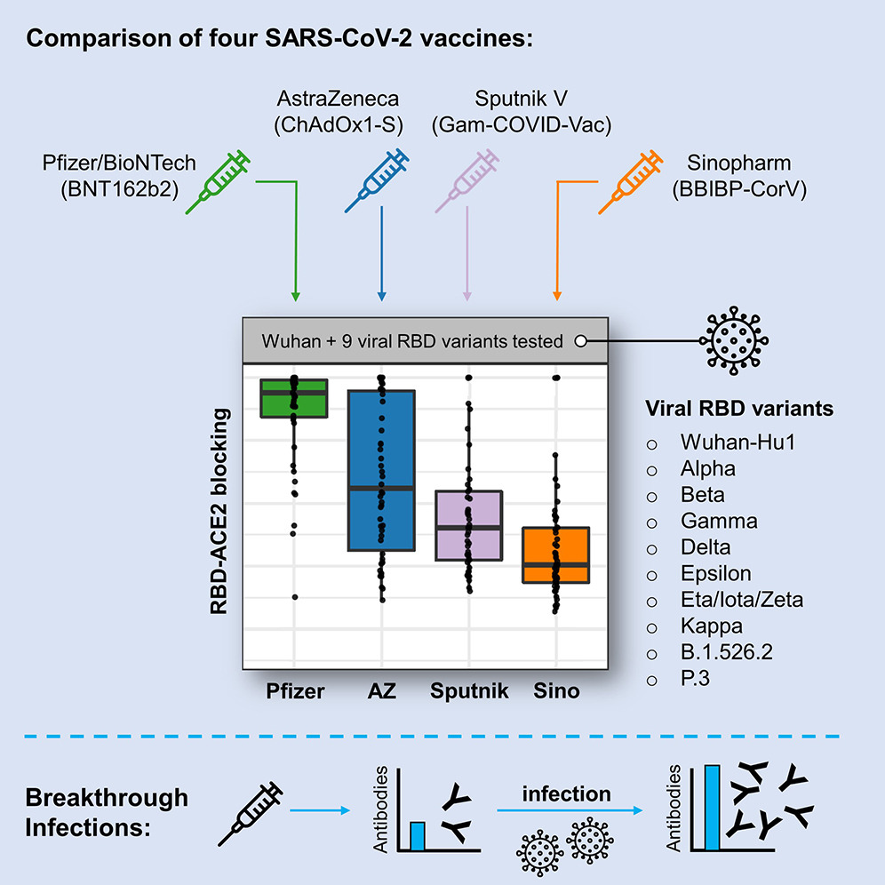
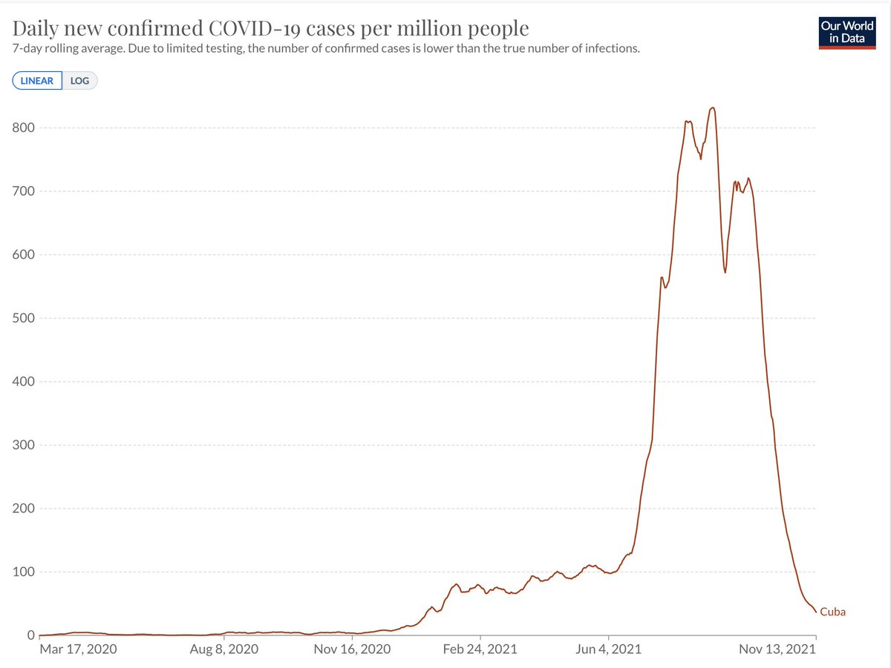
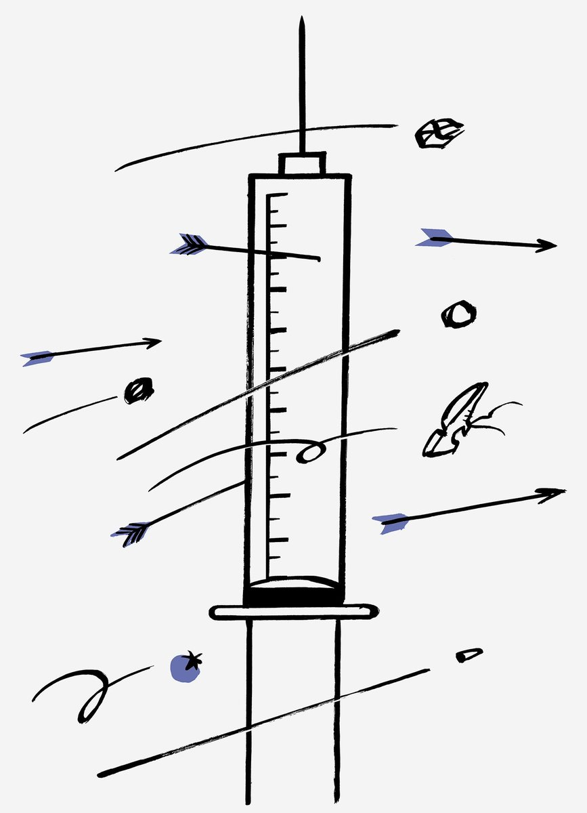
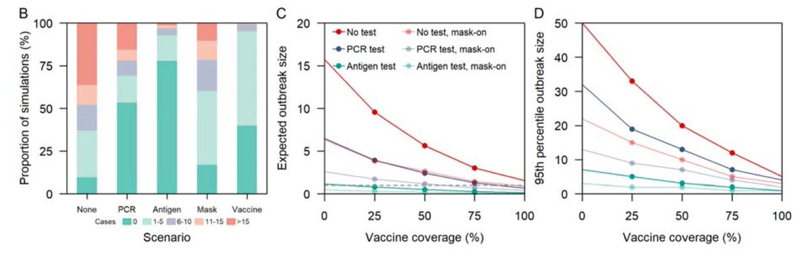

+++
title = "Tweets by Eric Topol Nov 14"
Summary = ""
tags = ["Twitter"]
category = "Twitter"
+++

---

<a href="https://twitter.com/erictopol/status/1459918614266400775" target="_blank" rel="noreferer">16:18 UCT</a>

7. Getting a booster when there'a a surge in your state is not the best timing ;-)
Also highlights that the booster rate across the US is remarkably low. 

<a href="FEKrPM0UcAE5KHd.jpg"  ></img></a>

---

<a href="https://twitter.com/erictopol/status/1459932317061836814" target="_blank" rel="noreferer">17:12 UCT</a>

The case for kids 

<a href="FEK4KizVIAQHPKC.jpg"  ></img></a>

---

<a href="https://twitter.com/erictopol/status/1459937906974289924" target="_blank" rel="noreferer">17:34 UCT</a>

Keep this in mind
https://twitter.com/EricTopol/status/1457814695541284868

---

<a href="https://twitter.com/erictopol/status/1459942671024152577" target="_blank" rel="noreferer">17:53 UCT</a>

And this
https://twitter.com/EricTopol/status/1458117183771496455

---

<a href="https://twitter.com/erictopol/status/1459945552771051522" target="_blank" rel="noreferer">18:05 UCT</a>

4. Fully vaccinated status reduces Delta transmission. With Delta for HOUSEHOLD CONTACTS, the worst case scenario, that reduction range from 27-63% in these studies. 💉💉Transmission reduction outside of households is likely considerably higher but difficult to quantify.

---

<a href="https://twitter.com/erictopol/status/1459945551571550211" target="_blank" rel="noreferer">18:05 UCT</a>

3. A 2nd UK study with sequencing of Delta showed a 27% reduction of transmission for vaccinated vs unvaccinated 
https://www.thelancet.com/action/showPdf?pii=S2666-7762%2821%2900238-6

---

<a href="https://twitter.com/erictopol/status/1459945550300676098" target="_blank" rel="noreferer">18:05 UCT</a>

2. UK study with Delta by genome sequencing, household transmission reduced from 38% (via unvaxxed) to 25% (vaxxed), a 35% reduction
https://www.thelancet.com/journals/laninf/article/PIIS1473-3099(21)00648-4/fulltext

---

<a href="https://twitter.com/erictopol/status/1459945548958494721" target="_blank" rel="noreferer">18:05 UCT</a>

Addressing the anti-vaxxer BS about vaccines not preventing transmission. It's not 0|1.
1. Recent Dutch study during Delta
"Effectiveness of full vaccination of the index against transmission to unvaccinated household contacts was 63% (95%CI 46-75%)."
https://www.medrxiv.org/content/10.1101/2021.10.14.21264959v1

---

<a href="https://twitter.com/erictopol/status/1459963090586398724" target="_blank" rel="noreferer">19:15 UCT</a>

A unique comparison of 4 different vaccines (Pfizer, AZ, Sputnik, Sinopharm) for the immune response that they induce, and across all major variants,  shows major differences https://www.cell.com/cell-host-microbe/fulltext/S1931-3128(21)00510-2 @cellhostmicrobe 

<a href="FELGDbyVkAIwqky.jpg"  ></img></a>

---

<a href="https://twitter.com/erictopol/status/1459965854381051904" target="_blank" rel="noreferer">19:25 UCT</a>

@nytimes @maggieNYT And the US is even lower. less than 59%
https://www.theguardian.com/commentisfree/2021/nov/12/covid-cases-surging-europe-america-denial

---

<a href="https://twitter.com/erictopol/status/1459977435160719361" target="_blank" rel="noreferer">20:12 UCT</a>

Cuba, now leading the world in vaccine doses per 100,000 people, has managed quite a turnaround from being one of the worst-hit countries
https://ig.ft.com/coronavirus-vaccine-tracker/?areas=gbr&areas=isr&areas=usa&areas=eue&areas=can&areas=chn&areas=ind&cumulative=1&doses=total&populationAdjusted=1
@OurWorldInData 
It can be done. 

<a href="FELT6YgVcAUXCgH.jpg"  ></img></a>

---

<a href="https://twitter.com/erictopol/status/1460010600931610629" target="_blank" rel="noreferer">22:23 UCT</a>

RT @Bob_Wachter: Agree w/ @EricTopol. I just don't get "vaccine wasn't designed to prevent infections" line. If vax used to prevent 95% of…

---

<a href="https://twitter.com/erictopol/status/1460018905196285953" target="_blank" rel="noreferer">22:56 UCT</a>

On self-inflicted wounds to the US workforce, the court battle against @OSHA_DOL standards for protection vs Covid , key thread by @ASlavitt below and @NewYorker piece by @tnyCloseRead https://www.newyorker.com/magazine/2021/11/22/the-vaccine-mandate-battle  https://twitter.com/ASlavitt/status/1459958243644477443

<a href="FEMF5rXVkAYGYmr.jpg"  ></img></a>

---

<a href="https://twitter.com/erictopol/status/1460026181047128064" target="_blank" rel="noreferer">23:25 UCT</a>

Cruises during Delta, the laboratory for studying transmission:
"We found that vaccination coverage &amp; rapid antigen tests had a larger effect than mask mandates alone, indicating the importance of combined interventions
against Delta to reduce event risk "
https://www.medrxiv.org/content/10.1101/2021.11.12.21266183v1 

<a href="FEMNYmaVkAIZoJG.jpg"  ></img></a>