+++
title = "Tweets by Eric Topol Nov 15"
Summary = ""
tags = ["Twitter"]
category = "Twitter"
+++

---

<a href="https://twitter.com/erictopol/status/1460098163264524294" target="_blank" rel="noreferer">04:11 UCT</a>

The surge in Europe, yet another manifestation of vaccines working—saving lives. The countries with low vaccination rates in Eastern and Central Europe are experiencing very high death rates, while those in Western Europe, w/higher vaxx rates, the lowest fatality rates 

<a href="FENPYpQVQAYLcUn.jpg"  >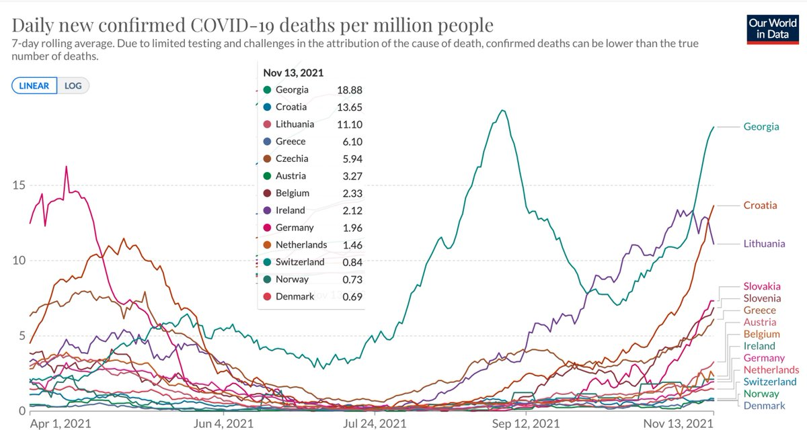</img></a><a href="FENPdEDUcAISKpl.jpg"  >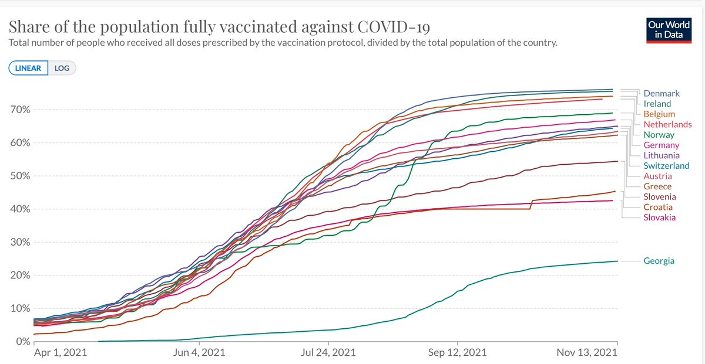</img></a>

---

<a href="https://twitter.com/erictopol/status/1460149351141937152" target="_blank" rel="noreferer">07:35 UCT</a>

Incredible "What We Know So Far About Waning Vaccine Effectiveness" is front page @nytimes tomorrow, missing many reports (as noted in🧵)   asserting the waning is only vs infection in some people, when it is across all age groups and for severe disease, the basis for boosters😲 

<a href="FEN-DsiVcAIvFZV.jpg"  >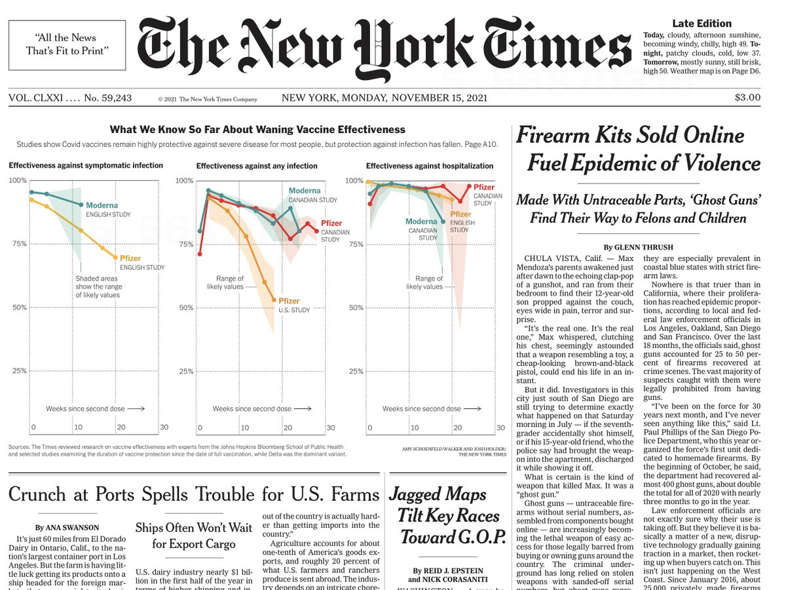</img></a>

---

<a href="https://twitter.com/erictopol/status/1460262458879217672" target="_blank" rel="noreferer">15:04 UCT</a>

Brazil joins 55 countries surpassing US vaccination rate 

<a href="FEPk4X2VQAwNbHU.jpg"  >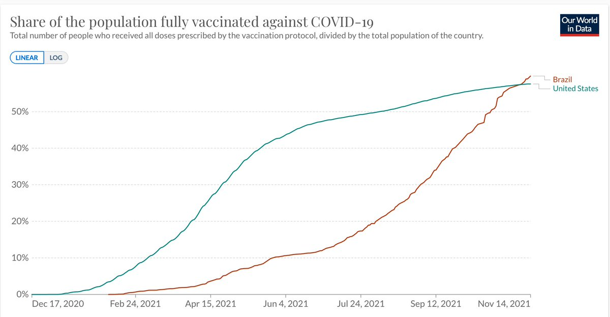</img></a>

---

<a href="https://twitter.com/erictopol/status/1460268852135161859" target="_blank" rel="noreferer">15:29 UCT</a>

8. New data today from the UK shows boosters restore vaccine effectiveness for protection vs symptomatic infection to over 90% (AZ 93%, Pfizer 94%)
https://khub.net/documents/135939561/390853656/Effectiveness+of+BNT162b2+%28Comirnaty%2C+Pfizer-BioNTech%29+COVID-19+booster+vaccine+against+covid-19+related+symptoms+in+England.docx/a366af4e-9c7f-ce86-bc58-1cb3b88e3378
https://www.gov.uk/government/news/boosters-give-over-90-protection-against-symptomatic-covid-19-in-adults-over-50 

<a href="FEPqs7wVIA0Y8O5.png"  >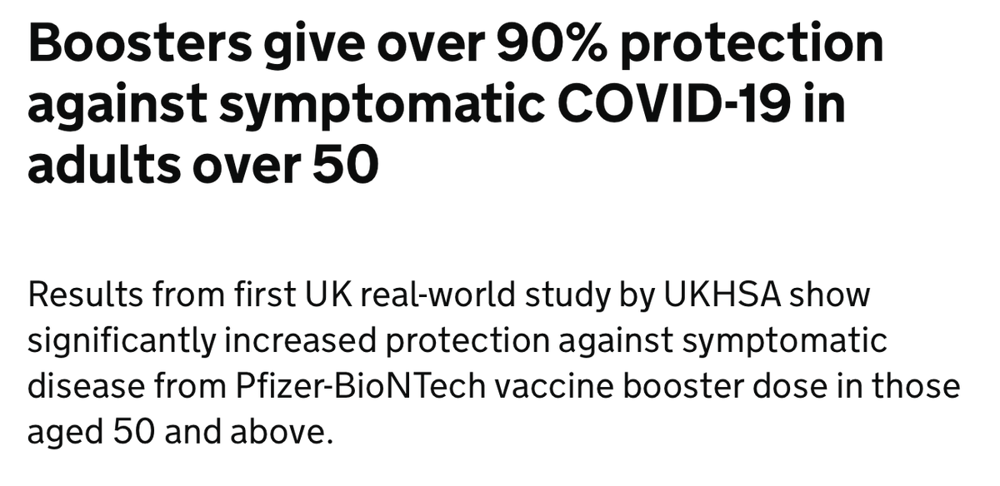</img></a>

---

<a href="https://twitter.com/erictopol/status/1460273570987212800" target="_blank" rel="noreferer">15:48 UCT</a>

Countering waning immunity
The new data from England today shows a booster (3rd) shot increased vaccine effectiveness from 44% to 93% for Astra Zeneca and from 62.5 to 94% for Pfizer, vs symptomatic infection, age 50+
https://khub.net/documents/135939561/390853656/Effectiveness+of+BNT162b2+%28Comirnaty%2C+Pfizer-BioNTech%29+COVID-19+booster+vaccine+against+covid-19+related+symptoms+in+England.docx/a366af4e-9c7f-ce86-bc58-1cb3b88e3378 

<a href="FEPtWbyVIAYdShu.png"  >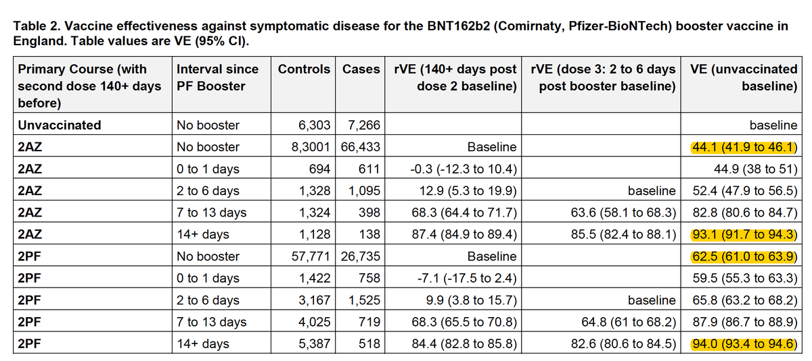</img></a>

---

<a href="https://twitter.com/erictopol/status/1460275490636267523" target="_blank" rel="noreferer">15:56 UCT</a>

This report is the first to provide solid evidence for 3rd shot clinical impact of another vaccine (AZ, all prior reports were with Pfizer's) and adds to the RCT and Israeli data summarized in 1 and 2 below
https://twitter.com/EricTopol/status/1459570332377907200

---

<a href="https://twitter.com/erictopol/status/1460280417521602565" target="_blank" rel="noreferer">16:15 UCT</a>

This adds to California, Colorado, and New Mexico states. It is noteworthy because (1) the decision is fully backed by the data and (2) it overrides the FDA and CDC guidelines for boosters which are far more restrictive by age criteria (65+). https://twitter.com/MarkLevineNYC/status/1460274055567843334

---

<a href="https://twitter.com/erictopol/status/1460286542593679362" target="_blank" rel="noreferer">16:40 UCT</a>

The new data led to a change in policy, expanding 3rd shot boosters to all age 40+ in the UK
https://www.ft.com/content/8330da6c-031d-4613-8f55-5b0269eaac00 [currently 65+ in the US] 

<a href="FEP6t0aVcAUXhUL.jpg"  >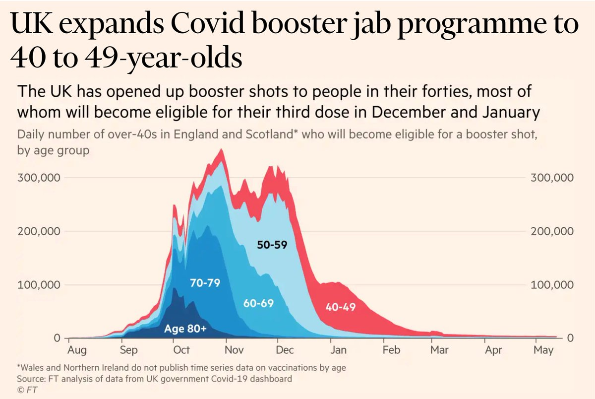</img></a>

---

<a href="https://twitter.com/erictopol/status/1460299288655765506" target="_blank" rel="noreferer">17:30 UCT</a>

@emilyakopp That's incorrect. The sole age criteria remains 65+
https://www.cdc.gov/media/releases/2021/p1021-covid-booster.html 

<a href="FEQGcy5UYAMh-cw.jpg"  >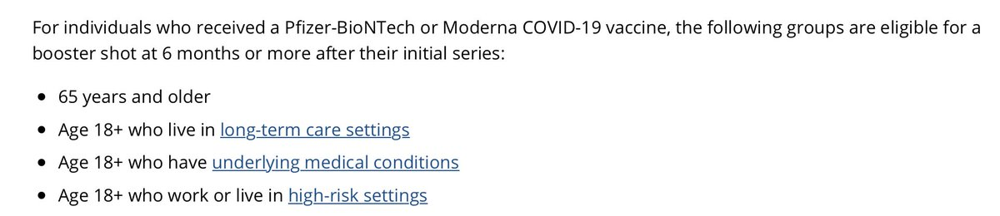</img></a>

---

<a href="https://twitter.com/erictopol/status/1460319806565978117" target="_blank" rel="noreferer">18:52 UCT</a>

Here's the @FT graph of the study (Table below) from England today showing marked efficacy of the 3rd shots for 2 different vaccines vs vaccinated with 2 shots and vs unvaccinated 
via @jburnmurdoch  https://twitter.com/EricTopol/status/1460273570987212800

<a href="FEQYQiOVQAEhp2u.png"  >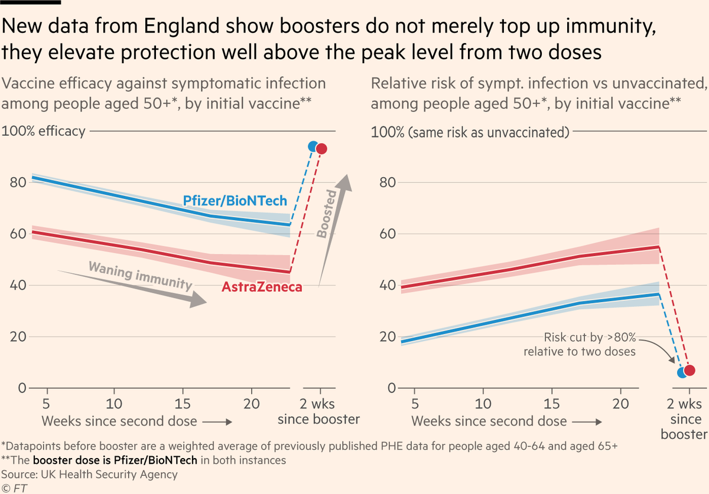</img></a>

---

<a href="https://twitter.com/erictopol/status/1460365831758487558" target="_blank" rel="noreferer">21:55 UCT</a>

Yes, there are surges, as seen here, but the high % vaccinated countries of Western Europe are generally in far better shape with respect to hospitalizations, ICU, and deaths compared with many in Eastern/Central Europe
https://www.ft.com/content/057665d4-5234-45cc-b96b-8d6c189803cc 

<a href="FERCjMHVIAMAtTO.jpg"  >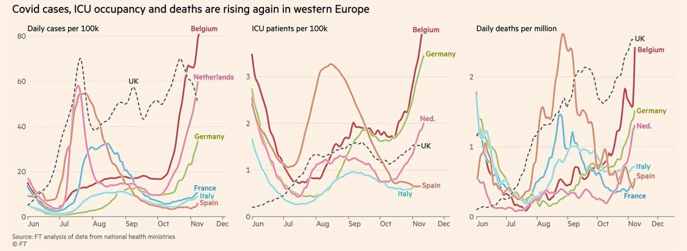</img></a>

---

<a href="https://twitter.com/erictopol/status/1460383281501802498" target="_blank" rel="noreferer">23:04 UCT</a>

This sums up the US approach to vaccinations 

<a href="FERSvV4VkAQ-ZMt.jpg"  >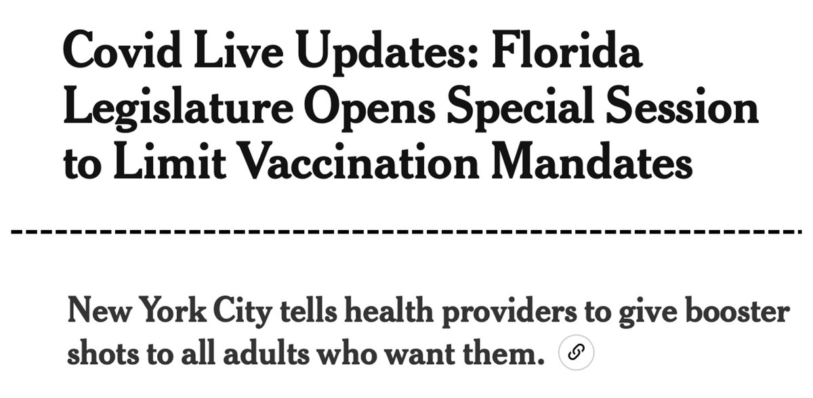</img></a>