+++
title = "Tweets by Eric Topol Nov 16"
Summary = ""
tags = ["Twitter"]
category = "Twitter"
+++

---

<a href="https://twitter.com/erictopol/status/1460408846887751681" target="_blank" rel="noreferer">00:46 UCT</a>

The neutralizing antibody level from Covid vaccines correlates with clinical outcomes across vaccines and major variants
https://www.thelancet.com/journals/lanmic/article/PIIS2666-5247(21)00267-6/fulltext @LancetMicrobe 

<a href="FERofknVUAkZeI5.jpg"  >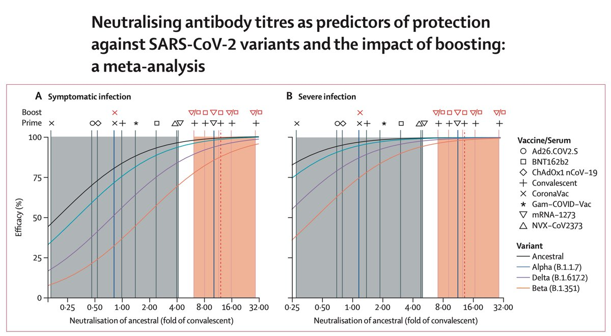</img></a>

---

<a href="https://twitter.com/erictopol/status/1460410225119281157" target="_blank" rel="noreferer">00:51 UCT</a>

And predicts the restoration of protection from booster (third shots) at 6 months 

<a href="FERrArBVcAM9gqS.jpg"  >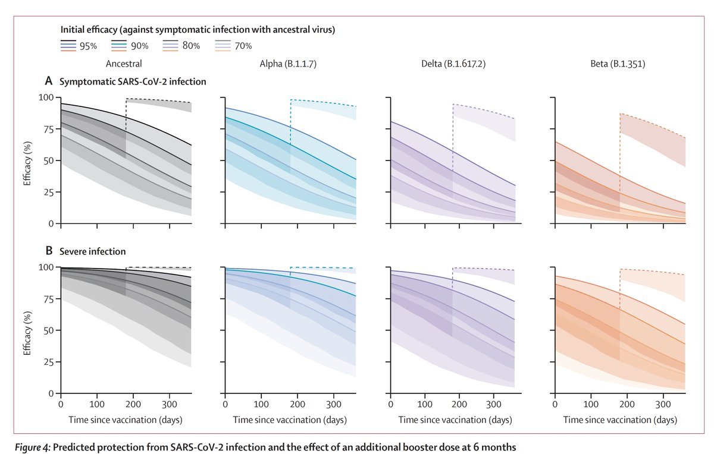</img></a>

---

<a href="https://twitter.com/erictopol/status/1460413471950999558" target="_blank" rel="noreferer">01:04 UCT</a>

So, as suspected, we have a lab assay that will help predict the level and durability of a vaccine, consideration and timing for boosters.
Also for people with prior Covid who get an mRNA vaccine👇 

<a href="FERuL4eVgAA69Nu.jpg"  >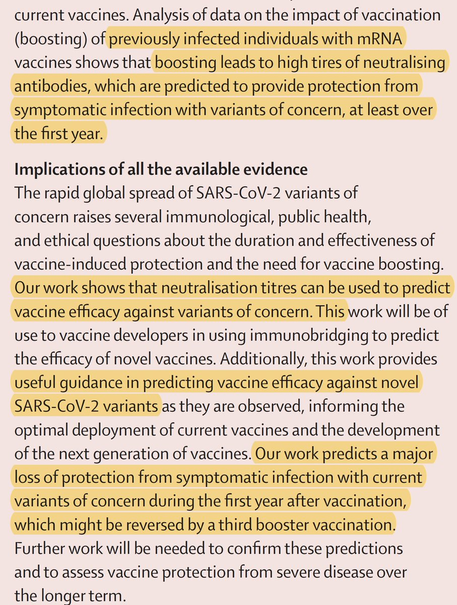</img></a>

---

<a href="https://twitter.com/erictopol/status/1460413731968487426" target="_blank" rel="noreferer">01:05 UCT</a>

@mkarolian @LancetMicrobe I added that to the thread and hope it helps

---

<a href="https://twitter.com/erictopol/status/1460431443599839238" target="_blank" rel="noreferer">02:16 UCT</a>

@joshtpm @PChildermass @cjones47 Follow-up is just approaching 4 months now for the first group, age 60+

---

<a href="https://twitter.com/erictopol/status/1460432607108165633" target="_blank" rel="noreferer">02:20 UCT</a>

Two notable data points on booster shot effectiveness (VE) vs symptomatic infections
1. Astra Zeneca jumped to 93%, had not reached 80% before w/💉💉
https://twitter.com/EricTopol/status/1460273570987212800
2. Pfizer VE in UK &amp; Israel = 94%; matched by 96% RCT for efficacy 3 vs [2 shots + placebo] in &gt;10K people

---

<a href="https://twitter.com/erictopol/status/1460446048539660294" target="_blank" rel="noreferer">03:14 UCT</a>

US new cases 7-day average up to 85,000 today with nearly 147,000 added, a 14% increase from a week ago
https://newsnodes.com/us 

<a href="FESKwysVEAERS9Q.jpg"  >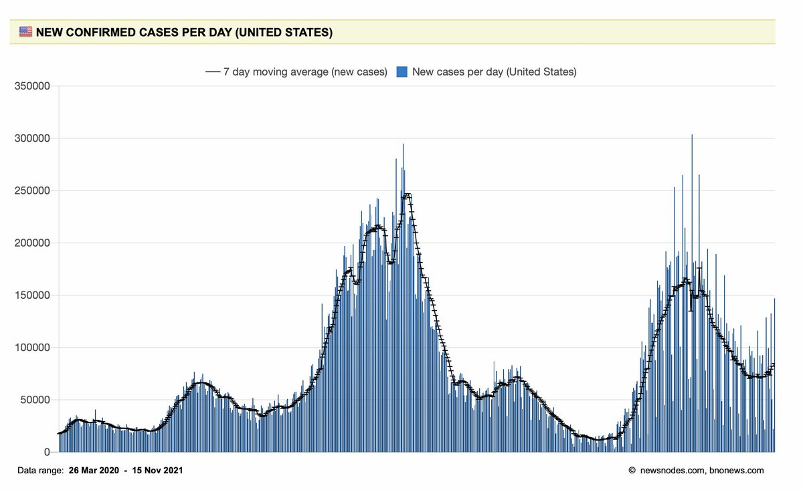</img></a>

---

<a href="https://twitter.com/erictopol/status/1460625984428789771" target="_blank" rel="noreferer">15:09 UCT</a>

One year ago today, the Moderna announcement of  Covid vaccine efficacy data—94.5%. 
Now more than 7,500,000,000 doses of vaccines have been given. 

<a href="FEUuCCIVkAkexyd.jpg"  >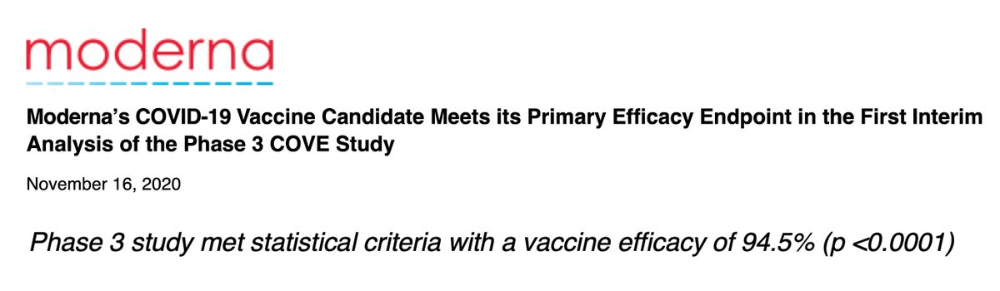</img></a>

---

<a href="https://twitter.com/erictopol/status/1460629386646806534" target="_blank" rel="noreferer">15:22 UCT</a>

The problem with vaccine waning 4-6 months later was 1st recognized in Israel in July, confirmed by more than 10 reports, and occurs with all vaccines. Protection is fully restored (or even exceeded) by 3rd (booster) shots. 

<a href="FEUx_YaUYAg8GFX.png"  >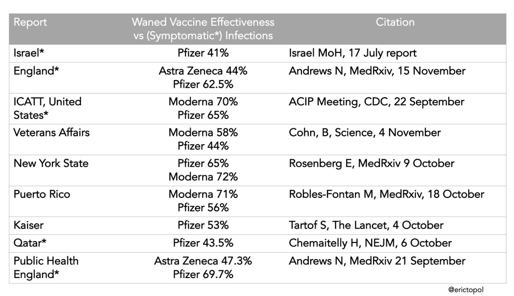</img></a>

---

<a href="https://twitter.com/erictopol/status/1460631512114630656" target="_blank" rel="noreferer">15:31 UCT</a>

The &gt;95% vaccine efficacy vs hospitalizations and deaths for mRNA vaccines in the Phase 3 randomized trials also waned. Protection is fully restored to this high level by 3rd (booster) shots. 

<a href="FEU0B5DVgAMnlkk.png"  >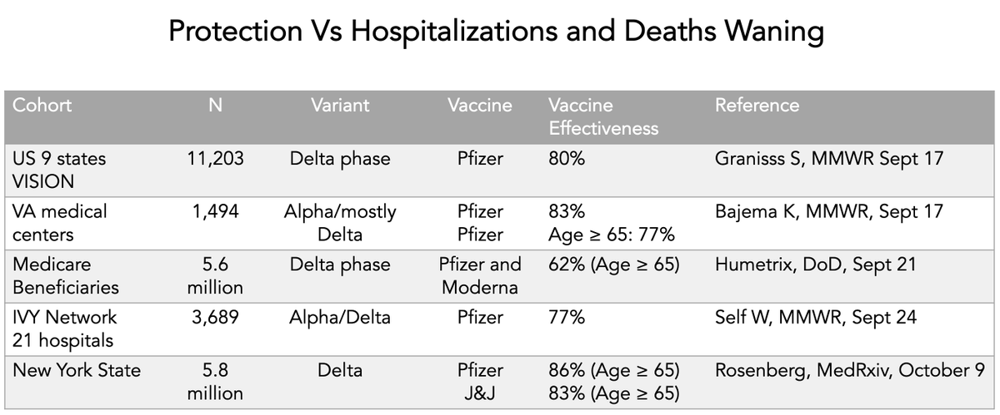</img></a>

---

<a href="https://twitter.com/erictopol/status/1460635987894177794" target="_blank" rel="noreferer">15:48 UCT</a>

How long will it last? 
Nobody knows for sure yet.
But let's hope Israel is right again:
"By analyzing the antibody levels, researchers have concluded that the third shot could be effective for 9 – 10 months, or even longer."
https://www.timesofisrael.com/pfizer-booster-shot-could-offer-protection-for-9-10-months-initial-data/

---

<a href="https://twitter.com/erictopol/status/1460642102375706628" target="_blank" rel="noreferer">16:13 UCT</a>

Now add Arkansas to the list
https://www.nytimes.com/live/2021/11/16/world/covid-vaccine-boosters-mandates#arkansas-boosters-adults-covid

---

<a href="https://twitter.com/erictopol/status/1460651450279743496" target="_blank" rel="noreferer">16:50 UCT</a>

And West Virginia https://www.wsj.com/articles/covid-19-boosters-become-available-to-all-adults-across-several-states-cities-11637067602?mod=Searchresults_pos1&page=1  @felschwartz 
These states and NYC rolling out their own booster shot policy—without precedent—speaks volumes about how the CDC and FDA are out of step with the data

---

<a href="https://twitter.com/erictopol/status/1460663821815615490" target="_blank" rel="noreferer">17:39 UCT</a>

We've been in the digital era for years, but just now discovering in medicine that simple text messaging can help substantially reduce Covid deaths
https://www.acpjournals.org/doi/10.7326/M21-2019
@AnnalsofIM @kit_delgadoMD @PennMedicine @PCORI 

<a href="FEVQrUsUUAALb53.jpg"  >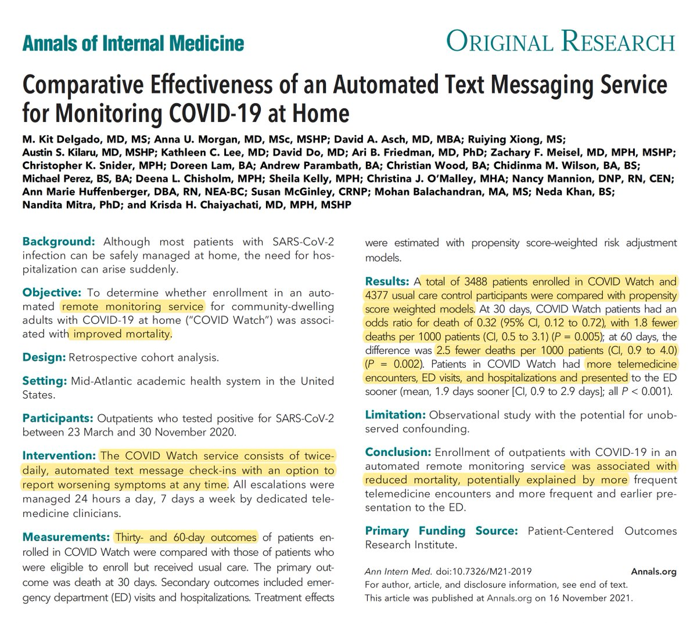</img></a>

---

<a href="https://twitter.com/erictopol/status/1460668319493623808" target="_blank" rel="noreferer">17:57 UCT</a>

"In short, the system saved lives."
https://www.acpjournals.org/doi/10.7326/M21-4273
by @faro_jamie and @slcmd 

<a href="FEVVzaKVEAcRUa3.jpg"  >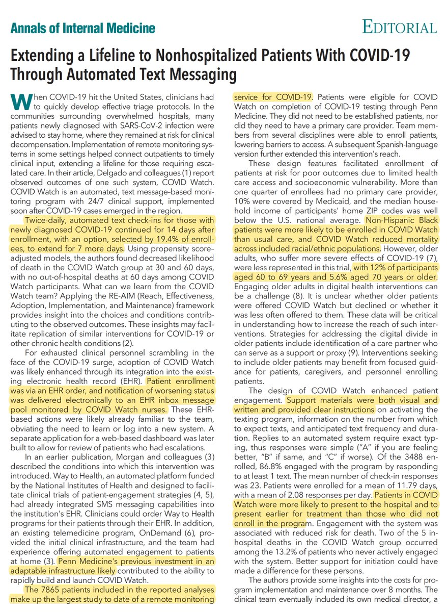</img></a><a href="FEVV0sKUcAYIR9f.jpg"  >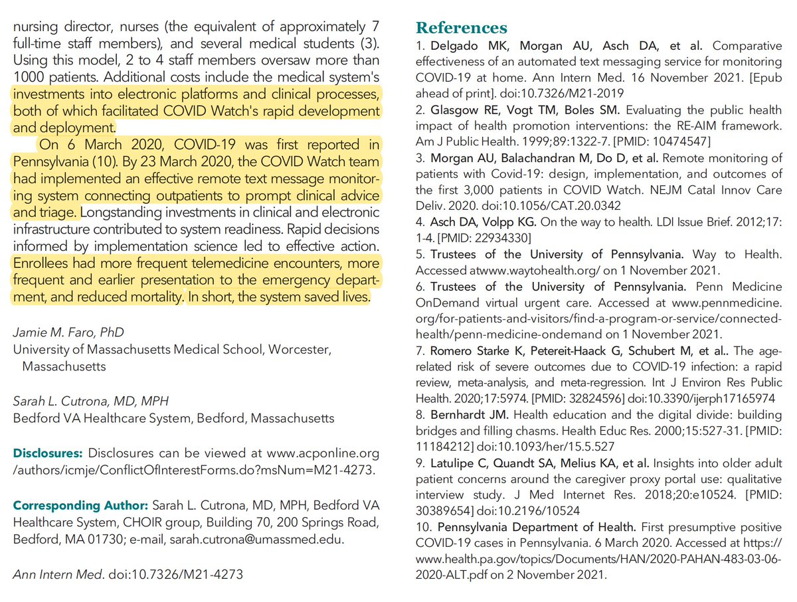</img></a>

---

<a href="https://twitter.com/erictopol/status/1460671071502278656" target="_blank" rel="noreferer">18:08 UCT</a>

The worldwide prevalence of #LongCovid, as defined by symptoms beyond 28 days, via review of all available data, is 43% [95% CI 35, 51], with marked heterogeneity among studies
https://www.medrxiv.org/content/10.1101/2021.11.15.21266377v1 @BhramarBioStat @UMRogelCancer @umichmedicine 

<a href="FEVXEF9UYAg7MuJ.jpg"  >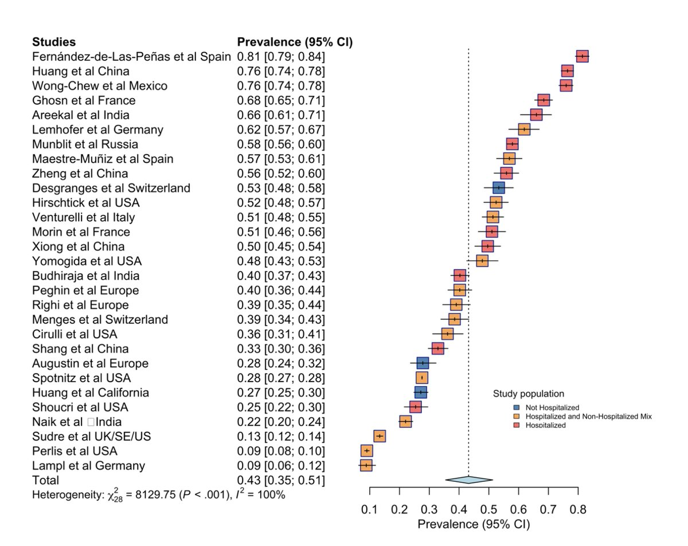</img></a>

---

<a href="https://twitter.com/erictopol/status/1460678346979696640" target="_blank" rel="noreferer">18:37 UCT</a>

Good news. This will help.
This pill for 5 days reduced hospitalizations and deaths by 89%, from 8 to 0.7% 

<a href="FEVe6WkVEAEWwtU.jpg"  >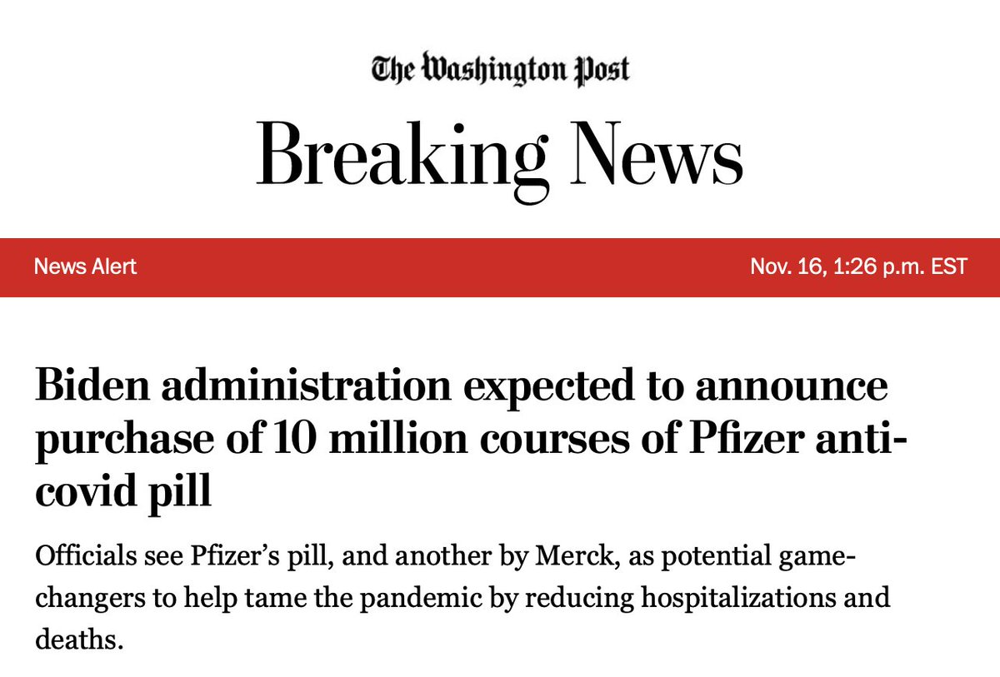</img></a>

---

<a href="https://twitter.com/erictopol/status/1460694329819729920" target="_blank" rel="noreferer">19:40 UCT</a>

The Alpha variant had its biggest toll in the US in Michigan. Michigan lead the US again, now with Delta. 

<a href="FEVtlaDUUAEP-nE.jpg"  >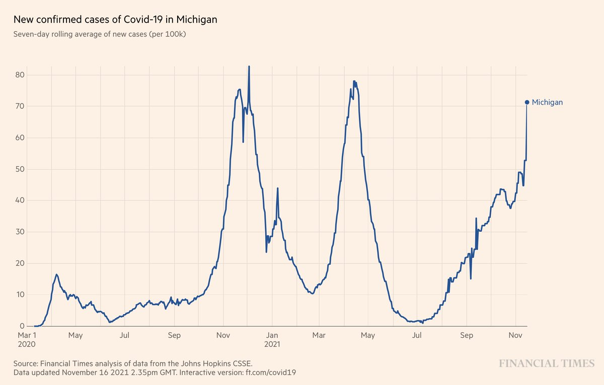</img></a>

---

<a href="https://twitter.com/erictopol/status/1460696319274545152" target="_blank" rel="noreferer">19:48 UCT</a>

The impact on hospitalizations and deaths, and rise in test positivity 

<a href="FEVveSSVIAA-HAg.jpg"  >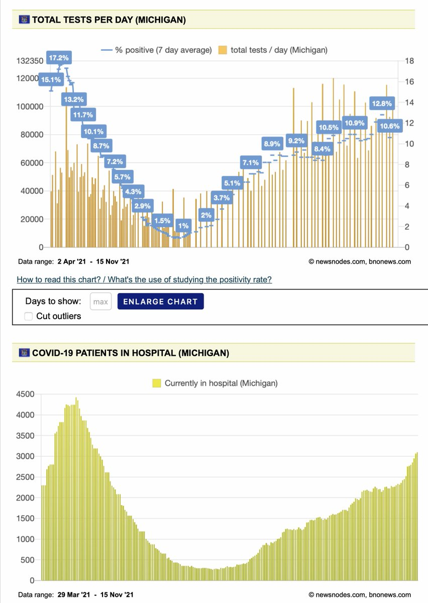</img></a><a href="FEVvXU6VQAAGGJS.jpg"  >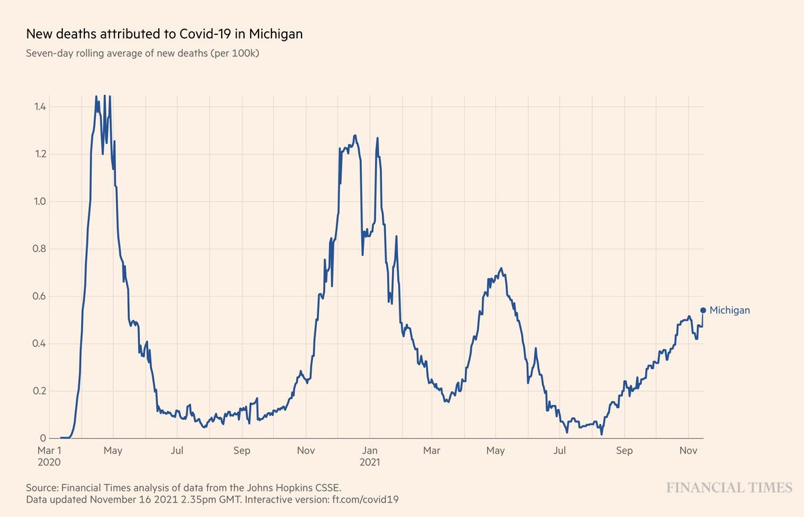</img></a>

---

<a href="https://twitter.com/erictopol/status/1460700560143773697" target="_blank" rel="noreferer">20:05 UCT</a>

Democratizing medicine, a slow process.....
"We could be getting closer to the prediction of a decade ago from American physician Eric Topol: “The digitisation of human beings will make a parody out of ‘doctor knows best’.”
https://www.ft.com/content/d72c9ffa-bdc9-44b2-ba83-4ee625da4ae8 @FT by @PatrickMcGee_

---

<a href="https://twitter.com/erictopol/status/1460711325588353032" target="_blank" rel="noreferer">20:48 UCT</a>

Updating my summary Table; the price for Pfizer's pill treatment pack is ~$500 by this US purchase and hopefully indicates competition, further reduction 

<a href="FEV8mN3UYAEvU7C.png"  >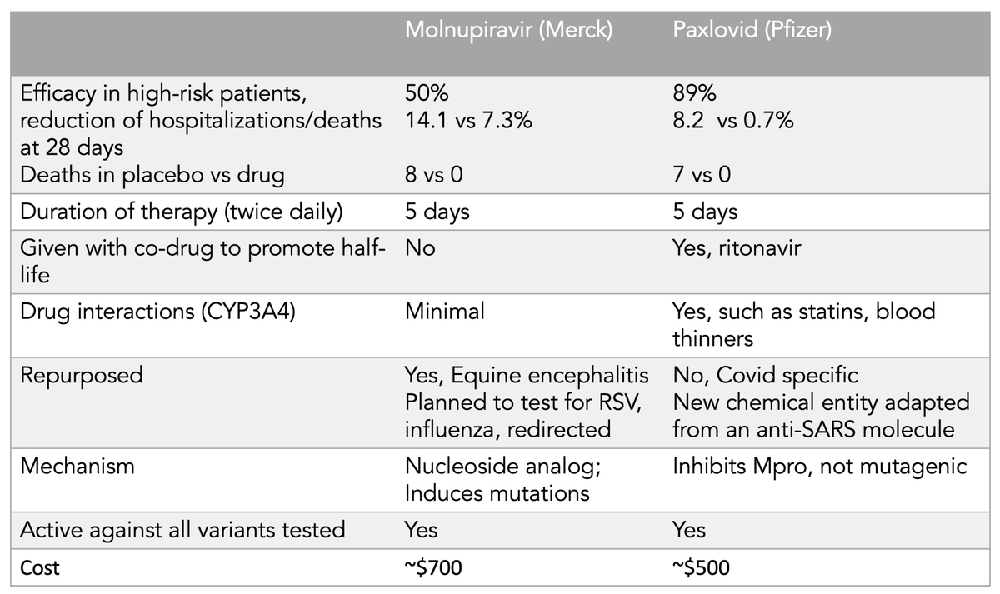</img></a>

---

<a href="https://twitter.com/erictopol/status/1460713926362951681" target="_blank" rel="noreferer">20:58 UCT</a>

Not your everyday photo
Seeing the #SARSCoV2 spike protein post-fusion at nanometer resolution https://www.pnas.org/content/118/48/e2112703118
@PNASNews

---

<a href="https://twitter.com/erictopol/status/1460722133596737537" target="_blank" rel="noreferer">21:31 UCT</a>

@ipfconline1 @ylecun @fchollet @lexfridman @AndrewYNg @Benioff @DeepLearn007 @antgrasso @jblefevre60 @EvanKirstel @SpirosMargaris @KirkDBorne @kdnuggets @sallyeaves @psb_dc @Ronald_vanLoon @DrJDrooghaag @pierrepinna @andi_staub @JimMarous @guzmand @Nicochan33 Happy to be on any list with @ylecun @AndrewYNg @Benioff @fchollet 🙏

---

<a href="https://twitter.com/erictopol/status/1460739539618598913" target="_blank" rel="noreferer">22:40 UCT</a>

@florian_krammer Good question. The Pfizer drug was derived from one they had (Top of table) active vs SARS-CoV but had not developed https://www.science.org/doi/10.1126/science.abl4784
@ScienceMagazine 
With potent anti-Mpro activity, it seems possible 

<a href="FEWWL0oVkAI89fZ.png"  >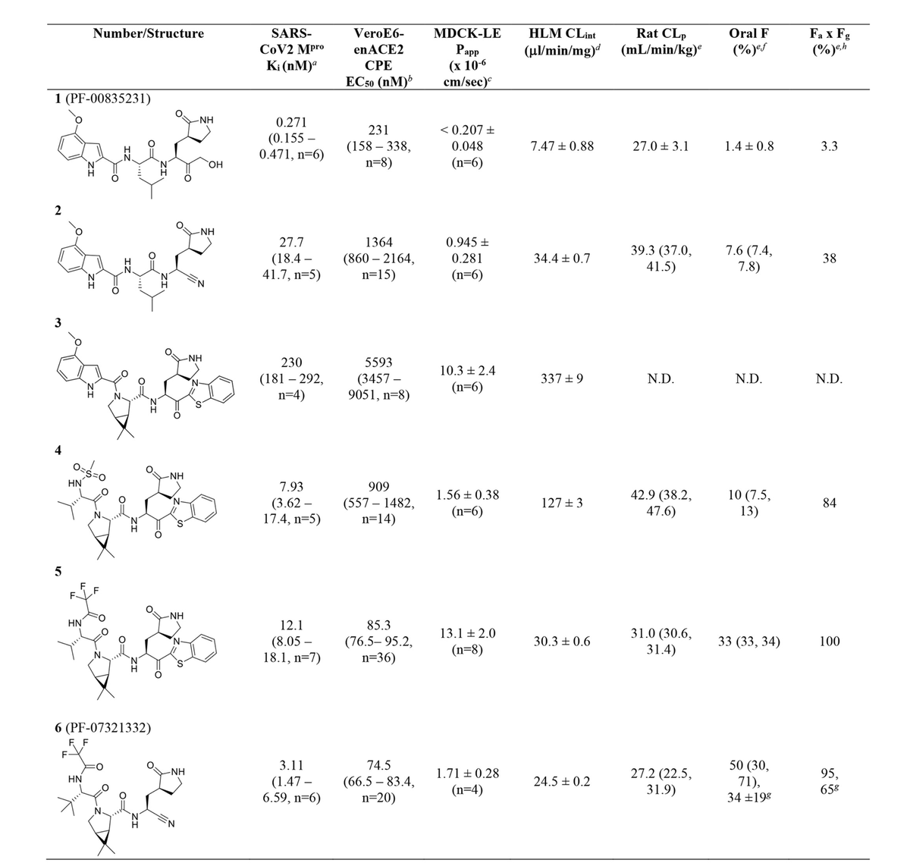</img></a>

---

<a href="https://twitter.com/erictopol/status/1460744672683331587" target="_blank" rel="noreferer">23:00 UCT</a>

The 3rd shot (boosters) provide ~95% protection vs symptomatic Delta infections. If a person doesn't get infected, they can't transmit. Period.

