+++
title = "Tweets by Eric Topol Nov 17"
Summary = ""
tags = ["Twitter"]
category = "Twitter"
+++

---

<a href="https://twitter.com/erictopol/status/1460767733029605378" target="_blank" rel="noreferer">00:32 UCT</a>

An impressive ongoing digital clinical trial with biobanking unravels a triad cytokine signature associated with #LongCovid (PASC), possibly driven by macrophage activation during the acute infection
https://papers.ssrn.com/sol3/papers.cfm?abstract_id=3963839 @UniHalle 

<a href="FEWvPufVEAQH18Y.jpg"  >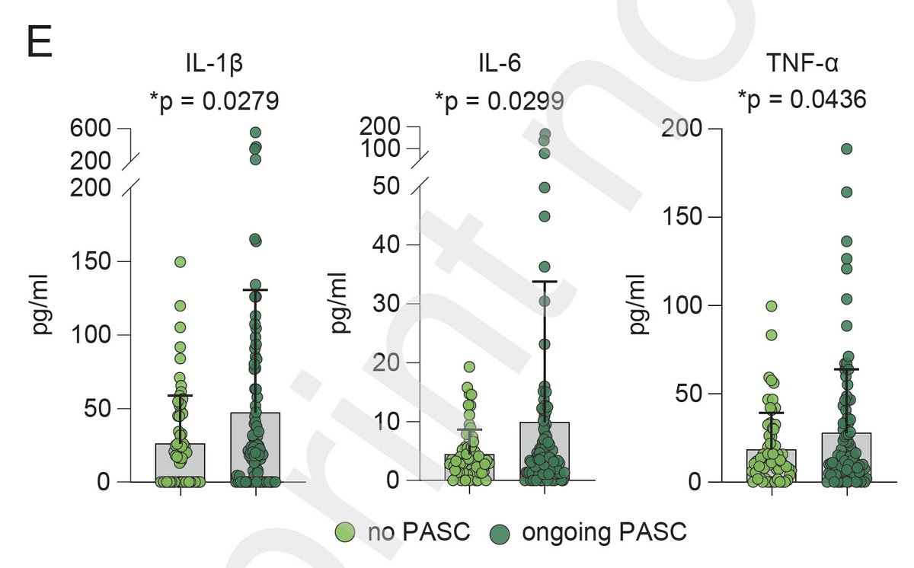</img></a>

---

<a href="https://twitter.com/erictopol/status/1460774037617987584" target="_blank" rel="noreferer">00:57 UCT</a>

Does #LongCovid occur with breakthrough (post-vaccination) infections?
A study of &gt;16,000 breakthroughs with &gt;3.5 million controls
Yes, clearly, including people not hospitalized
https://www.researchsquare.com/article/rs-1062160/v1
@zalaly @WUSTLmed 

<a href="FEW1Hd2UcAQrE2e.jpg"  >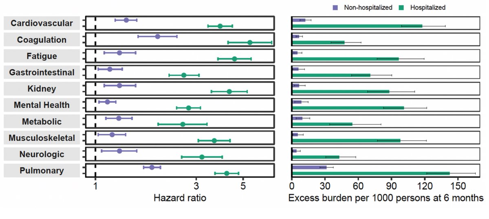</img></a>

---

<a href="https://twitter.com/erictopol/status/1460778503968735235" target="_blank" rel="noreferer">01:15 UCT</a>

The chance for a Covid co-infection this winter is increased, especially in hospitalized patients. They're frequently missed. Rapid sequencing in Covid ICUs made the diagnosis same-day, accurately, including antibiotic resistance
https://genomemedicine.biomedcentral.com/articles/10.1186/s13073-021-00991-y @GenomeMedicine 

<a href="FEW34wsUUAkJkof.jpg"  >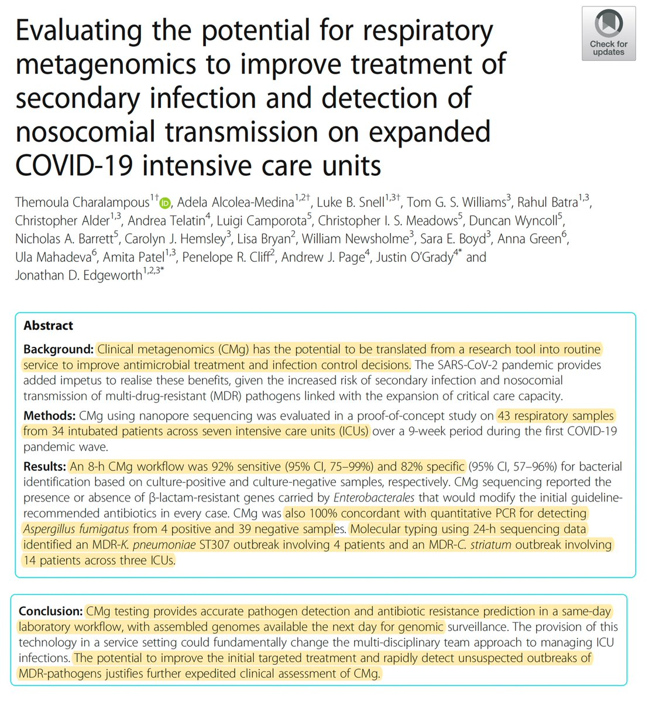</img></a>

---

<a href="https://twitter.com/erictopol/status/1460781442208698370" target="_blank" rel="noreferer">01:26 UCT</a>

This is more good news for this week on 3rd shots
https://www.nytimes.com/2021/11/16/us/politics/fda-pfizer-booster-shot.html by @noahweiland and @SharonLNYT 

<a href="FEW86ukUUAQfJR0.jpg"  >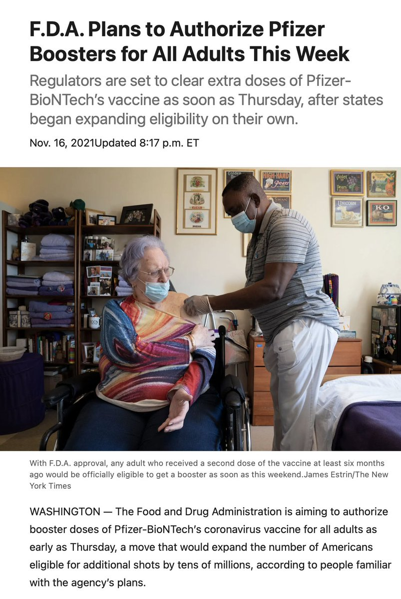</img></a>

---

<a href="https://twitter.com/erictopol/status/1460796145806942214" target="_blank" rel="noreferer">02:25 UCT</a>

As new cases are now increasing, averaging more than 85,000/day, hospitalizations are going back up
https://newsnodes.com/us 

<a href="FEXJ5DlVgAA0_Ng.jpg"  >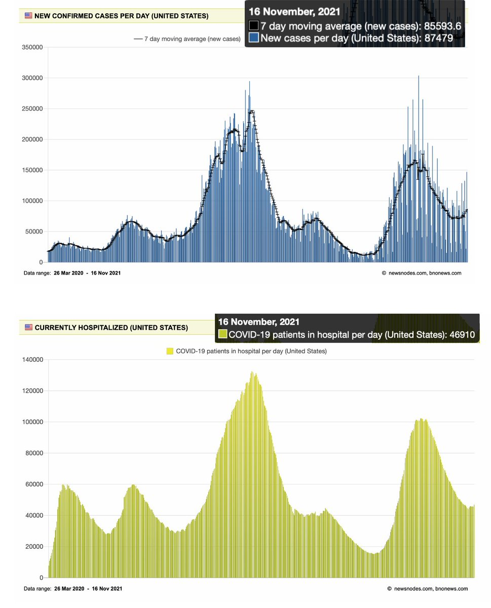</img></a>

---

<a href="https://twitter.com/erictopol/status/1460816560914714638" target="_blank" rel="noreferer">03:46 UCT</a>

@BoostedJ Likely before the end of the year, perhaps even by 15th December

---

<a href="https://twitter.com/erictopol/status/1460977271196426243" target="_blank" rel="noreferer">14:24 UCT</a>

Inside Israel's Booster Gamble
"Israel was able to achieve the goal of dealing with Covid and the fourth wave, while keeping the economy open, which the government attributes to the booster campaign."—@IKershner
https://www.nytimes.com/2021/11/15/us/coronavirus-briefing-what-happened-today-us-cases-rise-israel-boosters.html?searchResultPosition=2 @jonathan_wolfe 

<a href="FEZt8_ZVUAAvCkR.jpg"  >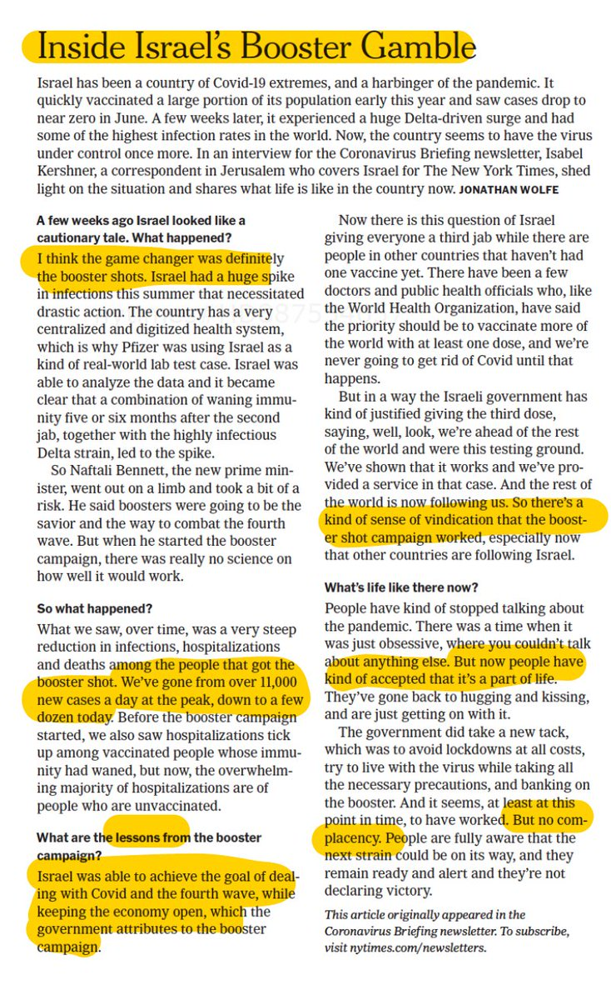</img></a>

---

<a href="https://twitter.com/erictopol/status/1460978914285666306" target="_blank" rel="noreferer">14:31 UCT</a>

At its 4th wave peak this summer, Israel had the highest normalized case burden in the world 

<a href="FEZwcK0VUAIHtMa.jpg"  >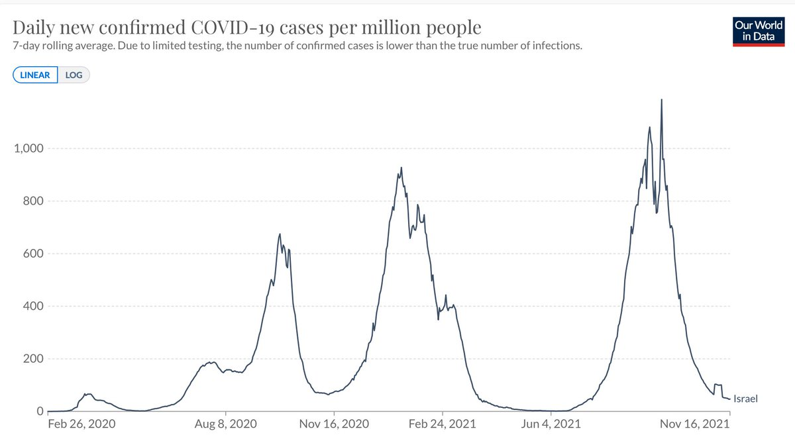</img></a><a href="FEZwDglVkAIxFih.jpg"  >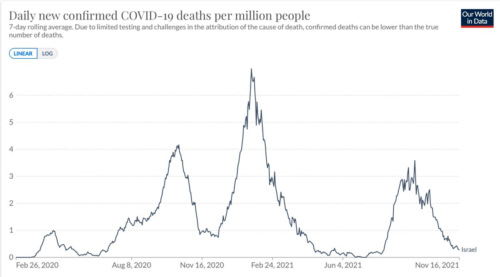</img></a>

---

<a href="https://twitter.com/erictopol/status/1460983274361131011" target="_blank" rel="noreferer">14:48 UCT</a>

Thoughts on prevailing over the US pandemic
https://www.nytimes.com/2021/11/16/opinion/covid-pandemic-end.html by @bokatlindell w/ inputs @Bob_Wachter @sarahzhang @KatherineEban @darakass @dwallacewells and me

---

<a href="https://twitter.com/erictopol/status/1460988162512019464" target="_blank" rel="noreferer">15:08 UCT</a>

The most "recent" @CDCgov data on breakthrough infections, deaths, by age and vaccine is from September 4, for 30% of the US population. The site says (15 Oct) it will be updated monthly (it should be at least weekly, if not daily). Where is the update?
https://covid.cdc.gov/covid-data-tracker/#rates-by-vaccine-status 

<a href="FEZ35E3UUAgFneq.jpg"  >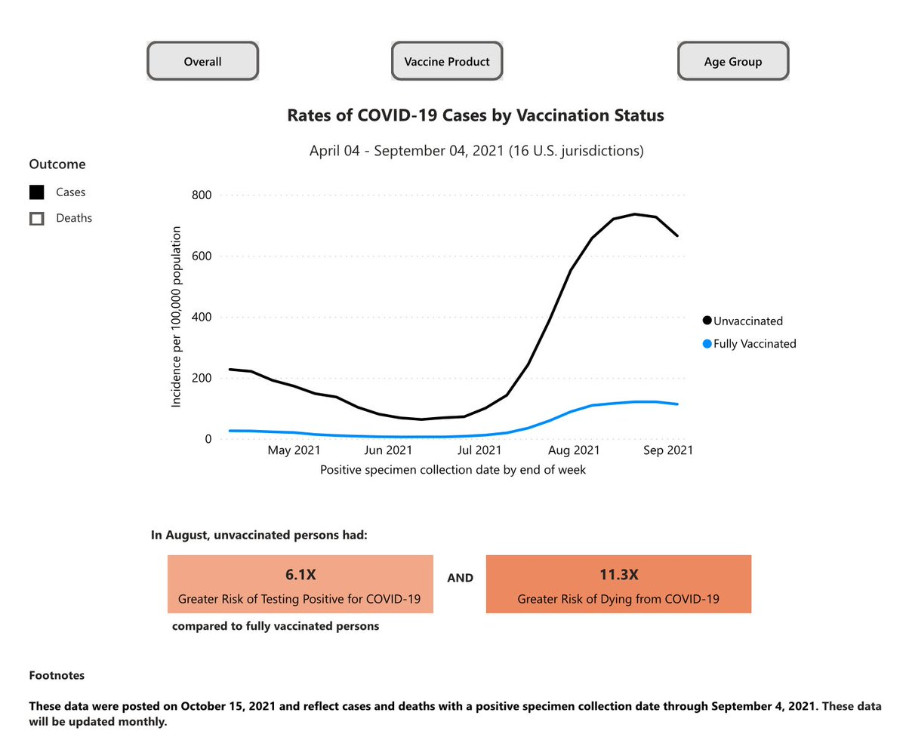</img></a>

---

<a href="https://twitter.com/erictopol/status/1460991857819734020" target="_blank" rel="noreferer">15:22 UCT</a>

A lot has been happening since September 4th
Like Washington state, for example
https://twitter.com/trvrb/status/1460772106354892806

---

<a href="https://twitter.com/erictopol/status/1461011126141939715" target="_blank" rel="noreferer">16:39 UCT</a>

The situation in Western Europe is worsening.
New pandemic records for cases in Austria, Netherlands, Germany, Denmark, Norway 1/2
@OurWorldInData 

<a href="FEaNIbtVgAAsVro.jpg"  >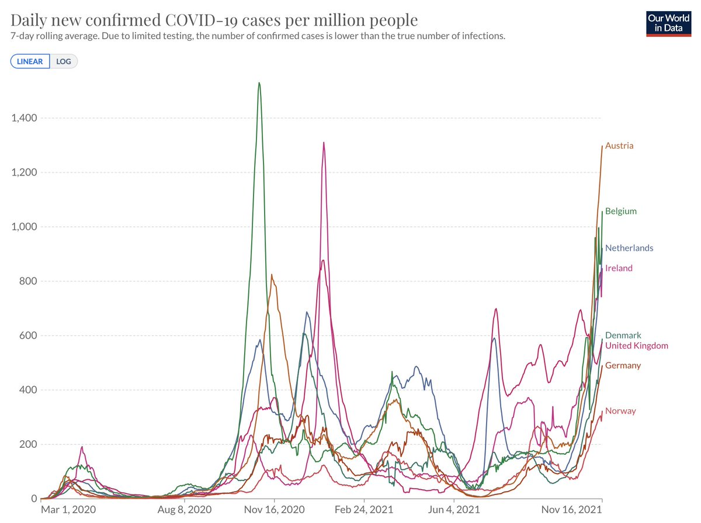</img></a>

---

<a href="https://twitter.com/erictopol/status/1461011130197757954" target="_blank" rel="noreferer">16:39 UCT</a>

Thanks to vaccinations the death rates are considerably lower than previous waves 

<a href="FEaNq3uVkAASHyZ.jpg"  >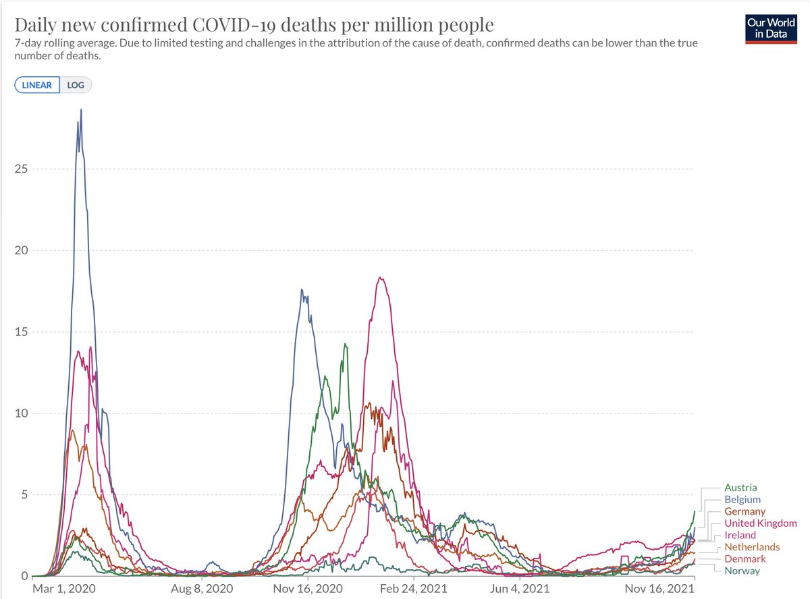</img></a>

---

<a href="https://twitter.com/erictopol/status/1461018065529761792" target="_blank" rel="noreferer">17:07 UCT</a>

And so are the hospitalizations for the countries for which data are available @OurWorldInData 

<a href="FEaUGKEUcAA8H7i.jpg"  >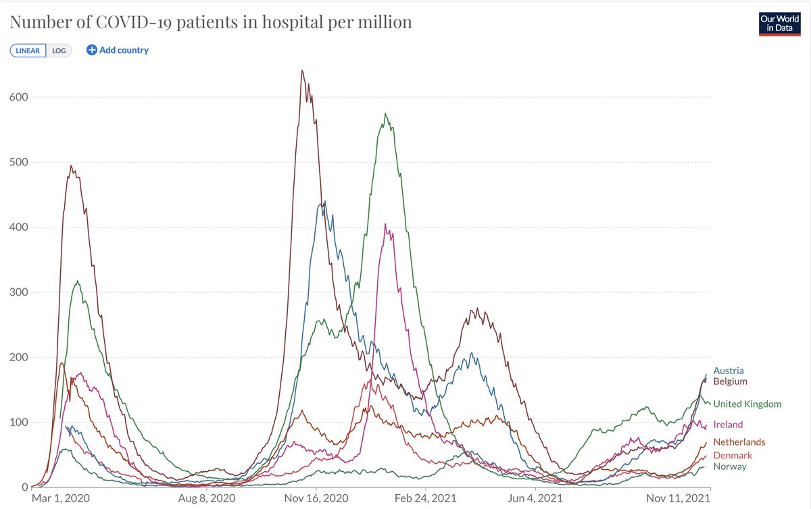</img></a>

---

<a href="https://twitter.com/erictopol/status/1461023319570857987" target="_blank" rel="noreferer">17:27 UCT</a>

The pandemic toll on mental health as assessed by 8 million helpline calls in 19 countries 
@Nature @NatureNV 
https://www.nature.com/articles/s41586-021-04099-6
https://media.nature.com/original/magazine-assets/d41586-021-03038-9/d41586-021-03038-9.pdf
https://www.nature.com/articles/d41586-021-03454-x 

<a href="FEaYUM3VkAImMkZ.jpg"  >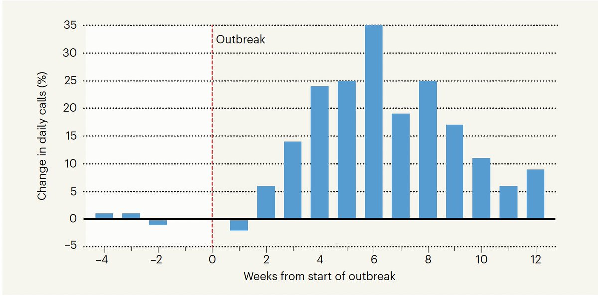</img></a><a href="FEaYrphVcAIkX5w.jpg"  >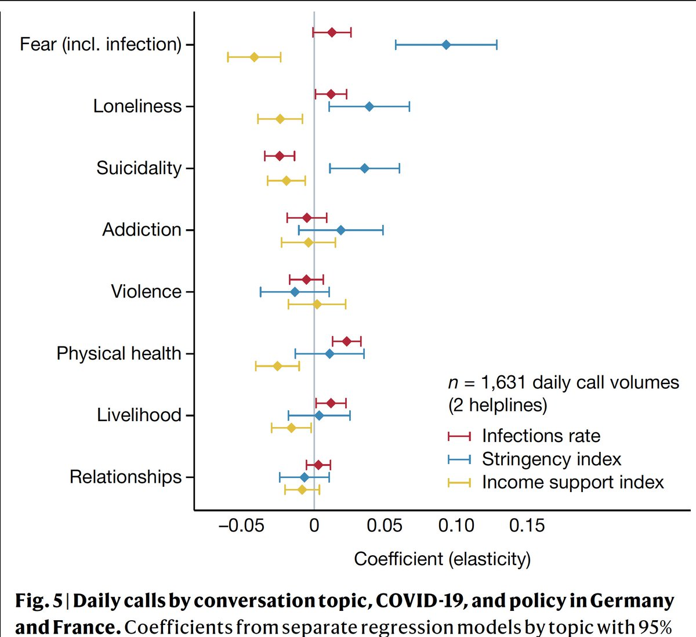</img></a>

---

<a href="https://twitter.com/erictopol/status/1461051382220296195" target="_blank" rel="noreferer">19:19 UCT</a>

In the era of mRNA vaccines, achieving resistance to ticks and prevention of transmission of Lyme disease in an experimental model
https://www.science.org/doi/10.1126/scitranslmed.abm2504 @ScienceTM @YaleSPH @YaleMed @WeissmanLab @andaleebsajid @GunjanArora1983 and colleagues 

<a href="FEaxih_VkAQRAtL.jpg"  >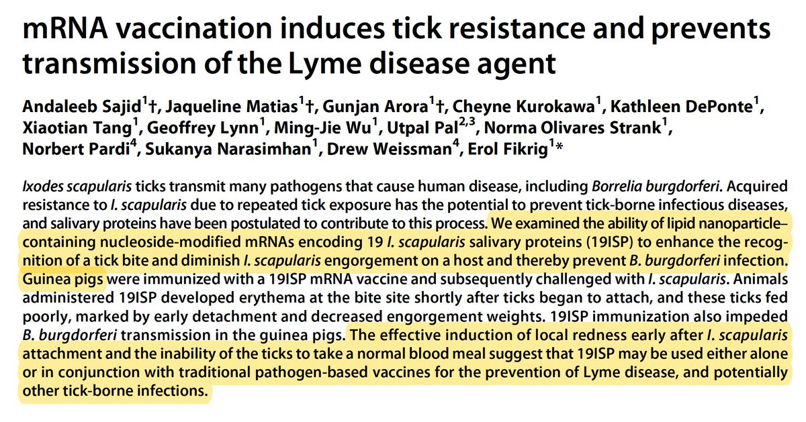</img></a>

---

<a href="https://twitter.com/erictopol/status/1461054284154302464" target="_blank" rel="noreferer">19:31 UCT</a>

Adding ticks, Lyme disease to a long pathogen list accruing over 3 decades, for which mRNA vaccines are targeting 
https://twitter.com/erictopol/status/1429533181162582019 

<a href="FEa0_ylUUAQo0sb.jpg"  >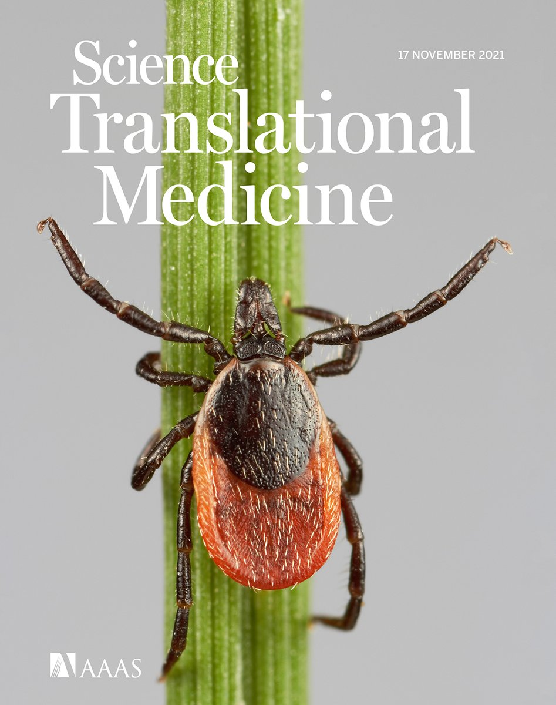</img></a>

---

<a href="https://twitter.com/erictopol/status/1461058159687049226" target="_blank" rel="noreferer">19:46 UCT</a>

An analysis of the US by its &gt;3,000 counties during the Delta wave shows that for each 1% increase in vaccination there was an associated 1·1% decrease in cases and a 2·6% reduction in Covid deaths
https://www.medrxiv.org/content/10.1101/2021.11.16.21266360v1

---

<a href="https://twitter.com/erictopol/status/1461120345922945024" target="_blank" rel="noreferer">23:53 UCT</a>

The first randomized trial to show safety, immune response and efficacy profile of a combined Covid vaccine (@Novavax) and flu shot at the same time https://www.thelancet.com/journals/lanres/article/PIIS2213-2600(21)00409-4/fulltext @LancetRespirMed 
"an unanticipated upside"
"the co-administration of the 2 vaccines is safe and effective" 

<a href="FEbwPFrVcAIa6-e.jpg"  >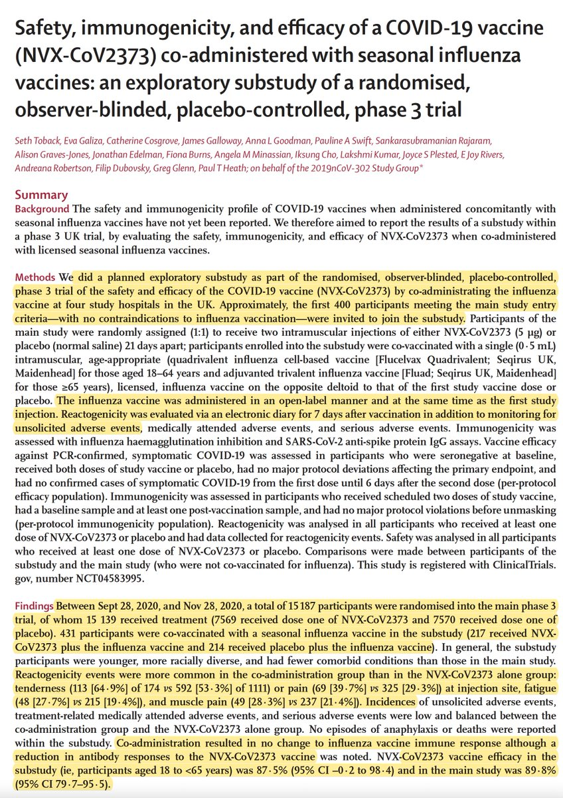</img></a><a href="FEbw53rUYAMY1ZO.jpg"  >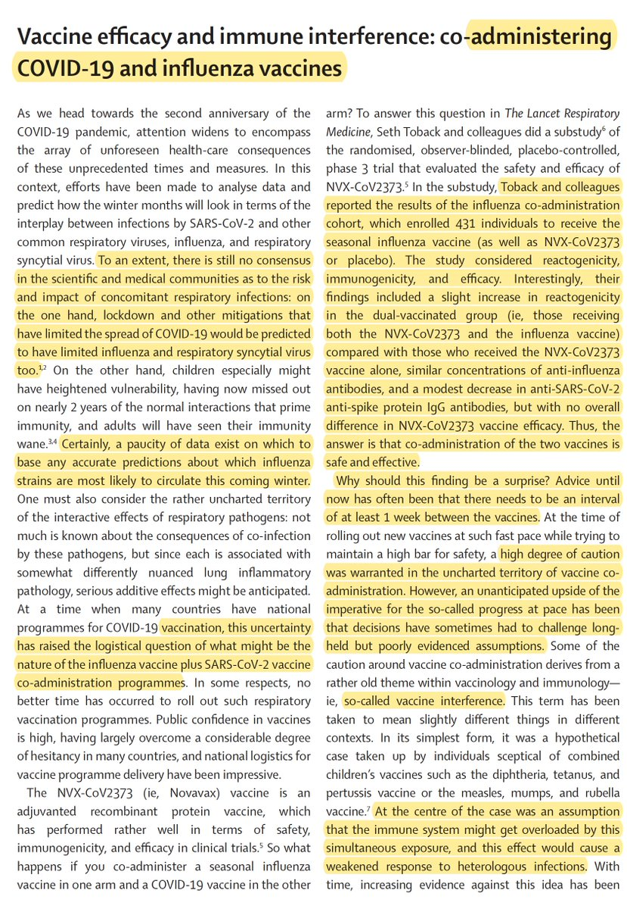</img></a>