+++
title = "Tweets by Eric Topol Nov 18"
Summary = ""
tags = ["Twitter"]
category = "Twitter"
+++

---

<a href="https://twitter.com/erictopol/status/1461129526306643968" target="_blank" rel="noreferer">00:30 UCT</a>

New @BMJ_latest
A systematic review of 72 studies of public health measures vs Covid: mask wearing reduced infections 53%, physical distancing by 25%
https://www.bmj.com/content/375/e068302
(link issue to be resolved) 

<a href="FEbrqG0UYA05IPe.jpg"  >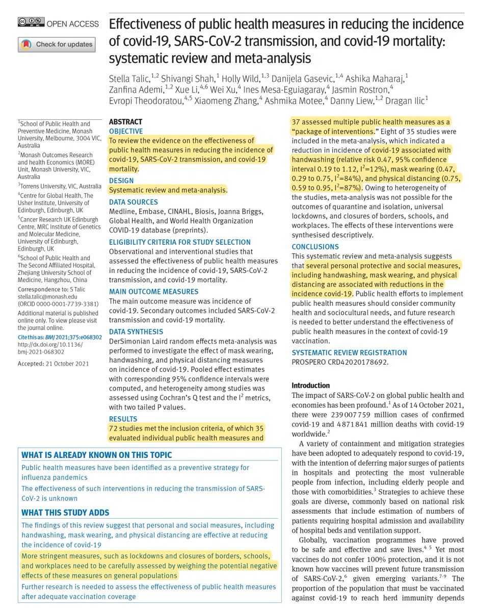</img></a><a href="FEbsMvAVEAAVuqs.jpg"  >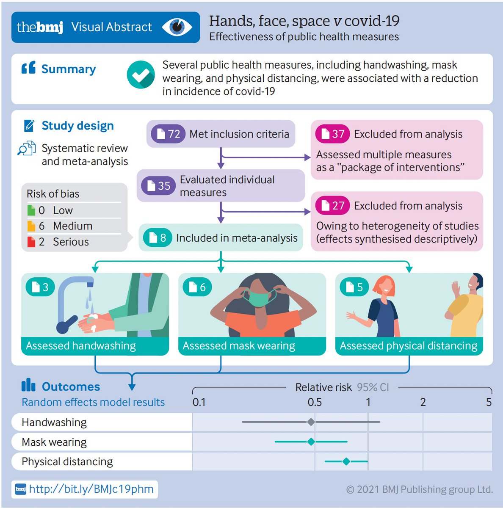</img></a>

---

<a href="https://twitter.com/erictopol/status/1461133347992702981" target="_blank" rel="noreferer">00:45 UCT</a>

Coverage @guardian; link still not fixed @bmj_latest 
https://www.theguardian.com/world/2021/nov/17/wearing-masks-single-most-effective-way-to-tackle-covid-study-finds?CMP=Share_iOSApp_Other
😷😷

---

<a href="https://twitter.com/erictopol/status/1461138763875160069" target="_blank" rel="noreferer">01:06 UCT</a>

In the 58.9% of US fully vaccinated, @CDCgov includes nearly 16 million people who had a J&amp;J vaccine as "fully vaccinated."  They aren't.
How many have had a 2nd shot? https://covid.cdc.gov/covid-data-tracker/#vaccinations_vacc-total-admin-rate-total 

<a href="FEcBDtAVIAAhBuQ.jpg"  >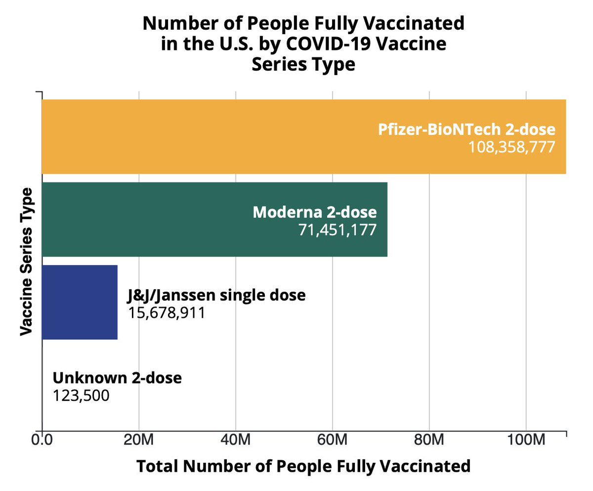</img></a>

---

<a href="https://twitter.com/erictopol/status/1461141859850342401" target="_blank" rel="noreferer">01:19 UCT</a>

A link that works (finally)
https://www.bmj.com/content/375/bmj-2021-068302
Great work by @stella_talic  @MonashUni 
@MonashMore and collaborators

---

<a href="https://twitter.com/erictopol/status/1461151619702136836" target="_blank" rel="noreferer">01:57 UCT</a>

This isn't good, folks, and tells where we're headed
—USA new cases today 115,000, 7-day average up to ~88,000, a 14% increase in a week
—Hospitalizations are on the rise again, 850 more today, to ~48,000
—Over 1,700 deaths
https://newsnodes.com/us

---

<a href="https://twitter.com/erictopol/status/1461178896930381832" target="_blank" rel="noreferer">03:46 UCT</a>

RT @Atul_Gawande: It is getting clearer and clearer that mRNA vaccines are three-dose vaccines.

---

<a href="https://twitter.com/erictopol/status/1461339473677979648" target="_blank" rel="noreferer">14:24 UCT</a>

A one-sentence summary of the evidence for boosters across all adult age groups
https://www.npr.org/2021/11/17/1056646733/what-to-know-ahead-of-the-authorization-for-pfizers-covid-booster @NPR  @WStoneReports @ailsachang 

<a href="FEe4HcMVQAEiQEa.png"  >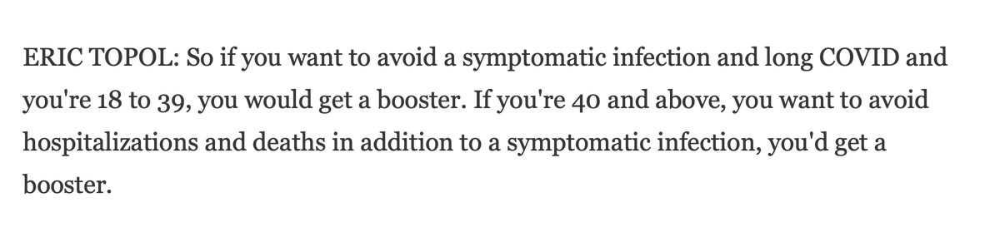</img></a>

---

<a href="https://twitter.com/erictopol/status/1461346425699127298" target="_blank" rel="noreferer">14:51 UCT</a>

Undercounting the neurologic cost of Covid
https://www.nature.com/articles/s41582-021-00593-7
by @AMannanBaig 

<a href="FEe-IJQUcAAaMNY.jpg"  >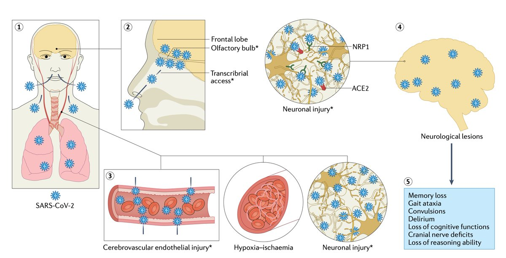</img></a>

---

<a href="https://twitter.com/erictopol/status/1461364548795973638" target="_blank" rel="noreferer">16:03 UCT</a>

RT @j_g_allen: Vaccines are our path out of this and the voluntary approach has hit its limit. Businesses can lead the way while OSHA's rul…

---

<a href="https://twitter.com/erictopol/status/1461389530993287169" target="_blank" rel="noreferer">17:43 UCT</a>

"Of 3,357,348 health care personnel in [US] 2,086 hospitals included...[only] 70.0% were fully vaccinated"
https://www.ajicjournal.org/article/S0196-6553(21)00673-8/fulltext
This is outrageously bad and unacceptable. Should be 100%. 

<a href="FEfllnjVQAYimjL.jpg"  >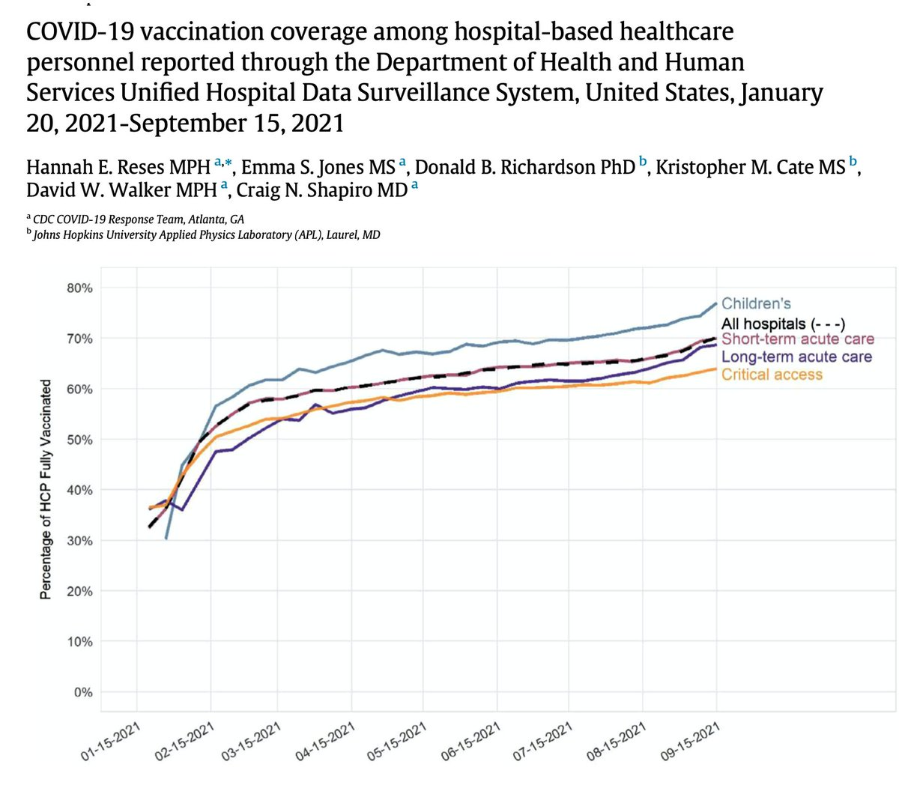</img></a>

---

<a href="https://twitter.com/erictopol/status/1461394960670871552" target="_blank" rel="noreferer">18:04 UCT</a>

Well beyond mink and deer reservoirs:
"The World Organisation for Animal Health, known as OIE, has recorded 598 Covid outbreaks in animals affecting 14 species in 30 countries"
https://www.ft.com/content/70dffb85-5c17-4dac-a1a5-b79c58d91270 @clivecookson 

<a href="FEfqu4cUUA4OQB7.jpg"  >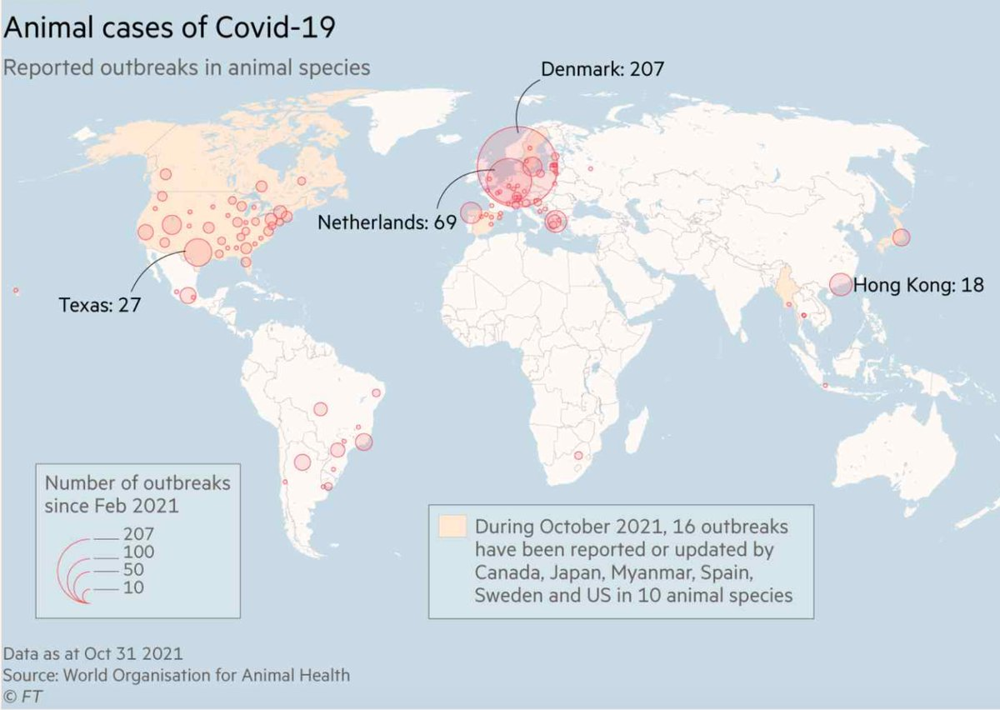</img></a>

---

<a href="https://twitter.com/erictopol/status/1461409016840478723" target="_blank" rel="noreferer">19:00 UCT</a>

Against all odds, the real American success standout for the pandemic is Puerto Rico
https://www.economist.com/united-states/2021/11/18/puerto-rico-success-story 

<a href="FEf3tsaVIAQ72xF.jpg"  >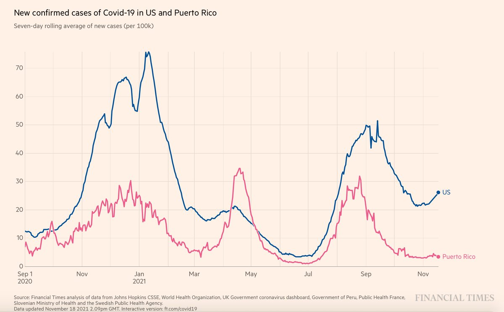</img></a><a href="FEf3sjuVgAEZkRj.jpg"  >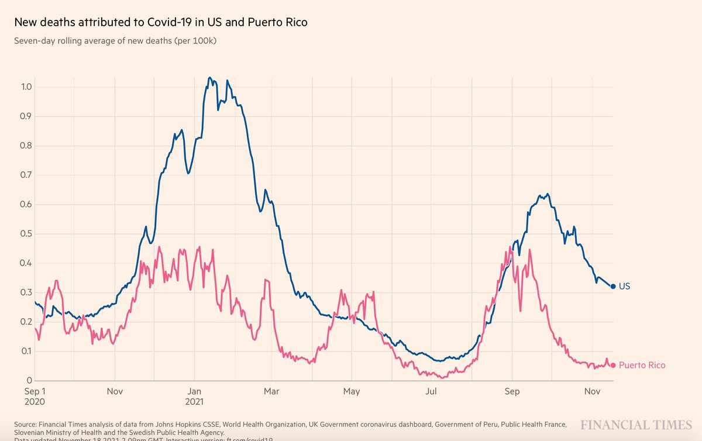</img></a>

---

<a href="https://twitter.com/erictopol/status/1461410840347758593" target="_blank" rel="noreferer">19:07 UCT</a>

"For America, it is a glimpse of what might have been." 

<a href="FEf5YVVVUAA_169.jpg"  >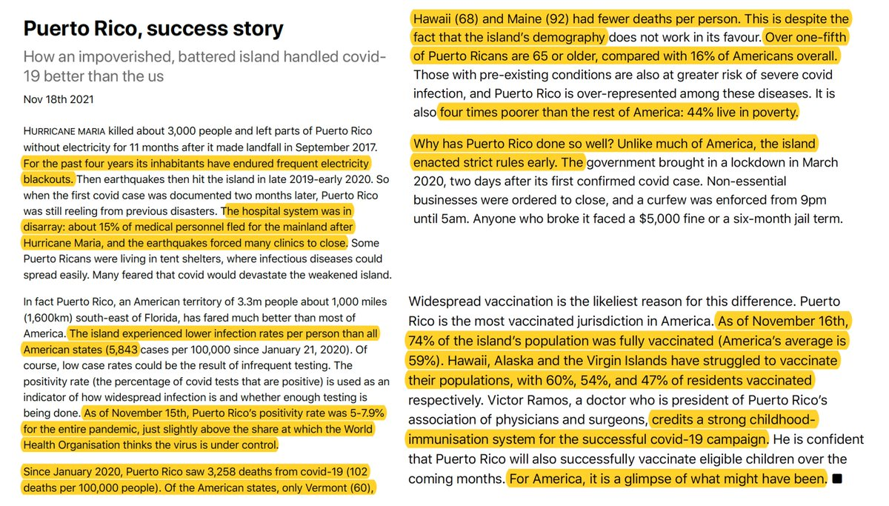</img></a>

---

<a href="https://twitter.com/erictopol/status/1461413291515793408" target="_blank" rel="noreferer">19:17 UCT</a>

The compelling case for vaccination in kids
https://www.science.org/doi/10.1126/science.abn2566
@ScienceMagazine 
"Vaccinating all children against SARS-CoV-2 could be among the most impactful public health efforts the US has seen in decades." 

<a href="FEf7YILVUAAM2fc.jpg"  >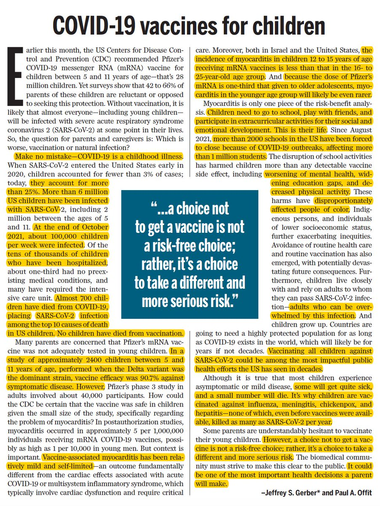</img></a>

---

<a href="https://twitter.com/erictopol/status/1461421464322600963" target="_blank" rel="noreferer">19:50 UCT</a>

Adding my case, which includes preventing #LongCovidKids 
While it's not as common as in adults, it is yet another reason to avoid Covid in children, not mentioned in the above
https://twitter.com/EricTopol/status/1459932317061836814

---

<a href="https://twitter.com/erictopol/status/1461426386342592512" target="_blank" rel="noreferer">20:09 UCT</a>

RT @DanRather: Let's face it. The messaging around Covid vaccine boosters has been a hot mess. Regardless, please, Get The Shot! It seems l…

---

<a href="https://twitter.com/erictopol/status/1461434087609024514" target="_blank" rel="noreferer">20:40 UCT</a>

@touchandtank THERE IS NO ADE. Period.

---

<a href="https://twitter.com/erictopol/status/1461434944618577920" target="_blank" rel="noreferer">20:43 UCT</a>

RT @benwakana46: Scores of LEADING HEALTH EXPERTS call on organizations to implement OSHA’s emergency temporary standard. 

Thank you @Zeke…

---

<a href="https://twitter.com/erictopol/status/1461446994556166147" target="_blank" rel="noreferer">21:31 UCT</a>

Sorry, it took 2 sentences.

---

<a href="https://twitter.com/erictopol/status/1461454679036989440" target="_blank" rel="noreferer">22:02 UCT</a>

And more on this.....
https://www.economist.com/science-and-technology/hidey-holes-for-sars-cov-2-1/21806334 

<a href="FEghNbyVIAAVrYj.jpg"  >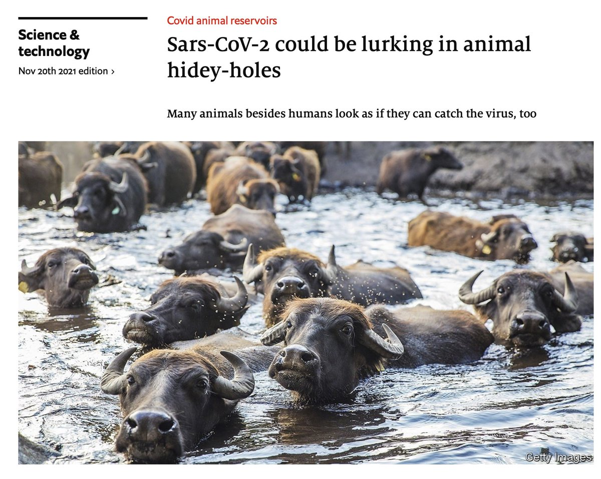</img></a><a href="FEghPHvVgAAe5WM.jpg"  >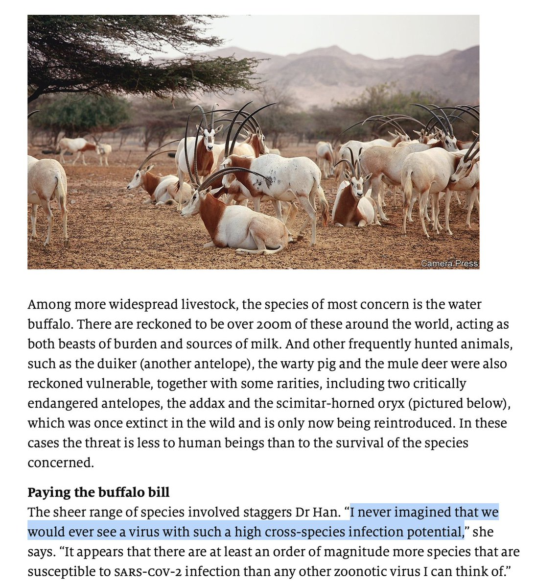</img></a>

---

<a href="https://twitter.com/erictopol/status/1461457833149415425" target="_blank" rel="noreferer">22:14 UCT</a>

@cravaritis @NPR @WStoneReports @ailsachang They're not. They haven't reached 5-6 months yet

---

<a href="https://twitter.com/erictopol/status/1461460077815025664" target="_blank" rel="noreferer">22:23 UCT</a>

Anti-aging diets?
No, none of these (or others) have any proof, as brilliantly reviewed @ScienceMagazine in "Separating Fact From Fiction" https://www.science.org/doi/10.1126/science.abe7365
@mkaeberlein @BittoAlessandro @CristalM_Hill @mitchellblee33 

<a href="FEglZyXUUAMepJN.jpg"  >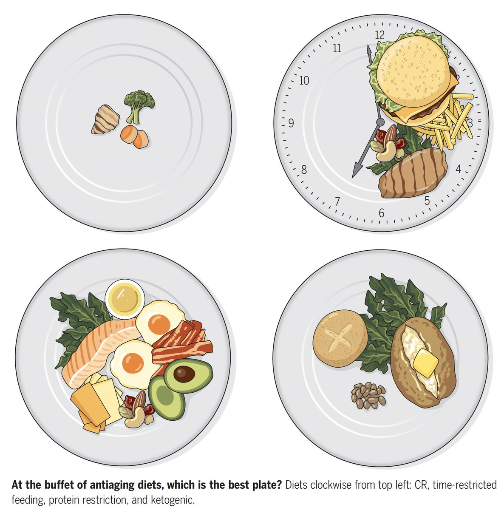</img></a>

---

<a href="https://twitter.com/erictopol/status/1461481359482896384" target="_blank" rel="noreferer">23:48 UCT</a>

Where do we stand with #AI for mammography?
https://www.thelancet.com/journals/lancet/article/PIIS0140-6736(21)02484-3/fulltext In today's @TheLancet , @lehman_connie and I map it out. We also address the recent @BMJ_latest review questioning its accuracy: https://www.bmj.com/content/374/bmj.n1872 

<a href="FEg4NQFVQAQfl_7.jpg"  >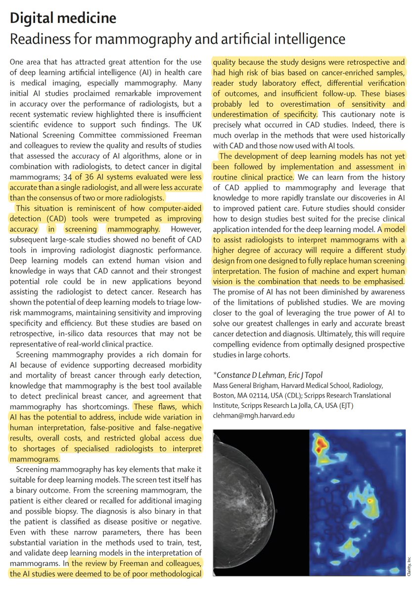</img></a>