+++
title = "Tweets by Eric Topol Nov 19"
Summary = ""
tags = ["Twitter"]
category = "Twitter"
+++

---

<a href="https://twitter.com/erictopol/status/1461492166044180482" target="_blank" rel="noreferer">00:31 UCT</a>

The list of organs that Covid can target keeps getting longer. Now the adrenal glands.
https://www.thelancet.com/journals/landia/article/PIIS2213-8587(21)00291-6/fulltext @TheLancetEndo 

Detectable #SARSCoV2 spike protein in adrenal cells of 18 of 40 (45%) patients who died 

<a href="FEg9WfXVgAMOfmJ.jpg"  >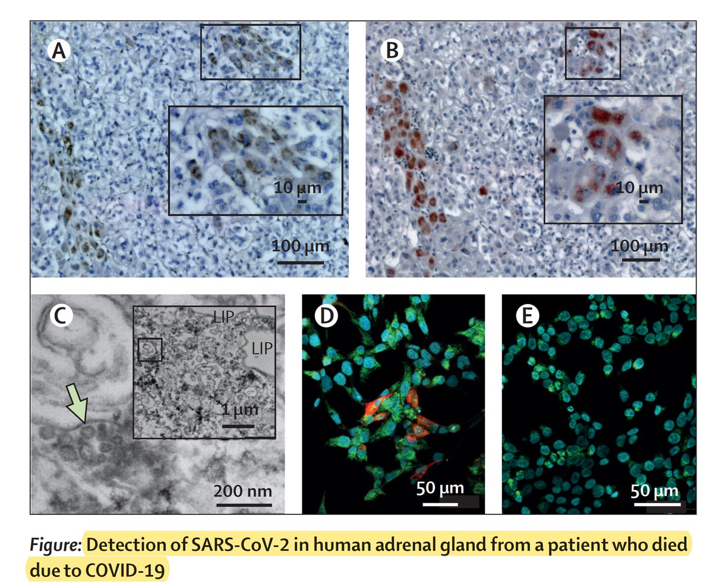</img></a><a href="FEg9ArgVQAAi6VB.jpg"  >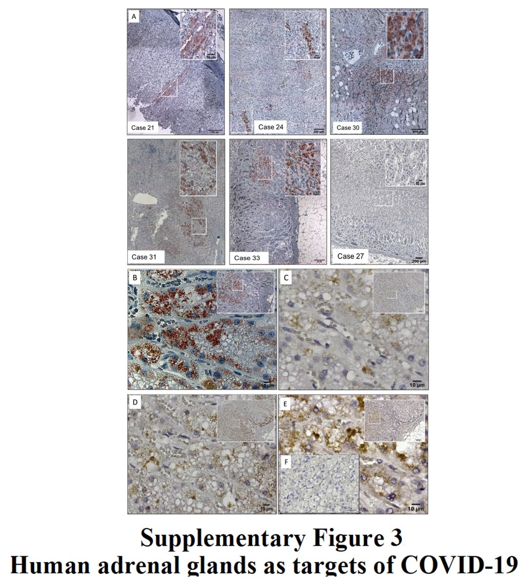</img></a>

---

<a href="https://twitter.com/erictopol/status/1461499388723806212" target="_blank" rel="noreferer">00:59 UCT</a>

The adrenals weren't on the list in the early days of the pandemic (left) but later their #SARSCoV2 tropism was identified by systematic assessment (right) 

<a href="FEhJp1YVUAMMQ2g.jpg"  >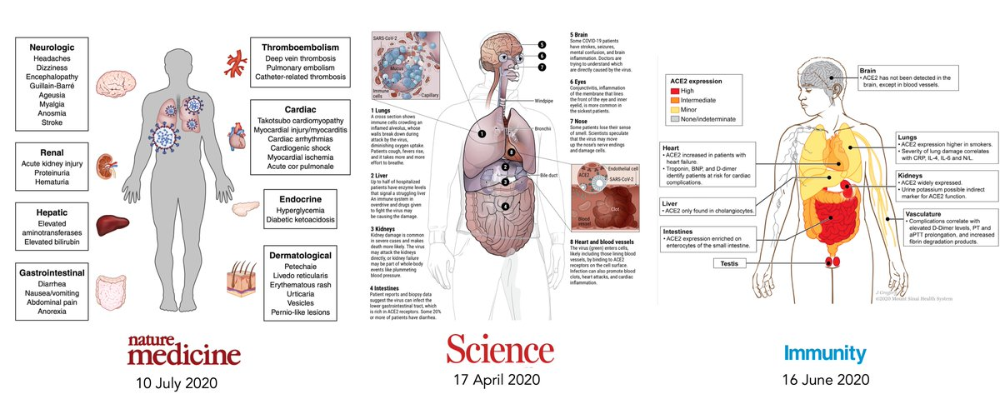</img></a><a href="FEhJrcUVgAI8lFj.jpg"  >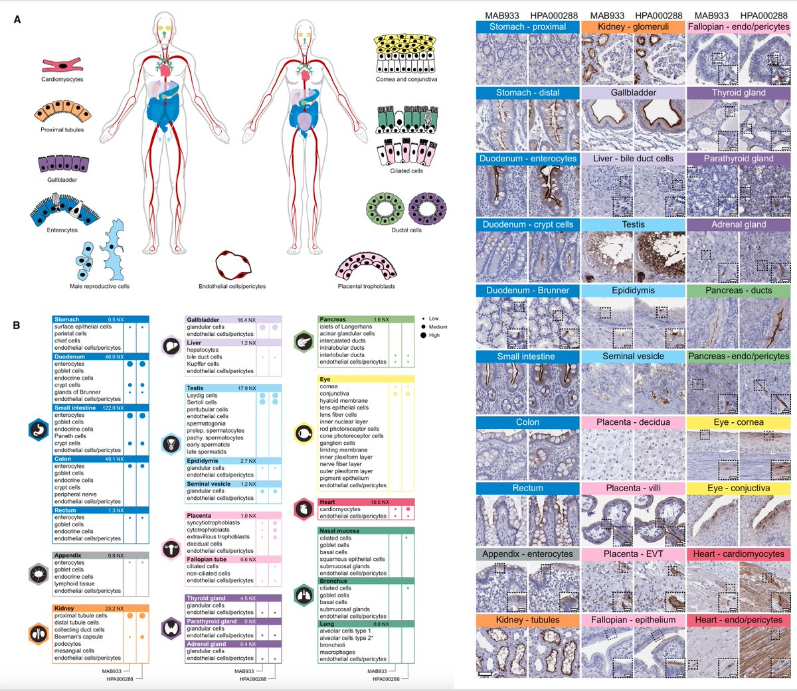</img></a>

---

<a href="https://twitter.com/erictopol/status/1461512004439457794" target="_blank" rel="noreferer">01:49 UCT</a>

From Israel's data, we've known about waning efficacy of vaccines since July. And full restoration of ~95% efficacy with boosters shot since September

Tomorrow @US_FDA will approve booster shots for all adults (current age criteria is 65+). Saying "it's about time" to too kind.

---

<a href="https://twitter.com/erictopol/status/1461533543423569920" target="_blank" rel="noreferer">03:15 UCT</a>

Another 105,000 new cases in the US today, 7-day avg up 28% for the past week, hospitalizations continuing to rise. The new (5th wave) has begun. 

<a href="FEhoSYgVkAc_oqJ.jpg"  >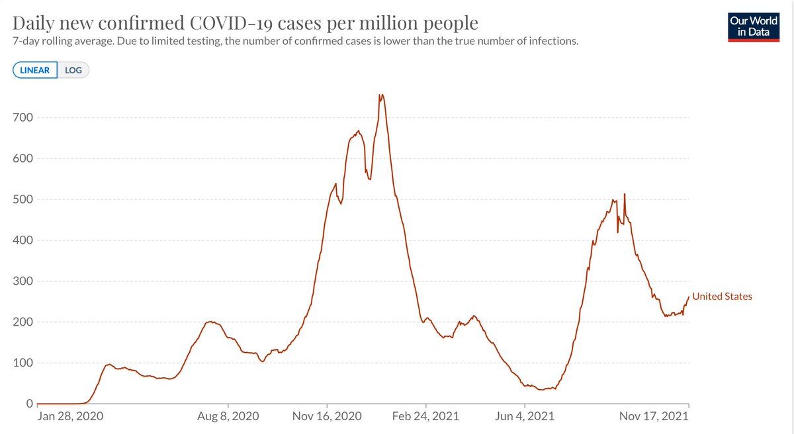</img></a>

---

<a href="https://twitter.com/erictopol/status/1461702799369011201" target="_blank" rel="noreferer">14:27 UCT</a>

Besides a national lockdown, Austria, currently with the highest Covid cases per capita in the world, initiates legislation to make vaccinations mandatory for all citizens
"“We have too many political forces in this country who fight against vaccination" 

<a href="FEkBishUcAIA9ve.jpg"  >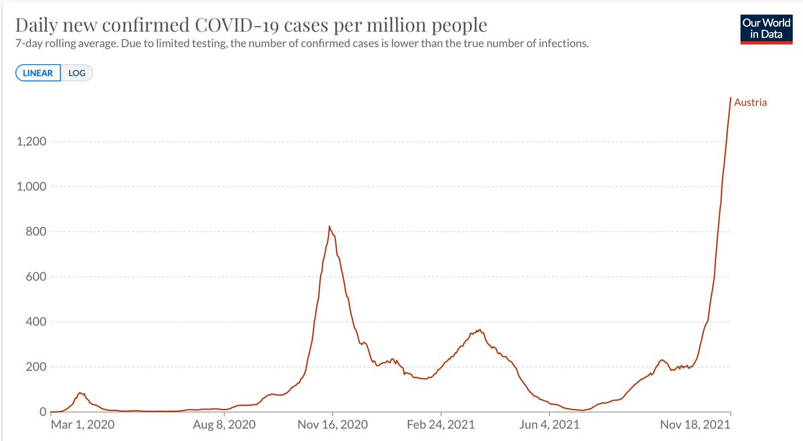</img></a><a href="FEkC0KeVQAU1hQu.jpg"  >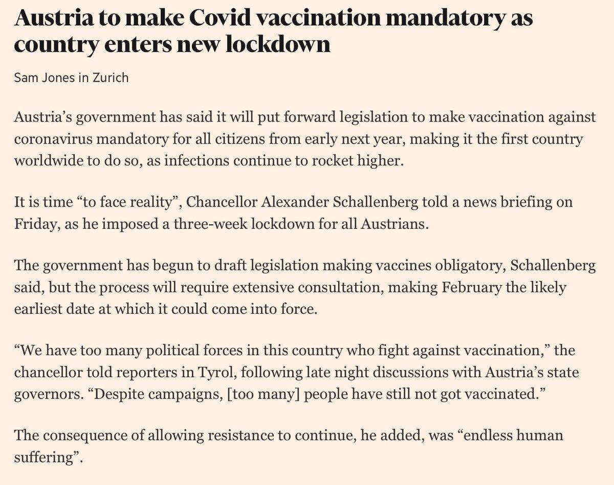</img></a>

---

<a href="https://twitter.com/erictopol/status/1461705617681227785" target="_blank" rel="noreferer">14:39 UCT</a>

The United States is significantly less vaccinated than Austria 

<a href="FEkFVgXVUAkBUe_.jpg"  >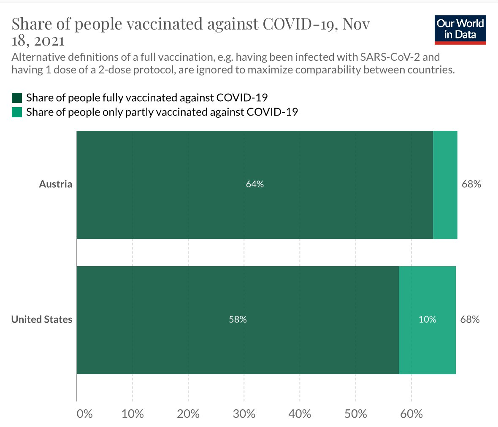</img></a><a href="FEkFZ9rVUAIwxmZ.jpg"  >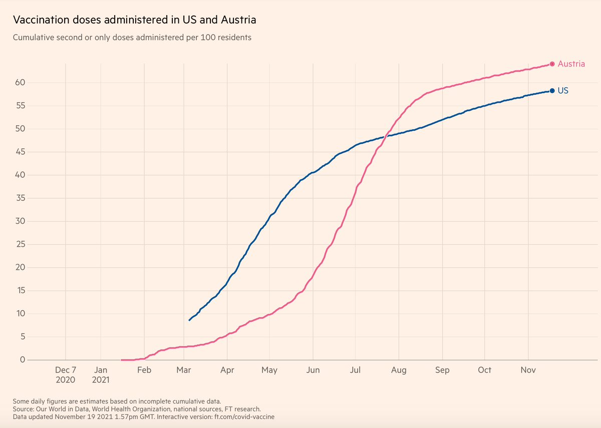</img></a>

---

<a href="https://twitter.com/erictopol/status/1461716467221557251" target="_blank" rel="noreferer">15:22 UCT</a>

Today Canada approved vaccinations for ages 5-11 https://twitter.com/EricTopol/status/1461413291515793408

---

<a href="https://twitter.com/erictopol/status/1461719374646022145" target="_blank" rel="noreferer">15:33 UCT</a>

@dan_ness Thanks for your note. I wish I had been wrong.

---

<a href="https://twitter.com/erictopol/status/1461727670895472641" target="_blank" rel="noreferer">16:06 UCT</a>

In the setting of a prison, transmission of Delta infections from fully vaccinated individuals was similar to that of unvaccinated 
https://www.medrxiv.org/content/10.1101/2021.11.12.21265796v1 

<a href="FEkZEMnVgAgJAiB.jpg"  >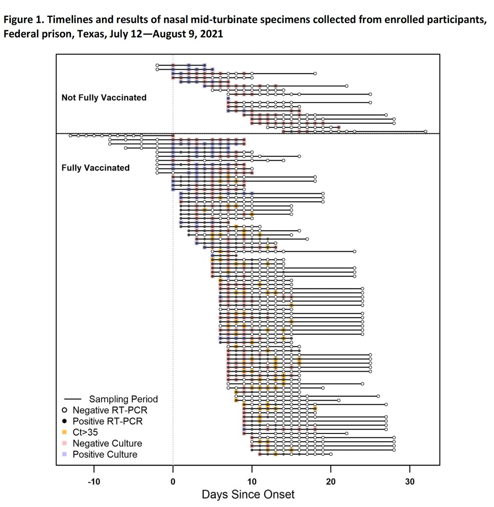</img></a>

---

<a href="https://twitter.com/erictopol/status/1461741637416017922" target="_blank" rel="noreferer">17:02 UCT</a>

It's important to put this in context. The setting matters. A prison or a cruise may be considered highest risk; household contacts as high risk. Brief outdoor contact the lowest. The transmission story is not binary. 3 household studies reviewed here:
https://twitter.com/EricTopol/status/1459945548958494721

---

<a href="https://twitter.com/erictopol/status/1461761689674665985" target="_blank" rel="noreferer">18:21 UCT</a>

Low levels of #SARSCoV2 antibodies in children and teens among &gt;10,000 cohort in Germany through May 2021 https://papers.ssrn.com/sol3/papers.cfm?abstract_id=3965378 

<a href="FEkz47AVEAIlRnc.jpg"  >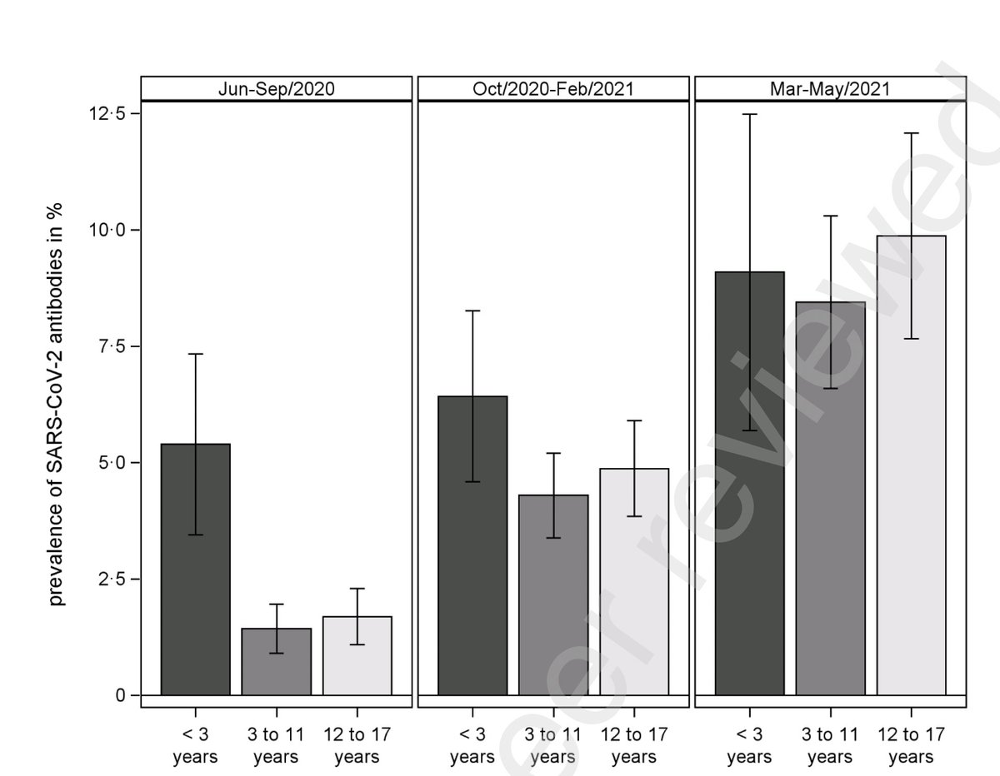</img></a>

---

<a href="https://twitter.com/erictopol/status/1461786768131465219" target="_blank" rel="noreferer">20:01 UCT</a>

First look at the only randomized trial of a booster vaccine data (Pfizer) today https://www.cdc.gov/vaccines/acip/meetings/downloads/slides-2021-11-19/02-COVID-Perez-508.pdf
95% efficacy vs symptomatic infections, consistent across all age, sex, race, ethnicity and comorbid condition subgroups 
Benefit seen very early 

<a href="FElO2f-VIAMvRaB.jpg"  >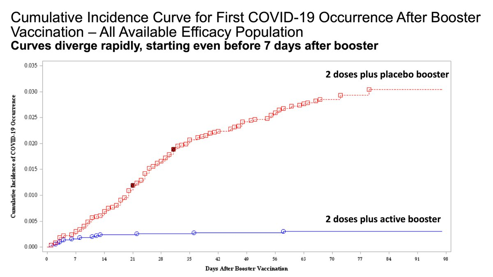</img></a>

---

<a href="https://twitter.com/erictopol/status/1461789870414868480" target="_blank" rel="noreferer">20:13 UCT</a>

Primary efficacy endpoint: 6 (booster) vs 123 events (placebo)
Solid safety profile 

<a href="FElQ-oUVcAAltjk.jpg"  >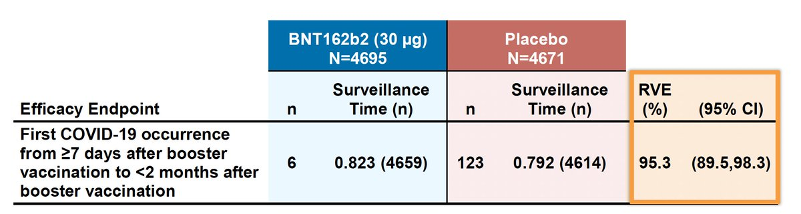</img></a><a href="FElRndoVUAo88du.jpg"  >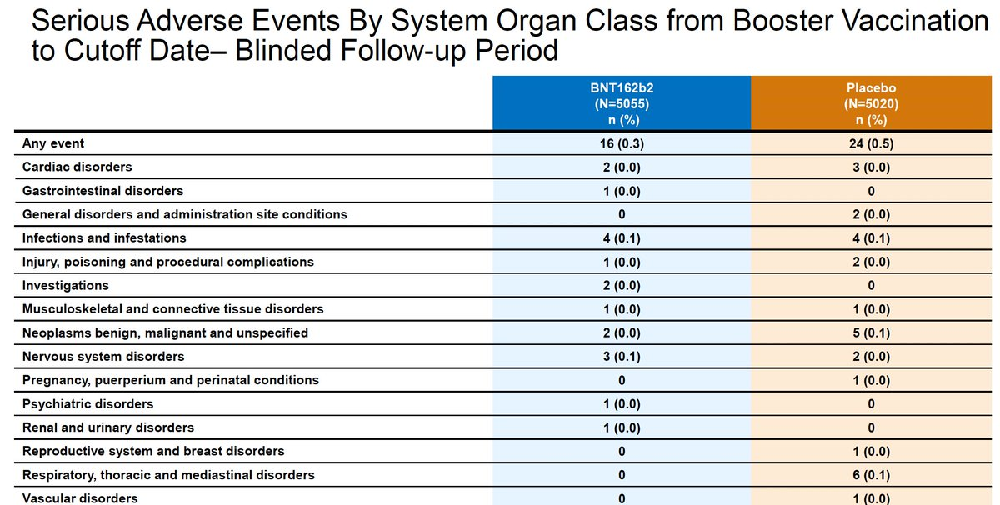</img></a>

---

<a href="https://twitter.com/erictopol/status/1461793516451991556" target="_blank" rel="noreferer">20:28 UCT</a>

Side by side event curves for the original Pfizer vaccine trial vs the Booster trial
You can see the curves diverge about a week earlier with a booster, ~14 vs 7 days, which aligns with much faster induction of neutralizing antibodies 

<a href="FElVHaLVgAAyK7n.jpg"  >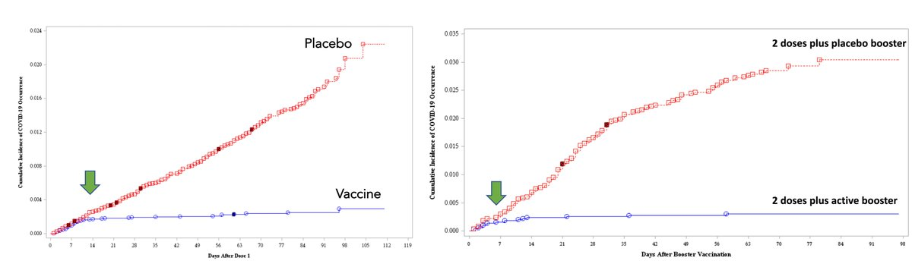</img></a>

---

<a href="https://twitter.com/erictopol/status/1461794967874068489" target="_blank" rel="noreferer">20:34 UCT</a>

The booster data shows benefit *across all ages* for 95% efficacy vs symptomatic infections and for age 40+ vs hospitalizations and deaths. But, remarkably,  unlike FDA, the CDC advisory committee still is unable to process these data.
The evidence does not align w/ "MAY" get it. https://twitter.com/DrLeanaWen/status/1461791366489518084

---

<a href="https://twitter.com/erictopol/status/1461810844854018050" target="_blank" rel="noreferer">21:37 UCT</a>

The @CDCgov advisors today came out with a recommendation that adults age 18-49 "MAY" get a booster. It should be SHOULD. Here's why: https://twitter.com/EricTopol/status/1459570332377907200

---

<a href="https://twitter.com/erictopol/status/1461819006566887425" target="_blank" rel="noreferer">22:09 UCT</a>

You get to pick the blue line or the red line

