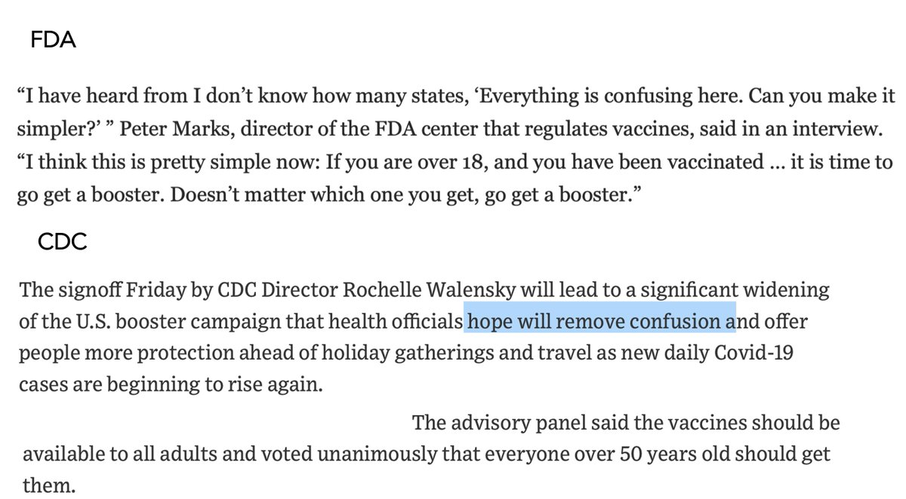
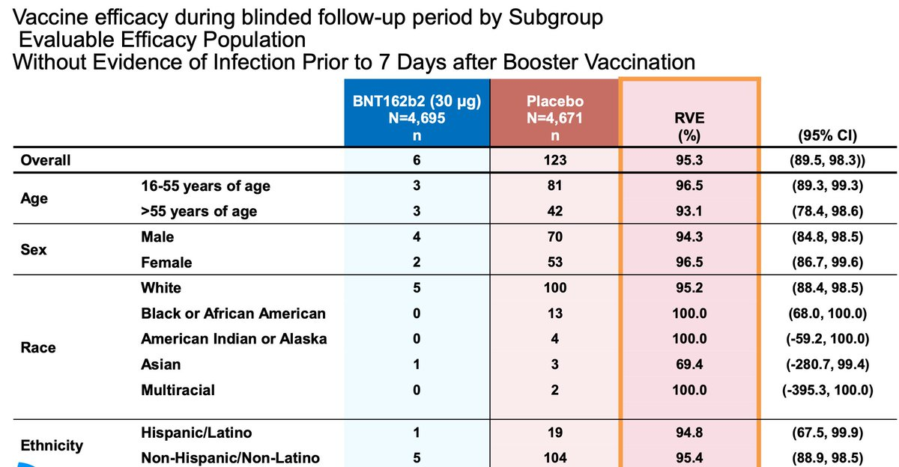
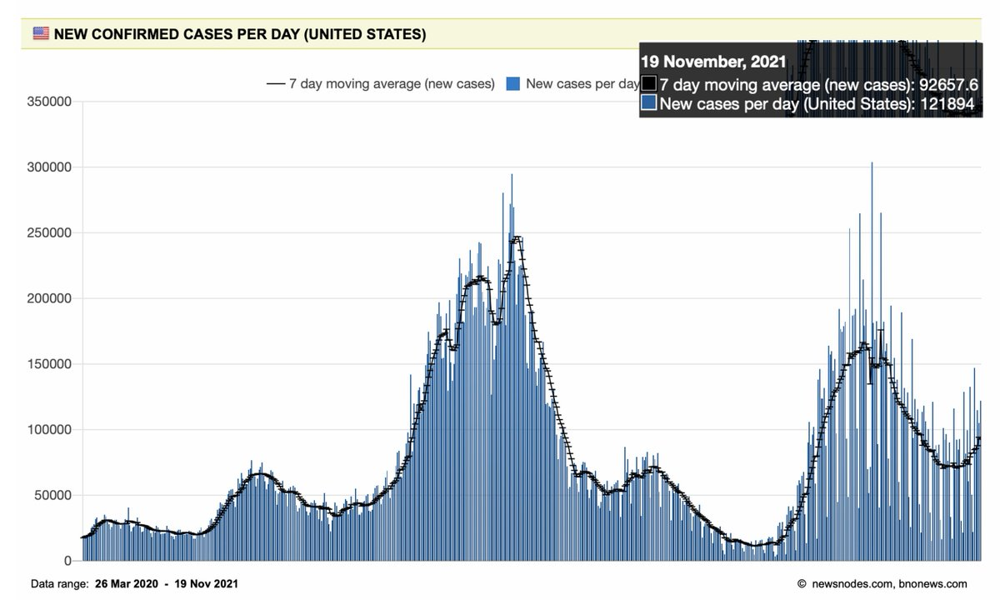
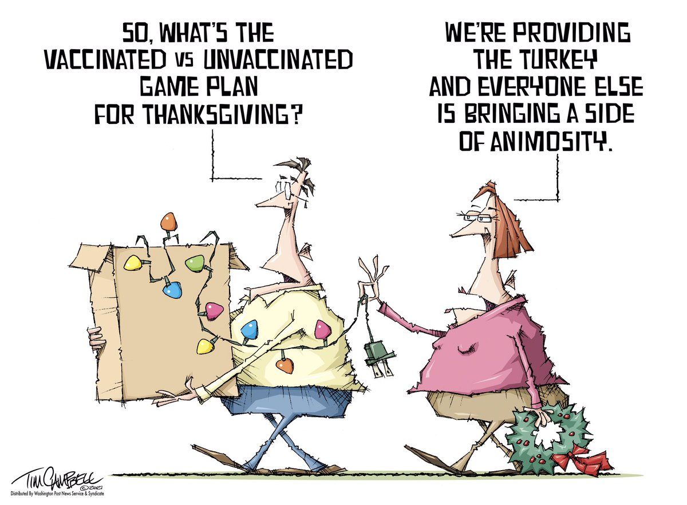
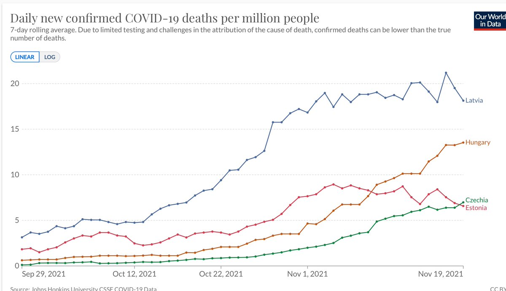
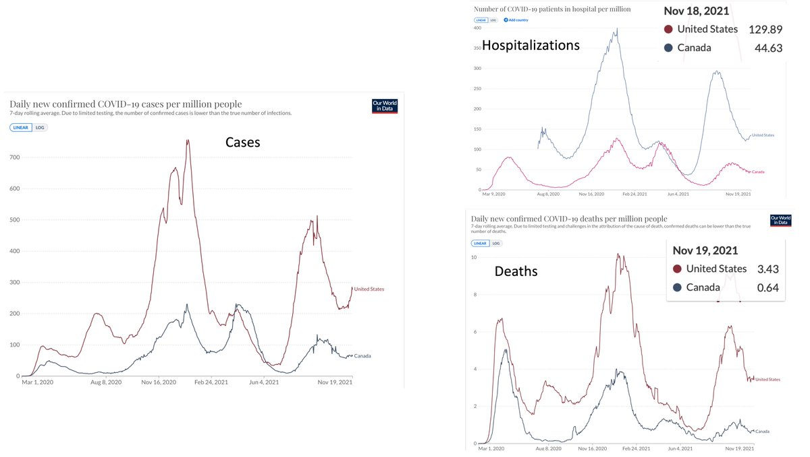
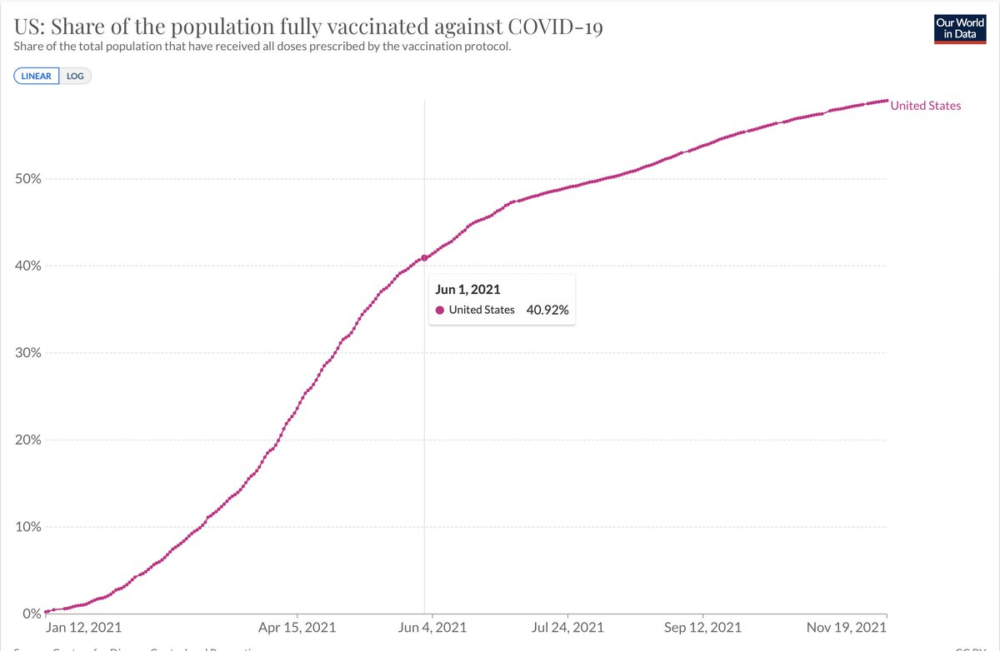
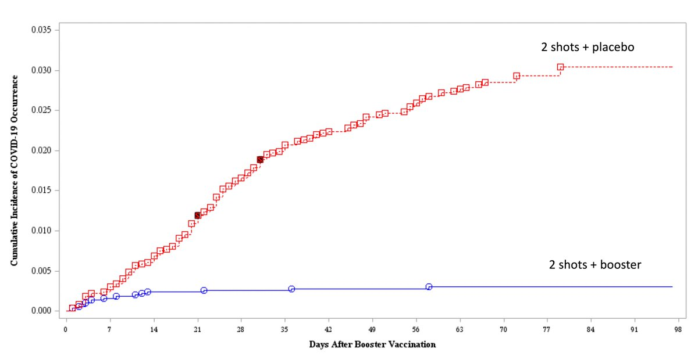
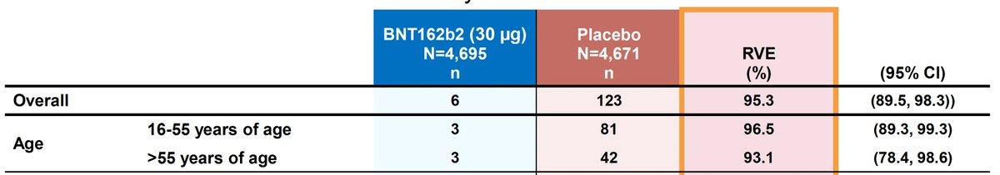
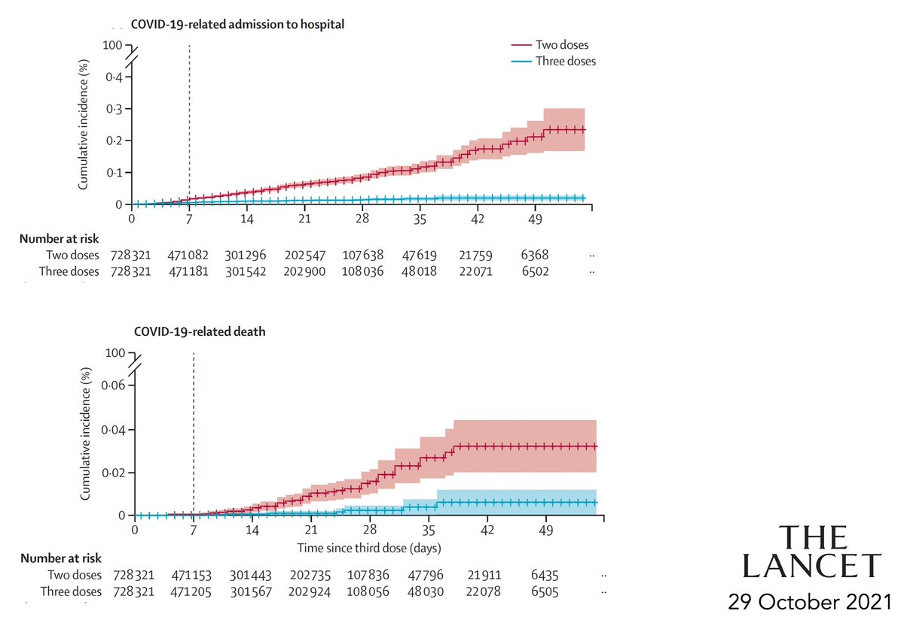

+++
title = "Tweets by Eric Topol Nov 20"
Summary = ""
tags = ["Twitter"]
category = "Twitter"
+++

---

<a href="https://twitter.com/erictopol/status/1461853953604214784" target="_blank" rel="noreferer">00:28 UCT</a>

I wish Dr. Hotez was also the Grand Marshal of the US pandemic. We’d be a lot better off. Thanks @PeterHotez for all you do https://twitter.com/houmayor/status/1461382067829231623

---

<a href="https://twitter.com/erictopol/status/1461863247527612420" target="_blank" rel="noreferer">01:05 UCT</a>

Boosters (3rd shots)
How to avoid confusion and align with the data
https://www.washingtonpost.com/health/2021/11/19/cdc-advisers-pfizer-moderna-booster-shots-adults/
or 
How to engender confusion and disregard the evidence 
https://www.wsj.com/articles/covid-19-boosters-from-pfizer-biontech-moderna-cleared-for-all-u-s-adults-11637329341?mod=hp_lead_pos3  @CDCDirector 

<a href="FEmUztKVcAM2-oF.jpg"  ></img></a>

---

<a href="https://twitter.com/erictopol/status/1461866425270738948" target="_blank" rel="noreferer">01:18 UCT</a>

Take a look at the data for people age 18- 55 in this, the only randomized trial (and N&gt;10,000) of a booster vs placebo. Let's make believe @CDCgov that only people &gt;age 50 "should" derive benefit vs symptomatic infections. The primary efficacy endpoint of all vaccine trials. 

<a href="FEmWfKPVcAAgy-r.jpg"  ></img></a>

---

<a href="https://twitter.com/erictopol/status/1461879917356802052" target="_blank" rel="noreferer">02:11 UCT</a>

The US 5th wave is going exponential
—122,000 new cases today, 7-day avg now &gt;92,000
—Added ~900 hospitalization, pushing -&gt;50,000
—And over 1,900 deaths
https://newsnodes.com/us 

<a href="FEmiM1gVIAQEMOy.jpg"  ></img></a>

---

<a href="https://twitter.com/erictopol/status/1462068111809544199" target="_blank" rel="noreferer">14:39 UCT</a>

Our covid times :-)
by @tc2oons 

<a href="FEpPJAmVcAIF3vM.jpg"  ></img></a>

---

<a href="https://twitter.com/erictopol/status/1462088692541968387" target="_blank" rel="noreferer">16:01 UCT</a>

The US has 59% of its population fully vaccinated. That's the same rate as 4 countries in Europe, currently with some of the highest fatality rates in the world.
@OurWorldInData 
(Latvia #3, Hungary #7) 

<a href="FEpgUHcVIAEkYNy.jpg"  ></img></a>

---

<a href="https://twitter.com/erictopol/status/1462127653129908231" target="_blank" rel="noreferer">18:36 UCT</a>

As the US begins its 5th wave with 59% vaccinated, Canada, with 76% vaccinated, shows no sign of increased spread
Death rate 🇺🇸 5.3-fold 🇨🇦
Hospitalizations 🇺🇸3-fold 🇨🇦
New cases 🇺🇸 &gt;4-fold🇨🇦
@OurWorldInData 

<a href="FEqEZfhVgAEa10A.jpg"  ></img></a>

---

<a href="https://twitter.com/erictopol/status/1462150362454847489" target="_blank" rel="noreferer">20:06 UCT</a>

The United States is not taking its 5th major wave seriously.
In November, new cases have increased 30% starting from the high level of 70,000/day. With that hospitalizations and deaths are increasing again.
We haven't taken heed from Europe 4 times
https://www.theguardian.com/commentisfree/2021/nov/12/covid-cases-surging-europe-america-denial /1

---

<a href="https://twitter.com/erictopol/status/1462150366716313603" target="_blank" rel="noreferer">20:06 UCT</a>

Our vaccination rate is dangerously low, putting &gt;100 million Americans (40% of 331 M) who are not vaccinated vulnerable. Then there's another 40% who were highly 💉💉protected, but are now out 6 months out and that protection has waned /2 

<a href="FEqVCsZVQAIY9t6.jpg"  ></img></a>

---

<a href="https://twitter.com/erictopol/status/1462150369266470913" target="_blank" rel="noreferer">20:06 UCT</a>

Instead of @CDCgov urging all people who've waned to get a 3rd shot, they deemed them "eligible." Only age 50+ "should" according to their recommendation. That is *not* what the data show and will further diminish our immunity wall /3

---

<a href="https://twitter.com/erictopol/status/1462150373158703104" target="_blank" rel="noreferer">20:06 UCT</a>

Let me review the data showing all adults 18+ benefit from a 3rd (booster) shot
There's the only randomized trial, data presented yesterday for the 1st time, of &gt;10,000 people with 95% efficacy for 3 vs 2 shots /4 

<a href="FEqWsYbVQAI8a0F.jpg"  ></img></a>

---

<a href="https://twitter.com/erictopol/status/1462150377952796672" target="_blank" rel="noreferer">20:06 UCT</a>

That trial enrolled adults of all ages. The efficacy vs symptomatic infections in the young s was just as high (numerically higher) as in people 55+ (96% and 93%, respectively) /5 

<a href="FEqXMRUUYAU2v6h.jpg"  ></img></a>

---

<a href="https://twitter.com/erictopol/status/1462150383485161472" target="_blank" rel="noreferer">20:06 UCT</a>

Then there's the @TheLancet study of &gt;728,000 people with 3 shots matched with 720,000 with 2 shots, across all ages, showing significant reduction of deaths, hospitalizations, and severe disease (not reviewed @CDCgov yesterday) 
https://www.thelancet.com/journals/lancet/article/PIIS0140-6736(21)02249-2/fulltext /6 

<a href="FEqYFucVUAMuKWw.jpg"  ></img></a>

---

<a href="https://twitter.com/erictopol/status/1462150387494838273" target="_blank" rel="noreferer">20:06 UCT</a>

Obviously vaccinations (both primary and 3rd shots) are not the only strategy. There's lack of almost any mitigation, and multiple tactics that could be used as reviewed in the @Guardian piece link, top of thread. /8

---

<a href="https://twitter.com/erictopol/status/1462150385716531201" target="_blank" rel="noreferer">20:06 UCT</a>

By not promoting boosters among the fully vaccinated for all adults, the US is actually going into further attrition of protection. The net number of newly vaccinated people each day is markedly exceeded by those who have waned and not boosted. /7

---

<a href="https://twitter.com/erictopol/status/1462176395392475137" target="_blank" rel="noreferer">21:49 UCT</a>

RT @myrabatchelder: @EricTopol @OurWorldInData Canada is doing more than just vaccinating! Please mention their mask mandates and other eff…

