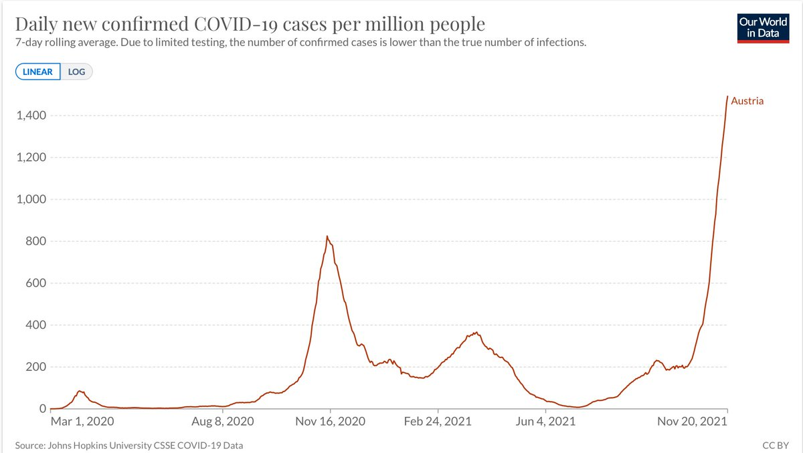
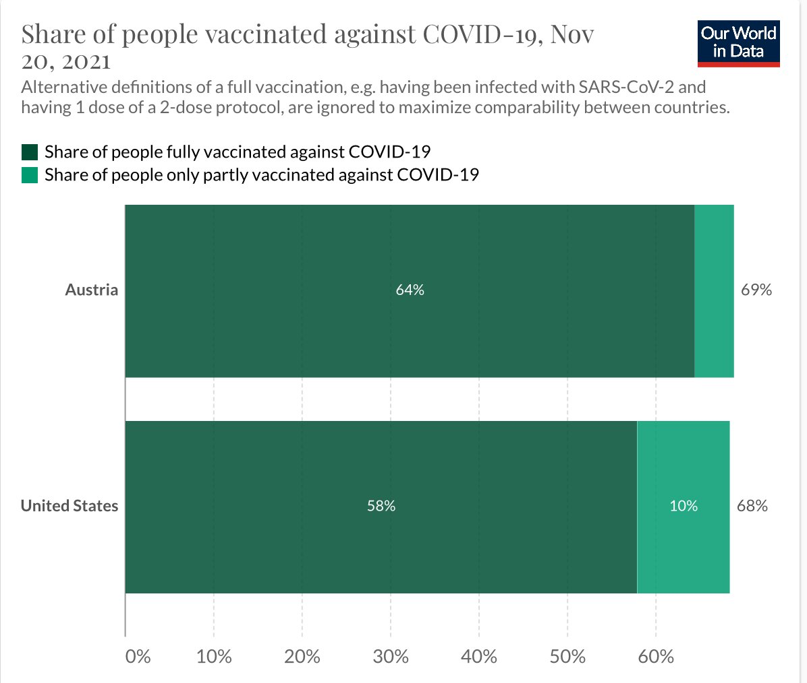
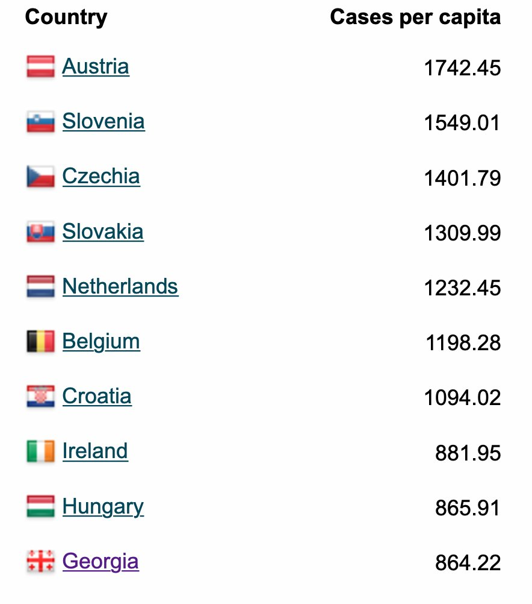
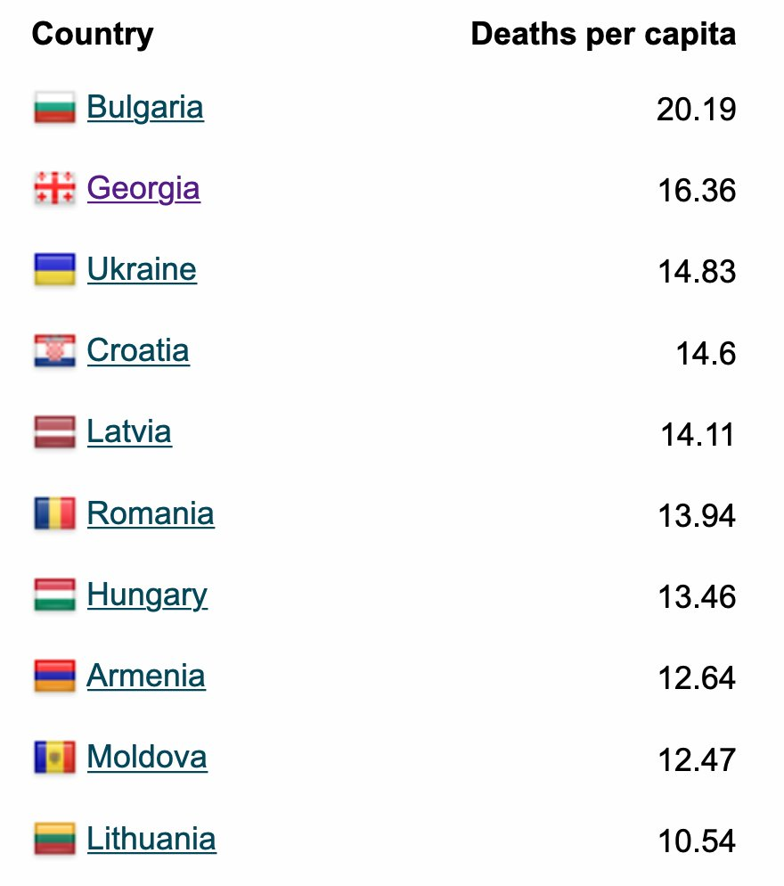
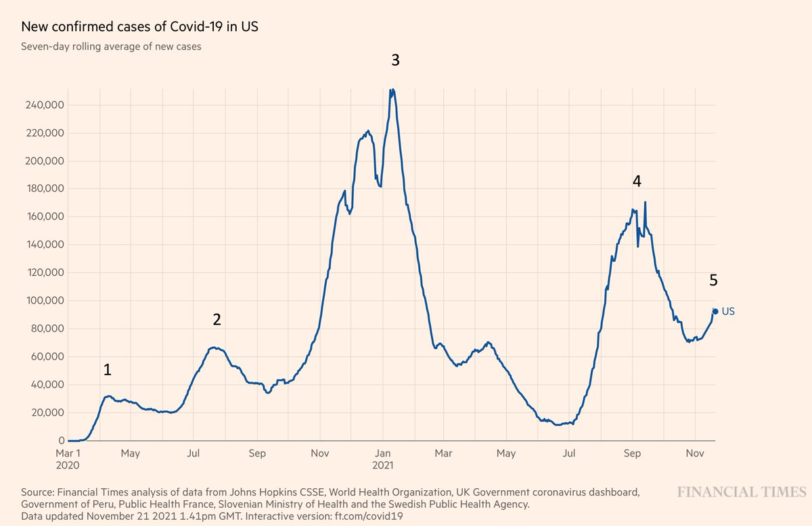
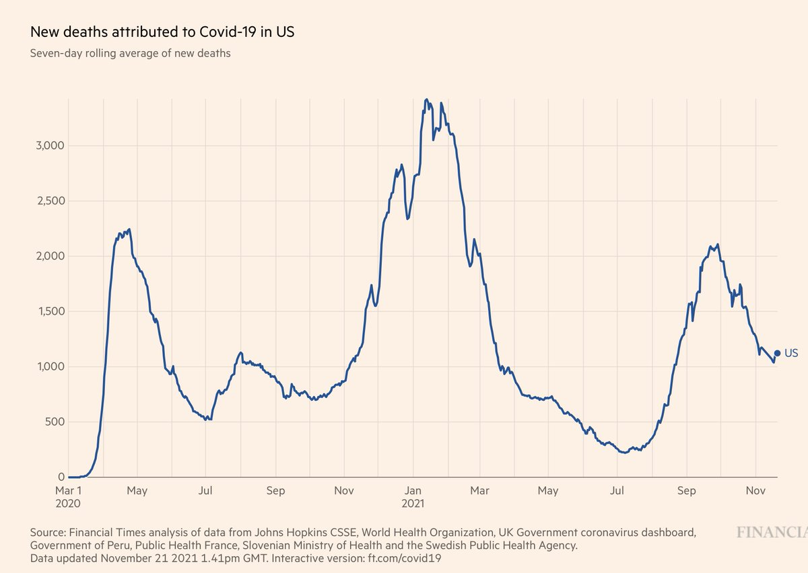
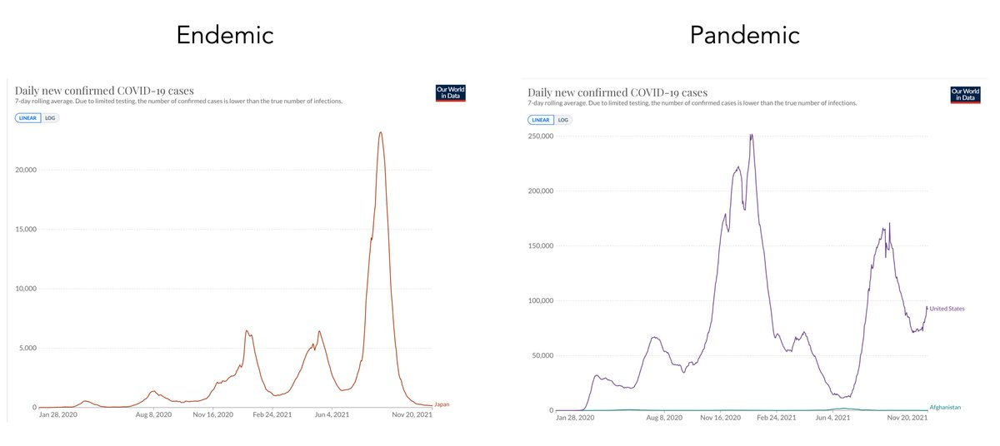
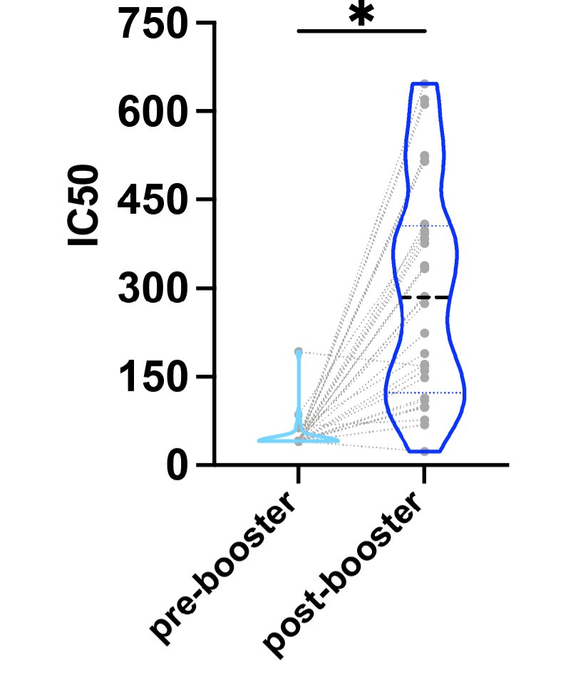
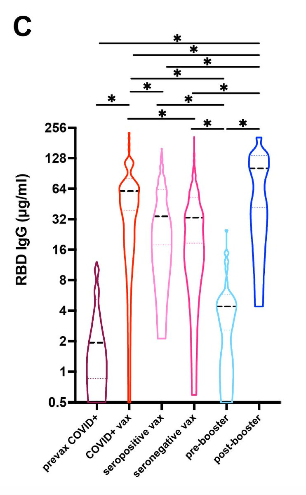

+++
title = "Tweets by Eric Topol Nov 21"
Summary = ""
tags = ["Twitter"]
category = "Twitter"
+++

---

<a href="https://twitter.com/erictopol/status/1462317887423541248" target="_blank" rel="noreferer">07:12 UCT</a>

RT @Logik_ist_geil: @EricTopol A disaster is happening here in Austria (one of the best health systems in the world), please take the wave…

---

<a href="https://twitter.com/erictopol/status/1462450434698665985" target="_blank" rel="noreferer">15:58 UCT</a>

How could Austria, with a fully vaccinated rate of 64%, have the highest Covid cases per capita in the world?
"Austria’s problem... is the large number of vaccine refuseniks nourished with conspiracy theories then amplified by far-right political parties."
https://www.ft.com/content/1b164c18-737f-4b82-b40d-e957b545e38e 

<a href="FEuqm4JVkAoi-lH.jpg"  ></img></a>

---

<a href="https://twitter.com/erictopol/status/1462451635234377734" target="_blank" rel="noreferer">16:03 UCT</a>

In comparison to 64%..... 

<a href="FEurr1LVUAAYAmR.jpg"  ></img></a>

---

<a href="https://twitter.com/erictopol/status/1462453982928900102" target="_blank" rel="noreferer">16:12 UCT</a>

Top 10 in the world for cases and deaths, all in Europe
https://newsnodes.com/worldmonitor/
The differences in the list (for high death rates) is largely accounted for by the low rate of vaccination rates in several Eastern and Central European countries 

<a href="FEutW9IVkAAdoJK.jpg"  ></img></a><a href="FEutZukVgAEfbfa.jpg"  ></img></a>

---

<a href="https://twitter.com/erictopol/status/1462480325154467842" target="_blank" rel="noreferer">17:57 UCT</a>

That over 3 million children age 5-11 in the US have been vaccinated without a reported case of myocarditis so far is encouraging

---

<a href="https://twitter.com/erictopol/status/1462493892369022979" target="_blank" rel="noreferer">18:51 UCT</a>

How to generate a new surge?
Have 40% of Americans not fully vaccinated, and another 40% vaccinated but waned (past 6 months).  https://twitter.com/EricTopol/status/1462150362454847489

<a href="FEvQTLjVUAE7LaV.jpg"  ></img></a><a href="FEvSI1nVQAIQHlK.jpg"  ></img></a>

---

<a href="https://twitter.com/erictopol/status/1462507006552514560" target="_blank" rel="noreferer">19:43 UCT</a>

What's the difference between endemic and pandemic? 

<a href="FEveVQbVUAA3gyE.jpg"  ></img></a>

---

<a href="https://twitter.com/erictopol/status/1462550485135618048" target="_blank" rel="noreferer">22:36 UCT</a>

The striking booster (3rd dose) effect of mRNA vaccines on neutralizing antibodies vs Delta, and in people with prior Covid who were vaccinated https://www.medrxiv.org/content/10.1101/2021.11.19.21266555v1 

<a href="FEwDCERUYAcHr96.jpg"  ></img></a>

---

<a href="https://twitter.com/erictopol/status/1462550488994377729" target="_blank" rel="noreferer">22:36 UCT</a>

"These data support the use of boosters to prevent breakthrough infections and suggest that antibody-mediated immunity may last longer after the second vaccine dose" 

<a href="FEwFDLDUUAEemjm.jpg"  ></img></a>