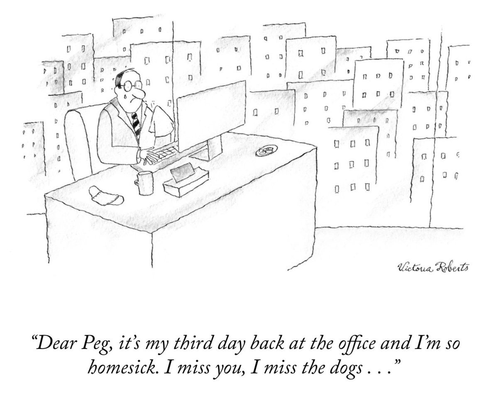
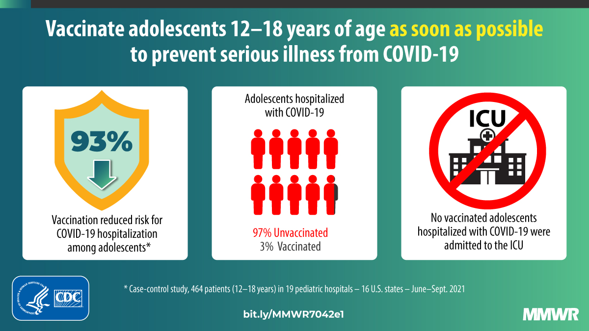
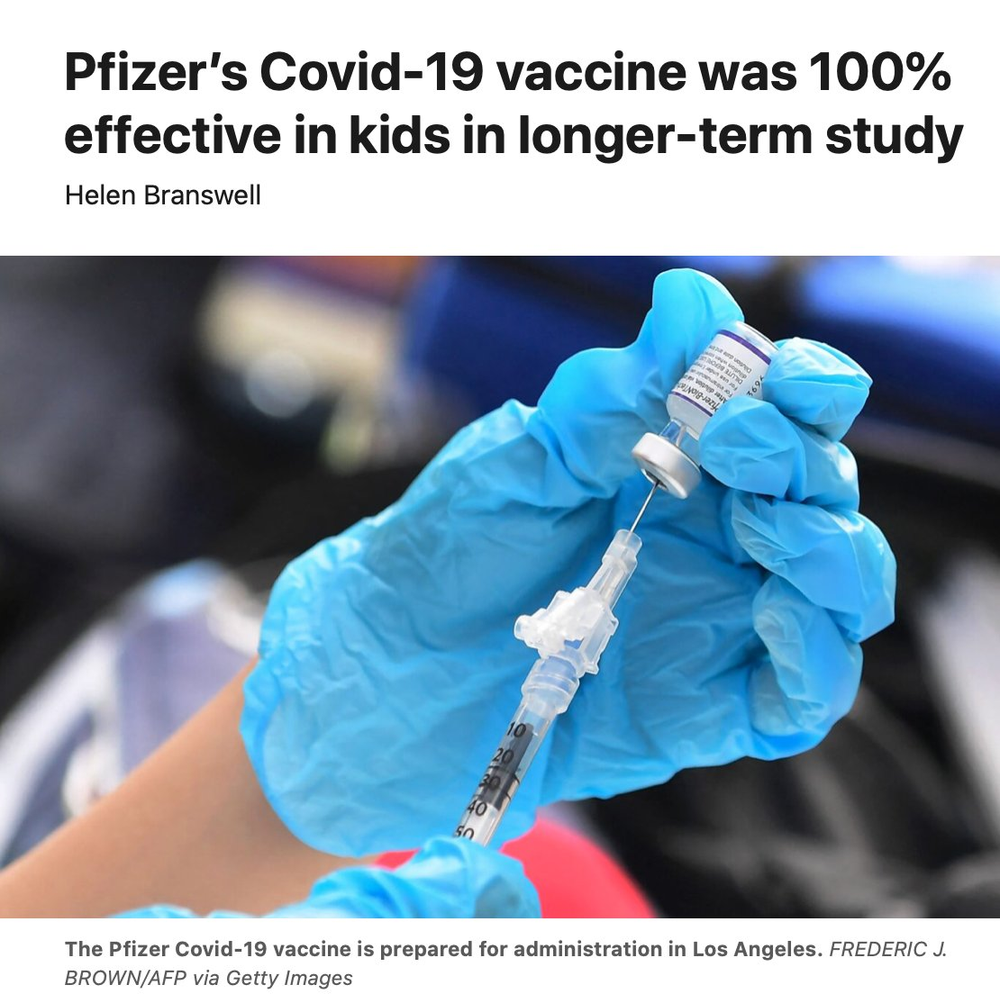
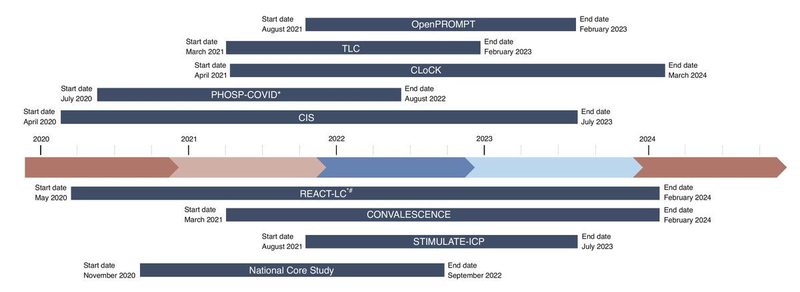
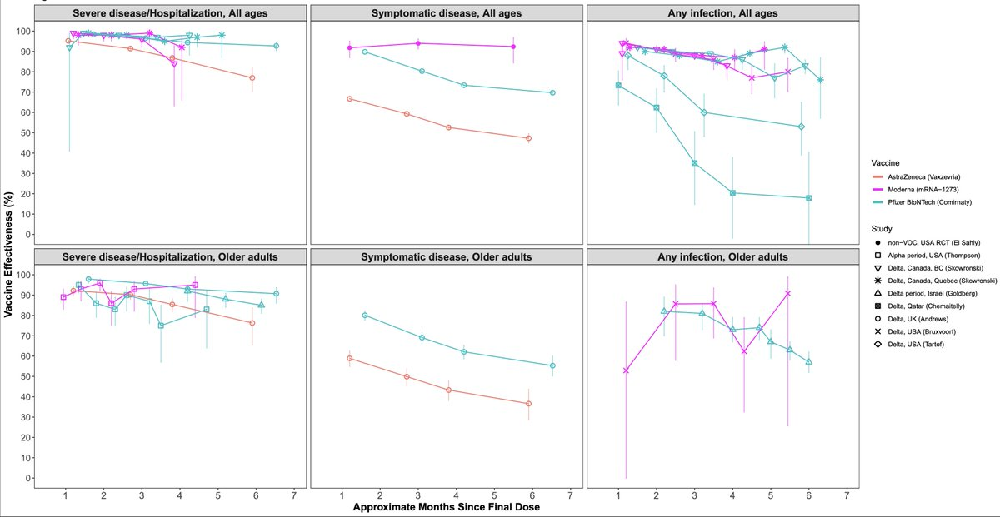
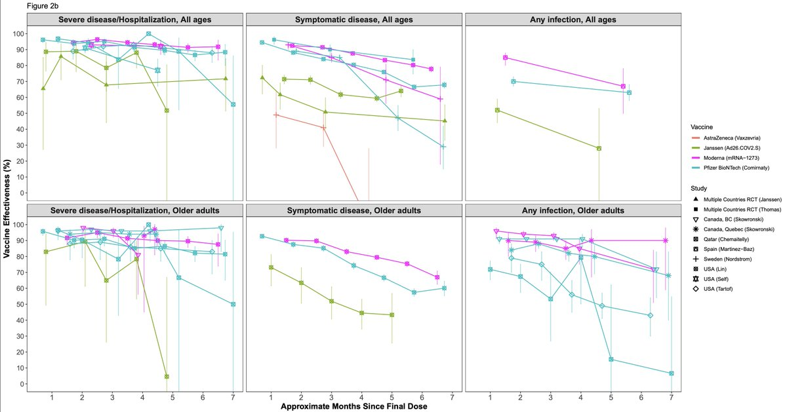
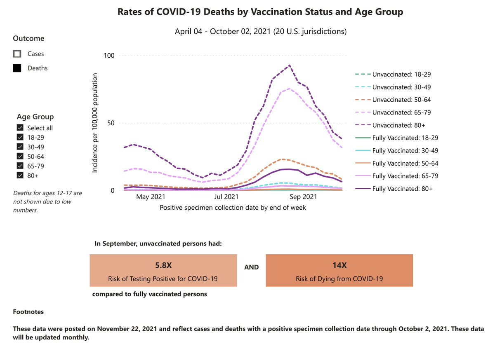
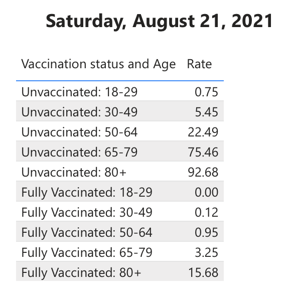
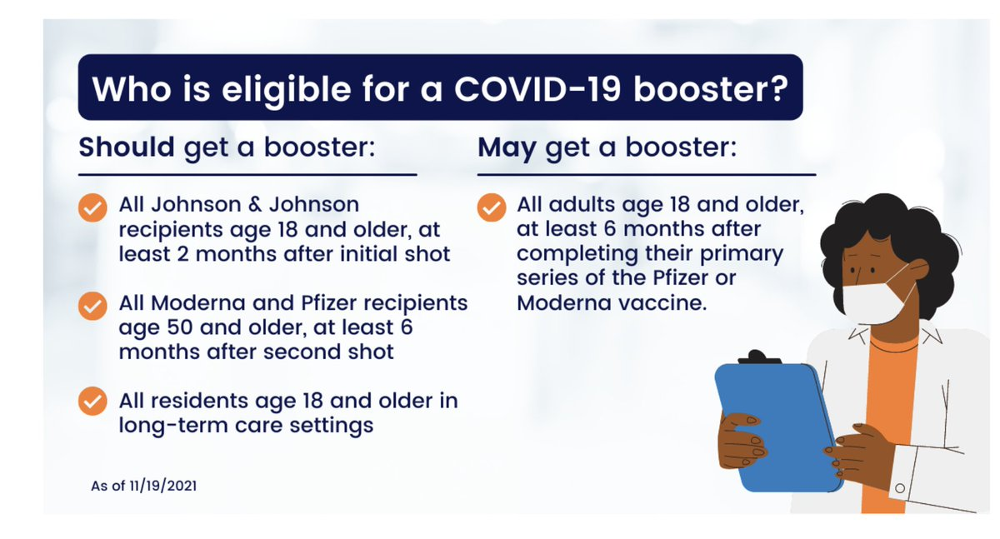

+++
title = "Tweets by Eric Topol Nov 22"
Summary = ""
tags = ["Twitter"]
category = "Twitter"
+++

---

<a href="https://twitter.com/erictopol/status/1462588800383664128" target="_blank" rel="noreferer">01:08 UCT</a>

RT @leonidkruglyak: @AnnikaKirstenR @EricTopol that number would mean that the risk for those boosted is 20 times lower than for those vacc…

---

<a href="https://twitter.com/erictopol/status/1462790689897336838" target="_blank" rel="noreferer">14:30 UCT</a>

Our covid times :-) 

<a href="FEzgVb1UYAYYEBS.jpg"  ></img></a>

---

<a href="https://twitter.com/erictopol/status/1462793460138725378" target="_blank" rel="noreferer">14:41 UCT</a>

So if the 93% vaccine effectiveness against hospitalizations for teens wasn't enough, new randomized trial results today with 100% vaccine efficacy vs infections
https://www.cdc.gov/mmwr/volumes/70/wr/mm7042e1.htm?s_cid=mm7042e1_w @CDCMMWR
https://www.statnews.com/2021/11/22/pfizers-covid-19-vaccine-was-100-effective-in-in-kids-in-longer-term-study/ @HelenBranswell @statnews 

<a href="FEziJHzVQAI0dbT.jpg"  ></img></a><a href="FEzifhxUcAUt0Vj.jpg"  ></img></a>

---

<a href="https://twitter.com/erictopol/status/1462817334645592064" target="_blank" rel="noreferer">16:16 UCT</a>

The UK is fully committed to understanding #LongCovid 
"The research community have joined patient researchers in their efforts to improve understanding of long COVID, including its symptoms, health impacts, pathophysiology and treatments"
https://www.nature.com/articles/s41591-021-01591-4 

<a href="FEz4HeMUUAAWDAX.jpg"  ></img></a>

---

<a href="https://twitter.com/erictopol/status/1462861780997210113" target="_blank" rel="noreferer">19:13 UCT</a>

A systematic review of 14 studies of vaccine effectiveness (VE) waning between 1-6 months
https://papers.ssrn.com/sol3/papers.cfm?abstract_id=3961378
For symptomatic disease, VE decreased by 25 per cent points for all ages, 32 per cent points for older individuals 

<a href="FE0gfi3UUAMvDfG.jpg"  ></img></a>

---

<a href="https://twitter.com/erictopol/status/1462865002914668544" target="_blank" rel="noreferer">19:26 UCT</a>

Graph by study (multiple variants) whereas above graph was categorized by variant (Delta, all but one) 

<a href="FE0jnzPUYAEtoi8.jpg"  ></img></a>

---

<a href="https://twitter.com/erictopol/status/1462871656699887621" target="_blank" rel="noreferer">19:52 UCT</a>

Today @CDCgov updated their website for cases and deaths by vaccine status, vaccine, and age; national data for 36% of the US population 
https://covid.cdc.gov/covid-data-tracker/#rates-by-vaccine-status
Unvaccinated: 14-fold increased risk of death, 5.8-fold risk of infection, compared with fully vaccinated 

<a href="FE0pGvUVkAASHSk.jpg"  ></img></a>

---

<a href="https://twitter.com/erictopol/status/1462875529044889601" target="_blank" rel="noreferer">20:07 UCT</a>

During the summer Delta wave, also representing &gt; 6 months from first tier of vaccinations, the breakthrough rate for cases and deaths among people 80+ is notable. At peak, deaths by age group and vaccination status shown here 

<a href="FE0s7KAUUAA6tI-.png"  ></img></a>

---

<a href="https://twitter.com/erictopol/status/1462900035650084865" target="_blank" rel="noreferer">21:45 UCT</a>

This is what @CDCgov is putting out. It's wrong. 
Based on the data, reviewed below, all adults should get a booster.

(6 month after completing their primary Pfizer or Moderna vaccine)  https://twitter.com/EricTopol/status/1461810844854018050

<a href="FE1DatMVcAMmYgs.jpg"  ></img></a>

---

<a href="https://twitter.com/erictopol/status/1462910304979865604" target="_blank" rel="noreferer">22:26 UCT</a>

RT @ashishkjha: Booster eligibility can still be confusing

So here's my guide to help you decide whether you should get a booster 6 months…

