+++
title = "Tweets by Eric Topol Nov 23"
Summary = ""
tags = ["Twitter"]
category = "Twitter"
+++

---

<a href="https://twitter.com/erictopol/status/1462937588319211521" target="_blank" rel="noreferer">00:14 UCT</a>

Exclusion criteria for vaccinated adults who will benefit from a booster 

<a href="FE1l8o-UUAYgmiZ.jpg"  >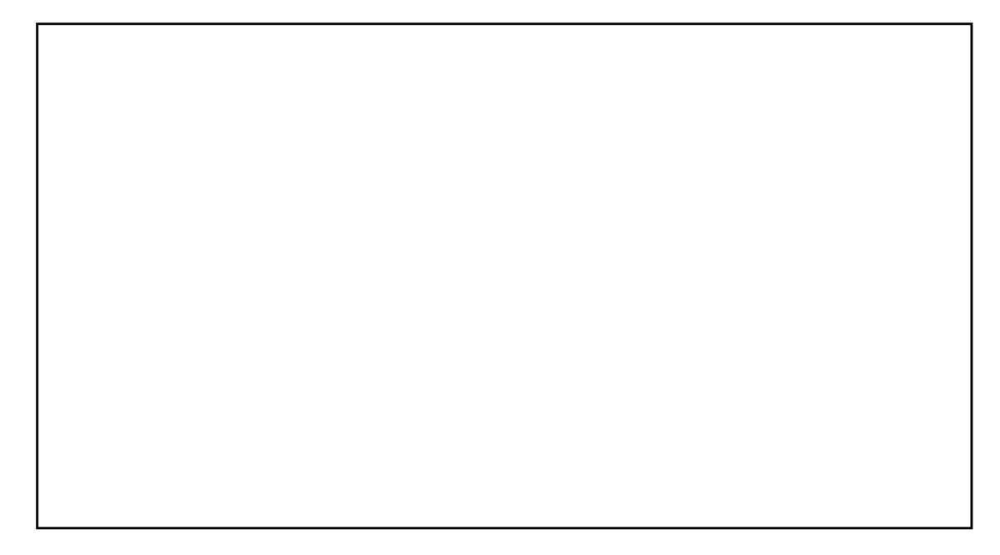</img></a>

---

<a href="https://twitter.com/erictopol/status/1462945437116026880" target="_blank" rel="noreferer">00:45 UCT</a>

Data points that ought to sound alarms......so much of this is preventable.
158,000 new cases reported in the US today, along with over 1,400 deaths
The 7-day average will soon exceed 100,000 new cases/day. Hospitalizations increased, very close to 50,000
https://newsnodes.com/us 

<a href="FE1s3CcVgAI11TE.jpg"  >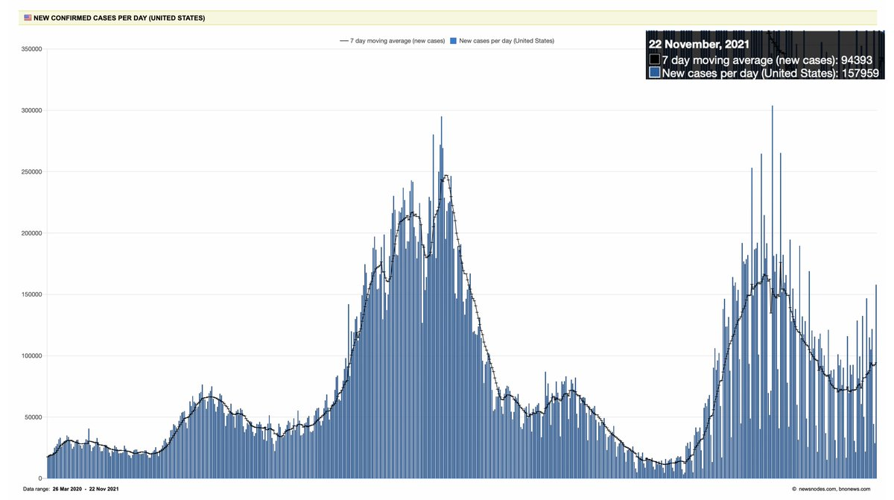</img></a>

---

<a href="https://twitter.com/erictopol/status/1462960939179786243" target="_blank" rel="noreferer">01:47 UCT</a>

From the month of August to the month of September in this US national dataset for about 33% of Americans:
—The risk of unvaccinated for getting Covid infections was consistent at ~6-fold
—The risk of unvaccinated for death increased from 11 to 14-fold 

<a href="FE16CuOVkAcq-xc.jpg"  >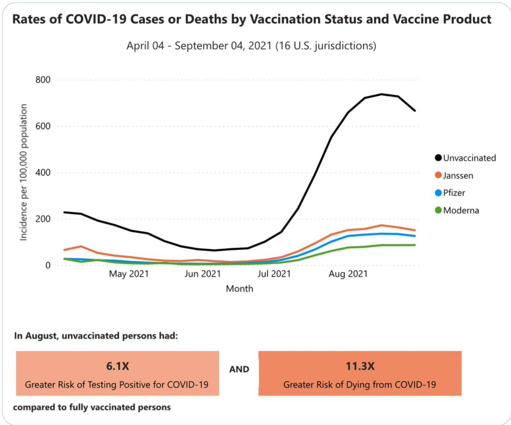</img></a><a href="FE16OeKVQAEH_sW.jpg"  >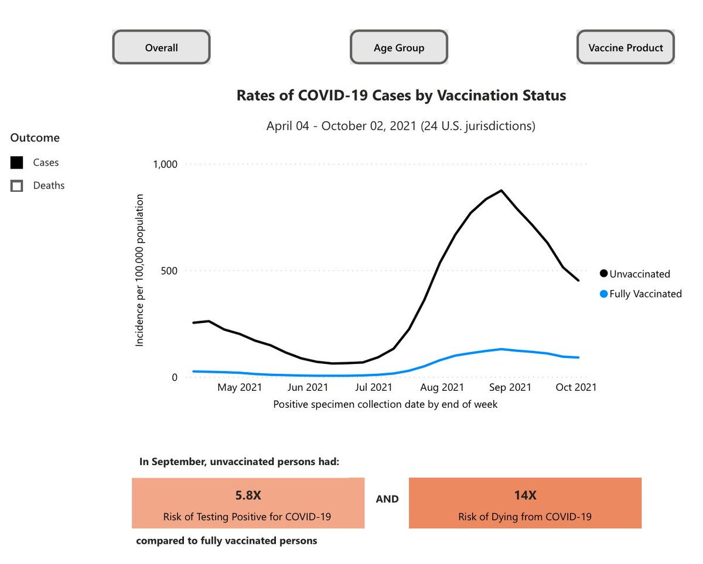</img></a>

---

<a href="https://twitter.com/erictopol/status/1462972901456375810" target="_blank" rel="noreferer">02:34 UCT</a>

RT @xkcdComic: Bayes' Theorem https://xkcd.com/2545/ https://m.xkcd.com/2545/ https://twitter.com/xkcdComic/status/1462895704280481793

<a href="FE0_5CaVkAEYu6b.png"  >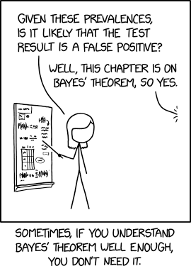</img></a>

---

<a href="https://twitter.com/erictopol/status/1462980681856815106" target="_blank" rel="noreferer">03:05 UCT</a>

@patrickc The independent data and safety monitoring boards stopped the trials because of overwhelming efficacy, deciding that it would no longer be ethical to give a placebo given the interim findings

---

<a href="https://twitter.com/erictopol/status/1463159353230479363" target="_blank" rel="noreferer">14:55 UCT</a>

This will go down as one of the worst approvals in the history of the @US_FDA 
https://www.nytimes.com/2021/11/22/health/aduhelm-death-safety.html?searchResultPosition=1 by @PamBelluck  https://twitter.com/EricTopol/status/1409896838350598146

<a href="FE4vkRvWUB0iqrs.jpg"  >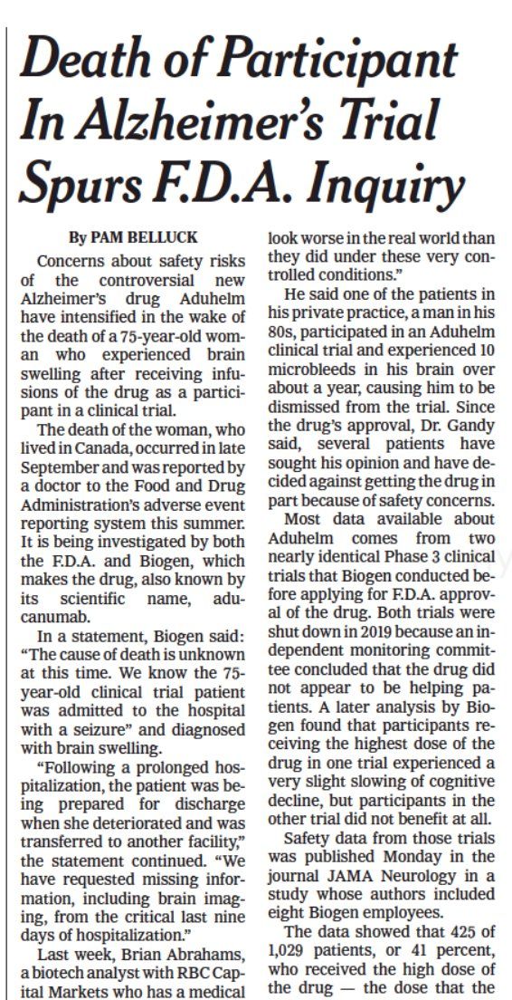</img></a>

---

<a href="https://twitter.com/erictopol/status/1463160910411976723" target="_blank" rel="noreferer">15:01 UCT</a>

That's right
https://www.wsj.com/articles/yes-get-a-covid-booster-vaccine-third-dose-shot-safe-effective-side-effects-11637617768 by @DrMarcSiegel 

<a href="FE4wzvVXMAEIwCX.jpg"  >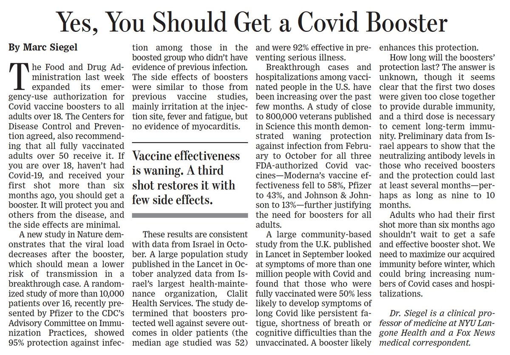</img></a>

---

<a href="https://twitter.com/erictopol/status/1463164627945152532" target="_blank" rel="noreferer">15:16 UCT</a>

Just published @ScienceMagazine 
The remarkably tight correlation of neutralizing antibody levels with protection from an mRNA vaccine (@moderna_tx)
https://www.science.org/doi/10.1126/science.abm3425
Titer/Vacccine efficacy
10/78%
100/91%
1000/96% 

<a href="FE4zaxmXEBIC-VL.jpg"  >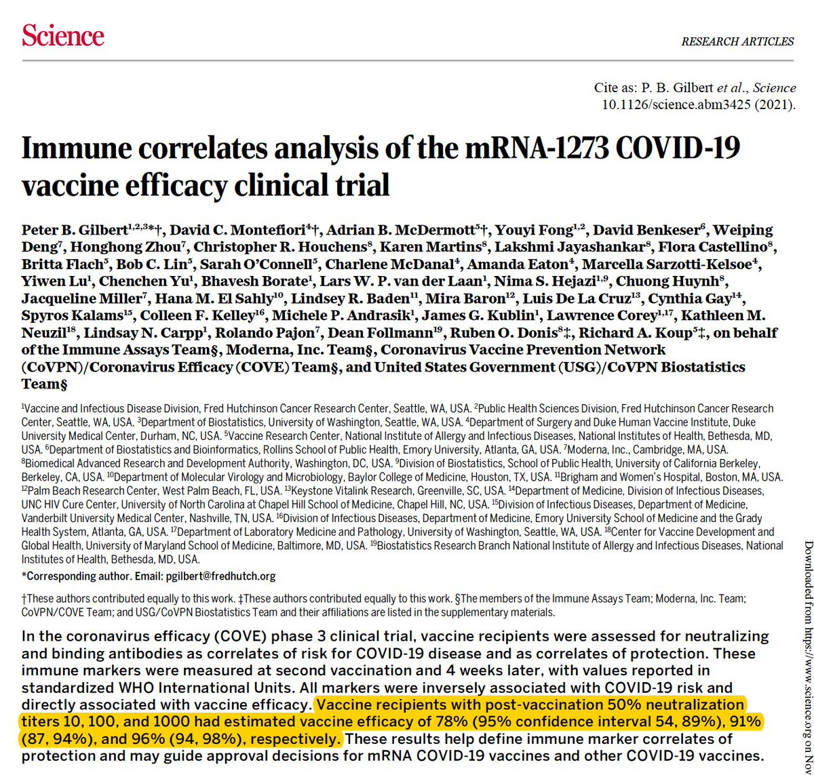</img></a><a href="FE4zcxBXIAYj02k.jpg"  >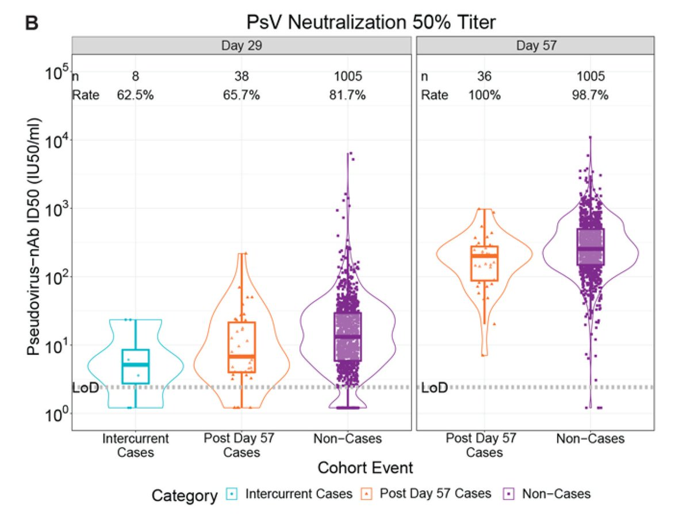</img></a>

---

<a href="https://twitter.com/erictopol/status/1463180808647151620" target="_blank" rel="noreferer">16:21 UCT</a>

These are important data, fully concordant with 2 recent studies, reinforcing why boosters are essential and why it is likely that a 3rd dose will be long lasting (1 year or longer)
@LancetMicrobe all vaccines, all variants 
https://www.thelancet.com/journals/lanmic/article/PIIS2666-5247(21)00267-6/fulltext 

<a href="FE5BkfkVkAIElo1.jpg"  >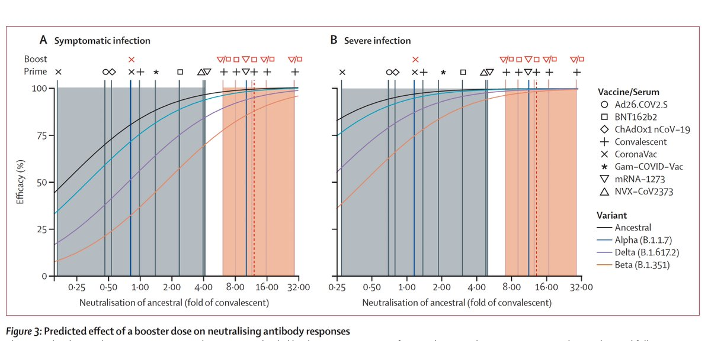</img></a>

---

<a href="https://twitter.com/erictopol/status/1463180814322049025" target="_blank" rel="noreferer">16:21 UCT</a>

A 25-50 fold increase in levels of neutralizing antibody of the booster (3rd dose) compared with the 2nd, and more rapidly generated
https://www.medrxiv.org/content/10.1101/2021.11.19.21266555v1 

<a href="FE5DF6sVUAESgS0.jpg"  >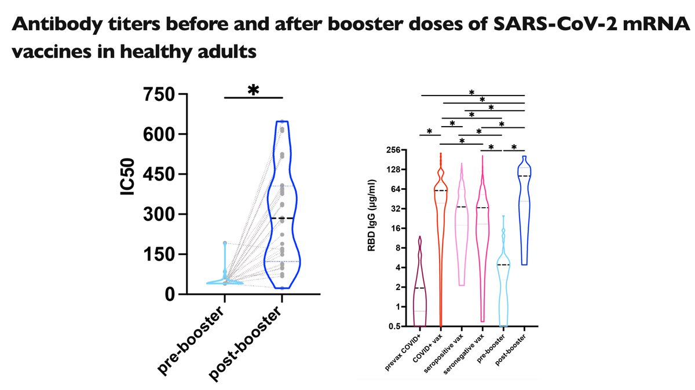</img></a>

---

<a href="https://twitter.com/erictopol/status/1463183133164011521" target="_blank" rel="noreferer">16:30 UCT</a>

Just out @Nature 
A unique peptide T-cell directed vaccine vs Covid that induced potent, broad cellular immunity against all variants in a Phase 1 clinical trial
https://www.nature.com/articles/s41586-021-04232-5
May be especially useful in immunocompromised people 

<a href="FE5Ez4SVkAA4Wun.jpg"  >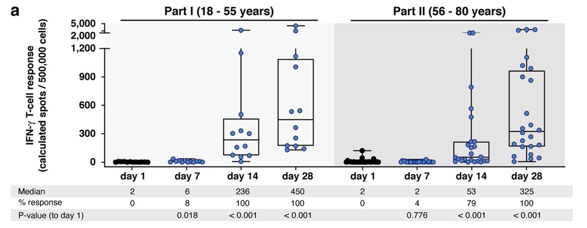</img></a>

---

<a href="https://twitter.com/erictopol/status/1463184442701201409" target="_blank" rel="noreferer">16:35 UCT</a>

Another Figure from the @LanctMicrobe paper that tells this story 

<a href="FE5GbrSVkAcViln.jpg"  >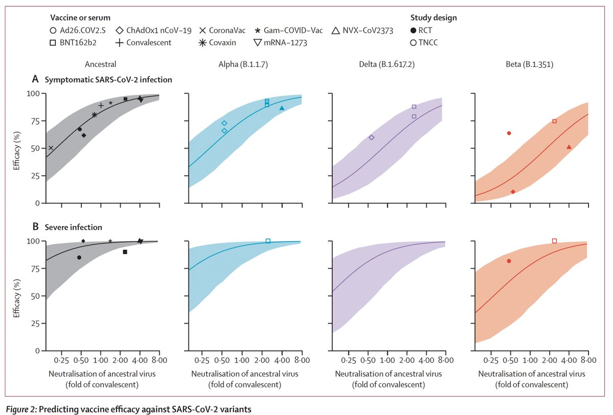</img></a>

---

<a href="https://twitter.com/erictopol/status/1463185390622240776" target="_blank" rel="noreferer">16:39 UCT</a>

How bad can it get in Europe?
This bad
@OurWorldInData 
(Keep ignoring the signs in🇺🇸) 

<a href="FE5HACvVgAIZPHw.jpg"  >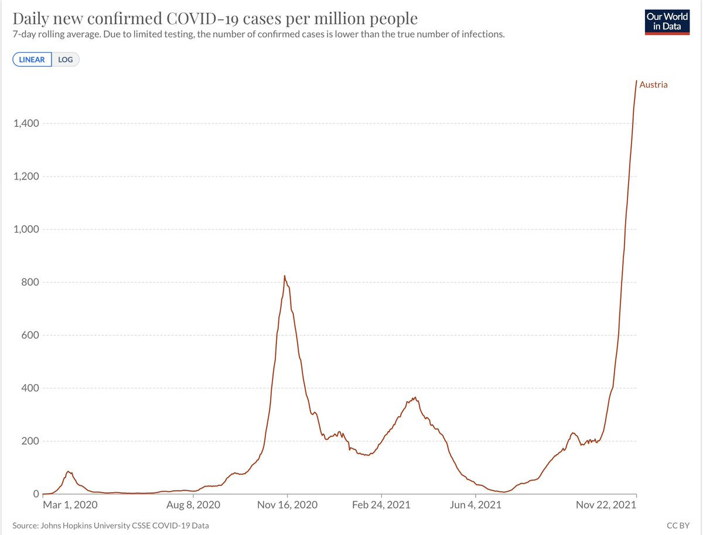</img></a>

---

<a href="https://twitter.com/erictopol/status/1463188999548268544" target="_blank" rel="noreferer">16:53 UCT</a>

More today on why the 6-foot rule belongs 6-feet under
https://aip.scitation.org/doi/10.1063/5.0070528

---

<a href="https://twitter.com/erictopol/status/1463224897925042177" target="_blank" rel="noreferer">19:16 UCT</a>

New results for Covaxin vaccine
The recent, large, Phase 3 trial showed efficacy of 78% vs symptomatic infections, 65% vs Delta 
https://www.thelancet.com/journals/lancet/article/PIIS0140-6736(21)02014-6/fulltext @TheLancet 
New report today on effectiveness (all Delta) = 50%
https://www.thelancet.com/journals/laninf/article/PIIS1473-3099(21)00674-5/fulltext?utm_campaign=lancetcovid21&utm_content=188584276&utm_medium=social&utm_source=twitter&hss_channel=tw-27013292 @TheLancetInfDis 

<a href="FE5qpYFVIAQEh1V.jpg"  >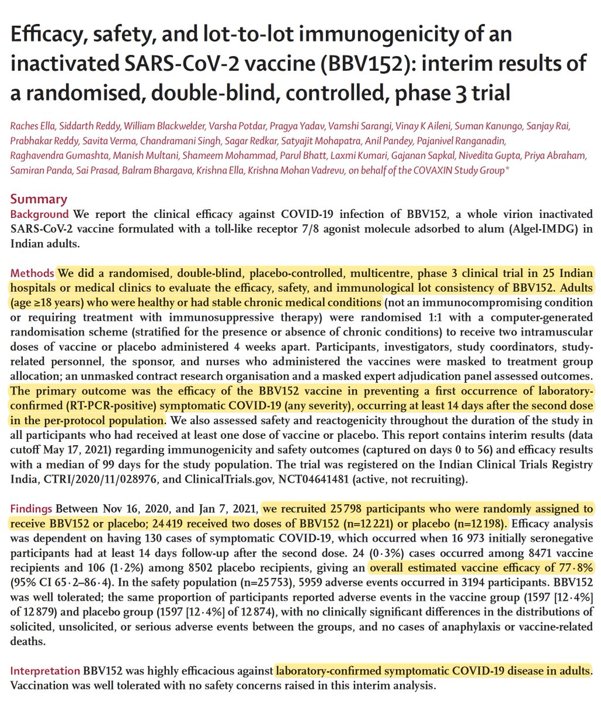</img></a><a href="FE5qrR-UcAI94NT.jpg"  >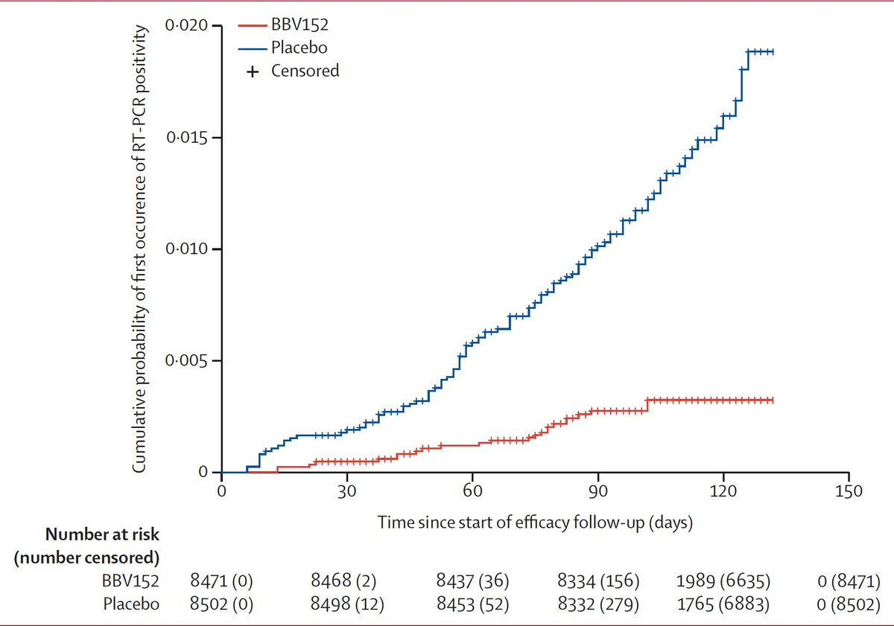</img></a><a href="FE5qsq_VEAApM8f.jpg"  >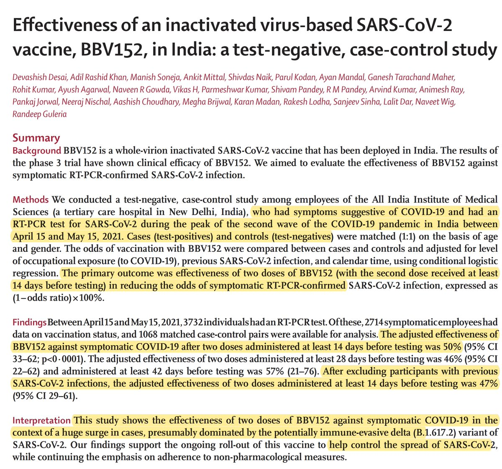</img></a>

---

<a href="https://twitter.com/erictopol/status/1463228360167870464" target="_blank" rel="noreferer">19:30 UCT</a>

The current Delta wave in Europe
#VaccinesWork well in countries with high vaxx rates to suppress deaths, despite some with new peaks in infections 🇳🇱🇧🇪🇬🇧🇮🇪🇩🇪🇨🇭🇪🇸🇵🇹 🇮🇹🇫🇷
Countries with low vaccination rates are not seeing this uncoupling 🇨🇿🇬🇷🇵🇱🇷🇴
https://www.economist.com/graphic-detail/tracking-coronavirus-across-europe 

<a href="FE5sgLHVEAUXVyK.jpg"  >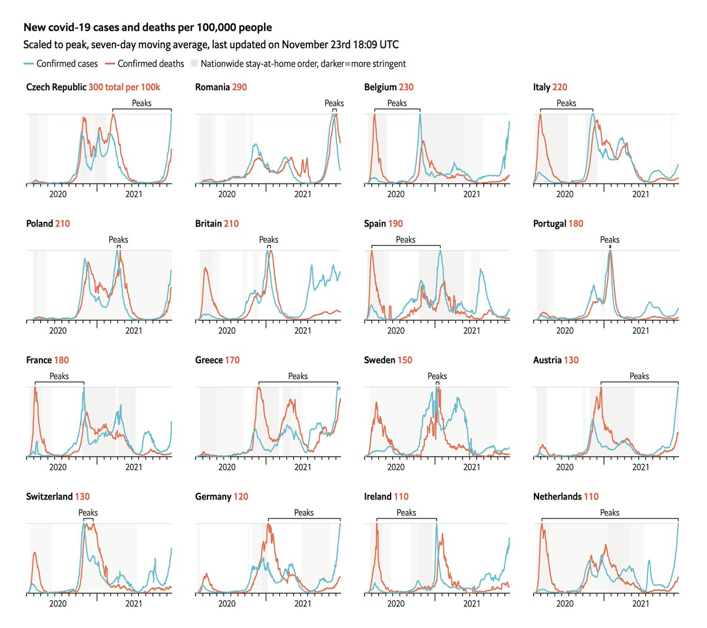</img></a>

---

<a href="https://twitter.com/erictopol/status/1463231651358539781" target="_blank" rel="noreferer">19:43 UCT</a>

@ramav_matsci Thanks. It’s not easy!

---

<a href="https://twitter.com/erictopol/status/1463263182403760128" target="_blank" rel="noreferer">21:48 UCT</a>

In patients with multiple myeloma the incidence of vaccine breakthrough infections resulting in hospitalization (as occurred with Colin Powell) is considerably higher, nearly 16-fold, in a @JAMANetworkOpen report today
https://jamanetwork.com/journals/jamanetworkopen/fullarticle/2786470 

<a href="FE6Ne9fUUAQBuVO.jpg"  >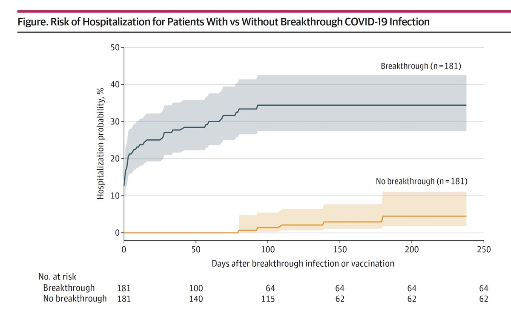</img></a>

---

<a href="https://twitter.com/erictopol/status/1463267673697968135" target="_blank" rel="noreferer">22:06 UCT</a>

Outstanding new @nature feature on #LongCovid and vaccination reviewing all of the current data, and uncertainty as to the magnitude of impact 
https://www.nature.com/articles/d41586-021-03495-2  by @heidiledford w/ @VirusesImmunity @Dr2NisreenAlwan @PutrinoLab @Survivor_Corps 

<a href="FE6RNk9VkAE2TyX.jpg"  >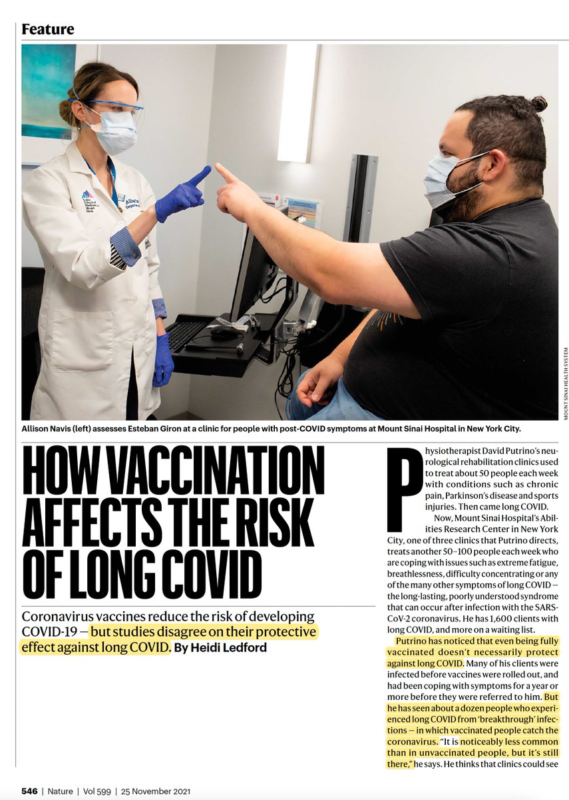</img></a><a href="FE6RO6hVIAITf0u.jpg"  >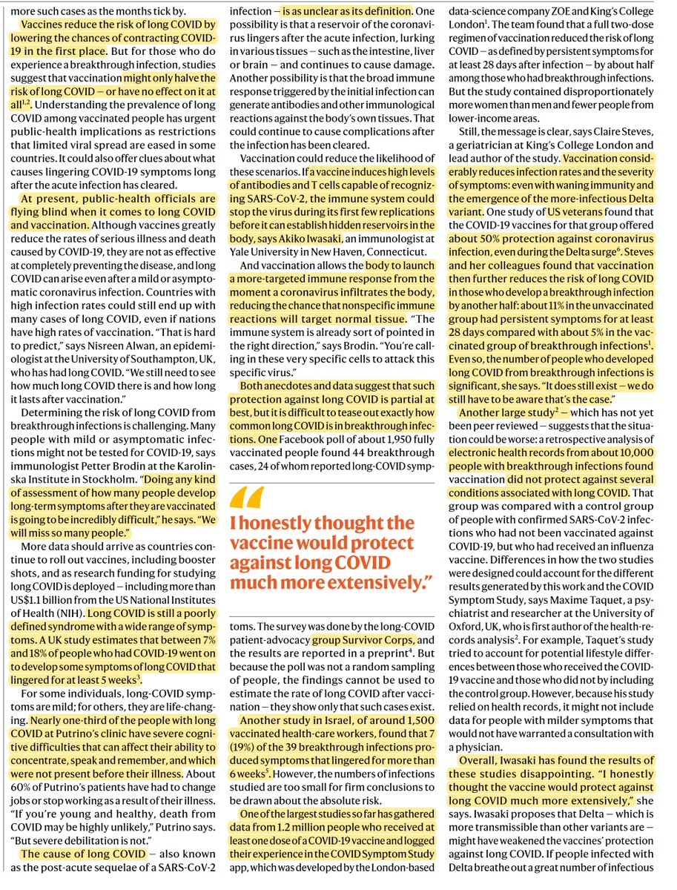</img></a><a href="FE6RQn9UUAM4DAE.jpg"  >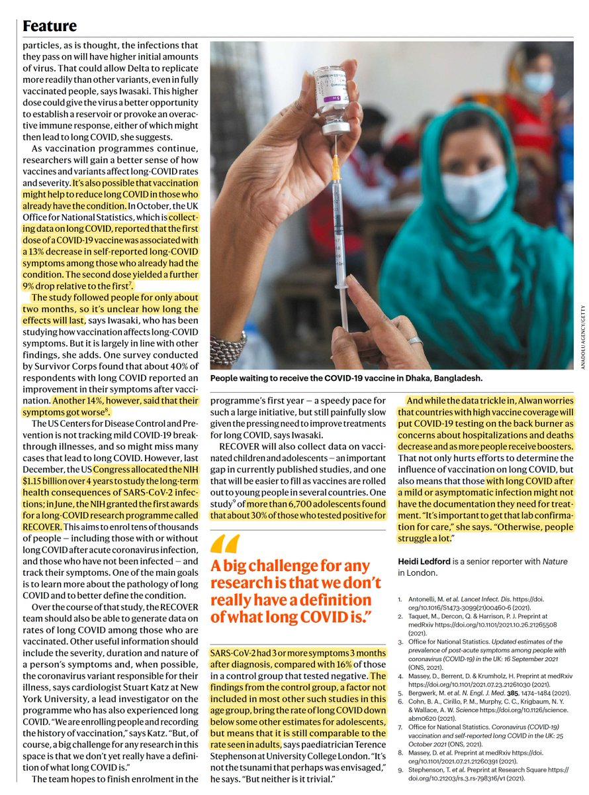</img></a>