+++
title = "Tweets by Eric Topol Nov 24"
Summary = ""
tags = ["Twitter"]
category = "Twitter"
+++

---

<a href="https://twitter.com/erictopol/status/1463298947053592579" target="_blank" rel="noreferer">00:10 UCT</a>

Delta🦠finds the unprotected. 
We have ways to prevent it and are not using them.
https://downloads.aap.org/AAP/PDF/AAP%20and%20CHA%20-%20Children%20and%20COVID-19%20State%20Data%20Report%2011.18%20FINAL.pdf by @hospitals4kids @AmerAcadPeds Prevent #LongCovidKids 

<a href="FE6tn-HVgAAyOdA.jpg"  >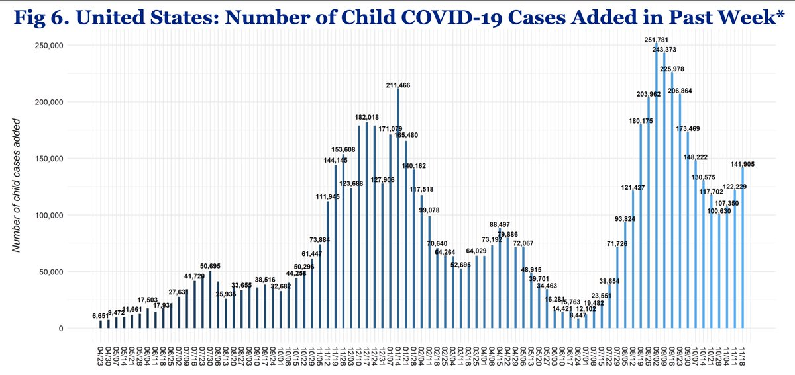</img></a>

---

<a href="https://twitter.com/erictopol/status/1463332849025622022" target="_blank" rel="noreferer">02:25 UCT</a>

The United States crossed 50,000 hospitalizations today, for the first time in a month, as it ascends in a new wave  https://twitter.com/EricTopol/status/1462945437116026880

<a href="FE7NK89VQAQYV9j.jpg"  >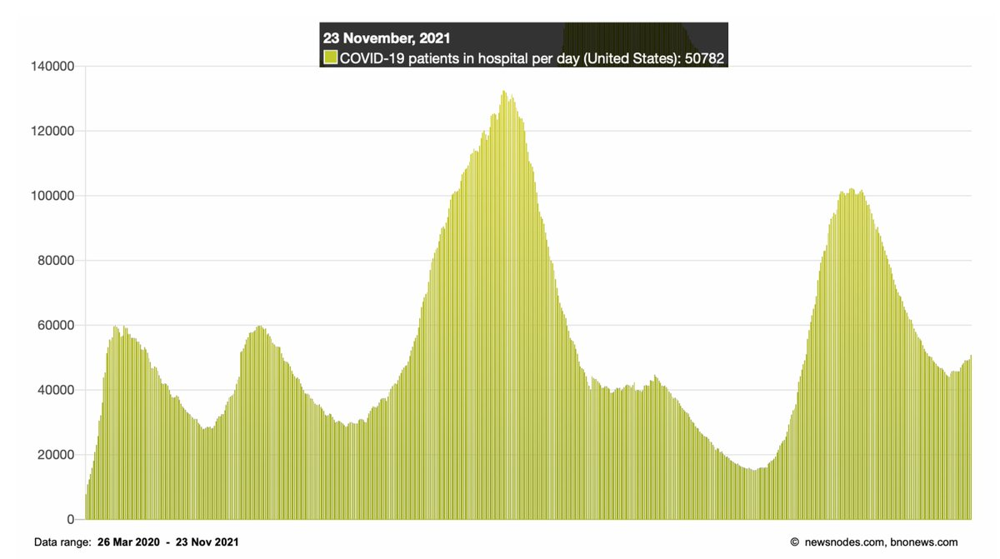</img></a>

---

<a href="https://twitter.com/erictopol/status/1463406617207083011" target="_blank" rel="noreferer">07:18 UCT</a>

The UK's path towards improvement as much of Europe is worsening
1. Boosters (3rd shots) are working, as seen by fewer hospital admissions among the age groups receiving them
https://www.ft.com/content/974487ab-54be-4b43-945c-597277aa1292 

<a href="FE8PTc8UUAAY_FI.jpg"  >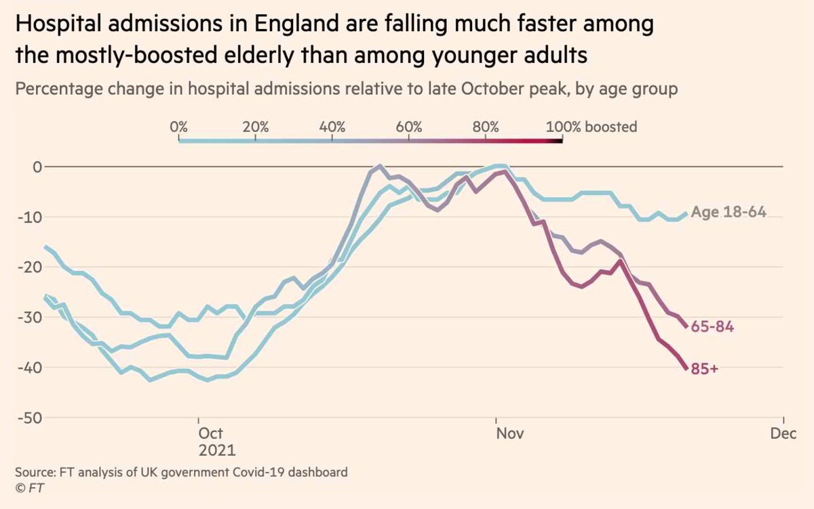</img></a>

---

<a href="https://twitter.com/erictopol/status/1463406624127668225" target="_blank" rel="noreferer">07:18 UCT</a>

3, Comparison with many countries throughout Europe experiencing a rapid rise in cases, patients requiring ICU admission and deaths 

<a href="FE8QOkiUcAMSoMs.jpg"  >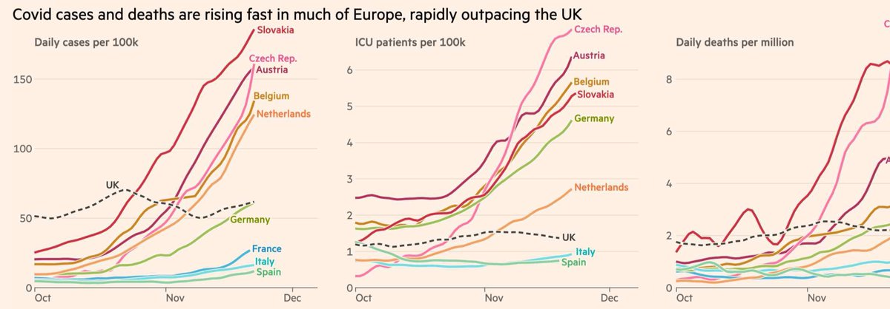</img></a>

---

<a href="https://twitter.com/erictopol/status/1463406621963341824" target="_blank" rel="noreferer">07:18 UCT</a>

2. Infection-acquired immunity playing a role 

<a href="FE8PpHaUYAU7DhV.jpg"  >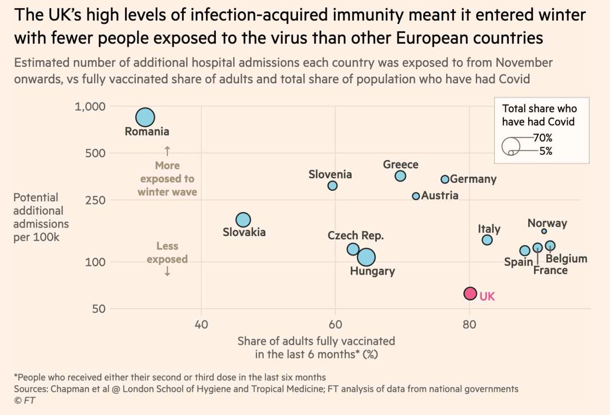</img></a>

---

<a href="https://twitter.com/erictopol/status/1463514191298371586" target="_blank" rel="noreferer">14:25 UCT</a>

“We are in the early stages of what will be a substantial fifth wave”
https://www.ft.com/content/cde3ef32-a754-4aae-82ca-7d8153af51b7  by @JamieSmythF @caitlinsgilbert
With low vaccination % and waning, we are far less protected than countries in Europe experiencing a  surge 

<a href="FE9xzEIUcAYd69Y.jpg"  >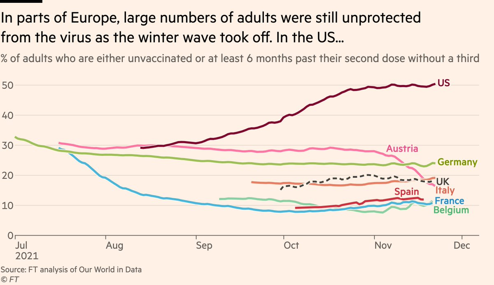</img></a>

---

<a href="https://twitter.com/erictopol/status/1463517306919686148" target="_blank" rel="noreferer">14:38 UCT</a>

“The patients who are in the ICU and are sickest are almost exclusively unvaccinated but we are seeing older [vaccinated] patients, typically 70- to 80-year-olds, hospitalised. 

<a href="FE91Na8VkAwXp9V.jpg"  >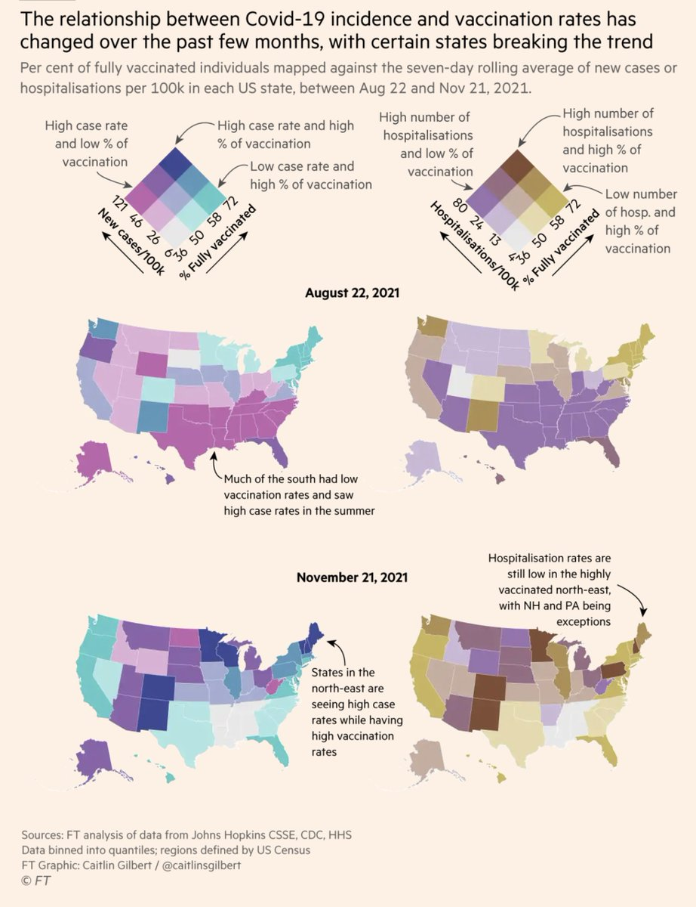</img></a>

---

<a href="https://twitter.com/erictopol/status/1463526103671214084" target="_blank" rel="noreferer">15:13 UCT</a>

Our oped on the big mistake @CDCgov on boosters: All adults, not just age 50 plus, need them. Here's why
@washingtonpost @mtosterholm 
https://www.washingtonpost.com/opinions/2021/11/24/cdc-got-it-wrong-it-should-have-urged-all-adults-get-covid-19-booster-shots/ @PostOpinions 

<a href="FE99A3jVIAcqHwL.jpg"  >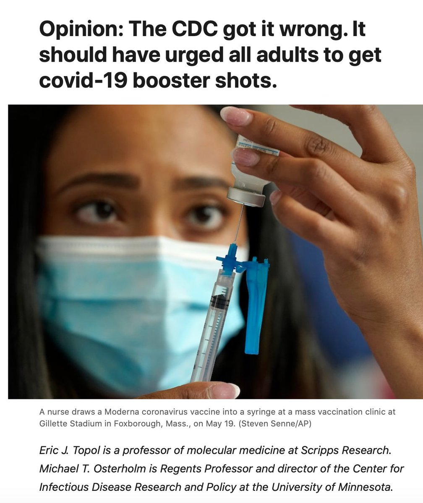</img></a>

---

<a href="https://twitter.com/erictopol/status/1463526872818479108" target="_blank" rel="noreferer">15:16 UCT</a>

Now is not the time to withhold a vital and validated means of boosting our efforts to contain the virus 

<a href="FE997TuVQAQpwF5.jpg"  >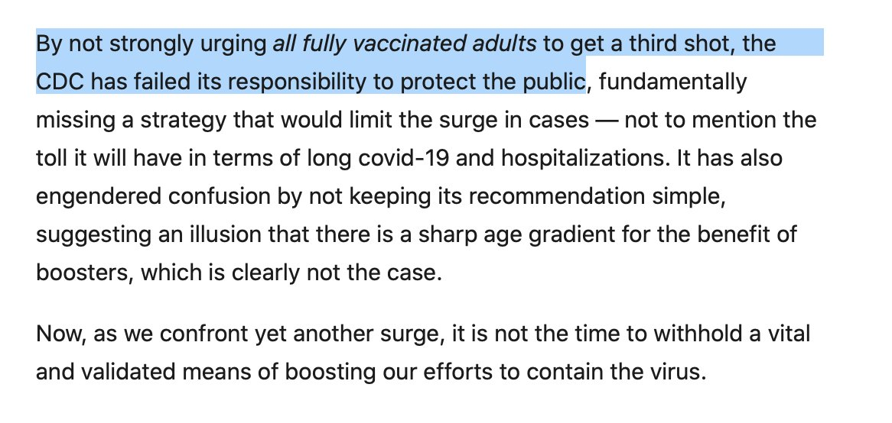</img></a>

---

<a href="https://twitter.com/erictopol/status/1463527727118446613" target="_blank" rel="noreferer">15:19 UCT</a>

Each day in the United States, the number of people with waning immunity greatly exceeds those who are getting newly vaccinated. Accordingly, rather than building our wall of population immunity, the United States is suffering attrition.

---

<a href="https://twitter.com/erictopol/status/1463542392678600705" target="_blank" rel="noreferer">16:17 UCT</a>

"Our recommendation is fully consistent with messaging from the White House and President Biden that all vaccinated adults should get boosters."
Notably, the @CDCgov position on boosters is different from the @WhiteHouse

---

<a href="https://twitter.com/erictopol/status/1463569368143437824" target="_blank" rel="noreferer">18:05 UCT</a>

RT @DrLeanaWen: "...The CDC recommended last week that all adults be made eligible for booster shots but only urged shots for people older…

---

<a href="https://twitter.com/erictopol/status/1463572820722536454" target="_blank" rel="noreferer">18:18 UCT</a>

It's seen particularly in the Midwest and Northeast now, but will affect the entire country 

<a href="FE-newxUUAI2A8z.jpg"  >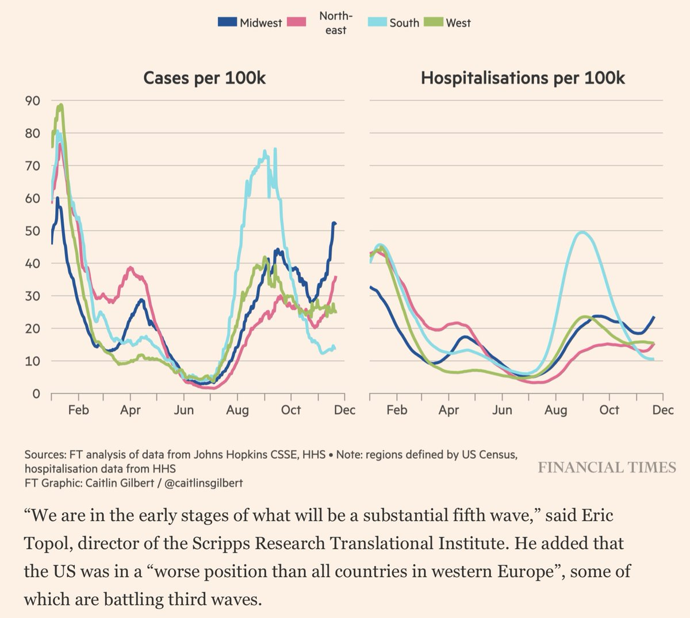</img></a>

---

<a href="https://twitter.com/erictopol/status/1463575134443229184" target="_blank" rel="noreferer">18:27 UCT</a>

4. 3 countries have shown the impact of boosters for reducing cases: Israel, UK, and now Belgium 

<a href="FE-pr_jUYAA_76P.jpg"  >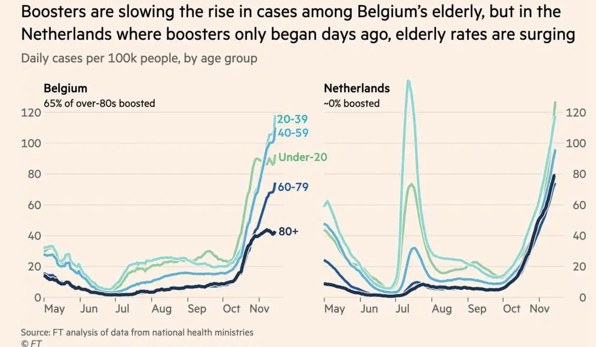</img></a>

---

<a href="https://twitter.com/erictopol/status/1463577147314872320" target="_blank" rel="noreferer">18:35 UCT</a>

If you have a fitness band or smartwatch, please join @detect_study 
Our @ScrippsDTC processes your data and gets it back to you.
It's free. It could make a difference
@ScrippsRTI @scrippsresearch @careevolution https://twitter.com/BacaMotes/status/1463575740054597634

---

<a href="https://twitter.com/erictopol/status/1463594242798882817" target="_blank" rel="noreferer">19:43 UCT</a>

Delta is a ferocious foe.
Cases are not just rising in Europe and the US now. 
4 model countries in Asia with best practices throughout the pandemic going through or coming down from their worst surge 🇰🇷🇸🇬🇹🇭🇻🇳 

<a href="FE-6kDhVUAEs-dP.jpg"  >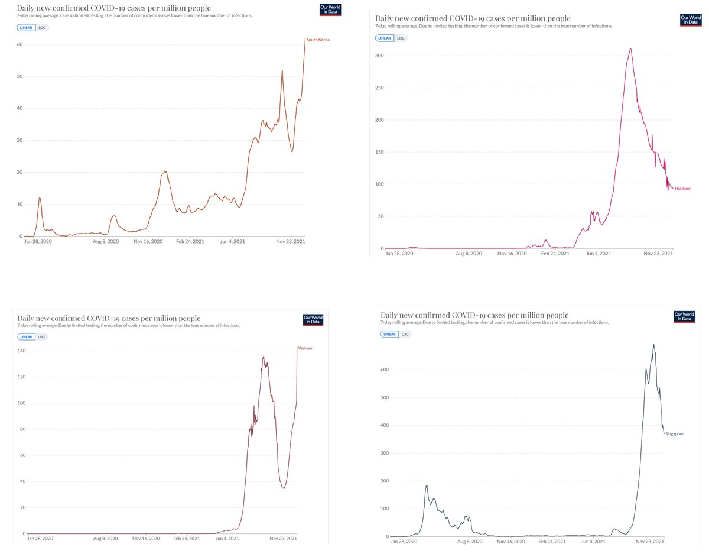</img></a>

---

<a href="https://twitter.com/erictopol/status/1463597591439060995" target="_blank" rel="noreferer">19:57 UCT</a>

Don't tell me "cases are irrelevant"
That means you don't understand:
—Cases beget cases. People getting sick. Surges.   
—Cases beget #LongCovid 
—Cases beget hospitalizations &amp; deaths
—Cases drive🦠evolution and the pandemic
—That you have no idea what your are posting about

---

<a href="https://twitter.com/erictopol/status/1463618427336085507" target="_blank" rel="noreferer">21:20 UCT</a>

RT @Laurie_Garrett: Tough words from @EricTopol &amp; Michael Osterholm:
"By not strongly urging all fully vaccinated adults to get a 3rd shot,…

---

<a href="https://twitter.com/erictopol/status/1463628744707477516" target="_blank" rel="noreferer">22:01 UCT</a>

New @NEJM
Assessment of Covid reinfections in Qatar's national database, w/ Alpha and Beta variants: "reinfections had 90% lower odds of resulting in hospitalizations or deaths than primary infections"
http://www.nejm.org/doi/full/10.1056/NEJMc2108120
Reflects the impact of infection-acquired immunity 

<a href="FE_VPa9UYAIaeUY.jpg"  >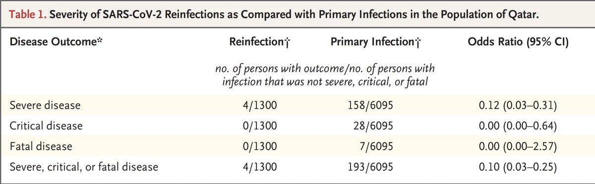</img></a>

---

<a href="https://twitter.com/erictopol/status/1463657968985985032" target="_blank" rel="noreferer">23:57 UCT</a>

Just out @BMJ_Latest
The time course and extent of breakthrough infections  (2 doses, Pfizer vaccine)
A study of over 83,000 people serially assessed demonstrates a gradual increase in risk across all adult age groups 
https://www.sciencemediacentre.org/expert-reaction-to-study-looking-at-covid-infection-risk-as-time-increases-after-second-pfizer-vaccine-dose-in-israel/ 

<a href="FE_mgsBVEAMi_hg.jpg"  >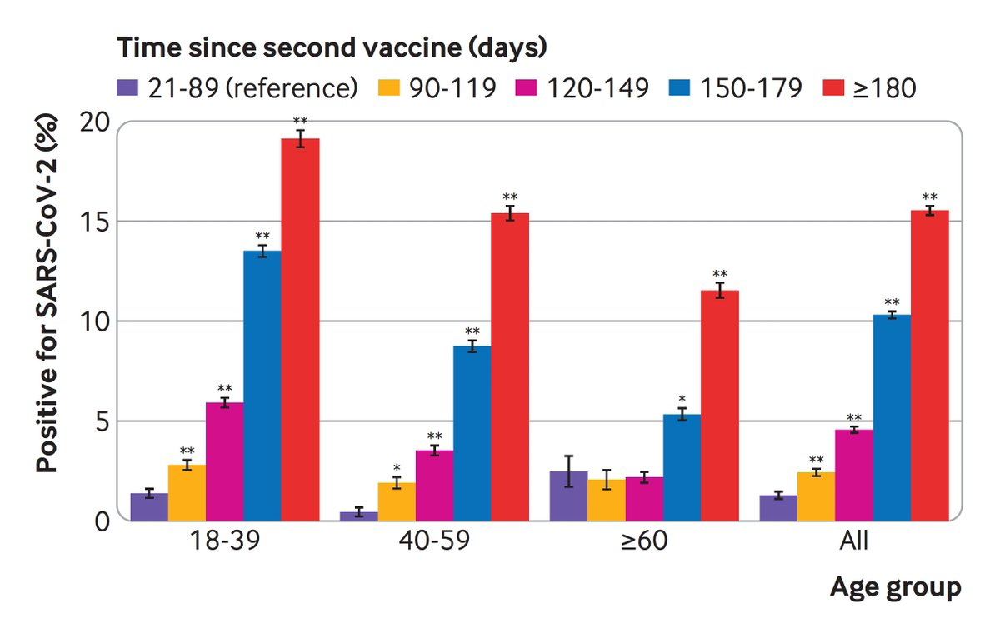</img></a>

---

<a href="https://twitter.com/erictopol/status/1463657973213843456" target="_blank" rel="noreferer">23:57 UCT</a>

The odds ratio for (OR) risk of infection increased for each age group after 90 days. After 6 months, the OR for ages 40-59 was 40-fold. 

<a href="FE_mjoZVUAMSop2.jpg"  >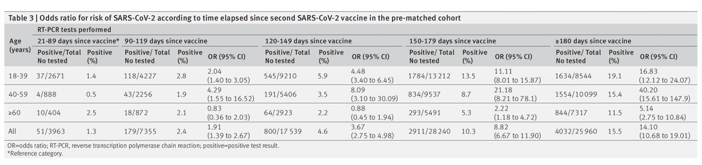</img></a>