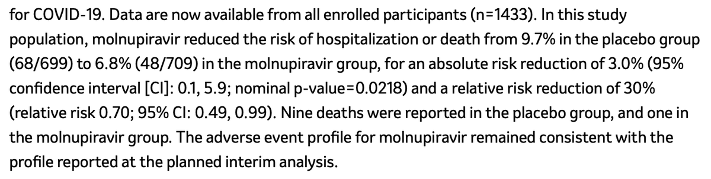
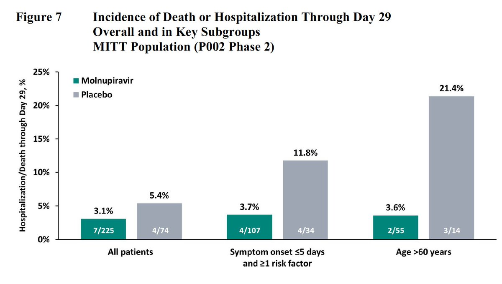
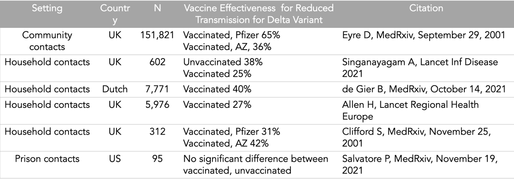
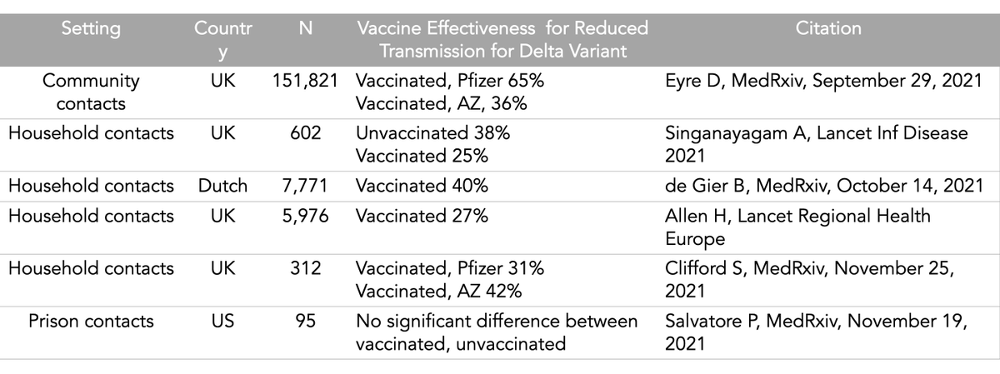
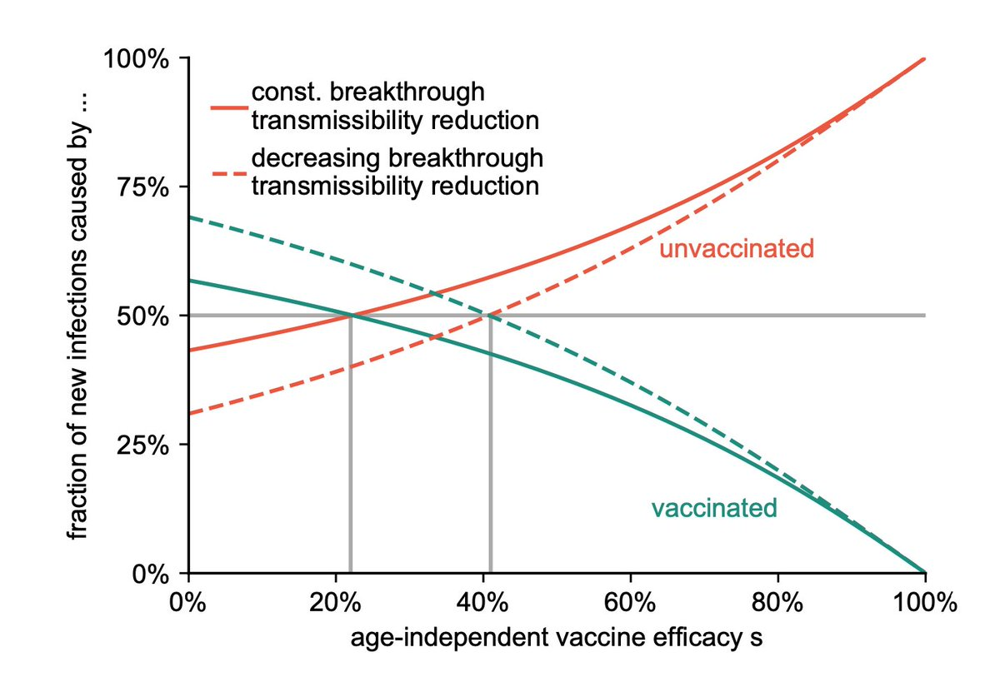
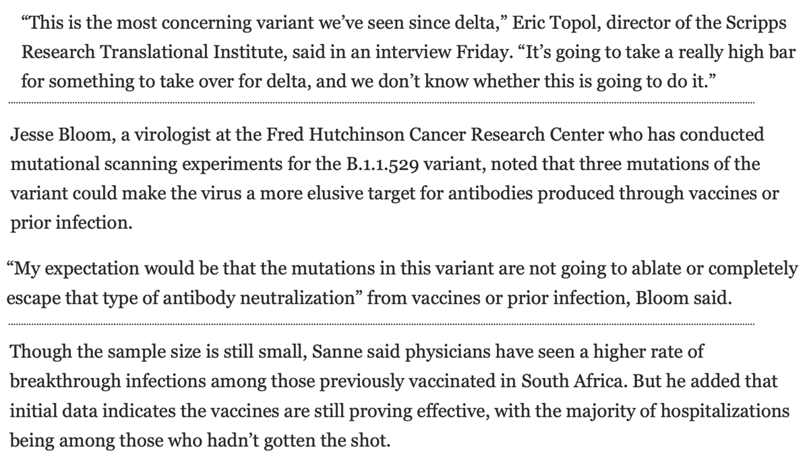
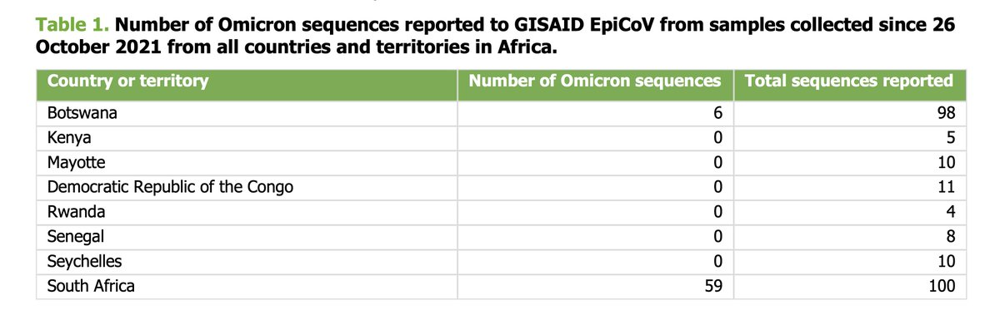

+++
title = "Tweets by Eric Topol Nov 26"
Summary = ""
tags = ["Twitter"]
category = "Twitter"
+++

---

<a href="https://twitter.com/erictopol/status/1464109734777131013" target="_blank" rel="noreferer">05:52 UCT</a>

RT @holmescnn: The #COVID19 variant discovered in South Africa spreads with frightening speed, says Dr @EricTopol.  "The big question now i…

---

<a href="https://twitter.com/erictopol/status/1464231697851904005" target="_blank" rel="noreferer">13:56 UCT</a>

Cases of the B.1.1.529 new variant confirmed in Israel, Belgium
https://www.theguardian.com/world/live/2021/nov/26/covid-news-live-new-variant-sparks-tougher-restrictions-in-india-and-singapore-ahead-of-who-meeting?page=with:block-61a0e4d08f08a201d9c7c69c
https://www.timesofisrael.com/israel-detects-first-case-of-new-highly-mutated-covid-19-strain/

---

<a href="https://twitter.com/erictopol/status/1464233509820583938" target="_blank" rel="noreferer">14:04 UCT</a>

Disappointing from Merck. Updated data for efficacy of their Molnupiravir pill in full trial drops down to 30% from 50%, absolute reduction to 3 from 7 per 100 at interim analysis https://www.merck.com/news/merck-and-ridgeback-biotherapeutics-provide-update-on-results-from-move-out-study-of-molnupiravir-an-investigational-oral-antiviral-medicine-in-at-risk-adults-with-mild-to-moderate-covid-19/ 

<a href="FFIACEPVQAQn54B.png"  ></img></a>

---

<a href="https://twitter.com/erictopol/status/1464237193073807364" target="_blank" rel="noreferer">14:18 UCT</a>

From the @US_FDA briefing documents along with a lot more data from the clinical trial results 
https://www.fda.gov/media/154421/download 

<a href="FFIDtpAVUAIm7Mu.jpg"  ></img></a>

---

<a href="https://twitter.com/erictopol/status/1464265887154798594" target="_blank" rel="noreferer">16:12 UCT</a>

Vaccinations reduce Delta spread:
1.  Prevention of symptomatic infections; ~95% effectiveness restored w/ boosters. 
2. Reduced transmission (27-65%) among people who are vaccinated vs unvaccinated, as seen in multiple recent reports
/1 

<a href="FFIbSrAUYAcRzoe.png"  ></img></a>

---

<a href="https://twitter.com/erictopol/status/1464265889872691201" target="_blank" rel="noreferer">16:12 UCT</a>

For the latter, setting, variant, &amp; time from vaccination are key determinants
—Delta transmission &gt; Alpha
—Prison &gt; Household &gt; Community contacts
—Longer time from vaccination, less reduction
—Other factors, such as better viral clearance w/ vaccination, also play a role 
/2

---

<a href="https://twitter.com/erictopol/status/1464273367800815623" target="_blank" rel="noreferer">16:42 UCT</a>

Corrected date of citations (typo of 2001)
One is from yesterday (Clifford et al) /3 

<a href="FFIkvzHVEAEgduH.png"  ></img></a>

---

<a href="https://twitter.com/erictopol/status/1464280811289468930" target="_blank" rel="noreferer">17:12 UCT</a>

What is driving the new case records in Germany?
The people who aren't vaccinated
https://www.medrxiv.org/content/10.1101/2021.11.24.21266831v1 @BenFMaier @DirkBrockmann @rki_de and colleagues 

<a href="FFIqs8iVEAIyvZb.jpg"  ></img></a>

---

<a href="https://twitter.com/erictopol/status/1464294799213678596" target="_blank" rel="noreferer">18:07 UCT</a>

The @WHO has named B.1.1.529 Omicron, a Variant of Concern [O, not Nu)

---

<a href="https://twitter.com/erictopol/status/1464295706844270594" target="_blank" rel="noreferer">18:11 UCT</a>

Here's their full statement, summary of data
https://www.who.int/news/item/26-11-2021-classification-of-omicron-(b.1.1.529)-sars-cov-2-variant-of-concern

---

<a href="https://twitter.com/erictopol/status/1464298566810099720" target="_blank" rel="noreferer">18:22 UCT</a>

This is only the 5th Variant of Concern since the pandemic began: Alpha, Beta, Gamma, Delta, and now Omicron. 
That it was not named as a Variant of Interest is interesting and raises concern ;-)
There have been thousands of uninteresting #SARSCoV2 variants

---

<a href="https://twitter.com/erictopol/status/1464319477714079744" target="_blank" rel="noreferer">19:45 UCT</a>

Omicron in context, by @Kit_Yates_Maths 
https://www.theguardian.com/commentisfree/2021/nov/26/new-variant-covid-b11529-testing-masks-vaccines @Guar

---

<a href="https://twitter.com/erictopol/status/1464323470217474051" target="_blank" rel="noreferer">20:01 UCT</a>

Omicron: known and unknowns https://www.washingtonpost.com/health/2021/11/26/faq-new-variant-omicron/ by @MerylKornfield @lateshiabeachum w/ @Tuliodna @jbloom_lab @BhadeliaMD 

<a href="FFJSMjLVgAA3Dd2.png"  ></img></a>

---

<a href="https://twitter.com/erictopol/status/1464344728950898689" target="_blank" rel="noreferer">21:26 UCT</a>

Omicron was first detected from a sample collected in Botswana on 11 November
https://www.ecdc.europa.eu/en/publications-data/threat-assessment-brief-emergence-sars-cov-2-variant-b.1.1.529 @ECDC_EU via @kakape
"In conclusion, the overall level of risk is assessed as HIGH TO VERY HIGH." 

<a href="FFJkluGUYAIbmrA.jpg"  ></img></a>

---

<a href="https://twitter.com/erictopol/status/1464358283452444674" target="_blank" rel="noreferer">22:19 UCT</a>

From Omicron's sequence, there's a lot of antigenic drift, posing the threat of evading our immune response. Good that vaccine companies are gearing up for it. But we ought to be pressing hard for a pan-sarbecovirus vaccine that would target *all* variants https://www.businesswire.com/news/home/20211126005595/en/Moderna-Announces-Strategy-to-Address-Omicron-B.1.1.529-SARS-CoV-2-Variant

---

<a href="https://twitter.com/erictopol/status/1464363202649595907" target="_blank" rel="noreferer">22:39 UCT</a>

RT @trvrb: Growth rate (in absolute terms and relative to Delta) will be become clearer in the following days, but at the moment, I believe…

