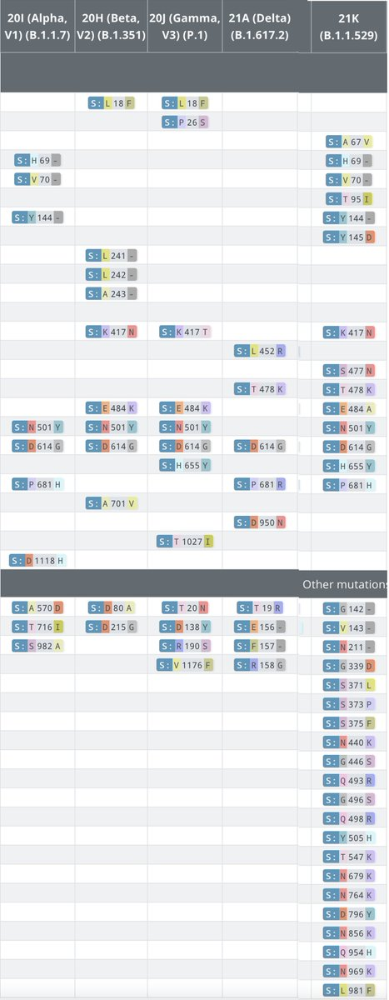
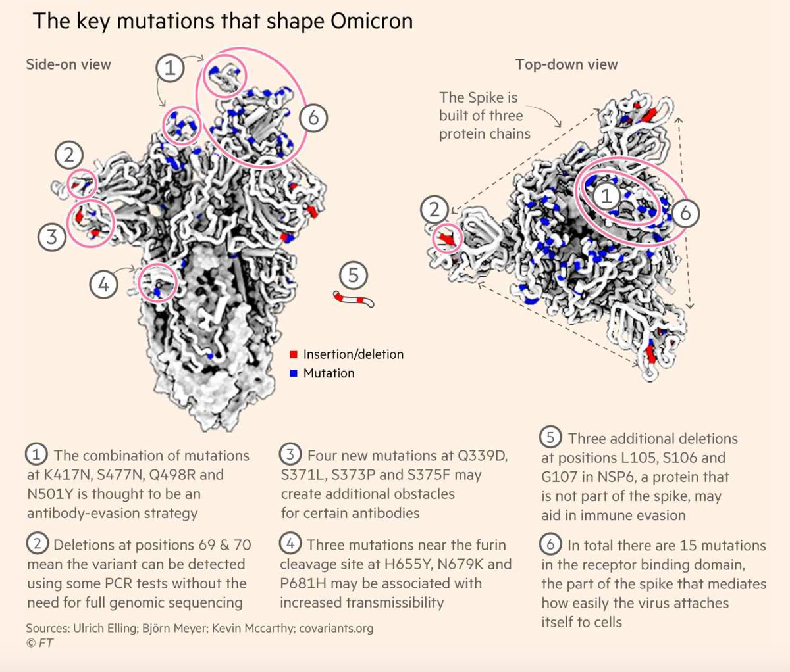
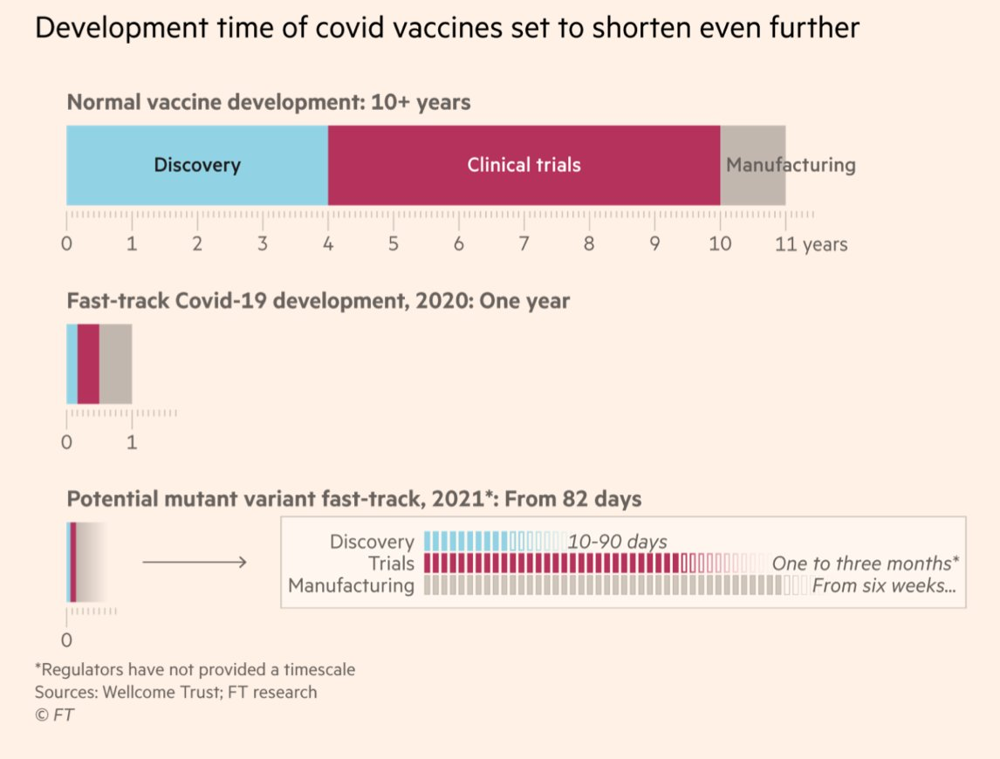
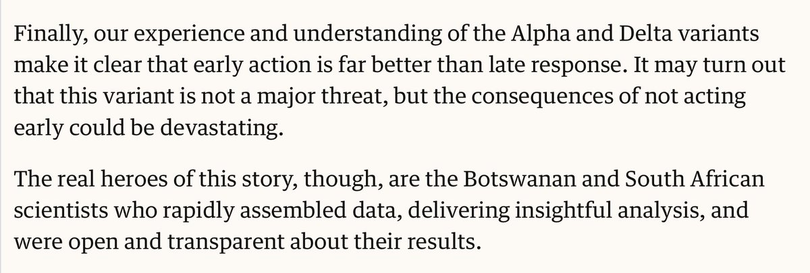
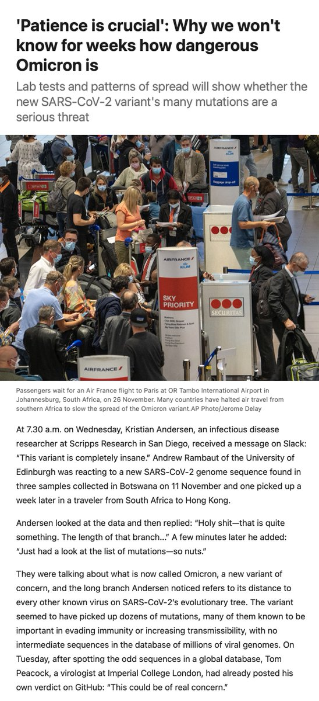

+++
title = "Tweets by Eric Topol Nov 27"
Summary = ""
tags = ["Twitter"]
category = "Twitter"
+++

---

<a href="https://twitter.com/erictopol/status/1464410605402480641" target="_blank" rel="noreferer">01:47 UCT</a>

The mutation map of the 5 Variants of Concern
adapted from https://covariants.org/shared-mutations
Omicron (B.1.1.529) shares many key mutations of Alpha, Beta, Gamma &amp; Delta, but a lot more added, very likely having been derived from an immunocompromised host with extensive in vivo evolution 

<a href="FFKhi7yVgAAsyFE.jpg"  ></img></a>

---

<a href="https://twitter.com/erictopol/status/1464452102382448643" target="_blank" rel="noreferer">04:32 UCT</a>

View of key mutations of Omicron's 50, with 30 in the spike protein, 15 in its receptor binding domain https://www.ft.com/content/42c5ff3d-e676-4076-9b9f-7243a00cba5e http://covariants.org @EllingUlrich
@_b_meyer 

<a href="FFLF9WeVcA0V7rN.jpg"  ></img></a>

---

<a href="https://twitter.com/erictopol/status/1464617347046461446" target="_blank" rel="noreferer">15:29 UCT</a>

Add to this our deficient sequencing surveillance https://twitter.com/kaitlancollins/status/1464607176744386564

---

<a href="https://twitter.com/erictopol/status/1464620381600247815" target="_blank" rel="noreferer">15:41 UCT</a>

An accelerated path to an Omicron specific vaccine in less than 3 months 
https://www.ft.com/content/a7aa4bd3-4405-41f9-bacc-51fb40181156 by @hannahkuchler 

<a href="FFNgC9PVcAMKw0T.jpg"  ></img></a>

---

<a href="https://twitter.com/erictopol/status/1464623081368940550" target="_blank" rel="noreferer">15:52 UCT</a>

The first 2 Omicron cases detected in the UK, travel related. The UK and South Africa have some of the best sequencing capabilities in the world.
https://www.ft.com/content/8aba36e0-53d5-4050-abcf-bff4a1256ca1
https://www.theguardian.com/world/2021/nov/27/two-cases-of-omicron-covid-variant-identified-in-uk

---

<a href="https://twitter.com/erictopol/status/1464655469931155457" target="_blank" rel="noreferer">18:00 UCT</a>

This could be the best Omicron news of the day if further confirmed tracking all confirmed cases 
https://www.telegraph.co.uk/global-health/science-and-disease/south-african-doctor-raised-alarm-omicron-variant-says-symptoms/
Not many have been thinking that the mutation laden variant could decrease virulence

---

<a href="https://twitter.com/erictopol/status/1464687575084404740" target="_blank" rel="noreferer">20:08 UCT</a>

The speed of the response to Omicron has been far improved compared with the prior variants of concern, thanks to the scientists in Southern Africa.  https://twitter.com/JeremyFarrar/status/1464679249198170114

<a href="FFOcWS1UYAAaiE5.jpg"  ></img></a>

---

<a href="https://twitter.com/erictopol/status/1464706048707600384" target="_blank" rel="noreferer">21:21 UCT</a>

Agree with Carl
https://twitter.com/CT_Bergstrom/status/1464702299276599296

---

<a href="https://twitter.com/erictopol/status/1464720179858849794" target="_blank" rel="noreferer">22:17 UCT</a>

We'll know much more about Omicron soon......
Excellent summary of where we stand, including the lab tests underway, by @kakape @ScienceMagazine 
https://www.science.org/content/article/patience-crucial-why-we-won-t-know-weeks-how-dangerous-omicron 

<a href="FFO6ULqVgAAs91G.jpg"  ></img></a>

---

<a href="https://twitter.com/erictopol/status/1464734595610341385" target="_blank" rel="noreferer">23:15 UCT</a>

@KasperKepp Sophisticated??  We have no idea yet for the transmissibility of Omicron. You've gotta be kidding.

