+++
title = "Tweets by Eric Topol Nov 28"
Summary = ""
tags = ["Twitter"]
category = "Twitter"
+++

---

<a href="https://twitter.com/erictopol/status/1464785696103669761" target="_blank" rel="noreferer">02:38 UCT</a>

RT @StevenSalzberg1: It would be a hidden bit of good news if the new omicron variant makes people less sick. Far too early to say, but thi…

---

<a href="https://twitter.com/erictopol/status/1464966262736359434" target="_blank" rel="noreferer">14:35 UCT</a>

Important 🧵from Dr. Lessells, a leading South African infectious disease specialist https://twitter.com/rjlessells/status/1464723163481354242

---

<a href="https://twitter.com/erictopol/status/1464973144528068609" target="_blank" rel="noreferer">15:03 UCT</a>

While attention has turned to Omicron, its functional impact yet unknown, the main issue is that Delta is rampant in many countries in Europe and the United States, with ~600,000 new confirmed cases a day globally 

<a href="FFSf-V6VUAogbt5.jpg"  ></img></a>

---

<a href="https://twitter.com/erictopol/status/1464982506445283331" target="_blank" rel="noreferer">15:40 UCT</a>

The US is the largest source of confirmed new Delta cases, &gt;90,000 per day (before holiday tracking issues). Highest European countries per capita here, most are pandemic records 

<a href="FFSplKhVcAMBBnA.jpg"  >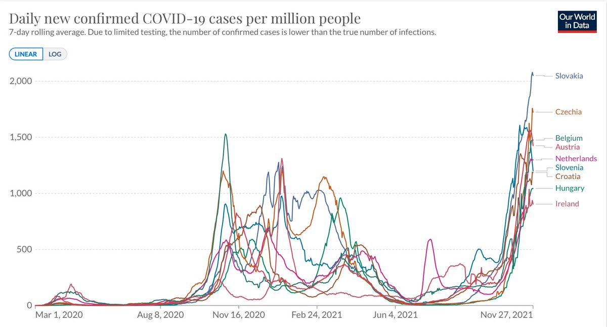</img></a>

---

<a href="https://twitter.com/erictopol/status/1464986845515698178" target="_blank" rel="noreferer">15:57 UCT</a>

Some wisdom here on Omicron and Delta
Note how the approach in the UK differs from the US w/r to free, rapid home tests, mitigation measures and the emphasis on boosters  https://twitter.com/devisridhar/status/1464983972291747841

<a href="FFSshEaVcAEAE4p.png"  >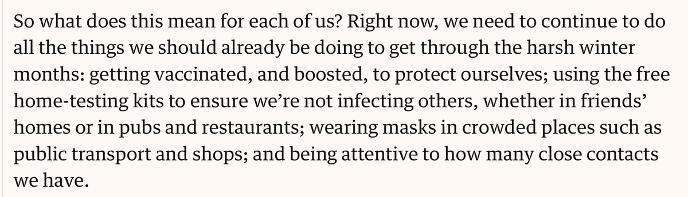</img></a><a href="FFStCFLUYAAS_Or.jpg"  >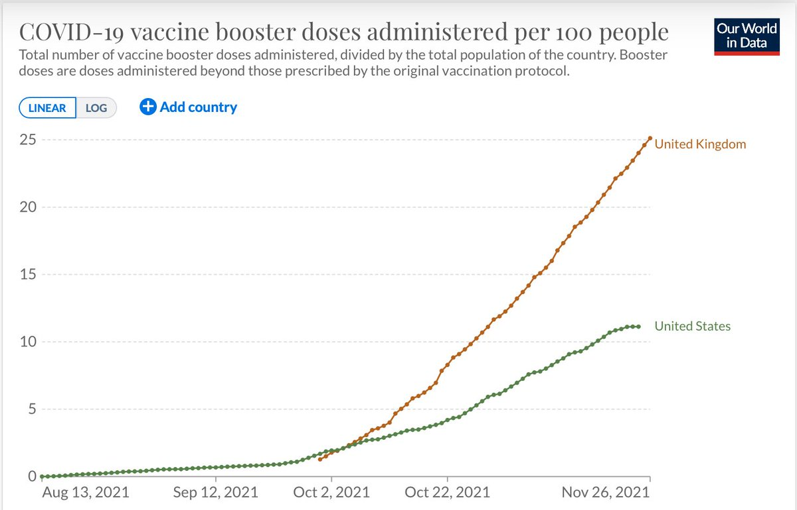</img></a>

---

<a href="https://twitter.com/erictopol/status/1464997006120656896" target="_blank" rel="noreferer">16:37 UCT</a>

Our covid times 

<a href="FFS2-NsVEAgMryN.jpg"  >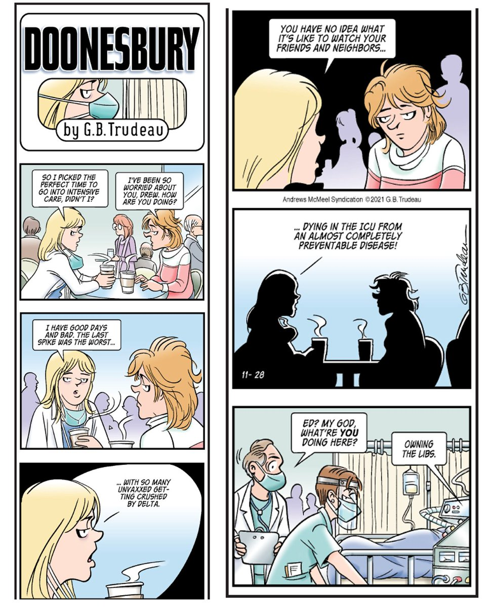</img></a>

---

<a href="https://twitter.com/erictopol/status/1465008413142773760" target="_blank" rel="noreferer">17:23 UCT</a>

The US markedly lags many countries with boosters, in part because of poor messaging, and lack of priority to get *all* adults with fully restored vaccine effectiveness.
Would help vs Omicron, too. Boosters induce a striking increase in level &amp; breadth of neutralizing antibodies. 

<a href="FFS-CYYVEAYW9KX.jpg"  >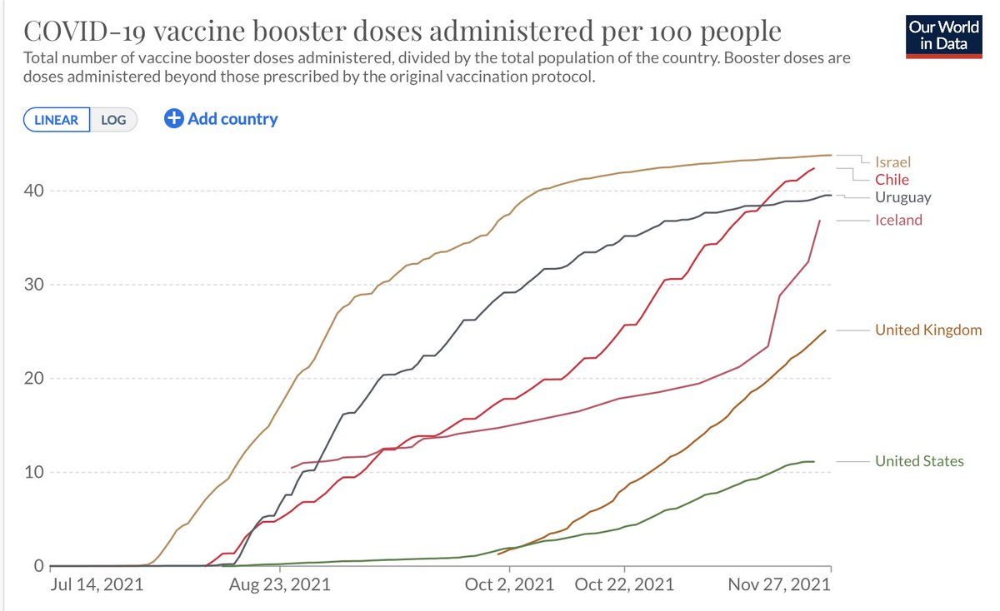</img></a>

---

<a href="https://twitter.com/erictopol/status/1465008419975221253" target="_blank" rel="noreferer">17:23 UCT</a>

Today's @washingtonpost editorial
"The [waning] phenomenon should compel all adults to get a booster shot." 

<a href="FFS_b4YUUAYnGfT.jpg"  >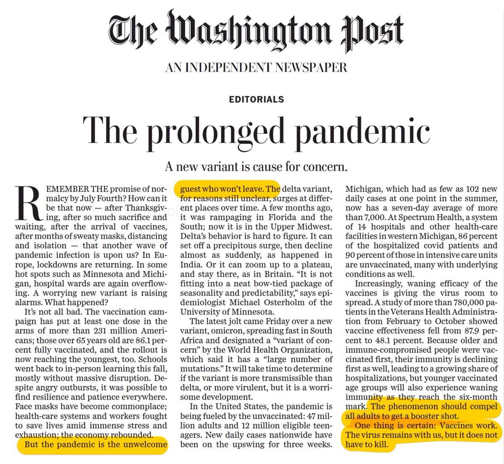</img></a>

---

<a href="https://twitter.com/erictopol/status/1465008429051777029" target="_blank" rel="noreferer">17:23 UCT</a>

Our editorial on boosters, @mtosterholm @PostOpinions 
"Each day in the United States, the number of people with waning immunity greatly exceeds those who are getting newly vaccinated"
https://www.washingtonpost.com/opinions/2021/11/24/cdc-got-it-wrong-it-should-have-urged-all-adults-get-covid-19-booster-shots/ 

<a href="FFTAfDSVIAEJutY.jpg"  >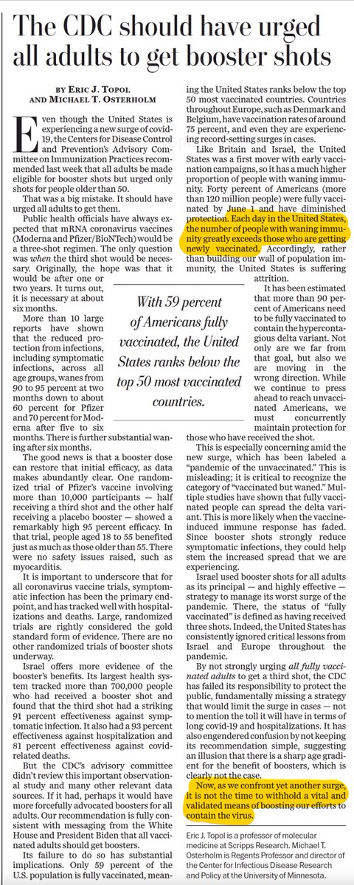</img></a>

---

<a href="https://twitter.com/erictopol/status/1465022795256004617" target="_blank" rel="noreferer">18:20 UCT</a>

We are our own worst enemy in more ways than one. An exceptional new review of our dysregulated immune response to Covid @NatRevImmunol https://www.nature.com/articles/s41577-021-00656-2 

<a href="FFTOESxVgAQJHNS.jpg"  >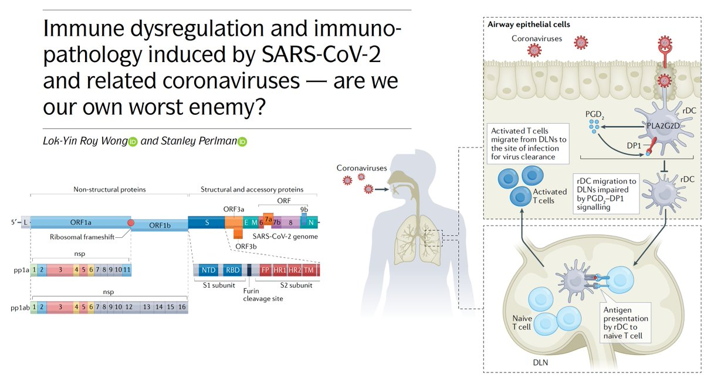</img></a>

---

<a href="https://twitter.com/erictopol/status/1465027004848242695" target="_blank" rel="noreferer">18:37 UCT</a>

If Omicron turns out to have substantial immune evasiveness, the pills will add a significant layer of defense. We should get these small molecules into mass production, especially Paxlovid, with its takedown of upstream Mpro, and much higher efficacy than Molnupiravir (to date)  https://twitter.com/davidrliu/status/1464714206150807559

<a href="FFTSJnHVUAISvgi.jpg"  >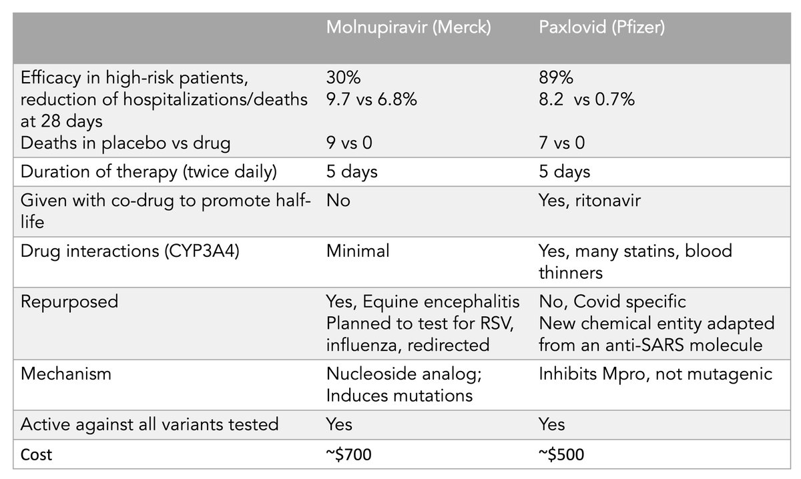</img></a>

---

<a href="https://twitter.com/erictopol/status/1465032571905974272" target="_blank" rel="noreferer">18:59 UCT</a>

The schematic mechanism of action for the anti-Covid pills, which should maintain efficacy vs Omicron and all variants
https://www.science.org/content/article/pfizer-antiviral-slashes-covid-19-hospitalizations @ScienceMagazine 

<a href="FFTWxlgVUAElTb0.jpg"  >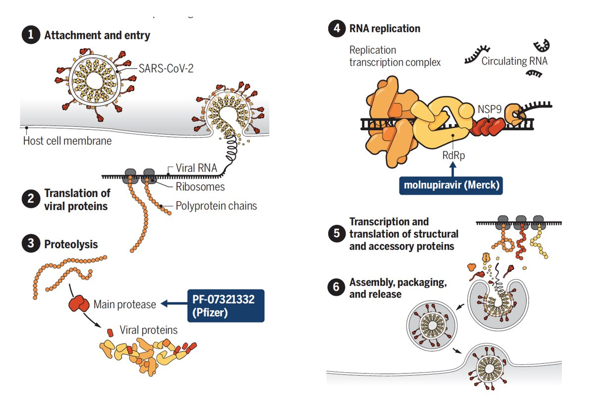</img></a>

---

<a href="https://twitter.com/erictopol/status/1465035795476013057" target="_blank" rel="noreferer">19:12 UCT</a>

@billprady Not as much of a hammer as hoped, as it turned out in the full trial
https://twitter.com/EricTopol/status/1464233509820583938

---

<a href="https://twitter.com/erictopol/status/1465038132189949952" target="_blank" rel="noreferer">19:21 UCT</a>

A simplified version of Omicron @nytimes home page today! 

<a href="FFTb_D3VIAYfQD_.jpg"  >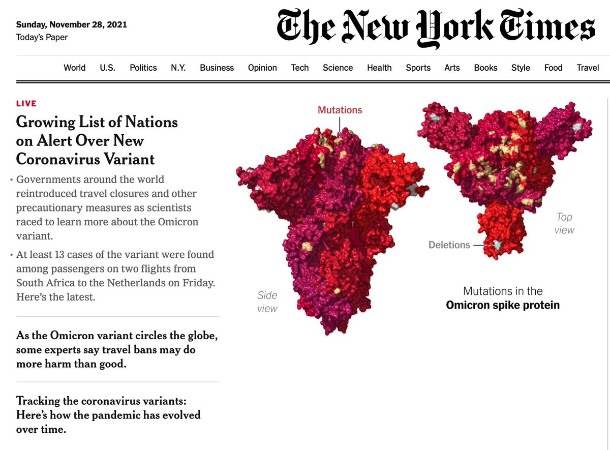</img></a>

---

<a href="https://twitter.com/erictopol/status/1465090335407624194" target="_blank" rel="noreferer">22:48 UCT</a>

Europe is accelerating 3rd shots
https://www.ft.com/content/260c3daf-8db0-4fd7-ba53-cb4549b46b17
"As of January 10, travellers entering the EU will have to either have received a booster dose or have received their 2nd jab no more than 9 months ago,  The EU ... boosters to be recognised in vaccine certificates." 

<a href="FFULT2sUYAIg-hk.jpg"  >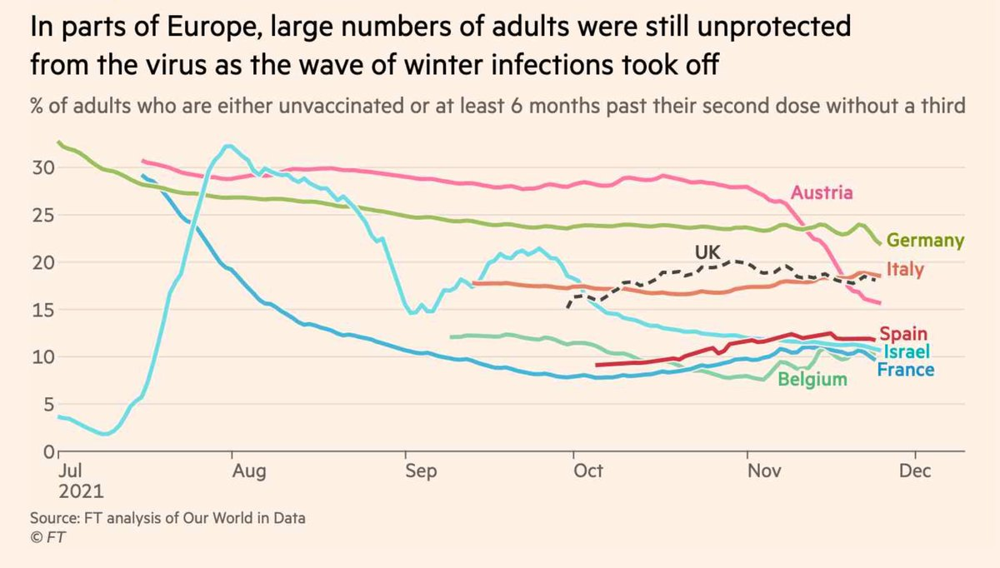</img></a>