+++
title = "Tweets by Eric Topol" 
date = 2021-07-01T13:06:08+00:00
category = "Twitter"
+++

---

<a href="https://twitter.com/erictopol/status/1410595069778751498" target="_blank" rel="noreferer">13:44:06 UCT</a>

In California, the Delta variant is 30% of cases, and vaccinations are fairly high  (&gt;61% population 1-dose or more), cases have started to creep up again, 17% in past 2 weeks and that's with 62% less testing (&lt;-complacency) 

<a href="E5NvySNVUA8Ew3x.jpg"  >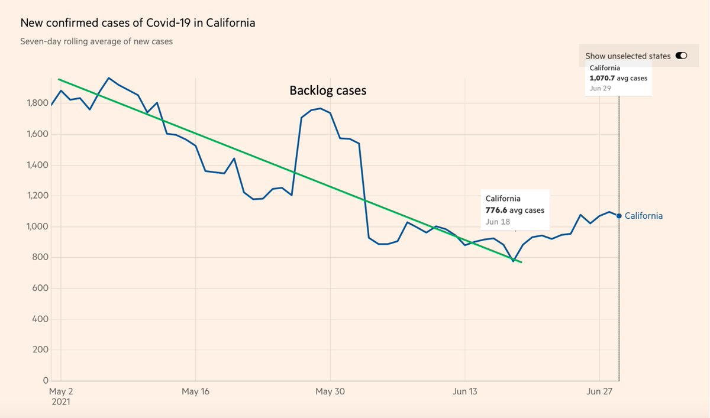</img></a>

---

<a href="https://twitter.com/erictopol/status/1410599877713678350" target="_blank" rel="noreferer">14:03:13 UCT</a>

Some comments on the Delta variant and how that's making vaccine global equity even more pressing https://twitter.com/rosemaryCNN/status/1410486203825152003

---

<a href="https://twitter.com/erictopol/status/1410616339161513989" target="_blank" rel="noreferer">15:08:37 UCT</a>

So we're at 73% of pre-covid normalcy?
https://www.economist.com/graphic-detail/2021/07/03/our-normalcy-index-shows-life-is-halfway-back-to-pre-covid-norms @TheEconomist 

<a href="E5OD6HrVoBEER6R.jpg"  >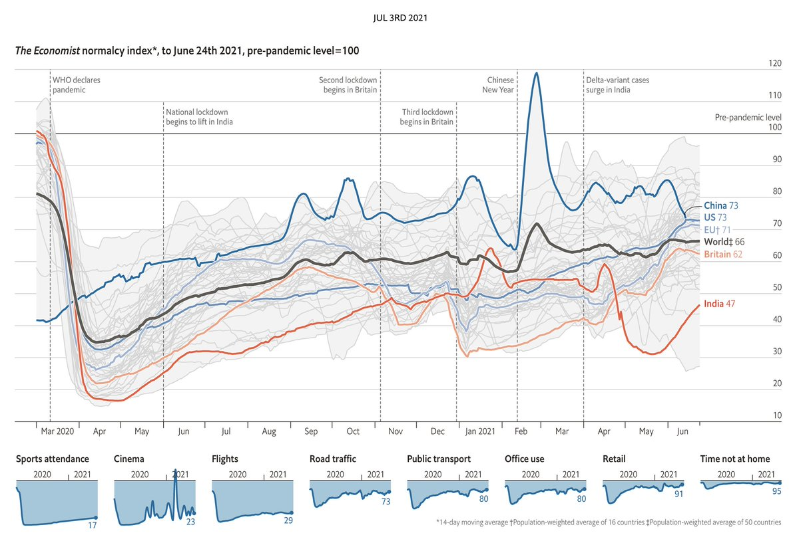</img></a>

---

<a href="https://twitter.com/erictopol/status/1410628006998024193" target="_blank" rel="noreferer">15:54:59 UCT</a>

Evolution of the virus to Delta and beyond: the impact of covid  immunity,  by natural infections or preferably via vaccine, and the unique mutations that occurred in Delta  that were not seen in Alpha, Beta and Gamma (P681R and NTD)
https://www.economist.com/briefing/2021/07/03/the-new-variants-of-sars-cov-2-are-much-more-dangerous-to-the-unvaccinated 

<a href="E5ONym4VUAM8nIy.png"  >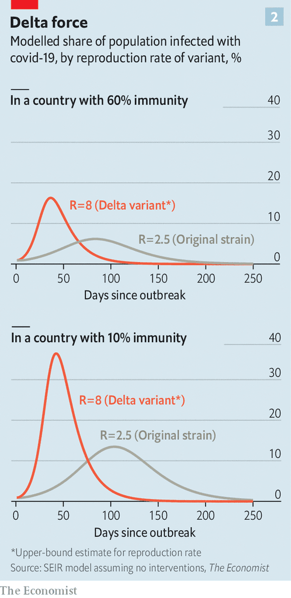</img></a><a href="E5ON11fVoAEjp80.png"  >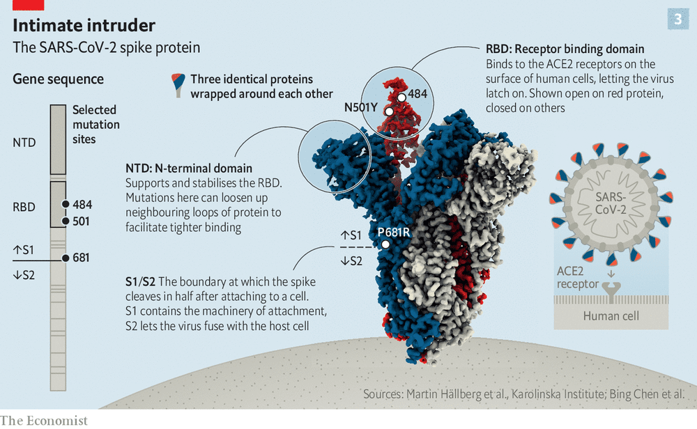</img></a>

---

<a href="https://twitter.com/erictopol/status/1410636517983227909" target="_blank" rel="noreferer">16:28:48 UCT</a>

In the face of the UK's increasing and high % vaccination, the Delta variant has led to 28,000 cases today. Hospitalizations are also rising, but the slope is far less and not like the prior waves, Alpha variant, or pre-vaccination
https://coronavirus.data.gov.uk  and @OurWorldInData 

<a href="E5OVgXGVcAEuQK_.jpg"  >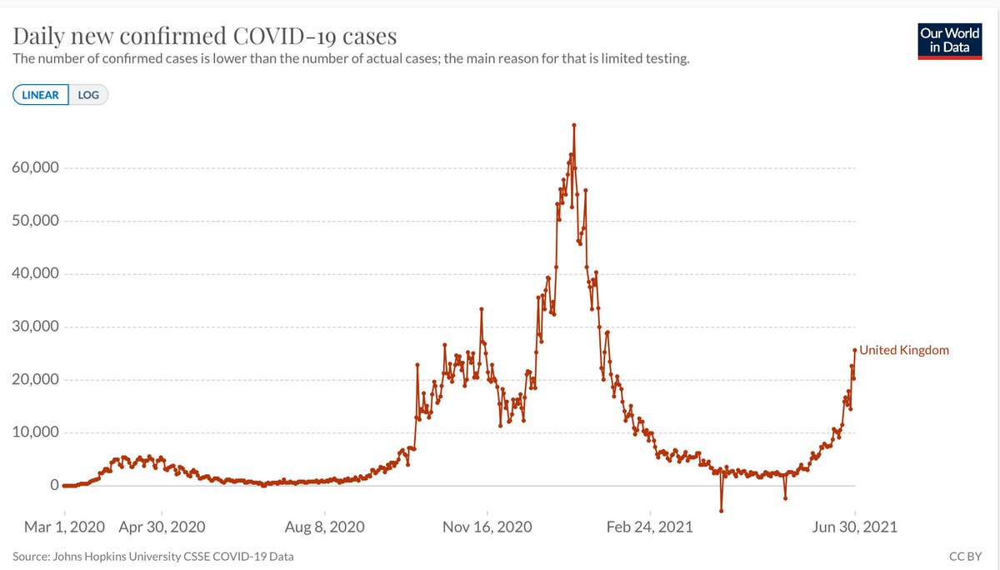</img></a><a href="E5OViRjVcAAd8SY.jpg"  >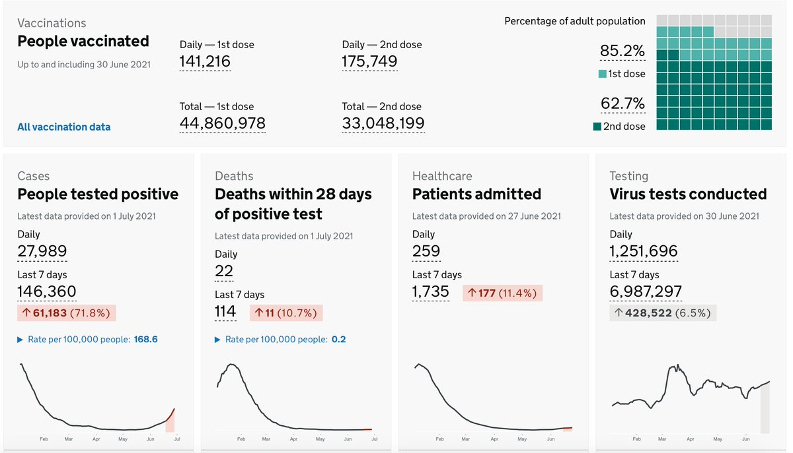</img></a>

---

<a href="https://twitter.com/erictopol/status/1410641802281979906" target="_blank" rel="noreferer">16:49:48 UCT</a>

There's no shortage of data for vaccinations substantially preventing severe illness, hospitalizations and death.  Here they also are correlated with countries return to pre-covid life
https://www.economist.com/graphic-detail/2021/07/03/our-normalcy-index-shows-life-is-halfway-back-to-pre-covid-norms @TheEconomist 

<a href="E5ObNS6VEAU6RpJ.jpg"  >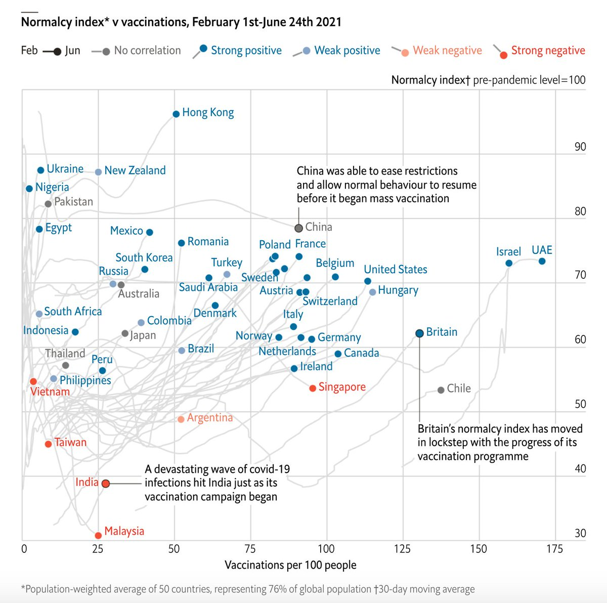</img></a>

---

<a href="https://twitter.com/erictopol/status/1410652030226485254" target="_blank" rel="noreferer">17:30:27 UCT</a>

Very good timing for the best US vaccinations in many weeks. Over 1.6 million shots with &gt;660,000 newbies reported today. 👍
Maybe awareness of Delta is helping people get on board to build the immunity wall we need right now 

<a href="E5OjocFUUAMTika.jpg"  >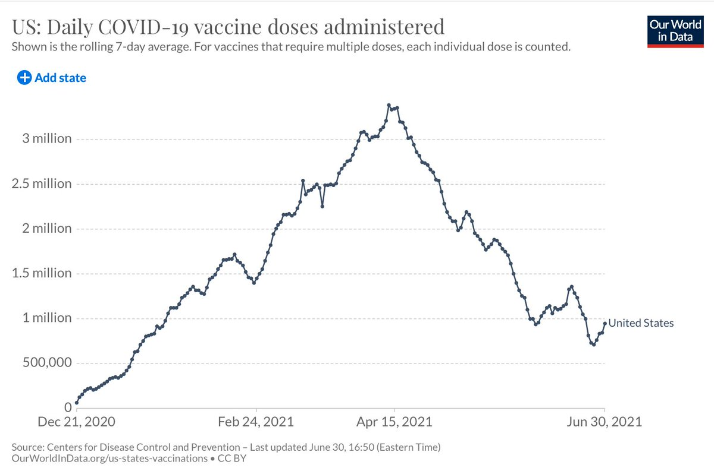</img></a>

---

<a href="https://twitter.com/erictopol/status/1410654635803566095" target="_blank" rel="noreferer">17:40:48 UCT</a>

RT @m_scribe: “This is the toughest version of the virus, by far, that we’ve seen,” @EricTopol said about the delta variant. But vaccinatio…

---

<a href="https://twitter.com/erictopol/status/1410663115872555013" target="_blank" rel="noreferer">18:14:30 UCT</a>

What is the opposite of immuncompromised?
This:
"We identify four ...antibodies from 3 convalescent donors with potent neutralizing activity against 23 variants including the B.1.1.7, B.1.351, P.1, B.1.429, B.1.526 and B.1.617"
Just out @ScienceMagazine 
https://science.sciencemag.org/content/early/2021/06/30/science.abh1766 

<a href="E5Oufm8VEAc6rgh.png"  >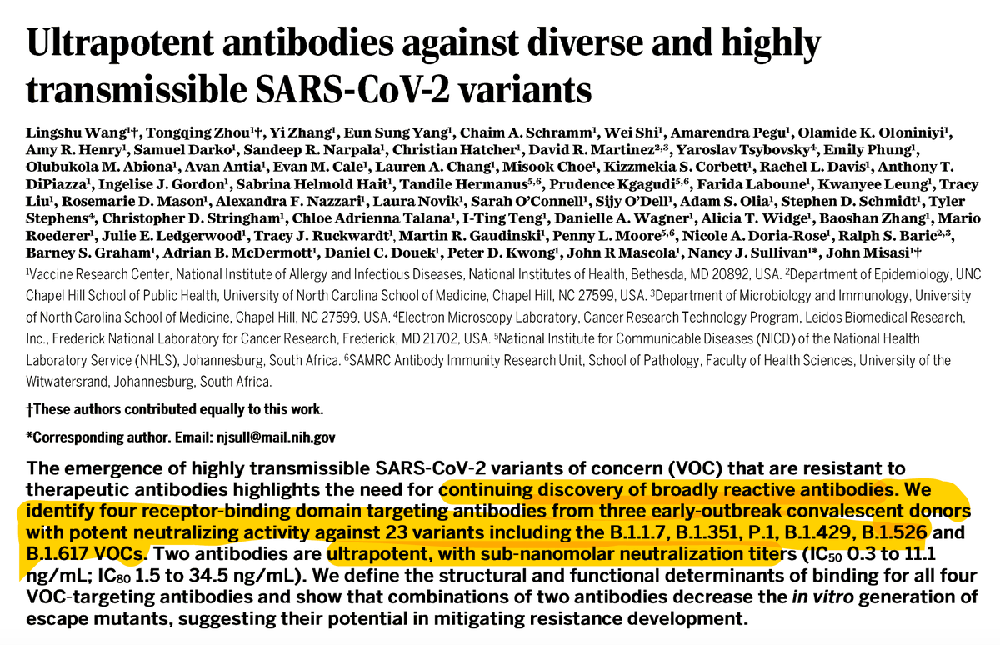</img></a><a href="E5OuiqBVoAMw4EL.jpg"  >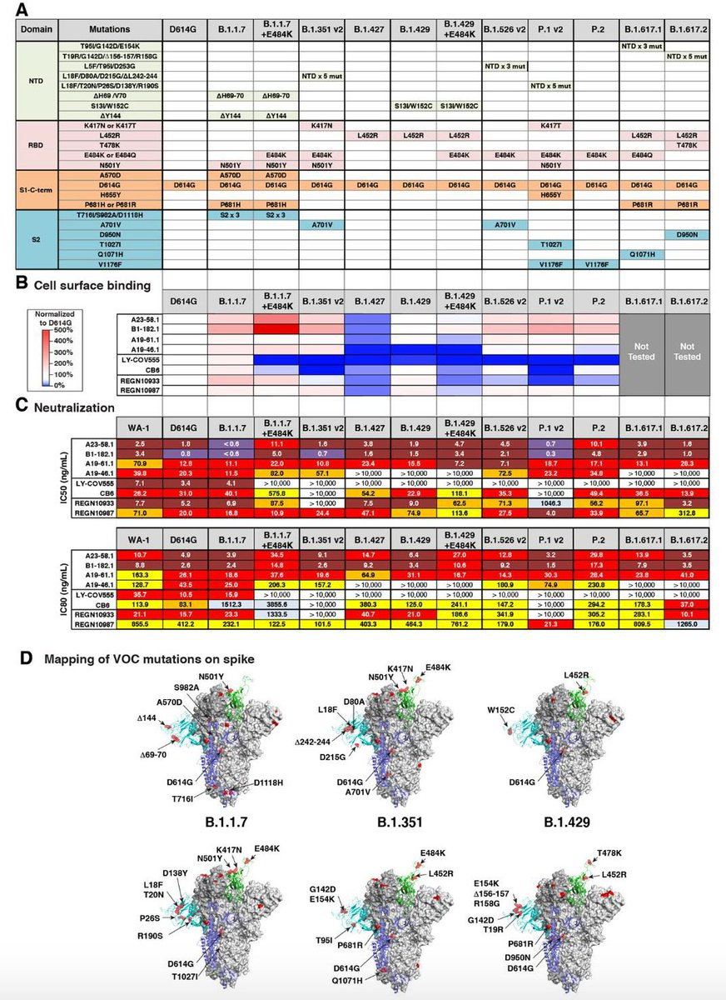</img></a>

---

<a href="https://twitter.com/erictopol/status/1410694245346734082" target="_blank" rel="noreferer">20:18:12 UCT</a>

How to build a Delta immunity wall?
Israel is showing us the way, with its very high vaccination rate countering this strain, now dominant. 
No further case increases (today 285) or hospitalizations. Zero deaths again for multiple days. 

<a href="E5PKXd9VcAASRdg.jpg"  >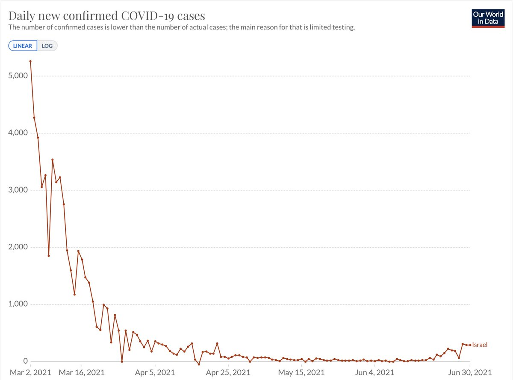</img></a>

---

<a href="https://twitter.com/erictopol/status/1410696960453996549" target="_blank" rel="noreferer">20:28:59 UCT</a>

It's a good idea to have "Surge Response Teams" ready in the US for the Delta variant. 
An even better idea is to get vaccinations way up so there wouldn't be any surges. But here there's too much resistance to be protected and protect others from covid
@FT 

<a href="E5PMqzPVcAITBKb.jpg"  >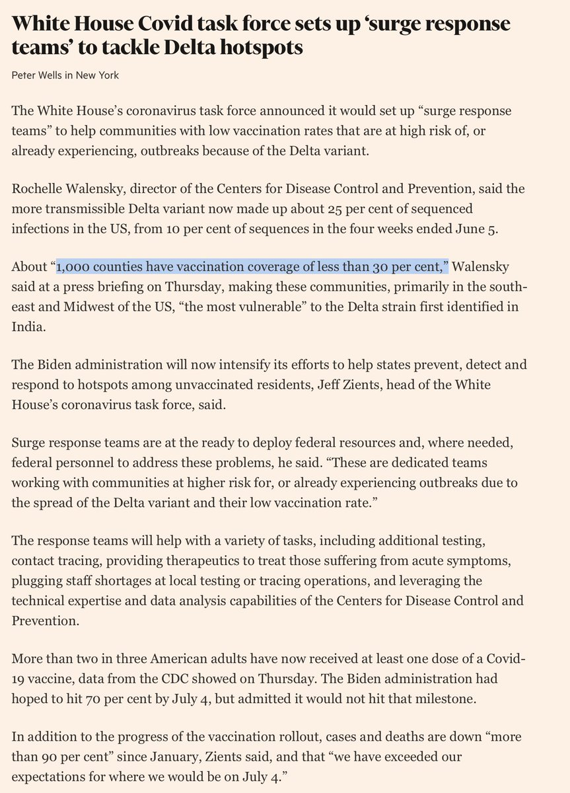</img></a>

---

<a href="https://twitter.com/erictopol/status/1410729332494913541" target="_blank" rel="noreferer">22:37:37 UCT</a>

You knew it was going to happen.
Mississippi Delta
@CovidActNow 
(lowest US vaccination, 36%, plus ~60% Delta variant) 

<a href="E5Pp7bgVUAMirD7.jpg"  >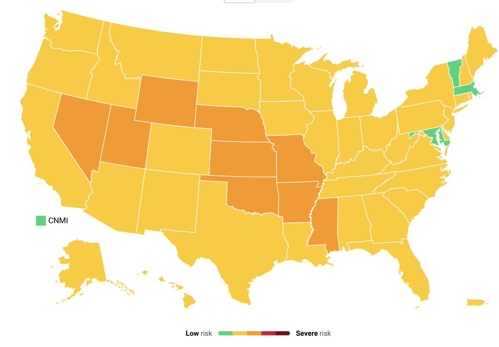</img></a>

---

<a href="https://twitter.com/erictopol/status/1410766785243013121" target="_blank" rel="noreferer">01:06:27 UCT</a>

The @US_FDA's overdue full approval of mRNA vaccines is holding us back from getting millions of more people protected, at a time of urgent need, with the Delta variant on the rise. My guest essay @nytopinion https://www.nytimes.com/2021/07/01/opinion/fda-vaccines-full-approval.html w/ thanks for editing @jopearl

---

<a href="https://twitter.com/erictopol/status/1410802213086134279" target="_blank" rel="noreferer">03:27:13 UCT</a>

The lives and health of millions of Americans rest on the F.D.A.’s decision to fully license these vaccines. https://twitter.com/nytopinion/status/1410800437570244609

---