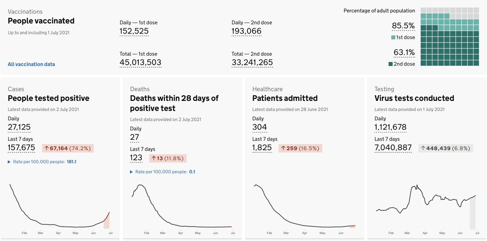
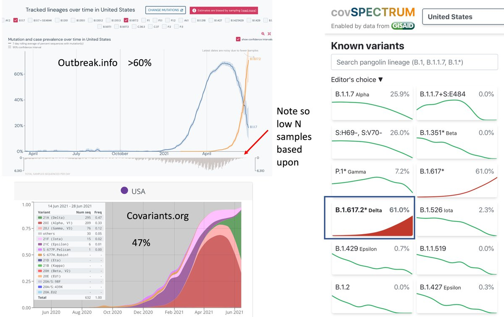
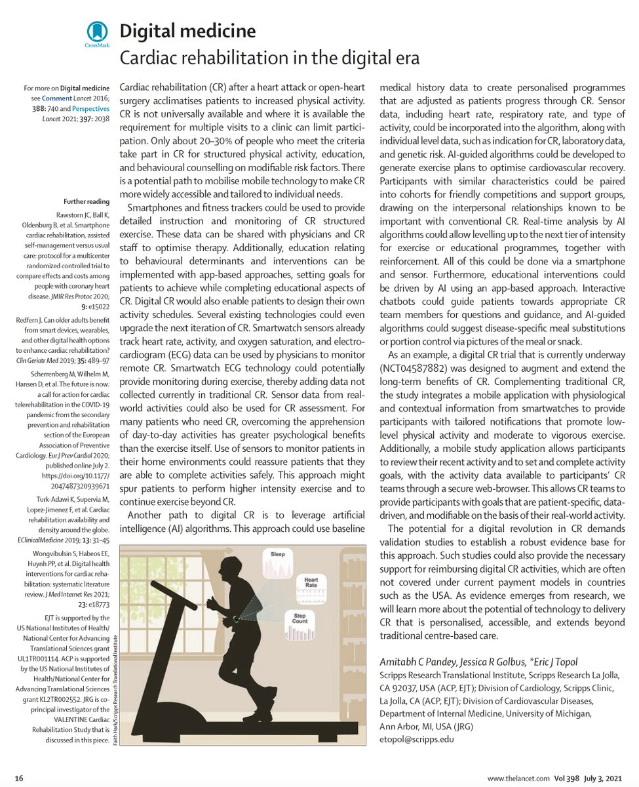
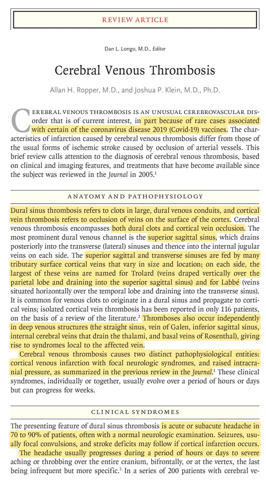

+++
title = "Tweets by Eric Topol" 
date = 2021-07-02T13:08:34+00:00
category = "Twitter"
+++

---

<a href="https://twitter.com/erictopol/status/1410988971320954881" target="_blank" rel="noreferer">15:49:20 UCT</a>

As the UK achieves ~86% adults vaccinated (Israel is also at 85%, the *US 67%*), today showing no increase in new cases (yesterday 27, 989, today 27,125) and that 70% increase in the last week associated w/ 16% rise in hospitalizations 

<a href="E5TWDVAVUAYctoF.jpg"  ></img></a>

---

<a href="https://twitter.com/erictopol/status/1411012902304174082" target="_blank" rel="noreferer">17:24:25 UCT</a>

RT @HuffmanLabDU: Great new study on #HEPA air cleaners by Lindsley et al. out today via @CDCMMWR: masks reduced aerosol by 72%, HEPA by 65…

---

<a href="https://twitter.com/erictopol/status/1411013115429355525" target="_blank" rel="noreferer">17:25:16 UCT</a>

RT @ashishkjha: Awesome @nytopinion piece by @EricTopol 

@US_FDA should fully approve Pfizer/Moderna

We have way more data for these vacc…

---

<a href="https://twitter.com/erictopol/status/1411017478814113796" target="_blank" rel="noreferer">17:42:37 UCT</a>

What % of US cases are from the Delta variant now?
It could be 47-61%, but the N of samples sequenced is low, so it is hard to know.
2 things are clear: 
1.  increasing exponentially 
2. surveillance is weak
http://outbreak.info
http://covariants.org
http://cov-spectrum.ethz.ch 

<a href="E5TvYXCVcAMOE-J.jpg"  ></img></a>

---

<a href="https://twitter.com/erictopol/status/1411034908789592064" target="_blank" rel="noreferer">18:51:52 UCT</a>

RT @DrTomFrieden: Vaccines Stop Cases…If They’re Given

The Delta variant poses a huge threat—but not to vaccinated people. Unvaccinated pe…

---

<a href="https://twitter.com/erictopol/status/1411039210392276993" target="_blank" rel="noreferer">19:08:58 UCT</a>

Cardiac rehab has been unchanged for 50 years. It's high time to move forward. 
Our latest digital medicine essay @TheLancet  https://www.thelancet.com/journals/lancet/article/PIIS0140-6736(21)01437-9/fulltext
@AmitabhCPandey @JRGolbus @scrippsresearch @ScrippsRTI @umichmedicine 

<a href="E5UEXCsUYAI7IXB.jpg"  ></img></a>

---

<a href="https://twitter.com/erictopol/status/1411044776208527360" target="_blank" rel="noreferer">19:31:05 UCT</a>

Cerebral venous sinus thrombosis (CVST) is rare. In the pandemic, it cropped us as occurring in &lt;1% of severe covid cases and as a very rare adverse effect with adenoviral-vector vaccines. Clinical features and treatment reviewed well in this week's @NEJM
https://www.nejm.org/doi/full/10.1056/NEJMra2106545?query=featured_home 

<a href="E5UHd1FVEAI1ch-.jpg"  ></img></a><a href="E5UJVtZUYAE3ZyA.jpg"  ></img></a>

---

<a href="https://twitter.com/erictopol/status/1411053894331813889" target="_blank" rel="noreferer">20:07:19 UCT</a>

Southern Africa is one of the worst-hit regions of the world now, led by Namibia (per capita). The Delta variant is playing a significant role. The absence of our help with vaccines is palpable. 

<a href="E5UQ3KSVcAEdSvv.jpg"  ></img></a><a href="E5UR2K_VoAYPRz1.jpg"  ></img></a>

---

<a href="https://twitter.com/erictopol/status/1411061477998424065" target="_blank" rel="noreferer">20:37:27 UCT</a>

Color Δ
The wavefront of states moving to higher risk is increasing, all w/ sub-average 1st dose vaccination (shown, US overall 57%) and with the Delta variant ranging 35-70% prevalence
The good part is the case burden is still low, Nevada is max 16/100K. But rising.
@CovidActNow 

<a href="E5UXeBWUcAUt5bD.jpg"  ></img></a>

---