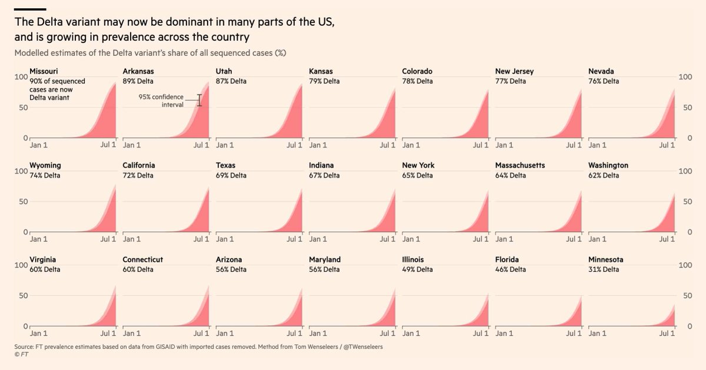
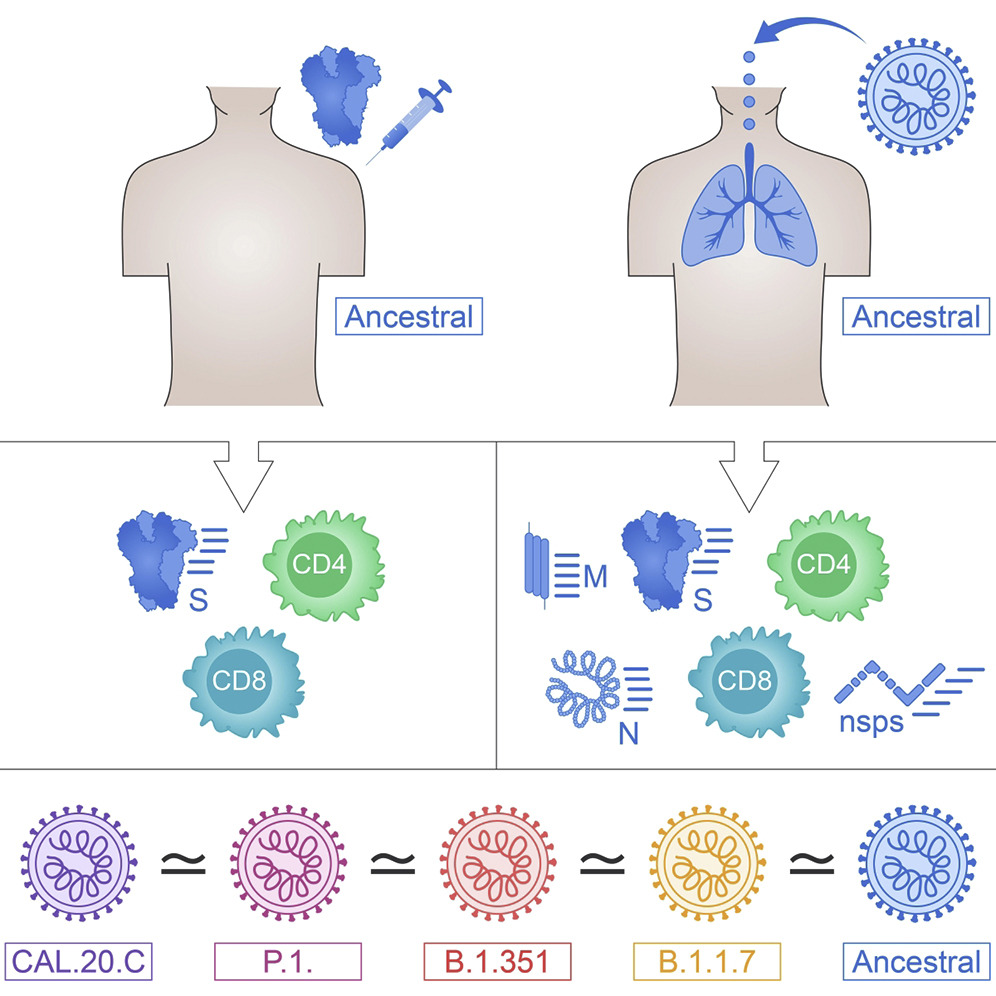
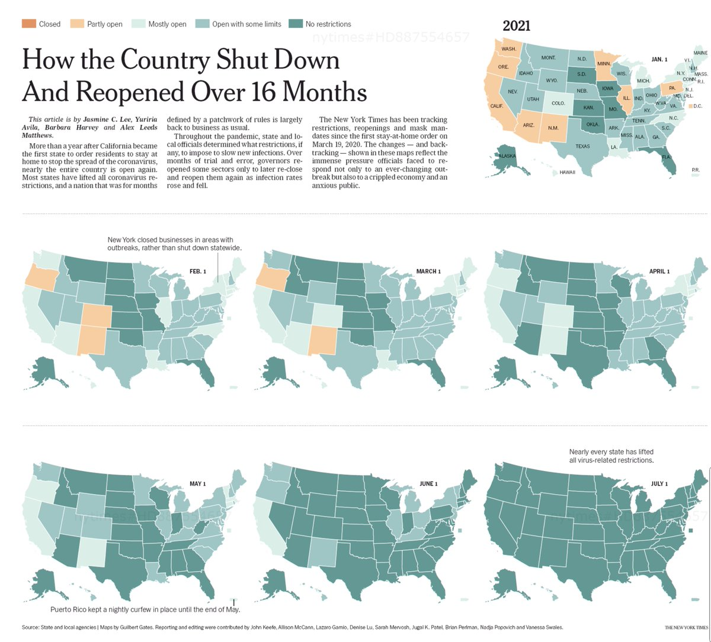
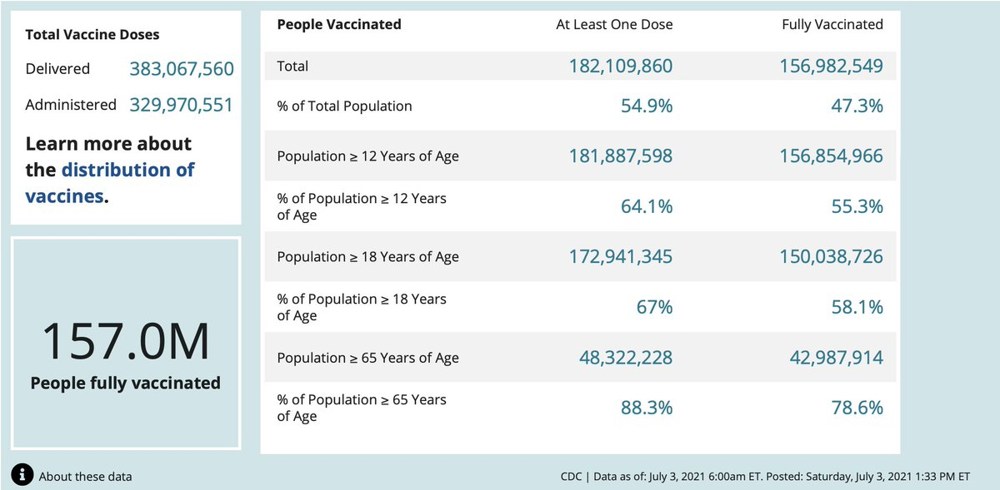

+++
title = "Tweets by Eric Topol" 
date = 2021-07-03T14:01:44+00:00
category = "Twitter"
+++

---

<a href="https://twitter.com/erictopol/status/1411324281733091331" target="_blank" rel="noreferer">14:01:44 UCT</a>

The high prevalence of the Delta variant in many US states.
The trends are likely right but, in most states, the number of sequenced samples is very low, leading to overestimates of the per cent
https://www.ft.com/content/7c3a7e3a-6cef-48ae-89a6-01e1a6f15959 by @TWenseleers 
and http://outbreak.info for N samples 

<a href="E5YGYSHVIAMh70K.jpg"  ></img></a>

---

<a href="https://twitter.com/erictopol/status/1411335124319309836" target="_blank" rel="noreferer">14:44:49 UCT</a>

"The world is watching the U.K. to see what living with Covid and high vaccine uptake looks like”—@devisridhar  
https://www.nytimes.com/2021/07/02/world/europe/coronavirus-britain-reopening-delta-variant.html?action=click&module=RelatedLinks&pgtype=Article by @MarkLandler 

<a href="E5YQ3rBVgAAAcHX.jpg"  ></img></a>

---

<a href="https://twitter.com/erictopol/status/1411341422964269058" target="_blank" rel="noreferer">15:09:51 UCT</a>

RT @nytopinion: In the history of medicine, few biologics have been scrutinized as much as the coronavirus vaccines from Pfizer and Moderna…

---

<a href="https://twitter.com/erictopol/status/1411351101576646667" target="_blank" rel="noreferer">15:48:18 UCT</a>

Some places where Delta is high and vaccinations are low are experiencing new surges or their worst Covid wave yet
@OurWorldInData 

<a href="E5YfpiAVkAQShYJ.jpg"  ></img></a>

---

<a href="https://twitter.com/erictopol/status/1411361111648083969" target="_blank" rel="noreferer">16:28:05 UCT</a>

Despite the rise of Delta in the US, the death rate keeps declining. 
Let's hope this continues. 

<a href="E5YpDAQUcAQWn6L.jpg"  ></img></a>

---

<a href="https://twitter.com/erictopol/status/1411374762975137793" target="_blank" rel="noreferer">17:22:20 UCT</a>

Over time, in people with prior covid, there is increased neutralization antibody potency to variants of concern (Alpha, Beta, Gamma). New @ImmunityCP (and good to see)
https://www.cell.com/immunity/fulltext/S1074-7613(21)00259-4 

<a href="E5Y1t8cVEAIp5S2.jpg"  ></img></a>

---

<a href="https://twitter.com/erictopol/status/1411377452622909442" target="_blank" rel="noreferer">17:33:01 UCT</a>

Just like the UK......
We have states now that have high Delta variant prevalence, sharp increase in cases and clear upticks in hospitalizations. All have below average vaccination rates (and average, 55% total population, is suboptimal) 

<a href="E5Y302yVEAAIAXQ.jpg"  ></img></a>

---

<a href="https://twitter.com/erictopol/status/1411380301423468547" target="_blank" rel="noreferer">17:44:20 UCT</a>

Is the T cell response (CD4+/CD8+) materially affected by key variants in people with prior covid or mRNA vaccinees?
Short answer is good: No. 👍
https://www.cell.com/cell-reports-medicine/fulltext/S2666-3791(21)00204-4 @SetteLab @ljiresearch @aetarke @CellRepMed 

<a href="E5Y54xWUUAUCJqx.jpg"  ></img></a>

---

<a href="https://twitter.com/erictopol/status/1411393139458199556" target="_blank" rel="noreferer">18:35:21 UCT</a>

Tracking the US open-&gt; close -&gt; re-opening
@jasmineclee @yag1310 @barbaraaharvey @alex_leedsmatts @nytgraphics 

<a href="E5ZGfbdVoAA5l-K.jpg"  ></img></a><a href="E5ZGTvqVcAEJwoQ.jpg"  ></img></a>

---

<a href="https://twitter.com/erictopol/status/1411416528495333376" target="_blank" rel="noreferer">20:08:17 UCT</a>

Good to see new data for the AZ vaccine, aka Covishield, with strong neutralizing antibody (NAb) response to the Delta variant. People with prior Covid had NAbs augmented by vaccination. 
20 breakthrough cases with high NAbs
https://www.biorxiv.org/content/10.1101/2021.07.01.450676v1 preprint 

<a href="E5ZaqmwUYAEZ7RS.jpg"  ></img></a>

---

<a href="https://twitter.com/erictopol/status/1411431112136564736" target="_blank" rel="noreferer">21:06:14 UCT</a>

This will help. Almost 1.2 million more vaccinations reported today, with 460,000 newbies.
Having 157 million Americans fully vaccinated and an untold (large) number of prior covid people who didn't get vaccinated is our Delta wall to further build on 

<a href="E5ZpDbAUUAA8VcY.jpg"  ></img></a>

---

<a href="https://twitter.com/erictopol/status/1411441631438409731" target="_blank" rel="noreferer">21:48:02 UCT</a>

The evolution of #SARSCoV2 variants over the course of the pandemic. Not just in the spike protein, but also nucleocapsid. The likely effects of genomic interactions, potential for variant-specific vaccines, &amp; prolonging the pandemic if🦠not contained
https://www.pnas.org/content/118/29/e2104241118 

<a href="E5Zxw9HVgAA3ZHx.jpg"  ></img></a><a href="E5Zxyb_UcAMMoLY.jpg"  ></img></a>

---

<a href="https://twitter.com/erictopol/status/1411494583914041344" target="_blank" rel="noreferer">01:18:27 UCT</a>

Defining a solid Delta wall, now confronting 60% prevalence
With a fully vaccinated 85% adult population
Zero deaths 9 days in a row https://twitter.com/EricTopol/status/1410694245346734082

---