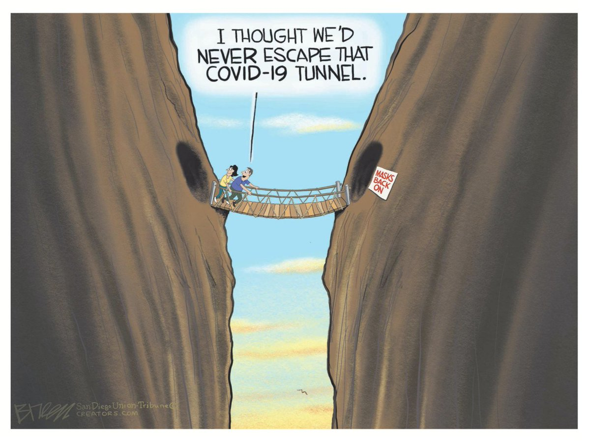
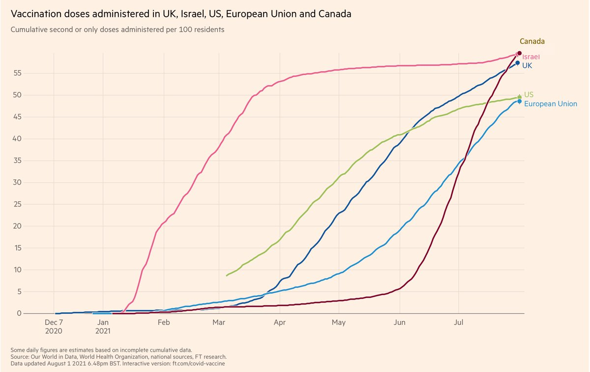
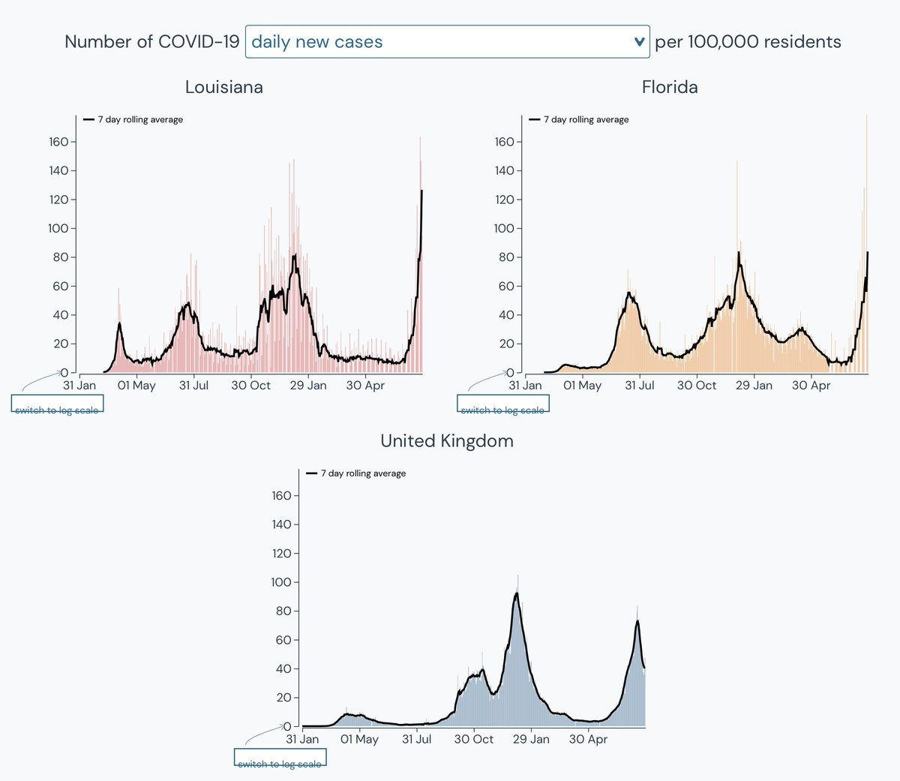

+++
title = "Tweets by Eric Topol" 
date = 2021-08-01T14:04:37+00:00
category = "Twitter"
+++

---

<a href="https://twitter.com/erictopol/status/1421834255127093249" target="_blank" rel="noreferer">14:04:37 UCT</a>

Our covid times
by @sdutBreen @sdut 

<a href="E7teo1NVcA413pv.jpg"  ></img></a>

---

<a href="https://twitter.com/erictopol/status/1421841172767465474" target="_blank" rel="noreferer">14:32:06 UCT</a>

How to build a Delta immunity wall.
The state with lowest rate of hospitalizations in the US Delta wave is the one with the highest vaccination (67% of 650,000 population).  
3 covid patients in the whole state of Vermont, 1 in ICU, past 2 weeks here 

<a href="E7tjNMnVgAEbC32.png"  ></img></a>

---

<a href="https://twitter.com/erictopol/status/1421872512393105411" target="_blank" rel="noreferer">16:36:38 UCT</a>

On May 1 @CDCgov stopped tracking breakthrough infections unless hospitalized. That was a mistake then, but with the increased risk posed by Delta, it's more serious. Complete tracking needs to be reinstated, w/ demographics, PCR Ct results, samples for neutralizing antibodies...

---

<a href="https://twitter.com/erictopol/status/1421884941218947072" target="_blank" rel="noreferer">17:26:01 UCT</a>

RT @dwallacewells: “The most hopeful and encouraging facts about the Delta surge were even harder to find in the coverage of the CDC slides…

---

<a href="https://twitter.com/erictopol/status/1421903629447962626" target="_blank" rel="noreferer">18:40:17 UCT</a>

August 1
Florida is adding 400-600 new hospitalized patients per day, ~90 in ICU. If this continues, it's less than a week away from highest in its pandemic.
In the post-vaccination era...... 

<a href="E7udbwVVIAAHs1i.jpg"  ></img></a>

---

<a href="https://twitter.com/erictopol/status/1421906652601544708" target="_blank" rel="noreferer">18:52:18 UCT</a>

Today, Canada surpassed Israel for fully vaccinated, a very high bar. Congratulations 🇨🇦 

<a href="E7ugdu8VcAQqqSO.jpg"  ></img></a>

---

<a href="https://twitter.com/erictopol/status/1421922969341759490" target="_blank" rel="noreferer">19:57:08 UCT</a>

Delta is daunting: one of the highest % vaccinated in the US, San Francisco
—Most breakthroughs mild/moderate Sx ; ~1% requiring hospitalizations is in keeping w/ other reports
—All healthcare staff must be vaccinated
—Our tracking for these is woeful
https://www.nytimes.com/live/2021/08/01/world/covid-delta-variant-vaccine?type=styln-live-updates&label=coronavirus%20updates&index=0&action=click&module=Top%20Stories&pgtype=Homepage#covid-san-francisco-hospital-delta 

<a href="E7uuGbEVkAEFwTd.jpg"  ></img></a>

---

<a href="https://twitter.com/erictopol/status/1421927284374523904" target="_blank" rel="noreferer">20:14:17 UCT</a>

RT @arimoin: Agree with @EricTopol 100%. We need to understand transmission real risk of infection, potential for transmission in household…

---

<a href="https://twitter.com/erictopol/status/1421931167855480835" target="_blank" rel="noreferer">20:29:43 UCT</a>

If you thought the UK's Delta wave was bad, we've got a much worse situation brewing in multiple places, led by LA and FL http://outbreak.info 

<a href="E7u2t1OVIAceGWH.jpg"  ></img></a>

---

<a href="https://twitter.com/erictopol/status/1421934766505398272" target="_blank" rel="noreferer">20:44:01 UCT</a>

All Delta here in July.
The 8:1 odds are pretty good. 

<a href="E7u6D2HVoAMno7I.jpg"  ></img></a>

---

<a href="https://twitter.com/erictopol/status/1421958102568427521" target="_blank" rel="noreferer">22:16:45 UCT</a>

RT @DinaPomeranz: This is a nice way to display Covid infections by vaccination status. Hopefully other outlets will follow.

The differenc…

---

<a href="https://twitter.com/erictopol/status/1422033221177413632" target="_blank" rel="noreferer">03:15:14 UCT</a>

US 4th, Delta wave
Hospitalizations are now &gt;49,000, highest since February,  rising rapidly, and clearly will surpass waves 1 and 2.
It's not too late to double down on all the things we know work💉,😷, distancing, rapid tests to limit the hit 

<a href="E7wRFf2VkAg7gQy.jpg"  ></img></a>

---

<a href="https://twitter.com/erictopol/status/1422041036432367621" target="_blank" rel="noreferer">03:46:17 UCT</a>

RT @BS_immunized: @EricTopol It's almost like Canadians are willing to do what's best for their society and are less influenced by superflu…

---