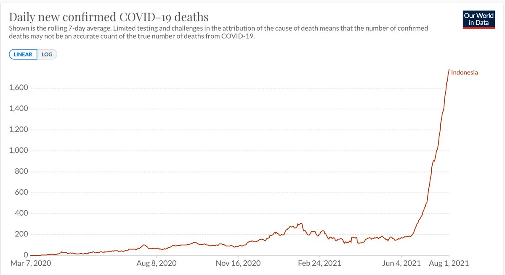
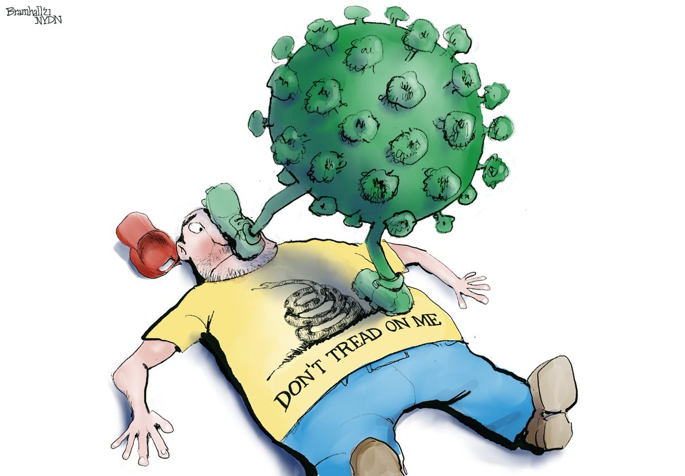
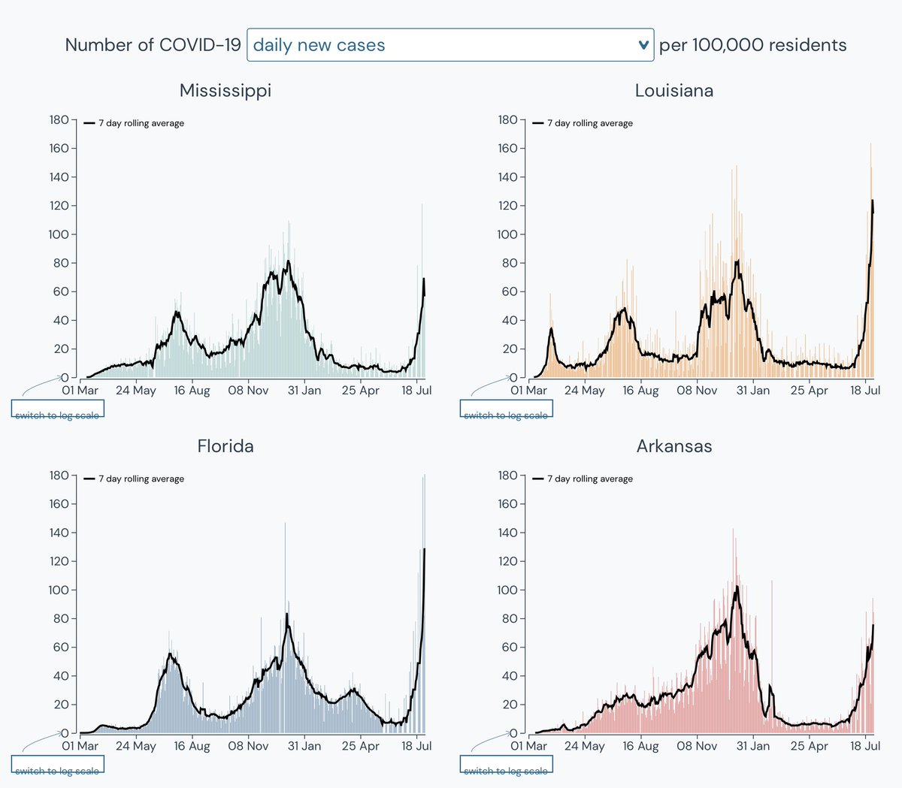
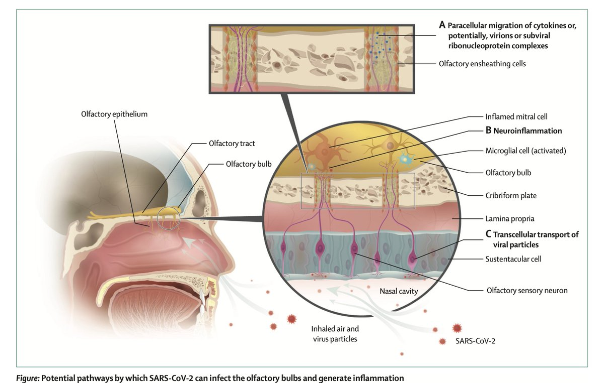

+++
title = "Tweets by Eric Topol" 
date = 2021-08-02T12:48:26+00:00
category = "Twitter"
+++

---

<a href="https://twitter.com/erictopol/status/1422187747402391553" target="_blank" rel="noreferer">13:29:16 UCT</a>

In the states most severely affected by Delta (per capita), there's some signs of slowing of case growth, especially in Missouri and Arkansas, the initial epicenter 

<a href="E7yfo7uVIAEcedj.jpg"  ></img></a>

---

<a href="https://twitter.com/erictopol/status/1422192406548545538" target="_blank" rel="noreferer">13:47:47 UCT</a>

A tragedy, with no sign of fatalities letting up, not getting enough attention or help from other countries
Indonesia, the 4th largest population in the world, has been devastated by the Delta variant, with only 8% of its population fully vaccinated
@OurWorldInData 

<a href="E7yjGGXVEAEpoLD.jpg"  ></img></a>

---

<a href="https://twitter.com/erictopol/status/1422203412821671937" target="_blank" rel="noreferer">14:31:31 UCT</a>

Our covid times
by @BillBramhall 

<a href="E7yubtbUUAATVt-.jpg"  ></img></a>

---

<a href="https://twitter.com/erictopol/status/1422229497525407747" target="_blank" rel="noreferer">16:15:10 UCT</a>

Current US test positivity is 8%; we have not seen &gt;20% levels anytime since the 3rd wave, but now Alabama 22%, Oklahoma 22%, Mississippi 20%, Florida 19% and 20 states in double digits. And grossly under-testing in face of Delta's spread.
https://coronavirus.jhu.edu/testing/individual-states
@CovidActNow 

<a href="E7zFp_7VEAE0Cwo.jpg"  ></img></a>

---

<a href="https://twitter.com/erictopol/status/1422256298595282944" target="_blank" rel="noreferer">18:01:40 UCT</a>

San Diego County, the 2nd largest in California, fortunately @SDCountyHHSA tracks infections by vaccination status. In July they're all Delta, fewer in the past week. The odds are now 15:1. The Delta wave has markedly increased the benefit of fully vaccinated status vs infections 

<a href="E7zdxG_VcAMspWZ.jpg"  ></img></a>

---

<a href="https://twitter.com/erictopol/status/1422260012022304768" target="_blank" rel="noreferer">18:16:25 UCT</a>

RT @GovPhilScott: Vaccines work, and Vermont continues to lead the nation with 84% of the eligible population with at least one dose. 

It…

---

<a href="https://twitter.com/erictopol/status/1422269301931724810" target="_blank" rel="noreferer">18:53:20 UCT</a>

Delta and vertical lines
Notice something different about the rate of rise in this wave for each of the heavily hit states
The 🦠 is remarkably efficient at finding the vulnerable, faster than any time previously
http://outbreak.info 

<a href="E7zqQ2vVkAEfTTJ.jpg"  ></img></a>

---

<a href="https://twitter.com/erictopol/status/1422302105642012672" target="_blank" rel="noreferer">21:03:41 UCT</a>

Changing behavior for prevention of covid
—Nudges to improve vaccinations (RCT)
https://www.nature.com/articles/s41586-021-03843-2
https://www.nature.com/articles/d41586-021-02043-2 @Nature  @danielcroymans @miteshspatel 
—Providing actual, not perceived, risk (which are not aligned)
https://www.pnas.org/content/118/32/e2100970118 @PNASNews @GregoryRSL 

<a href="E70F77lVEB4tlEH.jpg"  ></img></a><a href="E70Gl35VEBA1Zbw.jpg"  ></img></a>

---

<a href="https://twitter.com/erictopol/status/1422312312216555521" target="_blank" rel="noreferer">21:44:15 UCT</a>

We like any and all good news about Delta https://twitter.com/chrischirp/status/1422223706617696259

---

<a href="https://twitter.com/erictopol/status/1422326474581831687" target="_blank" rel="noreferer">22:40:31 UCT</a>

The mechanism of loss of smell from Covid, a ★ review pointing to inflammation, w/ or w/o direct infection, that may, if persistent, be a marker for long-term risk of neurological disease
https://www.thelancet.com/journals/laneur/article/PIIS1474-4422(21)00182-4/fulltext @TheLancetNeuro 

<a href="E70c7OiVcC4B7MW.jpg"  ></img></a><a href="E70dvpGVcAYn5UE.jpg"  ></img></a>

---

<a href="https://twitter.com/erictopol/status/1422331684372901888" target="_blank" rel="noreferer">23:01:13 UCT</a>

Good timing 

<a href="E70jE-QVoAA8nOF.jpg"  ></img></a>

---

<a href="https://twitter.com/erictopol/status/1422373901380636673" target="_blank" rel="noreferer">01:48:59 UCT</a>

A new, brilliant review of lab studies to assess #SARSCoV2's  infectivity @NatureCellBio, from conventional to  3D organoids https://www.nature.com/articles/s41556-021-00721-x
@TheSpenceLab and collaborators 

<a href="E71IJPOVEAITXjI.jpg"  ></img></a><a href="E71IFCMVoAMLfKt.jpg"  ></img></a>

---