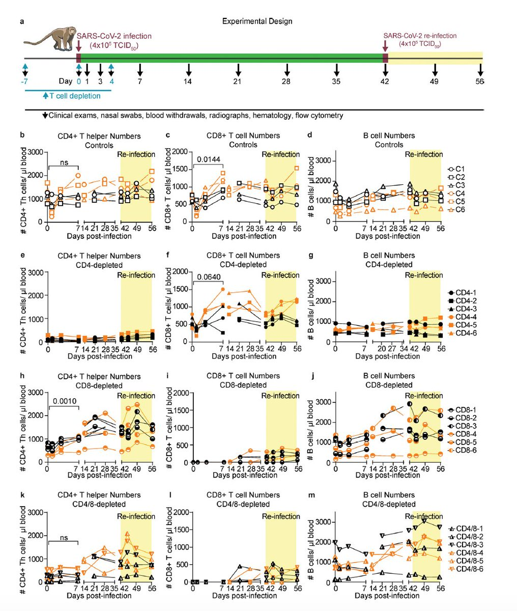
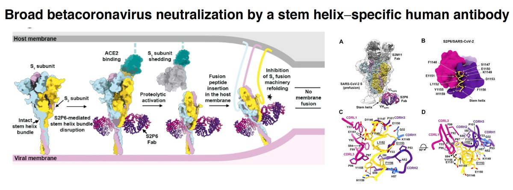
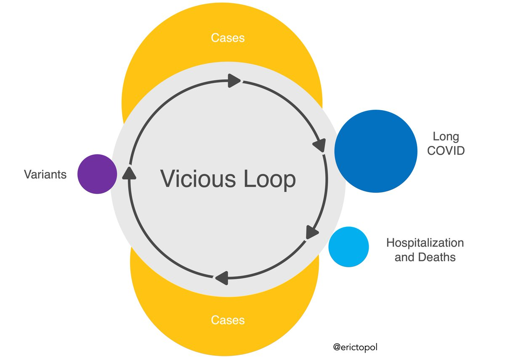
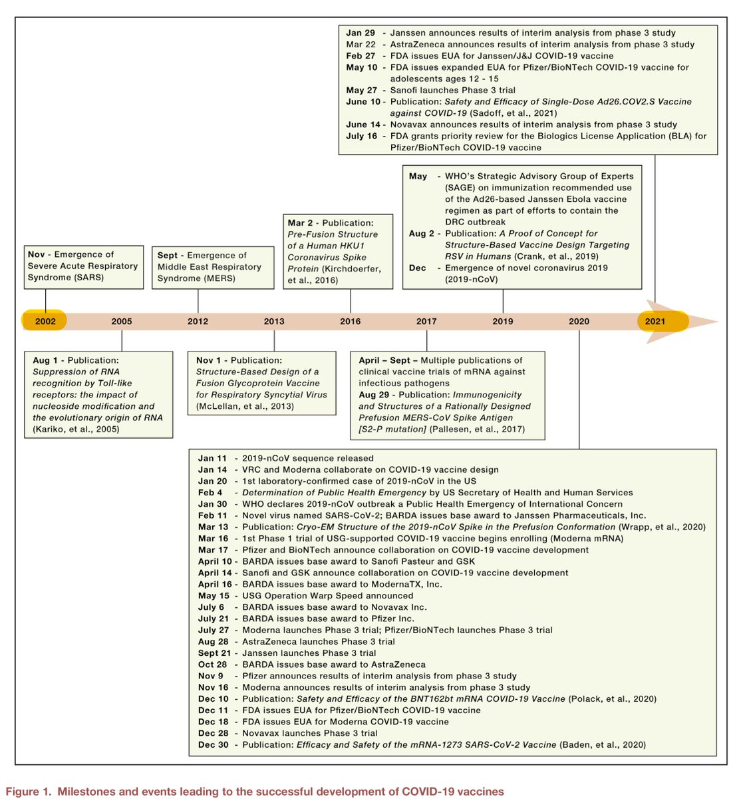
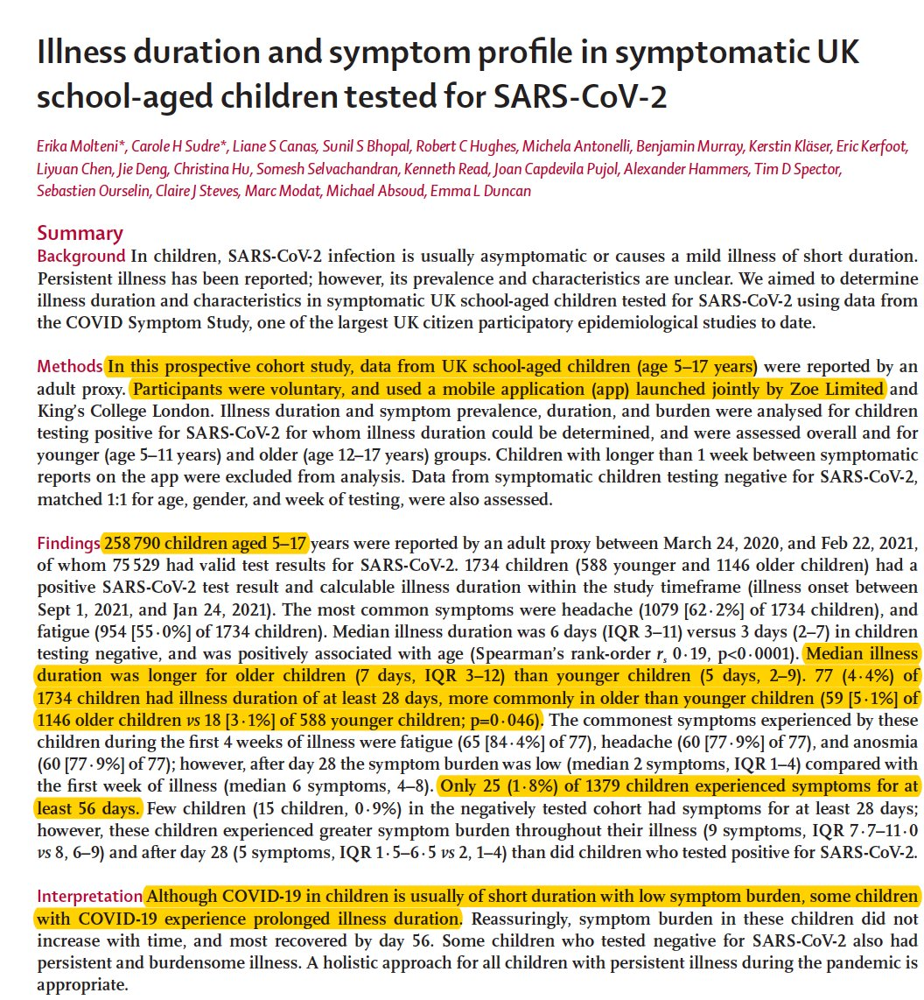
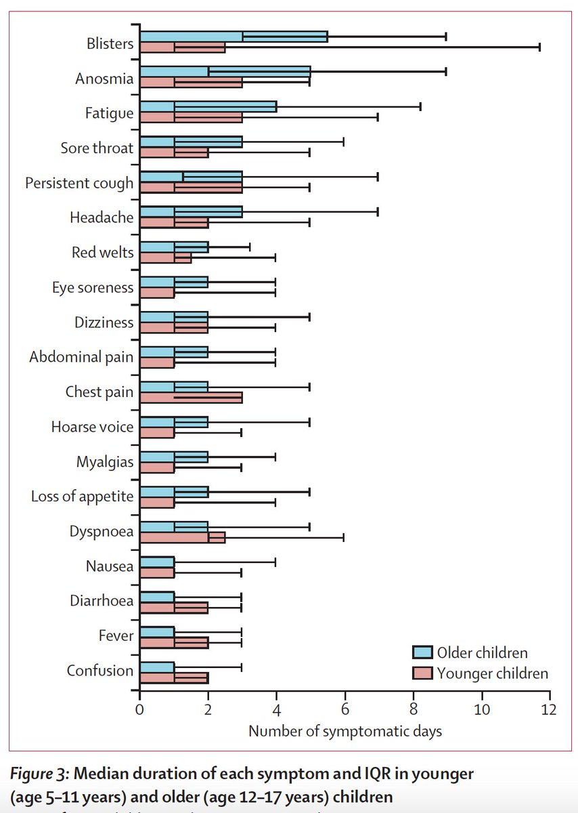

+++
title = "Tweets by Eric Topol" 
date = 2021-08-03T13:55:36+00:00
category = "Twitter"
+++

---

<a href="https://twitter.com/erictopol/status/1422556760888385537" target="_blank" rel="noreferer">13:55:36 UCT</a>

💯 They're not rare w/ Delta; clearly they're increasing, but our pathetic tracking leaves us uncertain as to their true incidence, severity, demographics, time from vaccination, Ct/viral load, neutralizing antibodies. All critical data to know, help prevent, decide re: boosters https://twitter.com/Bob_Wachter/status/1422445420593106945

---

<a href="https://twitter.com/erictopol/status/1422559345577926657" target="_blank" rel="noreferer">14:05:52 UCT</a>

Yet another new report that undermines the T cell narrative for its role in defense against #SARSCoV2 reinfection, an experimental depletion study in macaques
https://journals.asm.org/doi/10.1128/mBio.01503-21 @mbiojournal  https://twitter.com/EricTopol/status/1420870547039158273

<a href="E73x2kuX0AA0Kvx.jpg"  ></img></a><a href="E73x4CHVUAILgyi.jpg"  ></img></a>

---

<a href="https://twitter.com/erictopol/status/1422564476553891843" target="_blank" rel="noreferer">14:26:15 UCT</a>

The 4th wave
Louisiana, now the highest per capita rate of covid globally (for a state or country). It's also noteworthy that 72% of the world's population hasn't even had its 1st vaccine shot and there are enough here for every American to be fully vaccinated. 

<a href="E732harVIAAdLa8.jpg"  ></img></a>

---

<a href="https://twitter.com/erictopol/status/1422568213762646016" target="_blank" rel="noreferer">14:41:06 UCT</a>

RT @rosemaryCNN: As the #DeltaVariant drives up cases across the US we learned Monday 70% of Americans have now received at least one #COVI…

---

<a href="https://twitter.com/erictopol/status/1422578295250382857" target="_blank" rel="noreferer">15:21:10 UCT</a>

Just published @ScienceMagazine 
The path to a universal, betacoronavirus vaccine made even more likely with this discovery of such potent, stem helix neutralizing antibodies
https://science.sciencemag.org/content/early/2021/08/03/science.abj3321 

<a href="E74C6xnVUAMr2s9.jpg"  ></img></a>

---

<a href="https://twitter.com/erictopol/status/1422593573808005134" target="_blank" rel="noreferer">16:21:53 UCT</a>

The vicious loop starts with cases. And we'll never get out of this loop until they're controlled. Including breakthroughs. 

<a href="E74RRRTVoAM6wDF.jpg"  ></img></a>

---

<a href="https://twitter.com/erictopol/status/1422600017475366915" target="_blank" rel="noreferer">16:47:29 UCT</a>

The UK and Israel are &gt;20 per cent points higher than the US for fully vaccinated adults. 
That these Delta wave lines remain parallel is fortunate, as we run the risk of being far worse 

<a href="E74Wxn4VUAACURQ.jpg"  ></img></a>

---

<a href="https://twitter.com/erictopol/status/1422602340629061636" target="_blank" rel="noreferer">16:56:43 UCT</a>

Florida covid hospitalizations today are very close to peak pandemic 

<a href="E74ZGokVEAQ-vcI.jpg"  ></img></a>

---

<a href="https://twitter.com/erictopol/status/1422644921740136456" target="_blank" rel="noreferer">19:45:55 UCT</a>

Just published is a superb vaccine review @ImmunityCP by the @NIH's @KarinBok1 @sandra_sitar @BarneyGrahamMD @jrmascola https://www.cell.com/immunity/fulltext/S1074-7613(21)00303-4
Many key points:
1. The Covid mRNA vaccines were a work in progress for decades 

<a href="E74-hyvUcAI-uFG.jpg"  ></img></a><a href="E74-qQaVEAEbtkp.jpg"  ></img></a>

---

<a href="https://twitter.com/erictopol/status/1422694271845502980" target="_blank" rel="noreferer">23:02:01 UCT</a>

New @LancetChildAdol is a very reassuring prospective  study of &gt;250,000  children,  &gt;1700 with + covid test, age  5-17, that shows the risk for chronic Covid symptoms is quite low; 4.4% beyond 4 weeks
https://www.thelancet.com/journals/lanchi/article/PIIS2352-4642(21)00198-X/fulltext 

<a href="E75sAPjVgAE3be5.jpg"  ></img></a><a href="E75sCFzUYAMq_tB.jpg"  ></img></a>

---

<a href="https://twitter.com/erictopol/status/1422702908643037187" target="_blank" rel="noreferer">23:36:20 UCT</a>

To understand the complexities of the immune response, antibodies &amp; T cells, natural immunity and vaccine-induced, Delta, and more, we turned to @profshanecrotty for a new podcast https://www.medscape.com/viewarticle/954796
w/@cuttingforstone 
Beyond being a great scientist, he’s a master explainer

---

<a href="https://twitter.com/erictopol/status/1422741218232963078" target="_blank" rel="noreferer">02:08:34 UCT</a>

Hospitalizations in the US Delta, 4th wave are close to the peak of waves 1 and 2, and cases &gt;145/000 in a day with limited testing. The only reassuring data relates to low fatalities (so far), reflecting vaccinations and the disease shift to young https://newsnodes.com/us 

<a href="E76XVMPVoAE4GMc.jpg"  ></img></a><a href="E76XczxVIAwDM4Z.jpg"  ></img></a>

---

<a href="https://twitter.com/erictopol/status/1422749170230697985" target="_blank" rel="noreferer">02:40:10 UCT</a>

Good question: Why is #SARSCoV2 prone to superspreading, following the Pareto 80-20 rule for over-dispersion of infections, but not H1N1 or other pathogens?
https://www.thelancet.com/journals/laninf/article/PIIS1473-3099(21)00406-0/fulltext @TheLancetInfDis by @paulchenz @MarionKoopmans @DFisman @FrankGuLab 

<a href="E76eRT_VgAYCutH.jpg"  ></img></a><a href="E76eSu6VkAMeOUF.jpg"  ></img></a>

---

<a href="https://twitter.com/erictopol/status/1422756107559129095" target="_blank" rel="noreferer">03:07:44 UCT</a>

A large UK study of vaccination protection from Delta symptomatic breakthrough infections found effectiveness of ~60%  (combines AZ and Pfizer vaccines)
https://www.ft.com/content/df4db947-8697-49a7-b38b-e46bd86ba915
https://www.reuters.com/world/uk/english-study-finds-50-60-reduced-risk-covid-double-vaccinated-2021-08-03/ 

<a href="E76ky5cVkAMzJpc.jpg"  ></img></a><a href="E76ki6RUcAA-RRx.jpg"  ></img></a>

---