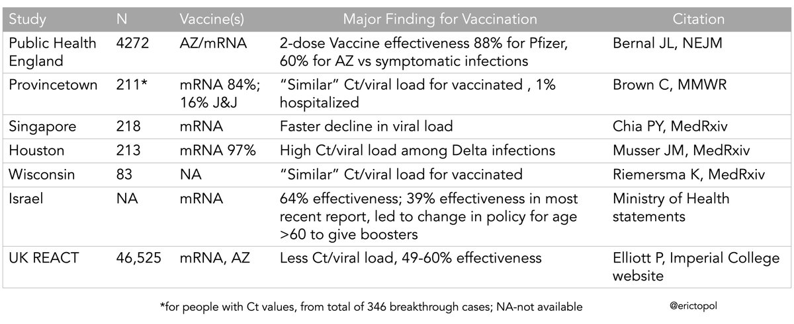
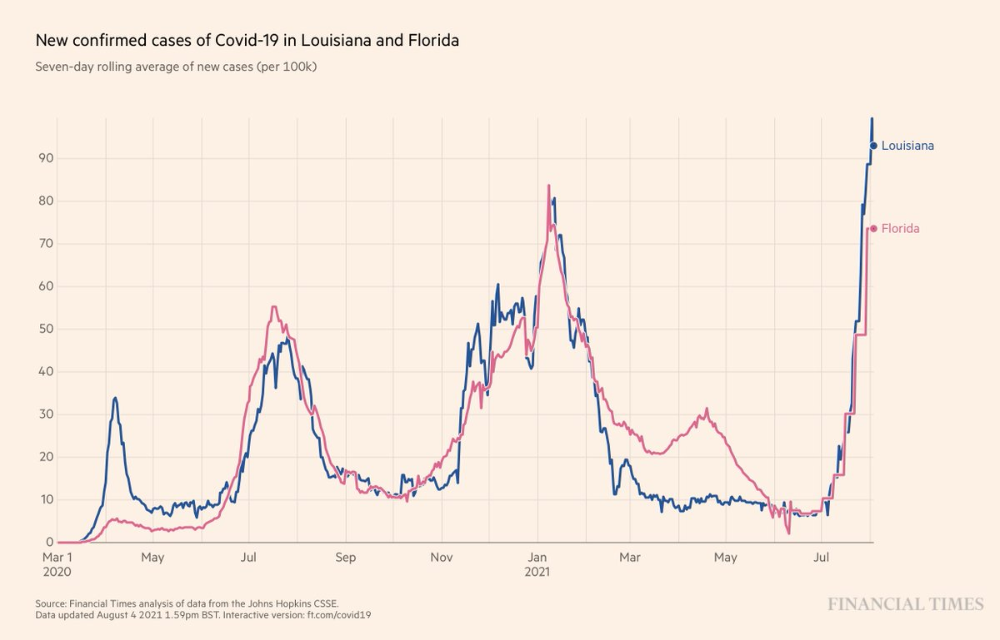

+++
title = "Tweets by Eric Topol" 
date = 2021-08-04T14:04:24+00:00
category = "Twitter"
+++

---

<a href="https://twitter.com/erictopol/status/1422926162624356357" target="_blank" rel="noreferer">14:23:28 UCT</a>

The FDA full approval of vaccines in now expected by Labor Day; it took months to get transparency and communication w/ the public
https://www.washingtonpost.com/health/2021/08/02/coronavirus-vaccines-fda-full-approval-timeline/
This Q&amp;A shows the prior lack of understanding of its urgency; also the implications on boosters 

<a href="E78-_N4UYAc1hso.jpg"  ></img></a>

---

<a href="https://twitter.com/erictopol/status/1422960935212179457" target="_blank" rel="noreferer">16:41:38 UCT</a>

Summary Delta breakthrough studies, Ct/viral load,  vaccine effectiveness (VE) 
Only 1 large study of Ct/viral load, shows some vaccine reduction 
VE ranges 39-88%; it's likely ≤ 60% at best for mRNA
More data needed, but points to need for boosters for at least some people 

<a href="E79d4qJUYAIwtQZ.jpg"  ></img></a>

---

<a href="https://twitter.com/erictopol/status/1422989657369808901" target="_blank" rel="noreferer">18:35:46 UCT</a>

There's little good news for the US Delta wave, but we may be seeing the peak case growth rate for the top 2 states, Louisiana and Florida 

<a href="E795ZpGVkAIupGj.jpg"  ></img></a>

---

<a href="https://twitter.com/erictopol/status/1423026091803828228" target="_blank" rel="noreferer">21:00:33 UCT</a>

Just published @NEJM
Prevention of Covid for household contacts with exposure via a single subcutaneous injection: results of a randomized trial of combination monoclonal antibodies shows marked benefit
 http://www.nejm.org/doi/full/10.1056/NEJMoa2109682 

<a href="E7-UV4IVgAEYNkV.jpg"  ></img></a><a href="E7-UXvhUUAM7eGc.jpg"  ></img></a>

---

<a href="https://twitter.com/erictopol/status/1423028440664403968" target="_blank" rel="noreferer">21:09:53 UCT</a>

In the pandemic, immunocompromised people (~3% of Americans) are not getting adequate recognition for the potential of in-host evolution of the virus (highlighted studies) and the need for far better approaches to protect them https://www.nejm.org/doi/full/10.1056/NEJMsb2104756?query=featured_home @NEJM 

<a href="E7-VPMrVcAAvJ40.jpg"  ></img></a>

---

<a href="https://twitter.com/erictopol/status/1423039487156707331" target="_blank" rel="noreferer">21:53:47 UCT</a>

Notable: several countries with Delta waves had abrupt U-turns that were short-lived or are stuttering
@OurWorldInData 

<a href="E7-mclEVEAAK1jw.jpg"  ></img></a>

---

<a href="https://twitter.com/erictopol/status/1423051289429086208" target="_blank" rel="noreferer">22:40:41 UCT</a>

During the 3rd wave in the USA, cases got above 300,000 per day and deaths above 4,000.
In the 4th, Delta wave, cases have already reached ~150,000 in a day, with deaths  ~400 (7-day avg)
[and yes, there's a lag; hospitalizations and #LongCovid are a big deal in this wave]

---

<a href="https://twitter.com/erictopol/status/1423098035408564225" target="_blank" rel="noreferer">01:46:26 UCT</a>

There really are 2 lines, not 1, for the US and Israel 4th wave ascents.
Israel is quickly getting people age &gt;60 with booster shots, 11% in 3 days; it'll be important to watch for impact in the weeks ahead
https://twitter.com/erlichya/status/1422785542329151490 

<a href="E7_bAouVEAI2J0k.jpg"  ></img></a>

---

<a href="https://twitter.com/erictopol/status/1423117888991367168" target="_blank" rel="noreferer">03:05:19 UCT</a>

The @Newsweek magazine must be getting desperate for sales to go with this cover. Delta is bad enough; there's no clinical evidence that Delta "Plus" or Lambda provide competition with it. Let's not make bad matters worse and beat this *&amp;^%'in🦠 

<a href="E7_qEZjVgAIcGwC.jpg"  ></img></a>

---