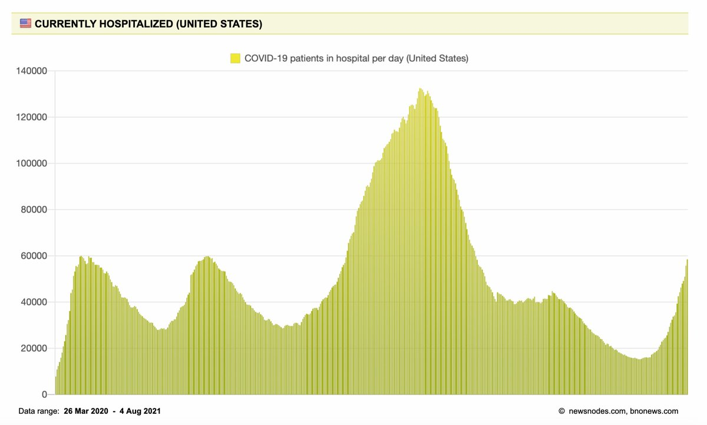
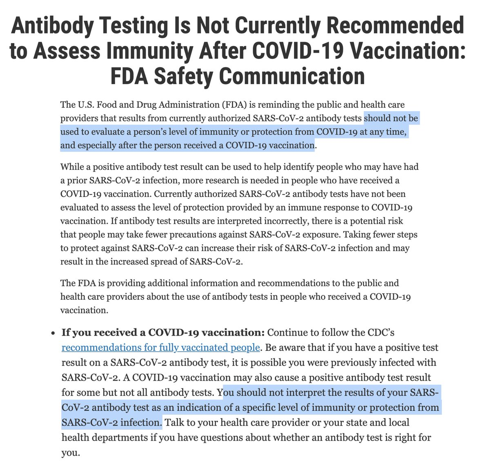
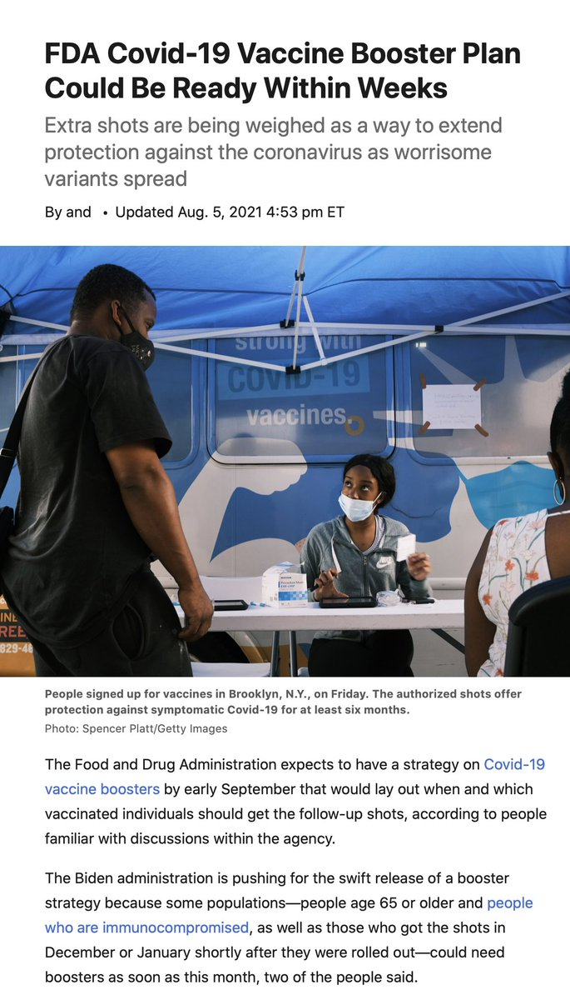
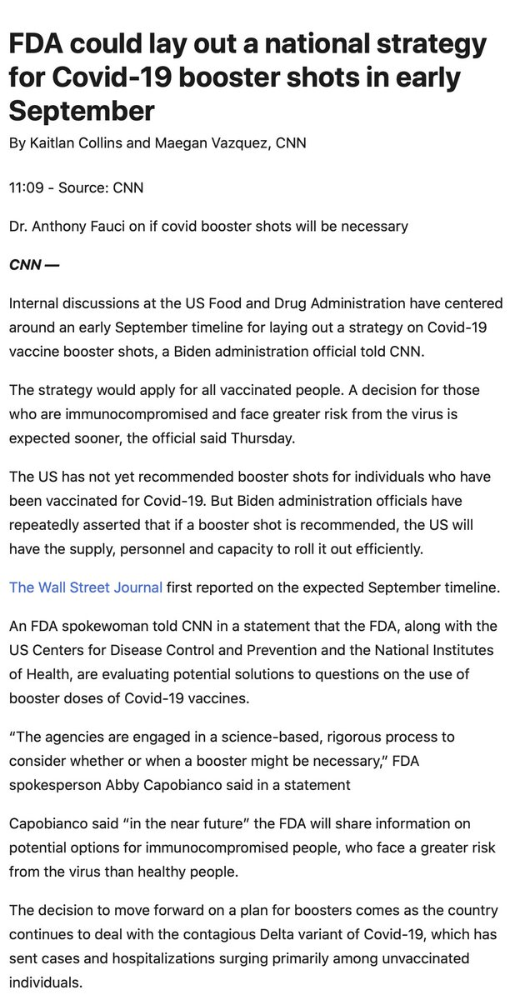

+++
title = "Tweets by Eric Topol" 
date = 2021-08-05T13:09:33+00:00
category = "Twitter"
+++

---

<a href="https://twitter.com/erictopol/status/1423269949384974338" target="_blank" rel="noreferer">13:09:33 UCT</a>

The striking relationship between vaccination and hospitalization in US states. 
[#VaccinesWork vs Delta, in case you didn't know that]
https://www.ft.com/content/21ed4e9c-2b20-4a9d-bf38-6b76212beef8 by @jburnmurdoch and @nikasgari @FT 

<a href="E8B4AxMVUAANn8_.jpg"  ></img></a>

---

<a href="https://twitter.com/erictopol/status/1423287725604544519" target="_blank" rel="noreferer">14:20:11 UCT</a>

The half-dose might have worked as well (as the full dose) for the 1st and 2nd doses, based on a randomized trial that looked at immune response https://twitter.com/megtirrell/status/1423244672676343812

---

<a href="https://twitter.com/erictopol/status/1423308870944923655" target="_blank" rel="noreferer">15:44:13 UCT</a>

We've now exceeded hospitalizations in the 1st and 2nd waves, but an additional concern is their rate of rise in the 4th, Delta wave. 
That this has happened w/ a surfeit of vaccines reflects both how formidable this strain is and our big miss in not suppressing it far better 

<a href="E8CZwMAVEAs0YZH.jpg"  ></img></a>

---

<a href="https://twitter.com/erictopol/status/1423334547962294273" target="_blank" rel="noreferer">17:26:15 UCT</a>

Off the chart
Good on Canada for needing an expanded Y-axis 

<a href="E8CzC5GVkAIP3X0.jpg"  ></img></a>

---

<a href="https://twitter.com/erictopol/status/1423349179259129857" target="_blank" rel="noreferer">18:24:23 UCT</a>

Great to see this profile feature on @j_g_allen in @ScienceMagazine today. He has been a leading light for the pandemic for the importance of air quality, masks, ventilation and more https://science.sciencemag.org/content/373/6555/612
by @douglasstar with @ScienceVisuals 

<a href="E8C_3MmUcAAoVrR.jpg"  ></img></a><a href="E8C_4k3VEAU9CHy.jpg"  ></img></a>

---

<a href="https://twitter.com/erictopol/status/1423366385871200258" target="_blank" rel="noreferer">19:32:45 UCT</a>

It's August 2021, where are the rapid antigen tests that should have been supplied for free for every household to accurately screen for infectiousness—which is what really matters? The tests that were ready here in May 2020. https://www.wsj.com/articles/demand-for-covid-19-tests-and-wait-times-rebound-as-delta-variant-spreads-11628162222 @sharonterlep @Brabbott42 

<a href="E8DPRHMVoAI23Nu.jpg"  ></img></a>

---

<a href="https://twitter.com/erictopol/status/1423368244803506179" target="_blank" rel="noreferer">19:40:09 UCT</a>

Fear from Delta plus mandates have led to the best US vaccination day in well over a month, with &gt;580,000 newbies and &gt;860,000 total. We need this trend to continue and get back into the millions/day 

<a href="E8DRRHcVoAAesOl.jpg"  ></img></a>

---

<a href="https://twitter.com/erictopol/status/1423381286371033091" target="_blank" rel="noreferer">20:31:58 UCT</a>

We still don't know to what extent boosters (vs the original strain) will prevent Delta infections
But we're seeing the start of "booster-mania"
People going to drugstores, lying about their vaccination status
W/ imminent full FDA approval, doctors can prescribe them for anyone

---

<a href="https://twitter.com/erictopol/status/1423415602744492037" target="_blank" rel="noreferer">22:48:20 UCT</a>

Many people are thinking about or have obtained antibody (Ab) tests after vaccination. This figure is very helpful, but there are a couple of issues
—We don't know correlation of these Abs, or their levels vs Delta
—They are not recommended https://www.fda.gov/medical-devices/safety-communications/antibody-testing-not-currently-recommended-assess-immunity-after-covid-19-vaccination-fda-safety  https://twitter.com/VirusesImmunity/status/1423403916058845184

<a href="E8D8tzrUYAELDO5.jpg"  ></img></a>

---

<a href="https://twitter.com/erictopol/status/1423422014690189313" target="_blank" rel="noreferer">23:13:48 UCT</a>

Good to see a US booster plan is (finally) in the works
https://www.wsj.com/articles/fda-covid-19-vaccine-booster-plan-could-be-ready-within-weeks-11628194767?mod=latest_headlines by @StephArmour1 @JaredSHopkins   https://www.cnn.com/2021/08/05/politics/fda-covid-booster-shot/index.html by @kaitlancollins @maeganvaz 

<a href="E8EB4fkUYAMd3Gu.jpg"  ></img></a><a href="E8ECPDXVkAMinLN.jpg"  ></img></a><a href="E8ECREpVoAMfRBy.jpg"  ></img></a>

---

<a href="https://twitter.com/erictopol/status/1423438139721281536" target="_blank" rel="noreferer">00:17:53 UCT</a>

Tomorrow we’ll get a new @PHE_uk report, but I wouldn’t be surprised that the vaccine effectiveness vs Delta infections will have declined, in keeping with the large, new UK study below https://twitter.com/EricTopol/status/1422960935212179457

---

<a href="https://twitter.com/erictopol/status/1423489026112118789" target="_blank" rel="noreferer">03:40:05 UCT</a>

We're half-way to the 3rd wave peak in cases/day and doing half as many tests/day as we did at that time 

<a href="E8E_bDiVIAgqy_6.jpg"  ></img></a>

---

<a href="https://twitter.com/erictopol/status/1423511369232445444" target="_blank" rel="noreferer">05:08:52 UCT</a>

The Israeli data for increased mRNA-vaccination breakthrough infections and "waning immunity" is finally available 
https://www.medrxiv.org/content/10.1101/2021.08.03.21261496v1?__cf_chl_jschl_tk__=pmd_e2ea998b4d62d17a2afd596b60deedbd98393a3c-1628225627-0-gqNtZGzNAfijcnBszQfi h/t @Aiims1742 
Overall 2X risk, no statistical significant difference between age groups, but trend of increase w/ age 

<a href="E8FT4xlVkAMuX_W.jpg"  ></img></a>

---