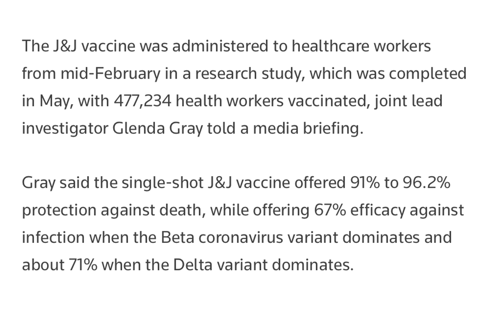
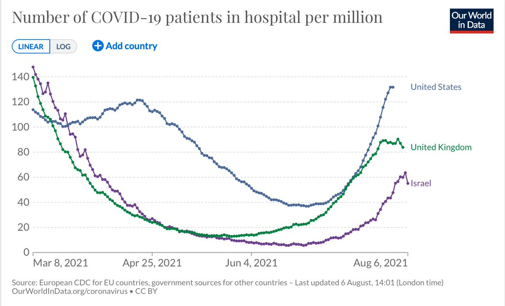
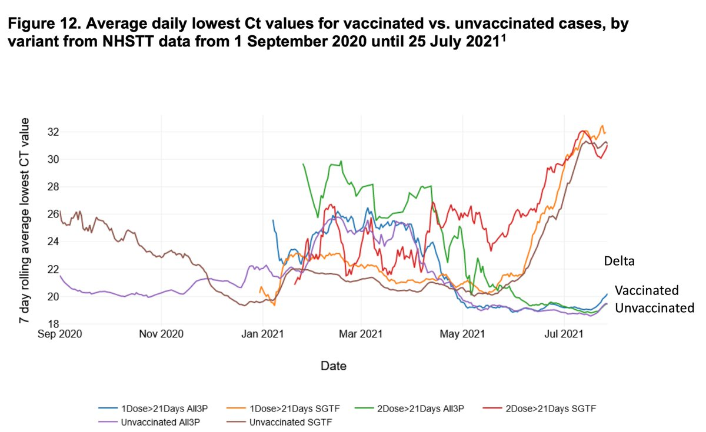
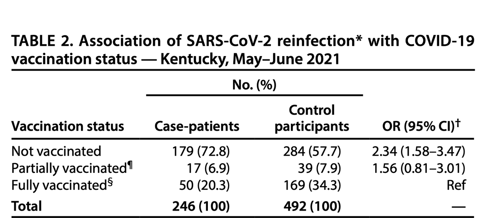
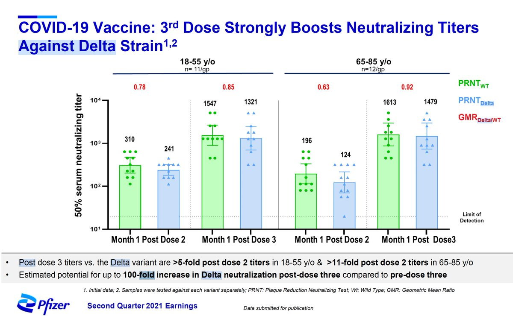
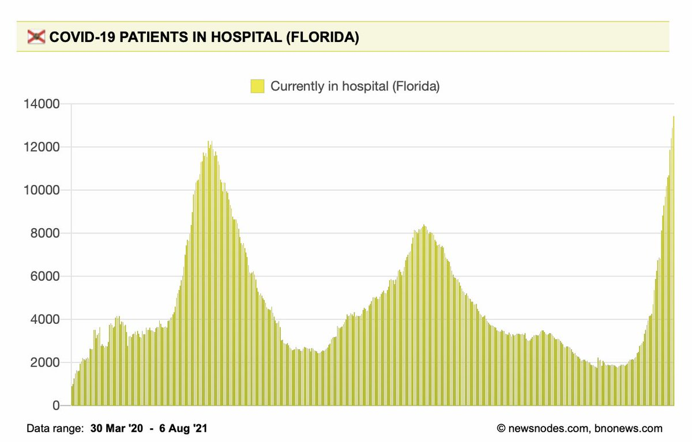

+++
title = "Tweets by Eric Topol" 
date = 2021-08-06T14:23:44+00:00
category = "Twitter"
+++

---

<a href="https://twitter.com/erictopol/status/1423651004428406785" target="_blank" rel="noreferer">14:23:44 UCT</a>

New data (via press briefing) on the 1-shot J&amp;J vaccine in &gt;477,000 health care workers support high level of protection, including during the South African Delta wave. Look forward to seeing the dataset but certainly encouraging
https://www.reuters.com/business/healthcare-pharmaceuticals/safrican-study-shows-jj-vaccine-protects-against-death-co-lead-investigator-says-2021-08-06/ 

<a href="E8HSRD2VoA4yP9i.png"  ></img></a>

---

<a href="https://twitter.com/erictopol/status/1423653927644401674" target="_blank" rel="noreferer">14:35:21 UCT</a>

The rapid ascent of hospitalizations in the US, already exceeding 60,000, shows no sign of slowing, distinct from the pattern in the UK and Israel to date, 2 countries w/ much higher % fully vaccinated 
@OurWorldInData 

<a href="E8HVamAUUAM0H01.jpg"  ></img></a>

---

<a href="https://twitter.com/erictopol/status/1423669985646288907" target="_blank" rel="noreferer">15:39:09 UCT</a>

New @PHE_uk report today provides data to support the high viral load (low Ct) is similar for Delta infections among unvaccinated (17.8) and vaccinated (18.0) https://assets.publishing.service.gov.uk/government/uploads/system/uploads/attachment_data/file/1009243/Technical_Briefing_20.pdf 

<a href="E8HkBUNVoAc8K-b.jpg"  ></img></a>

---

<a href="https://twitter.com/erictopol/status/1423673657402949644" target="_blank" rel="noreferer">15:53:45 UCT</a>

From the new variant @PHE_UK report, @GISAID prevalence data on the Lambda variant would argue it is not going to compete with Delta or other circulating variants
https://assets.publishing.service.gov.uk/government/uploads/system/uploads/attachment_data/file/1009063/Variants_of_Concern_Variant_Data_Update_10.pdf 

<a href="E8HnUaFVcAksYN3.jpg"  ></img></a>

---

<a href="https://twitter.com/erictopol/status/1423698071112753153" target="_blank" rel="noreferer">17:30:45 UCT</a>

An update on Delta, vaccination protection and viral loads from the aggregate data available, with new @PHE_uk data
1. Delta infections are characterized by very high viral loads (low Cts). When a breakthrough occurs, the load is similar to unvaccinated, but clears more rapidly 

<a href="E8H6Ut-VcAEepPD.jpg"  ></img></a>

---

<a href="https://twitter.com/erictopol/status/1423708891116818432" target="_blank" rel="noreferer">18:13:45 UCT</a>

What about B.1.621, a variant w/o a Greek letter, with some key mutations including N501Y, E484K, P681H seen in other major VOCs (mutation map http://outbreak.info)
See @kallmemeg's great🧵on it. One to watch
https://twitter.com/kallmemeg/status/1423614599778160640 

<a href="E8IHObuVcAEe7gr.jpg"  ></img></a>

---

<a href="https://twitter.com/erictopol/status/1423710986045825024" target="_blank" rel="noreferer">18:22:05 UCT</a>

New findings to support why people with prior covid benefit from vaccination: protection from reinfection 
https://www.cdc.gov/mmwr/volumes/70/wr/mm7032e1.htm?s_cid=mm7032e1_w @CDCMMWR 

<a href="E8IJS8fUcAQtBQn.png"  ></img></a>

---

<a href="https://twitter.com/erictopol/status/1423712894907154435" target="_blank" rel="noreferer">18:29:40 UCT</a>

We don't yet have data that 3rd shot boosters vs original strain will be effective in preventing Delta infections.
@Pfizer data of higher neutralizing antibodies is based on 23 people. No effectiveness data.
The Israeli preprint doesn't connect the dots
https://twitter.com/EricTopol/status/1423511369232445444 

<a href="E8IKsFWVEAAhcHa.jpg"  ></img></a>

---

<a href="https://twitter.com/erictopol/status/1423718811006472194" target="_blank" rel="noreferer">18:53:10 UCT</a>

Well above pandemic peak 
I just hope Florida is not the US Delta wave bellwether 

<a href="E8IQbXTVIAAuBW2.jpg"  ></img></a>

---

<a href="https://twitter.com/erictopol/status/1423726051474108417" target="_blank" rel="noreferer">19:21:56 UCT</a>

Just think we live in a country which is incapable of telling us the per cent vaccinated or unvaccinated who require hospitalization for covid. No less any more data about them. Or track breakthrough infections. Thanks @CDCgov. Where is @COVID19Tracking when we need them?

---

<a href="https://twitter.com/erictopol/status/1423735699157577737" target="_blank" rel="noreferer">20:00:17 UCT</a>

On natural immunity from Covid
"Antibody levels and neutralizing capacity are generally maintained up to 7.7 months, and in a substantial number of individuals antibody levels increase after some months after symptom onset"
https://www.nature.com/articles/s41467-021-24979-9 

<a href="E8Ifag_UUAAnn9f.jpg"  ></img></a>

---

<a href="https://twitter.com/erictopol/status/1423742110562324480" target="_blank" rel="noreferer">20:25:45 UCT</a>

I'd take the 1:10 odds for vaccinated: not vaccinated
Getting a Delta infection in San Diego County (pop 3.5 million), current data 
#VaccinesWork against Delta
@SDCountyHHSA 

<a href="E8IlqTTVEAMiWW2.jpg"  ></img></a>

---

<a href="https://twitter.com/erictopol/status/1423764222220009478" target="_blank" rel="noreferer">21:53:37 UCT</a>

Not a good sign when the #2 most populous US state gets to nearly 20,000 cases in a day or the rate of rise in hospitalizations looks like this 

<a href="E8I5-pMVcAE2Bs_.jpg"  ></img></a><a href="E8I55HdUUAApvVk.jpg"  ></img></a>

---

<a href="https://twitter.com/erictopol/status/1423779427096293377" target="_blank" rel="noreferer">22:54:02 UCT</a>

Just published @TheLancet 
A randomized mix and match trial of AZ and Pfizer vaccination in &gt;800 people shows that mixing is safe and can engender at least as good, if not better, immune response 
https://www.thelancet.com/action/showPdf?pii=S0140-6736%2821%2901694-9 by @XinxueLiu and colleagues 

<a href="E8JGaNsUYAAVGcV.jpg"  ></img></a><a href="E8JGY7lVcAAg82P.jpg"  ></img></a>

---

<a href="https://twitter.com/erictopol/status/1423828289659969538" target="_blank" rel="noreferer">02:08:12 UCT</a>

Brilliant.  Let's combine a superspreader variant with a superspreader event in the midst of a big surge with over 130,000 new cases today. Only in the USA
https://www.washingtonpost.com/nation/2021/08/06/sturgis-motorocycle-rally-covid-superspreader/ by @TimBella Perfect slogan, too. 

<a href="E8Jz3HtUcAMPjU4.jpg"  ></img></a>

---